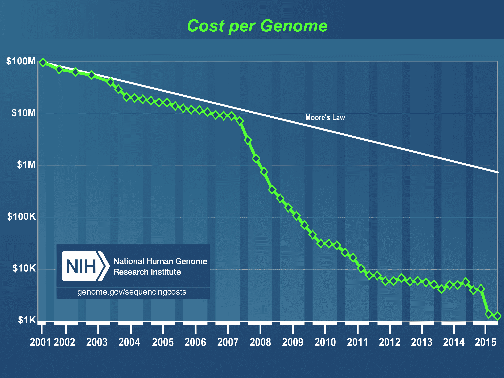

# 基因组智能革命 

> 原文：<https://web.archive.org/web/https://techcrunch.com/2017/01/21/the-genomics-intelligence-revolution/>

马赫尼·古拉西撰稿人

马赫尼·古拉西是

[Clear Labs](https://web.archive.org/web/20221221185143/https://www.clearlabs.com/)

在那里，他领导商业活动，包括战略，营销和业务发展。

我们已经进入了全基因组测序历史上的一个新阶段(WGS)。想想看，多伦多大学 [的研究人员刚刚启动了](https://web.archive.org/web/20221221185143/https://www.utoronto.ca/news/u-t-sequence-genomes-10000-people-year-%E2%80%9Cinformation-new-oil%E2%80%9D-say-university-toronto-scientists) 一个庞大的项目，每年对一万人的全部基因组进行测序。当你回想起第一个人类基因组测序花了 13 年时间和 30 亿美元，而就在 2012 年，只有 69 个完整的人类基因组被测序，这真是令人震惊。

自 2010 年以来，我们一直在使用 WGS 个性化医疗，当时 WGS 首次用于 [通知患者的治疗](https://web.archive.org/web/20221221185143/http://www.nature.com/news/2010/100914/full/news.2010.465.html) 。

现在，随着我们的公共和私人参考数据库的增长，我们可以获得比以往更多的基因组数据，我们将开始严重依赖机器学习来实现 WGS 的全部潜力。机器学习能力和处理能力的增加不仅推动了基因研究，也推动了基因组学在许多行业的广泛应用。我们刚刚开始看到像下一代测序(NGS)这样的尖端 WGS 技术在农业和食品安全等其他行业得到利用。

为了更好地理解 WGS 作为一门应用科学的重要性，并更好地想象 WGS 将如何在未来几年迅速改变各种行业——特别是当我们将它与机器学习等技术治疗相结合时——理解测序和分析的基本过程如何随着时间的推移而演变是有帮助的。

## WGS 简史

将 WGS 与人类 DNA 研究联系在一起已经变得司空见惯，但当然，WGS 是一个实验室过程，可以用来揭示任何生物体的完整 DNA 序列。事实上，第一个全基因组测序的生物体是 [流感嗜血杆菌](https://web.archive.org/web/20221221185143/https://en.wikipedia.org/wiki/Haemophilus_influenzae) ，这是一种存在于人类呼吸道中的细菌。这一突破出现在 1995 年。直到整整 5 年后的 2000 年，研究人员对果蝇的全基因组进行了测序， [黑腹果蝇](https://web.archive.org/web/20221221185143/https://en.wikipedia.org/wiki/Drosophila_melanogaster) 。

2003 年，人类基因组计划发布了人类基因组的全部序列，仅仅三年过去了。这一重大突破——科学史上最重要的突破之一——需要长达 13 年的艰苦努力，耗资约 30 亿美元。

在 2005 年引入下一代测序(NGS)之前，WGS 的商业可行性一直备受质疑。 NGS 是一个描述各种测序技术的总称，这些技术在很大程度上取代了桑格测序。

> WGS 的可能性范围对我们处理人类健康的方式有影响。

这些技术由 Illumina、Roche、Life Technologies 和许多其他公司开发，极大地减少了 DNA 和 RNA 测序的时间和成本，彻底改变了基因组学和分子生物学的研究和应用。在过去一年左右的时间里，我们已经接近实现价值 1000 美元的全人类基因组。事实上， [Veritas Genetics](https://web.archive.org/web/20221221185143/https://www.crunchbase.com/organization/veritas-genetics#/entity) 已经被 [誉为](https://web.archive.org/web/20221221185143/http://www.xconomy.com/boston/2016/10/17/veritas-genetics-lands-30m-for-1000-genome-sequencing/) 第一家能够以 *不到*1000 美元的价格对人类基因组进行测序、分析和解读的公司。

[来源:](https://web.archive.org/web/20221221185143/https://www.genome.gov/27565109/the-cost-of-sequencing-a-human-genome/)国家人类基因组研究所

当然，1000 美元这个数字一直是一个随意设定的目标。真正重要的是，我们现在可以快速而经济地对人类基因组进行测序，以建立研究人员所需的大规模参考数据库，就像多伦多大学正在建立的数据库一样，以更好地了解复杂的疾病，基因如何相互作用，以及基因如何对环境变化做出反应。

## 测序只是第一步:数据科学在现代基因组学中的作用

自从 NGS 的引入，减少 WGS 的时间和成本在很大程度上是一个计算机工程问题。将人类基因组的原始数据转换成医学上有用和可理解的信息在历史上一直是一个巨大的技术瓶颈，但在过去十年中，计算的进步而不是实验室过程的进步推动了与 WGS 相关的最显著的时间和成本减少。摩尔定律可能已经死亡；然而， [光计算](https://web.archive.org/web/20221221185143/https://www.technologyreview.com/s/602765/computing-with-lasers-could-power-up-genomics-and-ai/?utm_source=MIT+TR+Newsletters&utm_campaign=3a8df67b14-The_Download_November_4_2016&utm_medium=email&utm_term=0_997ed6f472-3a8df67b14-154310577&goal=0_997ed6f472-3a8df67b14-154310577&mc_cid=3a8df67b14&mc_eid=58a37e76fc) 继续改进基因组处理。

例如，在进行关于遗传疾病紧急管理的 2015 年 [研究](https://web.archive.org/web/20221221185143/http://genomemedicine.biomedcentral.com/articles/10.1186/s13073-015-0221-8) 的过程中，堪萨斯城儿童慈善医院详细介绍了他们对全基因组测序的使用，包括全分析。使用[Illumina HiSeq](https://web.archive.org/web/20221221185143/http://www.illumina.com/systems/hiseq_2500_1500.html)机器，一个[Edico Genome DRAGEN](https://web.archive.org/web/20221221185143/http://www.edicogenome.com/dragen/)处理器和定制的软件包，儿童慈善组织的团队在短短 26 小时内对一个完整的人类基因组进行了测序和分析。仅 DRAGEN 处理器就将分析时间从 15 小时缩短到了 40 分钟。

那么我们所说的分析是什么意思呢？首先，我们区分一级、二级和三级分析。今天的现代测序仪执行原始化学和物理样品到原始序列数据的初始转换。我们将最初的转换过程称为初步分析。

> 我们已经捕捉到了数据——难以捉摸的是洞察力。

二次分析是我们组装基因组的过程。把它想象成用十亿块拼图拼在一起。测序仪给了你所有的碱基对，但是它们的顺序不对。可以想象，这是一个计算密集型的过程。二次分析的最终结果是与整个基因组相关的数据。

从基因数据中提取意义——例如，将突变与某些疾病相匹配——需要三级分析。这是基因组学应用科学的起点。这也是一个大数据问题，有无限多的软件解决方案。

未来创新的一些最肥沃的土壤是设计新的方法和工作流程来从整个基因组中提取意义。我们已经捕捉到了数据——难以捉摸的是洞察力。

## WGS 健康的未来

WGS 对人类健康的未来具有重大影响，无论是在医疗保健系统如何运作方面，还是在消费者与自身健康互动的方式方面。

在机构层面，基因组学的力量将在帮助支付者和提供者改善人口健康方面发挥有趣的作用。大多数医疗保健提供商仍然完全依赖索赔数据和电子病历中的历史医疗信息。这些记录告诉我们 10-15%的人口已经患上了可预防的慢性疾病，但它们无助于预测剩余人口中谁最有可能患上这些疾病。基因组学可以通过帮助识别患某些疾病的高风险患者并早期干预来帮助描绘这幅图景。

在下游，在消费者层面，个性化医疗将继续是 WGS 的主要关注点。仍然有令人难以置信的大量工作要做，尤其是当你考虑到大多数人类基因变异仍未得到解释的时候。我们可以通过与其他参考基因组进行比较，从个人的遗传数据中提取意义，我们必须使用的参考基因组越多，我们的软件和过程就越好。这就是为什么建立巨型基因数据库的计划对这项工作的未来至关重要。

这项研究还开启了医疗保健的其他应用。其中最有趣的是精确营养，基于对我们个体微生物组成的理解。益生菌(甚至是益生元)基于其独特的微生物谱，可以对个体产生重大影响。正如个性化医学正在从现有的 NGS 方法中出现一样，我们也可以很快期待新的 [实验性 NGS 方法](https://web.archive.org/web/20221221185143/http://www.illumina.com/areas-of-interest/microbiology/human-microbiome-analysis.html) 用于分析人类微生物组，以支持个性化和优化营养的发展。

WGS 的可能性范围对我们处理人类健康的方式有影响，从医生办公室到家庭护理。

## 超越健康

随着 NGS 和高性能计算的创新继续降低全基因组测序的成本，我们也将看到基因组数据和见解改变医疗保健和制药以外的行业。

农业基因组学是一个新兴市场，由测序和分析方面的新创新推动。 [*从头* 测序](https://web.archive.org/web/20221221185143/http://www.illumina.com/content/illumina-marketing/amr/en_US/techniques/sequencing/dna-sequencing/whole-genome-sequencing/de-novo-sequencing.html) 举例来说，是 NGS 的一项创新，即使没有可供比对的参考序列，也可以对一个新的基因组进行测序。农业基因组学研究人员已经在使用由 *从头* 测序组装的基因组来发现遗传变异，并揭示植物或动物功能的遗传基础及其与环境的相互作用。

研究人员也开始尝试使用 DNA 存储数据。今年早些时候，微软和华盛顿大学的研究人员将 200 兆字节的数据编码到合成 DNA 中，然后进行检索。DNA 是终极存储介质。它既耐用又紧凑:一些专家认为世界上所有的数据都可以被编码在一公斤的 DNA中。

## 智能革命

基因组学的前景才刚刚开始显露。我们正处于由测序和分析技术推动的智能革命的前沿。

WGS 打开了在分子水平上理解我们整个世界的大门。有了这种智能，我们不仅能够理解，而且能够影响和优化我们与自己和自然世界的互动方式。