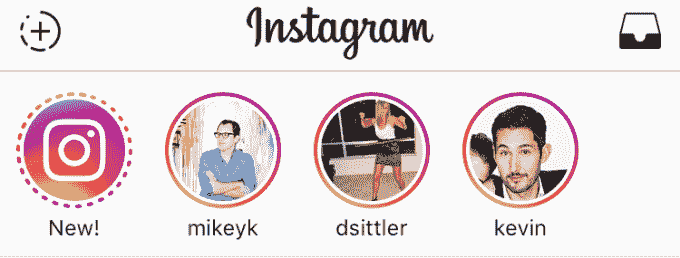
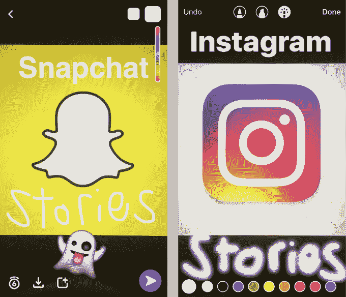
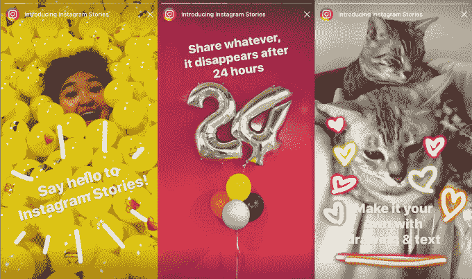

# Instagram 阉割了 Snapchat，就像脸书阉割了 Twitter

> 原文：<https://web.archive.org/web/https://techcrunch.com/2016/08/09/the-good-enough-strategy/>

与网络效应相结合,“足够好”大有帮助。你不需要总是做得更好才能赢，你只需要剥夺你的竞争对手的吸引力。如果你提供便利，即使没有质量，为什么人们会迷路？

这就是 [Instagram Stories](https://web.archive.org/web/20230329174654/https://techcrunch.com/2016/08/02/instagram-stories/) 背后的策略。

Snapchat 发明了一种分享日常生活的出色格式:照片和视频幻灯片加入评论，24 小时后消失，这样你就可以分享一个未经打磨的窗口。它迅速超越了 Snapchat 10 秒钟爆炸式私信的受欢迎程度，并使该应用程序增长到 1.5 亿日常用户。

Snapchat Stories 成了你在 Instagram 上发布的所有不够完美的帖子的家。Snapchat 的短暂性与脸书和 Instagram 的永久性形成了鲜明的区别。随着人们分享越来越多，故事看起来像是下一个大的社交媒体，并有可能从 Instagram 窃取内容和注意力。

因此，Instagram 从脸书 2011 年的剧本中挖掘出一个计划。

当时，公众人物的实时更新看起来像是下一个大型社交媒体，Twitter 是他们的家。陌生人发布的未经过滤的帖子与脸书通过算法过滤的朋友发布的帖子截然不同。

于是脸书推出了[订阅](https://web.archive.org/web/20230329174654/http://www.adweek.com/socialtimes/subscribe-button/268471?red=if)，这是一种关注公众人物的方式。

> 它从来都不是“推特杀手”不一定是这样的。

它并不比推特更好。更新没有实时出现。并不是所有最好的内容创作者都打开这个功能，这样他们就可以被关注。那时，没有标签，也没有热门话题。它缺乏 Twitter 那种即兴的城市广场讨论的感觉。

但是 Subscribe 并没有试图赢回死忠的 Twitter 用户。它从来都不是“推特杀手”与脸书的 8 亿用户相比，Twitter 只有 1 亿用户，这还为时过早，所以没必要如此。

足够好战略的目标是阻碍竞争对手的未来增长，而不是窃取他们已经获得的东西。

对一些人来说，脸书订阅已经足够好了，他们不需要加入 Twitter。订阅生活在他们已经访问过的新闻提要中。你不需要注册另一个账户，学习一个新的词汇或界面。你不需要建立新的观众群或者从零开始。

它并没有扼杀 Twitter，但是对于已经使用脸书的人来说，它似乎变得不那么必要了。五年后，Twitter 用户仅增长到 3.13 亿，而脸书现在有 17.1 亿。脸书仍在努力改善实时、公开的内容，但 Twitter 的问题是，它无法令人信服地解释为什么每个人都需要它。脸书的足够好的克隆消除了一些需要。

现在，Instagram 也在用同样的方式对抗 Snapchat。

Instagram Stories 缺乏 Snapchat Stories 的质量。没有地理滤镜、动画自拍镜头、3D 贴纸、速度效果或截图提醒。相机不是自发录制的默认主屏幕。上传也不顺利。

但是 Instagram 的故事可能足以减缓 Snapchat 的增长，特别是在 Instagram 的现有用户中。Instagram 的故事出现在提要的顶部，所以没有办法错过它们。核心的绘图和文本叠加工具就在那里。最重要的是，你不必在不同的应用程序上建立新的受众。

> 脸书之前克隆 Snapchat 的尝试失败了，因为他们试图创造一个“甚至更好”的版本。

再说一次，大多数 Snapchat 忠实用户可能不会放弃这一切。我的几十个朋友已经在玩 Instagram Stories，有几个事实上已经停止了 Snapchatting。然而，Instagram 故事的真正目标是所有那些对 Snapchat 有趣的创作工具和格式感到好奇的人，但他们要么尝试过并放弃了它，要么认为它只适合青少年，或者需要做太多工作才能采用。

如果没有成功，Instagram 仍然可以取消故事功能。唯一的代价将是一些开发时间和它抄袭 Snapchat 的侮辱 Instagram 首席执行官凯文·斯特罗姆在一次采访中巧妙地向我承认,“他们应该得到所有的赞扬。”无论有没有故事，Instagram 仍然主宰着精致的社交媒体，就像没有订阅，脸书仍然主宰着重大生活事件和意见分享一样。

如果 Instagram Stories 取得成功，它可能会成为方得最危险的对手。脸书之前尝试克隆 Snapchat 的尝试都失败了，很大程度上是因为他们试图制作一个“更好”的 Snapchat 版本，作为一个独立的应用程序，可以与 Snapchat 面对面。在这里，脸书明智地将一个足够好的版本整合到一个已经很受欢迎的应用程序中。

Snapchat 必须与其早期社区的奖金特征、真实性和实力竞争，而不是以其核心故事格式进行交易。Instagram 没有很好地杀死它，但是它可能伤害了 Snapchat 的繁殖能力。