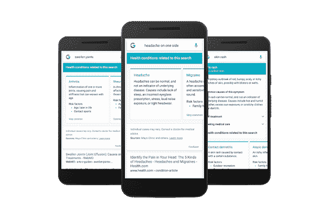

# 谷歌应用通过智能症状搜索挑战 WebMD 

> 原文：<https://web.archive.org/web/https://techcrunch.com/2016/06/20/the-google-app-takes-on-webmd-with-an-intelligent-symptom-search/>

# 谷歌应用程序采用智能症状搜索来应对 WebMD

如果你曾经在生病时上网，你可能已经开始担心你得了致命的食肉病毒，而不是普通感冒。谷歌的目标是在接下来的几天里通过对谷歌应用程序的一些调整来消除一些焦虑和困惑。

谷歌应用程序通过语音命令搜索旧金山的天气等信息，或者要求它为炉子上的烹饪计时。谷歌现在计划为该应用程序带来更智能的症状搜索，方法是梳理该平台上网络结果中提到的数百万种健康状况(约占所有搜索的 1%)，然后通过[知识图](https://web.archive.org/web/20221007033001/https://www.google.com/search/about/)将它们与从医生那里收集的医疗信息进行核对。

很快，你就可以让谷歌应用告诉你“一侧头痛”是什么意思，谷歌会提供一系列相关症状，如“头痛”、“偏头痛”、“紧张性头痛”、“丛集性头痛”、“鼻窦炎”和“普通感冒”。

“对于像“[头痛](https://web.archive.org/web/20221007033001/https://www.google.com/webhp?hl=en#hl=en&q=headache)”这样的个别症状，“我们还会给你一个概述性的描述，以及关于自我治疗选项的信息，以及可能需要医生就诊的信息，”谷歌在最近关于更新的[博客文章](https://web.archive.org/web/20221007033001/https://googleblog.blogspot.com/2016/06/im-feeling-yucky-searching-for-symptoms.html)中写道。

这项新发展可能会很有用。现在，我们大多数人只是简单地输入搜索，依靠业余爱好者的怜悯或 WebMD 上偶尔爆笑的诊断(我上次去那里时，它显示我有肌肉痉挛、胆结石或肾癌。是肌肉抽筋)。

谷歌的云机器学习平台为应用程序中的语音命令搜索提供了支持，并可以根据谷歌对你的了解来帮助优化搜索，从而带来更好的结果。

未来几天，这一更新将首先在手机上推出，包括英语和美国。谷歌表示，它希望添加更多的症状和语言，并随着时间的推移在更多国家提供更新。