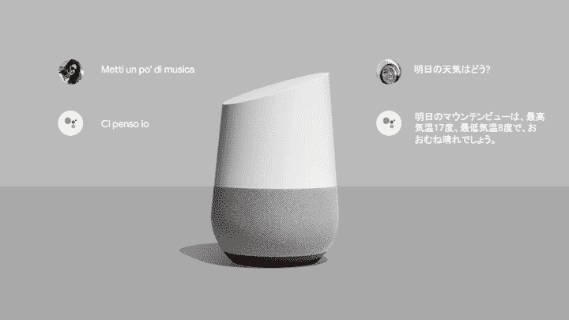
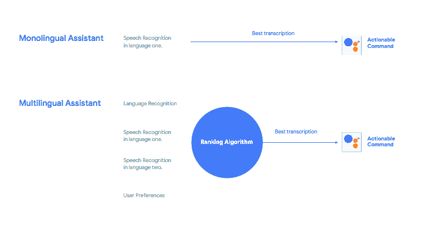

# 谷歌助手现在是双语的

> 原文：<https://web.archive.org/web/https://techcrunch.com/2018/08/30/the-google-assistant-is-now-bilingual/>

谷歌助手对多语言家庭来说变得更加有用。[从今天](https://web.archive.org/web/20230407055139/https://www.blog.google/products/assistant/meet-bilingual-google-assistant-new-smart-home-devices)开始，你将可以在 Google Home 应用程序和手机助手中设置两种语言，然后 Google Home 会很高兴地对你的命令做出反应，比如英语和西班牙语。

鉴于谷歌在今年早些时候的 I/O 开发者大会上宣布它正在开发这项功能，今天的宣布并不令人惊讶。很高兴看到今年，谷歌在明年的活动之前就推出了它的 I/O 公告。过去并不总是这样。

目前，助手只能说双语，它还有几门语言要学。但目前，你可以设置任何语言对，包括英语、德语、法语、西班牙语、意大利语和日语。未来会有更多的配对出现，谷歌也表示它也在致力于三种语言的支持。

谷歌告诉我，这个功能可以在所有支持你所选语言的助手界面上使用。这基本上是所有带助手的手机和智能扬声器，但不是新的智能显示器，因为它们目前只支持英语。

虽然这听起来像是一个容易实现的功能，但谷歌指出这是 T2 多年的努力。要构建这样一个系统，你必须能够识别多种语言，理解它们，然后确保向用户提供正确的体验。你必须在几秒钟内完成所有这些。

谷歌表示，其语言识别模型(LangID)现在可以区分 2000 种语言对。有了这一点，该公司的研究人员就必须建立一个系统，可以将口头查询转化为所有支持语言的可操作结果。谷歌副总裁 Johan Schalkwyk 和谷歌语音工程师 Lopez Moreno 在今天的声明中写道:“当用户停止说话时，该模型不仅可以确定正在说什么语言，还可以确定说了什么。”当然，这一过程需要复杂的体系结构，这增加了处理成本，并有可能带来不必要的延迟

如果你在德国、法国或英国，你现在也可以在谷歌 Home Max 上使用双语助手。谷歌家庭的高端版本今天将在这些国家销售。

此外，谷歌今天还宣布，许多新设备将很快支持助手，包括 tado 恒温器、许多新的安全和智能家居集线器(当然，虽然不是亚马逊自己的铃声警报)、智能灯泡和电器，包括 iRobot Roomba 980、896 和 676 真空吸尘器。毕竟，谁想在吸尘器上按一个按钮。