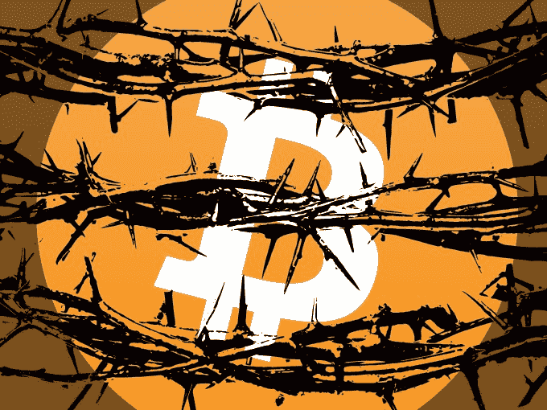

# 在 Satoshi 圆桌会议之后，是否有办法弥合比特币鸿沟？

> 原文：<https://web.archive.org/web/https://techcrunch.com/2016/03/13/the-great-bitcoin-divide/>

Salil desh pande撰稿人

Salil Deshpande 是

[Bain Capital Ventures.](https://web.archive.org/web/20230131001140/http://www.baincapital.com/)

他专注于基础设施软件和开源。

More posts by this contributor

比特币开发者之间最近的分歧，最初源于增加所谓的块大小(以便增加交易吞吐量)的问题，暴露了关于分布式治理的深刻分歧；具有讽刺意味的是，现在已经导致了根深蒂固的立场、暴躁的脾气、公开的侮辱、指责和贬低的言论。

**地缝**

一些人主张保留比特币(比特币核心)的当前实现，另一些人认为需要立即增加区块大小以克服可扩展性挑战，这两种对立的观点将比特币开发者社区分成了两大阵营。

对这一裂痕的戏剧性公开描述来自 Mike Hearn 1 月份在 Medium 上发表的博客文章，该文章挑衅性地声称“ [比特币实验失败了](https://web.archive.org/web/20230131001140/https://medium.com/@octskyward/the-resolution-of-the-bitcoin-experiment-dabb30201f7/) ”,原因是社区不愿意增加区块大小:

> “比特币为什么失败了？它失败了，因为社区失败了。本应是一种新的、去中心化的货币形式，缺乏“系统重要性机构”和“大到不能倒”，却变成了更糟糕的东西:一个完全由少数人控制的系统。更糟糕的是，网络正处于技术崩溃的边缘。本应阻止这一结果的机制已经崩溃，因此不再有太多理由认为比特币实际上比现有的金融体系更好。”

迈克的帖子发布后，比特币的价格暴跌至 358 美元，但在撰写本文时已回升至 418 美元。 [替代品出现了](https://web.archive.org/web/20230131001140/https://bitcoinmagazine.com/articles/unlimited-classic-and-bitpay-core-bitcoin-s-new-kids-on-the-blockchain-1452705977) ，比如比特币无限制，没有硬编码块大小限制；比特币经典版，将区块大小增加到 2 兆字节；和具有自适应块大小限制的 BitPay 核心。

本月早些时候，各种派别召集了 [Satoshi 圆桌会议](https://web.archive.org/web/20230131001140/http://satoshiroundtable.org/) ，一个邀请 50 人左右的聚会，这些人原来是比特币背后最重要的人物的集合。作为一个比特币狂热者，我没有参与这场竞赛，但贝恩资本风险投资公司通过 [数字货币集团](https://web.archive.org/web/20230131001140/http://dcg.co/) 投资了几十家比特币和区块链初创公司。

一个有着不寻常背景的不太可能的人， [布鲁斯·芬顿](https://web.archive.org/web/20230131001140/https://www.linkedin.com/in/brucefenton) ，构思并组织了这次圆桌会议。芬顿自称是热爱自由的技术极客。像区块链行业的许多人一样，他是一名自由市场经济学家，主张放松监管。

他是比特币中联系更紧密的人之一(他在 2015 年当选比特币基金会主席)，更令人惊讶的是，他是这个问题上罕见的中立党派之一。他已婚，是四个孩子的父亲，每年有半年的时间都在旅行，在中东待了很长时间，差点竞选国会议员，过去曾为包括贝恩资本(Bain Capital)在内的一些全球最大的投资者提供咨询服务。  

值得注意的是，他能够说服这 50 个人投入他们自己的时间和金钱来解决这个问题。圆桌会议最初的愿景并不宏伟——它只是一个与朋友谈论行业的有趣聚会——但仅在第二年，它就发展成为一个顶级的私人聚会。因此，今年圆桌会议的核心目标是尝试解决裂痕，建立统一的比特币。

在活动开始前，社区似乎很支持。这与圆桌会议的第一次会议形成了对比，在第一次会议上，人们的情绪似乎是，“这些家伙是谁，他们为什么要秘密会面？他们以为自己是谁，光明会吗？”今年的主题是，“动手吧，伙计们。找个解决办法。”

**选手们**

与会者包括交易所、钱包、另类区块链和加密货币等重要比特币公司的首席执行官。有来自足够多的矿工(验证交易的哈希服务器的运营商)的首席执行官，他们代表了比特币网络超过 50%的哈希容量(矿工可以用他们的服务器对重要问题进行“投票”，如运行哪个版本的比特币代码)。

但最重要的是，许多关键的开源开发者都出席了(我说“最重要”是因为至少在目前，他们对比特币技术的发展拥有最大的控制权和最强烈的意见)。

大裂谷的两个分支都得到了充分的代表。

裂缝的一边是比特币核心团队，他们是比特币主要来源基础的贡献者，并承担维护和增强它的责任，更重要的是，对众多增强建议进行优先排序。 [亚当背](https://web.archive.org/web/20230131001140/https://en.wikipedia.org/wiki/Adam_Back)[马特科拉洛](https://web.archive.org/web/20230131001140/https://twitter.com/thebluematt)[彼得托德](https://web.archive.org/web/20230131001140/https://twitter.com/petertoddbtc) ， [埃里克隆布罗佐](https://web.archive.org/web/20230131001140/https://www.linkedin.com/in/ericlombrozo) ， [亚历克斯莫尔科斯](https://web.archive.org/web/20230131001140/https://twitter.com/morcosa) ，以及 [卢克达什 jr【达什](https://web.archive.org/web/20230131001140/https://www.linkedin.com/in/lukedashjr)

一年多来，他们的立场是，通过一次性增强来增加区块大小对比特币没有好处；是的，数据块大小需要增加，但这应该在以后完成，也许是第二次、第三次或第四次，作为更大的一组重要变化的一部分。最重要的是，他们优先考虑矿工和安全之间的高度共识(即在不打破比特币的情况下升级)。

正如马特科拉洛[所说](https://web.archive.org/web/20230131001140/http://bluematt.bitcoin.ninja/2016/02/08/moving-forward/) :

> 然而，在这一点上，整个比特币社区似乎已经围绕着一个单一的愿景达成了一致——每块大约 2MB 的交易，无论是通过隔离见证还是通过硬分叉，都是既可以得到技术支持，又可以在第二层技术必须到位之前增加更多空间的东西。此外，似乎绝大多数机构群体都同意隔离证人应该在不久的将来实施，并且在某个时候硬分叉将是必要的。尽管社区中有明显的一致意见，但令人难以置信的是，仍然有如此多的冲突…

裂痕的另一边主要是 [加文·安德里森](https://web.archive.org/web/20230131001140/https://en.wikipedia.org/wiki/Gavin_Andresen) ，但也有 [罗杰·韦尔](https://web.archive.org/web/20230131001140/https://en.wikipedia.org/wiki/Roger_Ver)[布莱恩·阿姆斯特朗](https://web.archive.org/web/20230131001140/https://www.linkedin.com/in/barmstrong)[【彼得·史密斯](https://web.archive.org/web/20230131001140/https://www.crunchbase.com/person/peter-smith-2) ，以及其他各种钱包提供商和其他 CEO

加文的立场是，比特币在自身成功的重压下窒息，需要立即增加块大小，可能是数倍。在未能说服比特币核心团队优先增加区块大小后，加文创建了一个替代实施方案，名为比特币经典。比特币经典版只做了一个增加区块大小的改变；一些矿商认为这是更安全的选择，纯粹是因为它包含的变化少得多。

讨论了什么

圆桌会议之前气氛一直很紧张，但对话以建设性的方式开始。该小组开始围绕两件事寻找共同点:(1)行为准则，或者至少是强烈反对的开发者之间的互动规则，以及(2) [每个人都同意的关于比特币的原则](https://web.archive.org/web/20230131001140/https://pbs.twimg.com/media/Ccarm-jXIAAoZvU.jpg:large) 。

人们一致认为，裂痕正在伤害每个人。人们还一致认为，比特币分裂成两个区块链将会非常非常糟糕；交易会丢失或重复；不清楚真正的比特币是什么；声誉受损会很严重。尽管第二天达成共识似乎变得更加困难，但还是有一些相反的意见认为，也许这并不是那么糟糕，因为这样或那样的区块链将作为真正的比特币存在。 **治理**

每个人都同意问题是从块大小开始的(这仍然是当前的问题)，但是社区无法解决这个问题已经暴露了一个更大的问题:对治理的迫切需要。但这是一个非常难以解决的问题，因为(a)比特币完全是去中心化的，不需要信任一个中央实体，(b)比特币不受任何一个机构甚至司法管辖区的控制，(c)这个群体以及整个社区对任何关于治理结构或机构的建议反应非常消极。

大约 50 人分成 7 个不同的小组，他们有时聚在一起，有时在午餐、晚餐和饮料时分开。包括一家大型矿商和一家大型交易所运营商在内的一个团体认为， [港协议](https://web.archive.org/web/20230131001140/http://www.forbes.com/sites/laurashin/2016/02/21/60-bitcoin-agreement-promises-to-break-impasse-leads-to-jump-in-value/) 很好，只要区块规模增加的时间表提前。

另一个小组认为，未来的目标应该是鼓励更多的公司进行开采，为比特币的去中心化做出贡献，并有两个不同的子目标:开采的去中心化和节点的去中心化。

这些团体定期提醒彼此，他们有一个信誉问题，局外人看不到僵局。

在小组讨论过程中，一些人呼吁辩论双方进行更文明的对话，而另一些人则表示，不同的方法实际上并不相互排斥，如果各派能够就时间表达成一致，这两种方法都可以执行。

而有些人则带着失败主义的口吻指出，有些担忧应该是 所谓的 *第 1 层* 担忧(第 1 层是比特币的基础层，这个群体所担忧的层)，而有些担忧应该是 *第 2 层* 担忧(即另一层，负责不那么基础的事情，类似于网络协议栈)。

他们指出，有些是短期目标(区块大小)，有些是长期目标(治理，以及我们将来如何决定这些事情)。

在这个项目的过程中，人们提出了对所谓的 *共识规则* 进行变更的需求，将这些共识规则从代码的其余部分中分离出来，并对这些共识规则进行治理。

共识规则是决定矿工之间是否达成共识的代码，如果你愿意的话，是对投票的计数，它可以用来决定许多事情，包括…等等…运行比特币代码的哪个分支。

第三个团体提议，我们应该允许不仅仅是矿工投票，首先推出在交易中对投票进行编码的能力，用硬币年龄等参数来控制谁在何时投票。这在圆桌会议之前已经讨论过了，大多数人似乎认为这个想法是有根据的，这个想法的一个变体也是可行的；但是争论哪种变化是另一个治理问题。

他们警告圆桌会议不要轻视硬分叉场景，因为“没有人真正知道在硬分叉中会发生什么。”他们要求每个人停止寻找一个伟大的选择，甚至是一个好的选择，只找到最不坏的选择。(我确信，我是唯一被现实世界中未成年人不能投票这一事实逗乐的人；而在比特币中，只有矿工可以投票。我没有用这个双关语来浪费大家的时间。)

一位著名的密码科学家，也是另一种类似于比特币的加密货币的创造者，建议我们不要采取妥协的态度，因为当你站在悬崖边时，谈判太难了:

> “伙计们，我是真心实意的，我们不应该如此努力地就街区规模和治理达成共识。我们将继续有不同的、不相容的观点和策略，这没关系。我认为谈判和妥协会因为认为别无选择、必须达成共识或世界末日而变得更加困难。这并不是世界末日，参与的每个人都知道在没有协议的情况下他们有什么选择，并看到这些选择的价值，这对于真正的自愿合作是必要的。”

[比特币基金会的领导人之一](https://web.archive.org/web/20230131001140/https://en.wikipedia.org/wiki/Bitcoin_Foundation) 主动提出，“治理可能不是最好的任期。我们确实需要协议的标准化和一个被广泛接受的路线图来实现和发布改进。如果没有领导者、治理模式或其他形式的共识，这是很难做到的。也许我们需要建立一个协议或公认的选择前进道路的方式，这样我们才能作为一个群体取得进展。”

有几个人说，让矿工们决定，我们就此了结吧。其他人坚持认为这是非常狭隘的想法。“矿商的眼光非常非常短浅；他们中的一些人按小时开启和关闭采矿，”一位专家补充道。

出席圆桌会议的矿工们，有趣的是，并没有对此进行辩论，似乎也没有异议。

在小组讨论和扑克比赛期间(只有中国比特币矿业公司 BTCC 的首席执行官世尘小雪拥有足够的比特币、美元、欧元、人民币和手机信号，可以成为所有玩家的银行)，另一家大型矿商说，“我不想要这种权力。别给我这个权力。我不想处于一个我们必须做紧急硬分叉的位置。如果我们这样做了，游戏就结束了。比特币再也不会是原来的样子了。如果是简单的改变，比特币更安全。一个小小的改变。这就是我们支持比特币经典的原因，因为这是最小最简单的变化。”

**战书**

比特币基地首席执行官 Brian Armstrong 警告说，比特币作为一种协议和一个行业正处于一个糟糕的境地，一个危险的境地。然后，他继续阐述了一个非常，非常强烈和有争议的立场:

“我们需要一个新团队来研究比特币协议。比特币核心是一个很好的团队。比特币经典是个不错的团队。但是我们需要一个更好的团队——一个伟大的团队——来制定协议。我正在考虑去做这件事。”

提到他的名字我感到很舒服，因为他后来在博客上写了这件事 (否则我们已经同意我们可以写人们说的话，而不用提到他们的名字):

但随着对话的进行，阿姆斯特朗越来越不关心我们选择什么样的短期解决方案，因为他意识到我们都有一个更大的问题: **如果比特币核心是唯一一个研究比特币的团队，比特币的系统性风险** 。

> 他们宁愿保留一些现在可以帮助网络的东西，因为他们不相信社区在未来会做出明智的决定。他们认为自己是网络的中心策划者和人民的保护者。

然后 Armstrong 概述了我们在圆桌会议上讨论过的几个非常麻烦的失败场景，并总结道:

> 如果你想确保比特币的成功，我会鼓励你在短期内升级到比特币经典版，然后尽你所能帮助完成我上面概述的三步计划。这是缓解我们所处的危险境地的最佳途径。

我觉得这种姿态令人印象深刻，我钦佩他敢于直面困难。仅仅因为我们现在升级到比特币经典版，并不意味着我们需要永远使用经典版。这是一个降低风险的选择。不过，普通读者很难核实这项研究。尤其是，我认为关键在于:

> 【比特币核心团队提案】 **不仅需要新的比特币核心代码，还需要产生交易的各大钱包提供商编写新代码。这不太可能及时完成，以避免我们当前面临的扩展问题。** 整个行业为此需要编写的代码行数将比将 1MB 块更改为 2MB 块的扩展解决方案多几个数量级。在会议上向核心开发人员解释了这一点，但这似乎并没有改变他们对扩展的最佳短期解决方案的看法。

强烈的 [反应的](https://web.archive.org/web/20230131001140/https://www.reddit.com/r/technology/comments/48zggz/a_behind_the_scenes_look_at_how_bitcoin_core/)[火焰的](https://web.archive.org/web/20230131001140/https://www.reddit.com/r/Bitcoin/comments/48zhos/what_happened_at_the_satoshi_roundtable/) 分别是 [必然的](https://web.archive.org/web/20230131001140/https://news.ycombinator.com/item?id=11226912) 。我并不担心这是比特币基地“接管”比特币的策略——那将非常非常困难。

[比特币核心团队的观点](https://web.archive.org/web/20230131001140/https://news.ycombinator.com/item?id=11226912) 关于为什么比特币经典提案是欠考虑的是:

*   与比特币核心团队推荐的隔离见证软分叉不同，矿工、商家、开发者和用户从未部署过硬分叉，因此安全部署它们的技术尚未经过测试。
*   硬分叉要求所有完整节点升级，否则使用该节点的每个人都可能会赔钱。
*   即使是增加最大块大小这样的单行更改也会对代码的其他部分产生影响，其中一些是不可取的。

**我的结论**

比特币可能是目前金融科技领域发生的最重要的事情。如何管理一种被明确设计为没有中央控制机构的加密货币，这个问题在哲学上很有意思。

我相信涉事玩家都是善意的讲道理的人。他们都有一个共同的目标:让比特币成功。他们只是在如何到达那里的问题上意见不一(非常非常强烈)。这涉及到一些自我。有一些争夺权力或控制权的活动。但是对这个问题有足够的关注和担忧，我认为他们会解决短期问题(块大小),并开始在没有授权给中央机构的情况下进行更困难的分布式治理的长期任务。

我将区块链技术分为两类:(1)比特币作为价值储存手段需要赢得的人气竞赛(2)其他一切。“其他一切”包括其他公共区块链、私人区块链、公共或私人区块链上的第 2 层“应用程序”、替代加密货币等。第二类很有趣，那里可能会诞生一些价值数十亿美元的公司。我将这类公司比作 Docusign 或 Salesforce.com 等公司，即帮助我们更好地开展业务的企业技术公司。但第一类真的很有趣，因为在未来 50 年，比特币可能会发展成为事实上的非代表性非法定价值储存手段，即使它不是我们每天用来交易的货币。

正如我在 之前写的 [一样，作为一种价值储存手段和法定货币的替代品，人们必须相信，法定货币已经被主权国家变得越来越适用。在美国和西欧，我们认为拥有拥有央行技能、经验、信誉和能力的机构是理所当然的，这些机构分别是美联储和欧洲央行。](https://web.archive.org/web/20230131001140/https://www.linkedin.com/pulse/debug-my-theses-2015-salil-deshpande)

其他央行都是能力较弱，独立性较差，政治性或腐败性更强，最重要的是无法撤销其主权国家的错误，比如专制的民族主义，以及运行中的经济体都是 [过度依赖一种商品](https://web.archive.org/web/20230131001140/http://www.forbes.com/sites/francescoppola/2014/12/16/how-opec-destroyed-the-russian-ruble/) 。这一点在小主权国家更为明显，通常是在非洲或拉丁美洲，因为它们的经济崩溃或货币贬值。

央行是由人管理的，因此总是容易犯这样的错误，这就是黄金等非法定代表价值储存手段占有一席之地的原因。出于这个原因，我仍然认为，比黄金更便于操作和运输的非法定价值储存手段在未来将占据更大的市场。我们正在进行的关于比特币协议的理性(尽管激烈)讨论是否优于缺乏经验、不称职且通常不透明的央行？我也这么认为

在恐慌期间购买比特币是有意义的，我预计在未来几个月，随着事情自行解决，会出现几次恐慌。但话说回来，我是风险投资家。