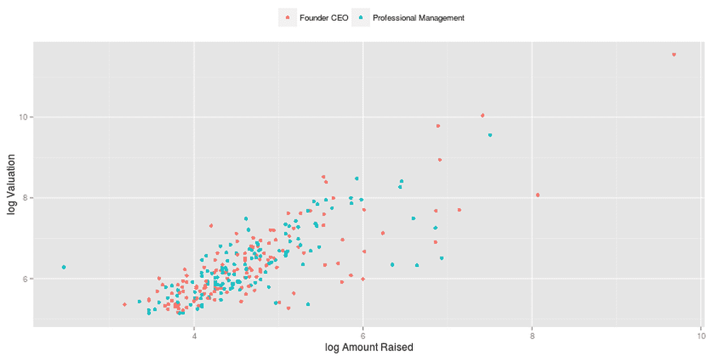
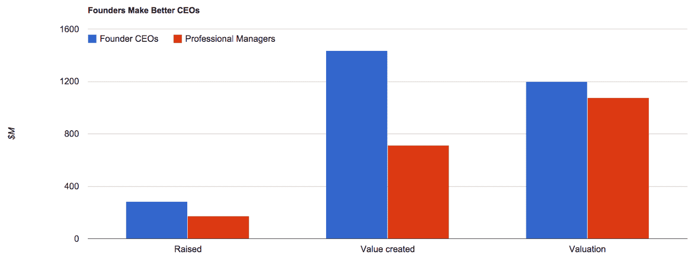
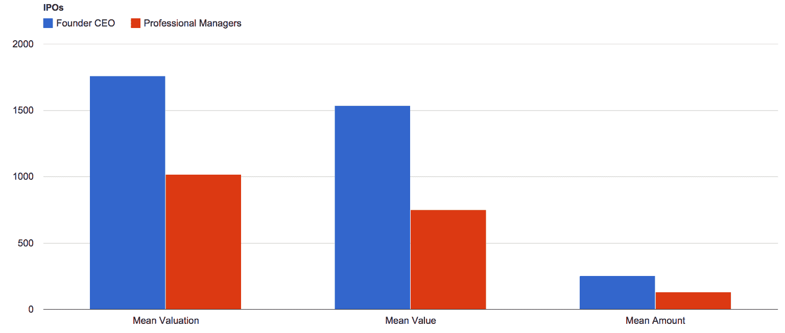
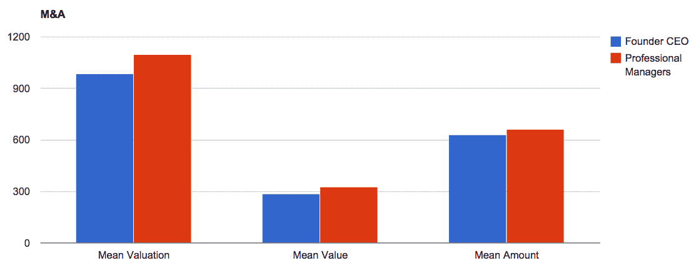

# 创始人的重要性 

> 原文：<https://web.archive.org/web/https://techcrunch.com/2015/05/11/the-importance-of-founders/>

本·纳拉辛做了 25 年的企业家，8 年的种子投资者，现在是一名风险投资家，是

[Canvas Ventures](https://web.archive.org/web/20221226110830/http://www.canvas.vc/)

.

More posts by this contributor

迈克尔·阿博特撰稿人

**编者按:** *本 纳拉辛是 TriplePoint Ventures 的总裁迈克尔 雅培是凯鹏华盈&拜尔斯的普通合伙人。*

在之前的时代，一些人认为最好的做法是引入“职业经理人”来管理由富有创造力和勤奋的企业家创办的企业，一旦这些企业开始形成规模，并且似乎需要“成人监管”。“升级管理”这个词仍然偶尔在投资者中听到，但从未在创始人面前出现过。

在最近的一次早餐会上，我们谈到了这一概念令人愤怒和冷酷无情的本质，以及我们的共同信念，即在我们现代的创业时代，这实际上与建设世界级企业背道而驰。我们用早餐时间讨论了创始人的重要性，他们给企业带来的道德权威，以及没有他们的巨大成功的罕见性。

这就提出了一个问题，即这些数据是否会证明我们的观点，或者证明保守派确实有道理。那次早餐让我们开始寻找和分析数据，并写下这个故事。它让我们确认并重申了创始人的重要性。

## 数据集

认识到使用经验方法对固有的定性问题建模的局限性，我们希望我们使用的数据集是正式的。我们搜索了 1994 年至 2014 年间任何 IPO 或 M&A 退市的数据，在 894 家公司中产生了 1195 笔融资。

有几家公司被多次出售，例如 About.com 和凯业必达，这两家公司都被收购了三次以上，因此我们在最终结果中尽可能排除了重复计数。

我们生成了一个二元指标——如果公司的首席执行官在 IPO 或收购时也是创始人之一，则为 1，否则为 0。下面的散点图以对数标度显示了公司筹集的风险资本和债务资本的数量，以及它们在 IPO 或收购时的相应估值。创始人领导的公司是红色的，其他的是蓝色的。

然后，我们研究了创始人领导的公司与职业经理人领导的公司的平均估值、融资额和价值(融资额与 IPO/M&A 时估值之差)。

## 创始人通过筹集资金创造更多价值

创始人 CEO 比职业经理人平均筹集了更多的资金，产生了更高的估值。然而，他们真正的闪光点在于创造“价值”——融资额与估值之差。创始人兼首席执行官领导的公司创造的价值是职业经理人领导的公司的两倍多。

## 创始人在 IPO 中创造更多价值

IPO 也是如此，创始人兼首席执行官比非创始人兼首席执行官筹集了更多的资金，产生了更高的估值和价值。

## 经理们在 M&A 活动中表现稍好

当我们只看 M&A 的活动时，由非创始人首席执行官领导的公司的估值和价值略高。

或许正确的结论是，当最终结果是直接收购，且平均价值低于筹集的总资本时，更换创始人就不那么疯狂了。这甚至看起来很直观，因为收购有时可能是优秀团队退出经营不善的公司的方式，而职业经理人更擅长这些最后关头的场景。

成为一名创始人可能需要一个狂热者的承诺水平，如果这一愿景不再可以实现，创始人可能很难也不可能放弃他的信念，走向一个无法实现他们梦想的出口。一个职业经理人可以在没有“要么全有，要么全无”的创始人的情感包袱和承诺的情况下驾驭水域。我们肯定听说过专业人士被请来“给猪涂口红”并让公司被卖掉的故事，但这些都是负面的管理场景。

## 创始人是比专业人士更好的首席执行官

然而，把我们吸引到这个问题上的，以及数据似乎证明的，是乐观的版本；大赢家。数据显示了我们的经验告诉我们的情况；更换创始人去追求一个伟大的梦想是一种可能性较低的方法，应该被视为一种核心选择。在所有其他可能性都已经穷尽的情况下，这应该是一件罕见的例外的事情。

偶尔，当最初的创始人认为最好的前进方式是与补充他们领导力的人合作(这里的关键词是“合作伙伴”)时，这确实是有意义的。然而，大多数情况下，并没有像杰里/费罗/库格尔或拉里/谢尔盖/施密特那样成为高功能的合作伙伴，但听到创始人被董事会或投资者排挤或取代的消息可能会令人痛苦。

我们早上起来帮助大胆的企业家建立改变世界的公司，这些公司通常受到其他公司和公开市场投资者的高度评价。如果这些是大多数风险投资家想要支持的公司，那么数据将表明有利于让创始人首席执行官领导他们努力建立的公司。

###### 我们使用了四个主要数据集:

###### 1.CB Insights——用于退出估值

###### 2 & 3.Crunchbase 和 LinkedIn——尽可能用算法填充创始人/CEO 的名字

###### 4.Amazon Turk——为了填补空白和清理数据，我们让两组独立的 Turk 独立运行整个数据集，以便我们进行双盲错误检查。

###### 我们很乐意分享原始数据集。邮件主题行中的“数据集”发送到[seriesseed@gmail.com](https://web.archive.org/web/20221226110830/mailto:seriesseed@gmail.com)