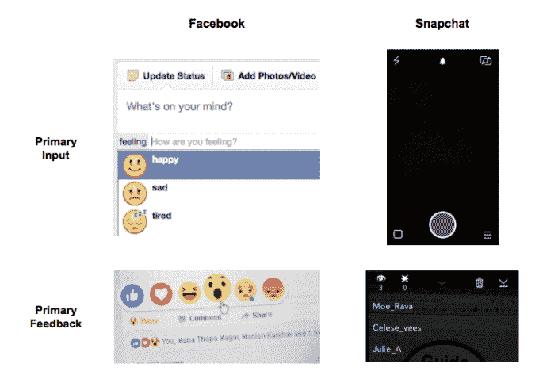

# 信息时代结束了；欢迎来到体验时代

> 原文：<https://web.archive.org/web/https://techcrunch.com/2016/05/09/the-information-age-is-over-welcome-to-the-experience-age/>

迈克·瓦德拉是

[Teleport](https://web.archive.org/web/20230401151836/http://teleportvr.co/)

.

More posts by this contributor

万维网问世 25 年后，信息时代即将结束。多亏了手机屏幕和无处不在的互联网，我们现在进入了我所说的“体验时代”

你上次更新脸书状态是什么时候？也许你不再做了？据报道，脸书 16 亿用户的原始状态更新下降了 21%。

状态框是信息时代的标志，这是一个由台式电脑主导的时代，也是一个公司组织全世界所有信息的使命。体验时代的图标看起来大不相同，它们诞生于微型计算机、移动传感器和高速连接。

状态盒的消亡只是从信息向体验转变的一小部分。是什么推动了这种转变？简而言之，我们的在线互动环境不断变化，这是由我们的互联设备决定的。

## 你不是你的个人资料

为了说明这是如何发生的，想想[脸书](https://web.archive.org/web/20230401151836/https://www.crunchbase.com/organization/facebook)和 [Snapchat](https://web.archive.org/web/20230401151836/https://www.crunchbase.com/organization/snapchat) 。

脸书是一个信息时代的土著。和同时代的其他社交网络一样，脸书建立在桌面时代的一个原则上——积累。

积累体现在数字档案中，我的身份是我保存的所有信息的总和——文本、照片、视频、网页。(埃文·斯皮格尔在 2015 年 YouTube 上一个名为[什么是 Snapchat 的视频中首次探讨了这一点。](https://web.archive.org/web/20230401151836/https://www.youtube.com/watch?v=ykGXIQAHLnA))。在信息时代，我们用这个数字档案来表现自己。

但是手机改变了我们看待数字身份的方式。随着一台联网的摄像机记录下我们的生活，积累的信息让位于持续的自我表达。“虚拟自我”变得不那么明显了。我可能是我所做的一切的结果，但我不是它的积累。Snapchat 是这种新现实的产物。

> 你不是个人资料。你就是你。

许多人认为 Snapchat 完全是为了保密，但 Snapchat 短暂消息的真正创新之处并不在于它们会自毁。而是它们迫使我们打破从桌面计算带来的积累习惯。结果是，个人资料不再是社会世界的中心。在经验时代，你不是一个侧面。你就是你。

## 秀，不要说

体验时代的中心思想是这样的——我给你看我的观点，你给我你的关注。我听到你在喊，“这一直是社交的故事！”事实也的确如此。但改变的是，我们现在告诉彼此的故事开始和结束都是可视化的，这使得叙事比以往任何时候都更真实。

信息时代，交流的起点是信息。在脸书上，你可以在状态框中输入内容，添加你的位置等元数据，并根据你的感受从不同的情绪层次中进行选择。这种信息优先的方法在脸书的反馈机制中也很明显——六个预先选择的反应和线程评论。

相比之下，Snapchat 总是从摄像头开始。反馈是被动发送的——在你的故事上滑动会显示哪些朋友看过你的照片。在体验时代，主要的输入是视觉，主要的反馈是注意力。

如今，连接分享和关注的反馈回路始于手机，止于手机；例如，在未来，它可以从隐形眼镜开始，到虚拟现实结束。

## 经验堆栈

这一现实框定了脸书最近的投资，这些投资将直播视频、360 度摄像机和虚拟现实作为产品全部纳入一个投资组合。但是，脸书并不是唯一一个向前看，看到所有这些技术如何排列的科技巨头。现在你可能已经听说过 [Magic Leap](https://web.archive.org/web/20230401151836/https://www.crunchbase.com/organization/magic-leap) ，这家超级隐形的 AR 初创公司估值 45 亿美元，由[谷歌](https://web.archive.org/web/20230401151836/https://www.crunchbase.com/organization/google)和[阿里巴巴](https://web.archive.org/web/20230401151836/https://www.crunchbase.com/organization/alibaba)等公司出资。

一场全球军备竞赛正在进行，并开始创造一种我称之为经验堆栈的分层技术。

经验堆栈。

底部是第 0 层，真实世界。整个堆栈用于捕捉和交流真实世界的瞬间。现实是其基础。

当你向上移动时，层从物理层过渡到逻辑层。最上面是由 Snapchat Live 和 [Periscope](https://web.archive.org/web/20230401151836/https://www.crunchbase.com/organization/periscope-co) 等产品组成的应用层。明天的产品会更加身临其境。以肖恩·帕克的[播出时间](https://web.archive.org/web/20230401151836/https://www.airtime.com/)和 Magic Leap 的[新的早晨](https://web.archive.org/web/20230401151836/https://www.youtube.com/watch?v=GmdXJy_IdNw)的重新推出为例。

经验堆栈将推动新产品更快上市，因为每一层都可以独立增长，同时受益于下面各层的进步。这种现象的一个例子是高速 3G 使苹果的应用程序商店成为可能，这共同推动了整个移动技术的发展。体验时代的最佳产品将是适时的新应用程序，这些应用程序利用了底层的阶跃变化进步。鉴于一些层仍处于萌芽状态，巨大的机会就在前面。

我们的线上和线下身份正在融合，我们相互讲述的故事现在开始和结束都是可视化的，对新堆栈每一层的投资都在加速体验驱动型产品的开发。总之，这些趋势为新的技术黄金时代打开了大门。

这是一个令人兴奋的建设时期。