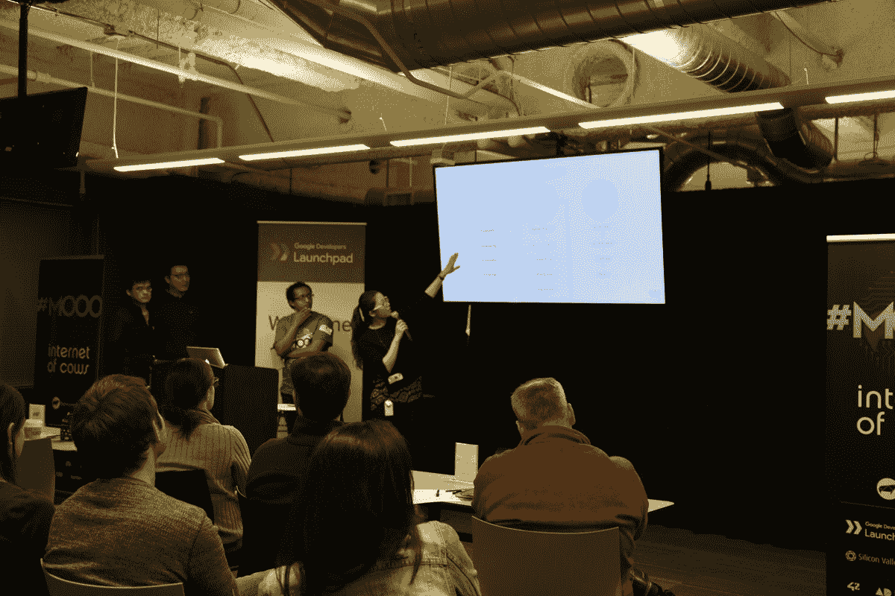

# 互联网牛群黑客支持全球养牛业 

> 原文：<https://web.archive.org/web/https://techcrunch.com/2017/04/25/the-internet-of-cows-herds-hackers-to-support-the-global-cattle-industry/>

# 牛群黑客网络支持全球养牛业

在那些把旧金山市场南部的动物圈当成家的人心中，奶牛通常不是第一个想到的。但是巴西初创公司 BovControl 正在努力缩小技术人员和牧场主之间的差距，该公司正在开发数据分析工具来支持畜牧业运营。主办了[奶牛互联网](https://web.archive.org/web/20221206095731/https://internetofcows.org/)黑客马拉松，与[谷歌 Launchpad](https://web.archive.org/web/20221206095731/https://developers.google.com/startups/) 和[硅谷论坛](https://web.archive.org/web/20221206095731/http://siliconvalleyforum.com/about/our-story)合作，这家初创公司让团队为监控畜群、出口商品和获得贷款集思广益。

这是 17 人的 BovControl 团队第四次举办这个黑客马拉松。该公司的使命是提高粮食产量。它的核心产品是一个移动和网络应用程序，它聚集了来自牛耳环、芯片和智能秤的数据，并给出可消化的可视化结果，有助于实现更广阔的愿景。但社区活动使 BovControl 能够解决其他生产效率低下的问题，而无需全新的产品。

在两天的时间里，四个小组准备了演示文稿，强调了牧场主面临的已知问题的解决方案。一个被幽默地命名为 Cowculator 的团队花时间设计了一个解决方案来帮助小规模牧场主获得库存融资。通过强调牧场主已经拥有的资产，考虑到销售和库存等指标，该团队希望使贷款申请过程民主化。

团队合作者在评委面前做最后的陈述

另一个团队 GlobalFarmers 设计了一个网络应用程序，帮助饲养有机和可持续牛肉的牧场主找到对他们的特色产品感兴趣的出口商。该集团假设，它可以向出口商收取交易服务费，并提供一个付费的溢价层。

最后两个团队，HerdWatch 和处于危险中的奶牛，帮助牧场主照看他们珍贵的牛。前者名为 HerdWatch，是针对丢失奶牛的跟踪和通知解决方案。处于危险中的奶牛是一个健康监测应用程序，提供对温度、心率和位置的见解。

就其本身而言,“奶牛网络”并不能解决世界饥饿问题，但黑客马拉松让人们开始交流，并把志同道合的群体聚集在一起。在一个人们有意将发刷连接到互联网的山谷，看到一家初创公司使用物联网以有趣的方式解决实际问题，令人耳目一新。