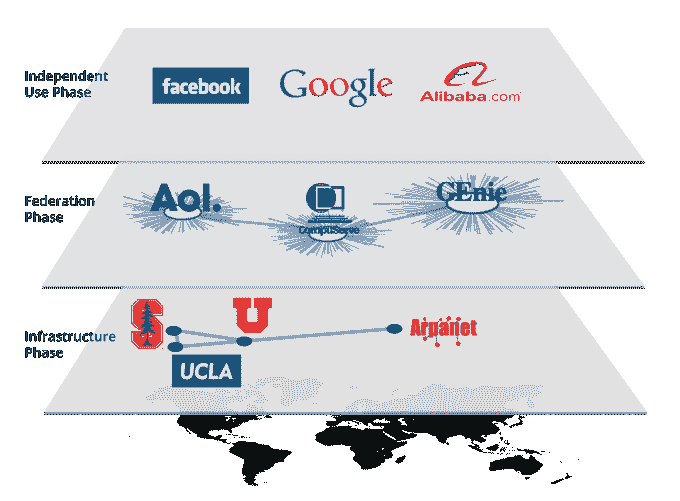

# 互联网缺失的一环 

> 原文：<https://web.archive.org/web/https://techcrunch.com/2014/09/27/the-internets-missing-link/>

斯蒂芬·托马斯撰稿人

**编者按:** *斯蒂芬·托马斯(Stefan Thomas)是 [Ripple Labs](https://web.archive.org/web/20221206050719/https://www.ripplelabs.com/) 的首席技术官，他的首要目标是通过让开发者——从个体企业家到金融机构——更容易地基于 Ripple 协议构建一个全球价值网。*

当网络最初被设计的时候，它的创造者渴望包括一种转移价值的方法。根据 [HTTP 标准](https://web.archive.org/web/20221206050719/https://tools.ietf.org/html/rfc2616#section-10.4.3)，错误代码 402“保留供将来使用”，并被标记为“需要付款”

正如我们需要一种自由分享信息的方式一样，我们也需要一种自由交换价值的方式。实施标准化的支付协议是一个自然的选择。但是，虽然数据可以存在于一个容易复制的世界，但价值是作为稀缺性的结果而固有地存在的——换句话说，与信息网络的复制和粘贴性质相反。

很快就发现克服这一挑战绝非易事，于是这个想法被无限期搁置。虽然信息可以以分散的方式交换，但如果没有中央运营商，就没有办法在线转移价值。

2009 年，随着比特币的出现，这一切都改变了。比特币是一种密码学和点对点技术的混合体，优雅地解决了这个问题。从这个角度来看，像比特币和 Ripple 这样的支付协议——允许我们直接在网上相互转移价值——代表着网络最初创始人未竟事业的延续。

因此，在信息网络的诞生和我们现在看到的发展之间有许多相似之处。

人们很容易认为互联网目前的存在是理所当然的。它从研究人员和爱好者的一个深奥的网络发展到今天包罗万象的主流现象是一个漫长而艰难的旅程。它始于一个经典的先有鸡还是先有蛋的问题:互联网需要开发者在其上构建实用程序来吸引用户，但开发者首先需要用户为谁构建。

早期的互联网是由学术界和军方发展起来的。尽管这个网络已经是开放的，全球范围的，并且相当强大，但是消费者的效用却很小。相反，主流消费者使用当时流行的专有网络解决方案。像美国在线(AOL)和 T2(CompuServe)这样的公司提供增值服务，从新闻到信息再到游戏。

唯一的问题是这些互联网出现之前的网络不能互操作。如果你在使用[精灵](https://web.archive.org/web/20221206050719/http://en.wikipedia.org/wiki/GEnie)，在 80 年代，没有一种直接的方式可以在 AOL 上与你的朋友互动。这与我们的支付网络目前的运作方式没有太大不同，像 PayPal、支付宝和 M-PESA 这样的系统还没有联合起来。

1989 年出现了两个重要的发展:蒂姆·伯纳斯·李构思了万维网的概念，CompuServe 成为首批提供电子邮件网关的主要在线服务公司之一，允许其用户通过因特网进行交流。这些事件标志着互联网发展联盟阶段的开始。在这两种情况下，标准化协议允许用户直接共享信息或相互通信，无论他们使用什么服务、软件或硬件。

网络的发展和演变——无论是信息还是价值——绝非巧合。随着我们的技术、联系和需求的成熟，每个新阶段都建立在最后一个阶段的基础上。

但即使全球互联的梦想在技术上变得可行，我们也需要一个社会激励。随着人们在自己的专属圈子里闲逛，需要的是一个杀手级的应用程序，将所有人团结在同一个派对上。事实证明，答案是[新闻组](https://web.archive.org/web/20221206050719/http://en.wikipedia.org/wiki/Usenet)，这是一个在线公告板系统，是今天互联网论坛或网站的前身，如 [4chan](https://web.archive.org/web/20221206050719/http://www.4chan.org/) 和 [reddit](https://web.archive.org/web/20221206050719/http://www.reddit.com/) 。

大约在那个时候，新闻组已经越来越受欢迎，但主要是在大学校园里。每年 9 月，这项服务都会迎来最新一批学生，这是一个新用户的年度来源，将把新闻组变成互联网的典型目的地，一个对话和文化的数字堡垒——也许不仅是互联网“巨魔”的发源地，也是互联网迷因的发源地(例如，T2·戈德温定律)。

没过多久，这个知识和愚蠢行为的数字仓库就吸引了急于满足日益增长的用户需求的在线服务提供商的注意。AOL 于 1993 年 9 月加入，为新闻组提供了源源不断的新用户——这一时刻在互联网历史上被新闻组资深人士称为“[永恒的九月](https://web.archive.org/web/20221206050719/http://en.wikipedia.org/wiki/Eternal_September)”

这个转折点解决了先有鸡还是先有蛋的问题。在 90 年代早期，先锋开发者的努力失败了，没有市场接受他们的创造。现在，数以百万计的用户都连接在同一个网络上，开发者突然拥有了大量的内置受众，允许他们建立可行的公司，重新想象实体企业，并打造全新的行业。

最令人兴奋的是，这个过程即将重新开花。

正如信息互联网需要打好基础，彼得·泰尔和马克扎克伯格才能通过贝宝和脸书改变世界一样，价值互联网也需要一个初步的框架。

一方面，我们需要网络浏览器、智能手机和无处不在的互联网接入。另一方面，在转移资金的情况下，我们需要流动性、合规性和可扩展性。取代大学和政府机构的是金融机构，它们拥有托管资产，每天已经转移数万亿美元，以巩固价值网的基础。

类似于信息网络的联合和兴起，技术已经存在。我们只需要给人们一个走到一起的理由。如果历史有所启示的话，结果甚至会超出我们最疯狂的预期。