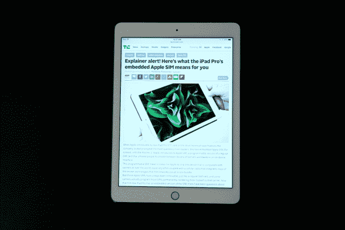
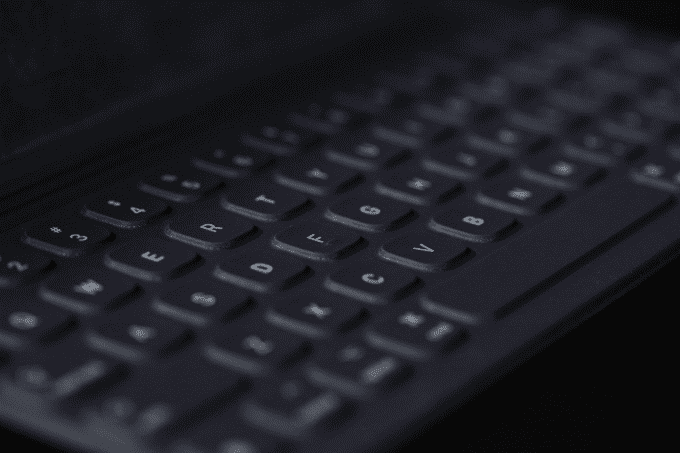
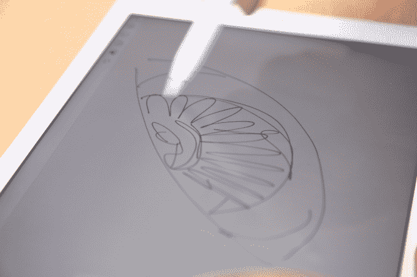
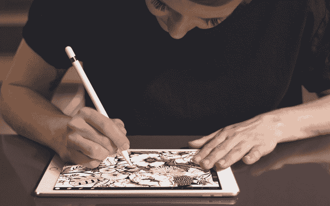

# iPad Pro 是苹果有史以来最容易上手的电脑 

> 原文：<https://web.archive.org/web/https://techcrunch.com/2016/04/10/the-ipad-pro-is-the-most-accessible-computer-apple-has-ever-built/>

史蒂文·阿基诺撰稿人

史蒂文·阿基诺是一名自由科技作家和 iOS 无障碍专家。

More posts by this contributor

我对传统笔记本电脑一直是又爱又恨，比如 MacBook。我拥有一辆[首款铝制一体式汽车](https://web.archive.org/web/20230212220515/https://support.apple.com/kb/SP500?locale=en_US)。

这是我的第一台 Mac 电脑，尽管在计算机时代已经过时，但它仍然可以使用。我现在已经不怎么用了，但是想到我在 2008 年买的一台机器能够在 2016 年运行 OS X El Capitan(虽然不是很好)，还是很有趣的。

我的 MacBook 可能很慢，技术上也过时了，但它仍然*好用*。它的长寿证明了苹果的硬件实力——从设计角度来说，今天的 MacBook Pros 是它的直系后代——以及 Mac 的价值主张。

尽管 MacBook 进展顺利，但也并非一帆风顺。根据我的经验，我发现笔记本电脑的外形在可访问性方面对我不利。

正如我去年写的那样，问题是笔记本电脑的屏幕总是让人感觉“遥远”由于视力受损，我需要尽可能靠近才能看得舒服，而笔记本电脑的屏幕让这变得很困难。我不得不探身去看，几乎是我的鼻子碰到显示器的那一点。这不仅在人体工程学上很糟糕，而且我这样做看起来很傻。我试图通过调整屏幕的位置和增加鼠标指针的大小等软件技巧来弥补这一点，但它的好处是名义上的。

事实是，笔记本电脑对我来说更难使用，因为我不能靠近屏幕，因为我需要有效地工作。并不是说我* **不会** *用笔记本电脑；那就是使用它们总是让我感觉像是一场我赢不了的硬仗。

iPad，尤其是 12.9 英寸的 Pro，提供了完全不同的体验。它的大小与 [12 英寸 Retina MacBook](https://web.archive.org/web/20230212220515/http://www.apple.com/macbook/) 差不多，但平板电脑的外形和交互模式让它的可访问性更好。

正是这些原因(以及我对 iOS 的熟悉程度)让我相信把 iPad 作为我的主要电脑。与我的旧 MacBook 不同，我可以根据需要将 iPad Pro 贴近我的脸，我可以简单地通过触摸屏幕来做事情。

我对 iPad 的热情是我强烈反对 Tech Insider 的 Tim Stenovec 的原因，当[他最近写道](https://web.archive.org/web/20230212220515/http://www.techinsider.io/the-new-ipad-pro-wont-save-the-ipad-2016-3)iPad Pro“不像电脑一样多功能”时，我觉得他离题了，因为他的评论似乎忽略了一个小众但并非无关紧要的人群:无障碍社区。

我认为，对于残疾人来说，iPad 在很多方面比笔记本电脑更加多功能。计算和生产力并不总是与规格表或原始功能或 Photoshop 有关。毫无疑问，iPad *是一台成熟的电脑。在使用了一段时间的评测单元后，我相信 12.9 英寸的 iPad Pro 是苹果有史以来最容易上手的电脑。

## 

## iPad Pro 的黑仔功能:越大越好

从可访问性的角度来看，iPad Pro 的杀手锏是它的屏幕。

在[写我为什么换了一部 [iPhone 6s Plus](https://web.archive.org/web/20230212220515/https://www.macstories.net/stories/how-the-ipad-pro-made-me-love-the-iphone-6s-plus/) 的文章中，我是这样评价 iPad Pro 的:

> 12.9 英寸的 iPad Pro 显示屏是我长期以来看到的最好的东西。它的效果不仅仅是像素密度或颜色精度；这是纯粹的大小。iPad Pro 的屏幕很大，彻底改变了我的工作方式。凭借大屏幕，我在 iPad 上看到的一切都变得更好，从管理电子邮件到浏览网页，再到在虚拟键盘上打字。

我从使用 iPad Pro 中学到的关键是，更大的屏幕对我的视力更好。Pro 的大屏幕是一种荣耀，因为我的眼睛不必努力阅读文本或寻找按钮；我看到的一切都更直观。最棒的是，这和我在 9.7 英寸的[型号](https://web.archive.org/web/20230212220515/http://www.apple.com/ipad-pro/)上使用 iPad 的体验是一样的，只是现在它的尺寸变大了。转到职业队没有学习曲线或调整期。可以说，从我的 iPad Air 1 转移到 iPad Pro 是一个相当大的升级。

虽然断言 iPad Pro 主要是因为它的屏幕而变得伟大可能看起来陈腐或过于简单，但在可访问性的背景下这是有意义的。使用 iPad Pro 简直是一种启示。它教会了我拥抱巨大的 iOS 设备，因为它们巨大的屏幕，它们的整体笨拙是该死的。

同样值得注意的是，iPad Pro 的屏幕对一个人对其他设备的看法有多大影响。在使用我的审查单元仅仅几个小时后，我的旧 iPad Air 感觉小得可笑。与 Pro 相比，使用 Air 让我感觉好像拿着一台 iPad Mini。可以肯定的是，这是一个鲜明的对比，但我无法看到自己在使用 12.9 英寸的 iPad Pro 后回到“小”的 9.7 英寸尺寸。

## 拿着和使用 iPad Pro

当它首次发布时，我担心 iPad Pro 坐在沙发上阅读或观看视频时会不舒服，因为这款设备太大了。事实证明，手持平板电脑并不是问题。它比我的 iPad Air 1 重，但重量与体积相称。整体不重，但和 iPhone 6s Plus 一样，双手握持时更好。尽管如此，与 6s Plus 一样，Pro 的出色屏幕超越了对其物理尺寸的任何担忧。

如果我没有拿着电脑，我会把它放在膝盖上打字。虽然我确实喜欢智能键盘(稍后会有更多介绍)，但我的大部分“工作时间”(即写作)都是用虚拟键盘度过的。我非常喜欢它，尽管[打字对我来说不是最容易的事情](https://web.archive.org/web/20230212220515/http://www.macworld.com/article/2044544/pecking-order-typing-with-cerebral-palsy.html)。更大的屏幕自然允许更大的键盘，我感觉我的手有更多的活动空间。我觉得更大的空间对我的双指打字风格更宽容。

## 

## 大屏幕上的 iOS 9

正如我之前所写的，我对 iPad Pro 上的 iOS 非常熟悉。不同的是，iOS 以前从未被推到像 iPad Pro 那样大、像素那么多的显示器上。我能一目了然无疑是一件好事，但这并不意味着一切都是完美的。

让我们首先强调积极的一面。使用 iOS 作为主要平台的优势之一是操作系统没有 cruft。从概念上讲，OS X 是围绕键盘鼠标输入和多窗口设计的，而 iOS 是完全不同的。它专为触摸和各种手势设计，直到最近，一次只显示一个应用程序。这种复杂性的缺乏是 iOS 设备受到所有年龄和能力的人喜爱的部分原因，也是 iOS 在可访问性方面如此伟大的原因。正如我在开头所写的，这种简单性是我选择用 iPad 而不是 MacBook 工作的一个关键原因。

当然，自 2007 年“iPhone OS 1.0”以来，iOS 已经变得更加成熟和复杂。iOS 9(http://www . apple . com/iOS/)的[marquee 特性]之一就是支持 iPad 的多任务处理。能够同时查看两个应用程序极大地提高了我的工作效率，因为我现在可以在我的文本编辑器旁边打开 Safari，这使我不必经常来回切换来搜索信息和获取链接。太好了。

随着我熟悉 iOS 9 的多任务功能，我脑海中一直萦绕着一个想法，即分割视图模式有多容易使用。对于桌面操作系统，我在试图管理屏幕上的窗口时遇到了很多麻烦——调整窗口大小尤其麻烦，因为很难找到窗口的边缘并判断合适的大小。

相比之下，苹果在一个应用程序能占据多少屏幕上有限制。这减轻了我的认知负荷，因为我不再需要挣扎着决定我想把东西放在哪里；我只需要决定我希望一个应用程序占据四分之一还是一半的屏幕。

对于可访问性来说，更重要的是，调用拆分视图或滑动的机制比摆弄鼠标指针要容易得多。我所做的就是移动我的手指来拖动分隔线到我想要的地方；这也有助于分割线足够暗，我可以很容易地在屏幕上看到它。

我对 iPad Pro 上的 iOS 只有一个抱怨。苹果很可能会在未来几个月内预览 iOS 10，我希望看到该公司在增强 iPad 体验方面更进一步。尽管在多任务处理方面有所改进，但 iOS 实际上是一个为智能手机设计的操作系统，它确实在 iPad Pro 上得到了体现。如果能看到苹果在 12.9 英寸机型上改造 iOS，以更好地利用屏幕空间，那将是一件非常棒的事情。例如，按钮和其他用户界面元素可以变得更加明显，而不需要显示缩放。同样，插入点、放大镜和剪切/复制/粘贴菜单都非常需要视觉上的升级。

在像 iPad Pro 这么大的显示器上，这些元素的小尺寸对于视觉障碍者来说是站不住脚的。至少，iOS 10 应该在 Accessibility 下包含一个设置，用户可以调整插入点的大小，类似于 Mac 上的鼠标指针选项。

除了抱怨，我对 iPad Pro 上 iOS 的整体体验感到满意。我认为有必要澄清一下，尽管我对 iOS 赞不绝口，但我并不意味着 OS X 是不可访问的或者是一个更糟糕的系统。我非常喜欢 Mac，但使用触摸驱动的操作系统的可访问性优势是如此明显，以至于我觉得把大部分时间花在 iOS 上是正确的。

## 

## 配件:智能键盘和苹果铅笔

首先，智能键盘。我几乎写了整篇关于它的文章，它很棒。虽然一开始我讨厌它，但我已经渐渐喜欢上了智能键盘。它看起来很好，打字感觉很好，而且不太笨重。我过去试过几个第三方的 iPad 键盘，但是没有一个比得上它的美观和功能([固件更新！](https://web.archive.org/web/20230212220515/http://appleinsider.com/articles/16/02/24/apple-issues-firmware-update-for-ipad-pro-smart-keyboard))苹果公司的解决方案。

我最喜欢的是什么？点击 Command-Tab 快速切换应用程序。

也就是说，智能键盘如果有两样东西就更好了。首先，我喜欢背光按键。我不知道这在工程上有多实际，但是在昏暗的光线下很难看到按键。我花了几秒钟寻找该按的键，因为很难判断我在看什么，而且通常情况下，我会按错键。额外的光线将大大有助于我更容易找到钥匙。其次，Caps Lock 键需要一个指示灯。我的旧苹果无线键盘的一个很棒的方面是它有一个小绿灯，告诉你大写锁定是否打开。这种视觉提示是一种有价值的辅助工具，不管它多么微妙。即使在写这篇文章的时候，我也数不清我按了多少次 Caps Lock 来查看它是开还是关，因为我不知道它处于哪个状态，而且我一直在打错字。令人沮丧。

最后，关于连接键盘的注意事项。我从苹果公司获得的评测套件包括了这两种配件，我在一开始试图将智能键盘和 iPad 结合在一起时经历了最艰难的时刻。这是由于我的大脑麻痹引起的灵活性问题，以及我的低视力。(换句话说，折叠键盘并查看智能连接器应该停靠的位置。)在几次充满咒骂的尝试之后，一个朋友通过 iMessage 发来了一段操作视频，让我终于掌握了正确的技巧。

关于 Apple Pencil，字典中没有足够的最高级来描述它有多棒。事实上，我可以说，这支铅笔本身就是库比蒂诺去年推出的最令人印象深刻的产品。这是典型的苹果产品:其硬件和软件集成的经典组合运行得如此之好，你会发誓这是魔术。有那么好。

在 iPad Pro 上使用 Apple Pencil 对我来说就像是模拟笔(或铅笔)和纸的数字等价物。这支铅笔握起来和写起来感觉都很好。就像智能键盘一样，我过去也在 iPads 上使用过[其他类似手写笔的设备](https://web.archive.org/web/20230212220515/http://www.fiftythree.com/pencil)，但没有一个能提供铅笔所能提供的功能。这是蒂姆·库克经常吹嘘的“只有苹果”的东西之一，因为苹果通过协同设计他们的产品来控制整个堆栈。

使用 Apple Pencil 最棒的一点是，它让我探索了自己创造性的一面。我羡慕(也钦佩)那些比我更有艺术才能的人，但是我确实喜欢涂鸦和涂色。我为 iPad Pro 下载的第一批应用程序商店应用程序之一是 Pixite 的[颜料](https://web.archive.org/web/20230212220515/https://itunes.apple.com/us/app/pigment-only-true-coloring/id1062006344?mt=8)，这是一本“[成人涂色书”](https://web.archive.org/web/20230212220515/https://www.macstories.net/reviews/pigment-brings-adult-coloring-books-to-ipad-pro-with-apple-pencil-support/)，它已经成为我最喜欢的应用程序之一。

就像印刷的涂色书一样，你会看到跨越不同类别的黑白“页面”图片。这是一个做得很好的应用程序；我特别喜欢的是，你可以捏到变焦，以更好地看到线。这对我看到更多的细节和确保我的工作整洁是一个很大的帮助。最重要的是，我喜欢颜料，因为着色有治疗作用。

当我有压力或文思枯竭时，我发现抓起铅笔，打开颜料，涂上几分钟是一种放松。很有趣，虽然我还没看完一页。与其说是产品，不如说是过程。

我对 Apple Pencil 本身没有任何疑虑。我唯一的问题是我害怕失去帽子。它很小，我担心它会掉到地板上，滚进深渊，因为以我的视力，我可能再也看不到它了。我曾开玩笑地在推特上发过几次，苹果应该为 iPhone 开发一个 Find My Apple Pencil Cap 应用程序，以便帮助人们在不可避免地将笔帽放错地方时找到它。

## 

## 最后的想法

每当我在科技媒体上看到像蒂姆·斯蒂诺维奇这样的人说 iPad 不是一台真正的电脑时，我都会退缩。我认为这种想法是短视的，对 iPad 不利。我承认，在执行某些任务时，MacBook 仍然比 iPad Pro 好——播客是一个例子——但 iPad 现在变得如此强大，它不能做的事情越来越难以理解。

在这一点上，我认为延续“笔记本电脑是用来创作的，平板电脑是用来消费的”的陈词滥调是不真诚的。

然而，就可访问性和易用性而言，iPad Pro 明显胜过笔记本电脑。作为一个在以可访问性为中心的环境中使用 iPads 有[年经验的人](https://web.archive.org/web/20230212220515/https://the-magazine.org/9/re-enabled)，我非常清楚平板电脑的优势和劣势。是的，在 iPad 上使用 iOS 的体验可以而且应该得到改善，但无论目前存在什么样的缺点，都不能完全阻止它明显而深远的好处。这同样适用于残疾人和非残疾人。今天的 iPad Pro 是一个发电站，它未来的潜力感觉是无限的。

约翰·格鲁伯在总结[他的 iPad Pro 评论](https://web.archive.org/web/20230212220515/http://daringfireball.net/2015/11/the_ipad_pro))时敏锐地指出，“大众市场便携式计算的未来既不涉及鼠标指针，也不涉及 x86 处理器。”

我真诚地相信。iPad Pro 可能不是每个人的笔记本电脑替代品，这没关系，但对我来说肯定是。iOS 和平板电脑的魅力是不可抗拒的，它们的结合让计算变得更加容易。虽然我会永远迷恋 12 英寸 MacBook 的纤薄设计，但 12.9 英寸的 iPad Pro 绝对是满足我需求的更好的“笔记本电脑”。