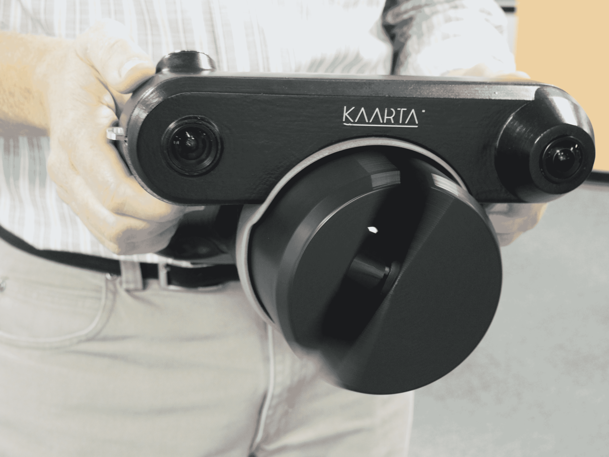

# Kaarta Contour 手持式扫描仪使用激光雷达实时绘制空间图 

> 原文：<https://web.archive.org/web/https://techcrunch.com/2017/07/03/the-kaarta-contour-handheld-scanner-uses-lidar-to-map-spaces-in-real-time/>

[轮廓](https://web.archive.org/web/20221207073700/http://www.kaarta.com/contour/)看起来有点像一个超大的便携式游戏机。中间有一个 7 英寸的触摸屏，两侧有两个大手柄。一个圆形激光雷达扫描仪在前方伸出，当你走的时候扫描空间。当它读取房间时，一个 3D 映射图像出现在屏幕上，显示空间和所有物体的鸟瞰红外地图。

Contour 是总部位于匹兹堡的初创公司 [Kaarta](https://web.archive.org/web/20221207073700/http://www.kaarta.com/) (也有更小的模板)的两款新产品之一，旨在供建筑师、工程师和建筑工人手持绘制空间地图。Kaarta(以前的真实地球)肯定不是镇上唯一的竞争者——毫不夸张地说。附近的卡耐基梅隆大学已经使这座城市成为 3D 地图技术的温床，因为优步和福特等公司已经进驻，以利用大量世界级计算机科学家和一个特别积极地向科技公司示好的当地政府。

但是 Kaarta 的突出之处在于它能够实时绘制地图，不需要后期处理。在轮廓的情况下，这意味着在你面前的触摸屏上产生该信息的视觉。

首席执行官凯文·道林(Kevin Dowling)解释说:“我们有能力在你走路的时候看到地图。“您可以查看是否遗漏了某些区域。对测量员和测绘员来说，最糟糕的事情之一就是有回调，因为你错过了一个地方或犯了一个错误而不得不返回。有了这个系统，你可以随身携带所有的信息。”

像匹兹堡的许多创业公司一样，Kaarta 的起源可以追溯到 CMU 的机器人学校，道林在那里完成了他的博士研究。这家初创公司开发的地图技术试图解决 [SLAM(同步定位和地图](https://web.archive.org/web/20221207073700/https://en.wikipedia.org/wiki/Simultaneous_localization_and_mapping))问题，这是该领域的一个常见问题，围绕着缺乏自我意识。

道林解释道:“这是两个基本问题的答案:我在哪里，我周围有什么。”。“这对于移动机器人来说非常重要。我们的业务所围绕的技术解决方案解决了这个问题。我认为这指出了在我们对机器人的传统看法之外，还有许多应用是在创造我们每天都会使用的新技术的新形式。”

Kaarta 底层技术的准确性已经帮助它登上了地图。这家年轻的初创公司连续两年赢得了微软的室内测绘比赛，最近被匹兹堡选中测试其技术，以帮助绘制城市的管道和基础设施。

鉴于当前围绕匹兹堡自动驾驶汽车行业发生的土地争夺战，很容易想象随着一些科技巨头搬到镇上，卡尔塔被抢购一空。然而，与此同时，该公司的投资组合相当有限，主要针对勘测和建筑等基础设施工作。这个轮廓在 4 月份才公布——道林说话时用来绘制房间的大块轮廓看起来像是用 3D 打印机制作的。

但是这位创业高管对未来有着宏伟的计划。“随着价格开始下降，你会看到越来越多的急救人员、危险品处理人员、执法人员等采用这种技术，”他解释道。该技术还可以确定传感器在环境中的位置。我们的技术还可以用于自动驾驶汽车和车辆，以确定机器人的位置。”