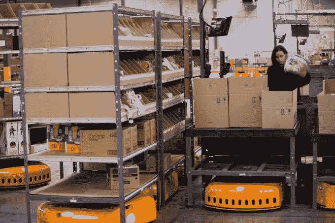
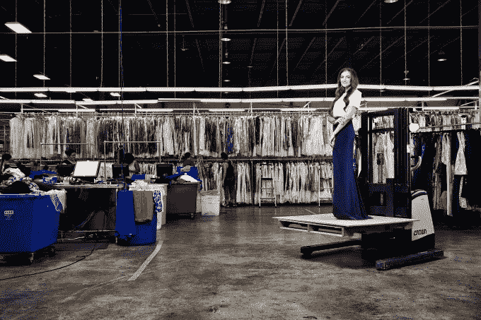

# 商业成功的关键是供应链 

> 原文：<https://web.archive.org/web/https://techcrunch.com/2014/12/24/the-key-to-successful-commerce-businesses-is-supply-chain/>

Ajay Agarwal 是

[Bain Capital Ventures](https://web.archive.org/web/20221206221131/http://www.baincapitalventures.com/)

在那里，他专注于早期 SaaS 投资。

More posts by this contributor

**编者按:** *Ajay Agarwal 是[贝恩资本风险投资](https://web.archive.org/web/20221206221131/http://www.baincapitalventures.com/)在帕洛阿尔托办公室的董事总经理，也是早期商业技术公司的积极投资者。*

你们中的许多人可能会惊讶地发现，戴尔电脑是 90 年代升值最高的科技股。这种成功不是基于营销或产品，而是主要基于供应链的革命性方法。

戴尔的成功得益于“按订单生产”的方法，这种方法使其能够为客户提供个性化的解决方案，同时避免在收到订单之前的库存积压。戴尔在供应链管理方面的创新推动了其迅猛的股市表现——91，863%(戴尔股价在 20 世纪 90 年代的累计涨幅)。

快进到 2014 年和最近的网络星期一。目前电子商务领域的重量级巨头亚马逊在今年的网络星期一媒体闪电战中展示了由 Kiva Systems 支持的[配送中心技术(披露:贝恩资本是 Kiva Systems 的投资者)。](https://web.archive.org/web/20221206221131/https://beta.techcrunch.com/2014/12/01/these-cool-robots-are-processing-your-amazon-orders/)

亚马逊通过供应链创新重塑了客户体验和期望，使其能够在收到订单的几分钟内将包裹运送到客户手中，同时实现了比传统的劳动密集型配送中心更大的节约。通过战略性地部署配送中心和利用 Kiva Systems 等革命性技术，亚马逊可以在 48 小时内以很低甚至零运输成本将商品经济高效地送达绝大多数美国家庭。亚马逊的创新使其能够大幅提高市场份额，同时给竞争对手带来巨大压力。

戴尔和亚马逊的例子提醒我们，商业成功的关键是供应链和物流的不性感、粗糙、复杂的世界。萨姆·沃尔顿在 20 世纪 60 年代发现了这一点，50 多年后仍然如此。

客户体验的其他关键组成部分仍然很重要，如品牌、个性化和销售，但今天一个伟大的电子商务公司的基础始于供应链。因为物流领域处理的是原子而不仅仅是比特，所以单靠软件解决方案无法解决问题，必须与 Kiva 机器人等硬件以及快递员和 Ubers 等人工相结合，才能将物理物品移动到位。

订单履行现在是消费者在线购物时评估的关键标准。

贝恩公司(Bain & Company)最近的一份报告强调了这一点，报告称“美国近 60%的网上购物者表示，运费是决定是否在零售商处网上购物的主要因素。”

因此，许多电子商务网站被迫提供免费送货服务。根据贝恩公司(Bain & Company)的数据，第三季度 68%的在线交易使用免费送货，高于 2013 年的 44%，这一数字将继续上升。

尽管消费者预期有所改变，但很少有电子商务公司能够盈利地吸收免费运输成本，这就是为什么“灵活履行”是当今美国电子商务首席执行官的首要战略举措。

## 新的电子商务玩家引领潮流

其他创新者已经从亚马逊的例子中吸取了教训，并利用物流和供应链的力量作为竞争优势的来源。Rent the Runway 等较新的创新者已经认识到，成功的关键在于供应链管理和库存软件之间的成功结合。 Rent the Runway today 在 160，000 平方英尺的设施中经营着美国最大的干洗店，并开发了管理其数百万会员的 65，000 件服装和数万件配饰的库存、交付和履行的软件。(披露:贝恩资本目前是《出租跑道》的投资者。)

同样，最近上市的 Wayfair 现在拥有近 20 亿美元的市值，它建立了一个强大的业务，依赖于其准确有效地从数千家全球供应商处直运数百万件商品的能力。Wayfair 的创始人认识到销售“长尾”商品的巨大机会，这是普通零售商(甚至是亚马逊)无法库存的，因为对任何给定 SKU 的需求都很小，而保持库存的成本很高。例如，目前在 Wayfair 网站上列出的这个邮箱有多少需求？

Wayfair 与数千家供应商的深度技术集成使其能够以与亚马逊相同的交付速度和准确性提供该邮箱和数千种其他商品。因此，该公司在亚马逊无法竞争的庞大电子商务类别中建立了市场领先地位。

## 防御性=进入壁垒=利润=获胜

这些供应链创新的强大之处在于，它们代表了巨大的防御能力和巨大的进入壁垒。这反过来又会阻止其他公司进入同一领域，降低利润率。

创新供应链是戴尔如何在 90 年代占据主导地位的剧本，亚马逊今天占据主导地位，而像 Wayfair 和 Rent the Runway 这样的新公司将在未来占据主导地位。整合当今的新技术，包括自动驾驶汽车、机器学习和数据科学以及无人机，将允许下一代 B2C 和 B2B 企业家利用这一机会。