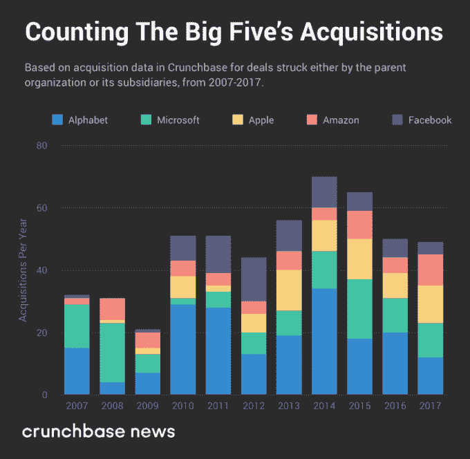
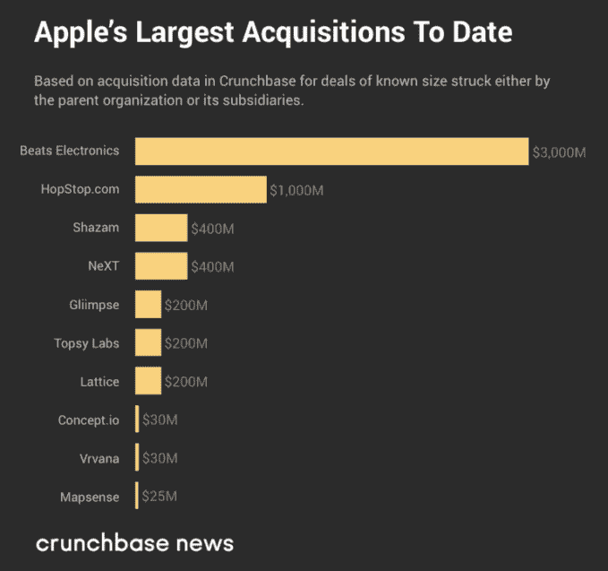
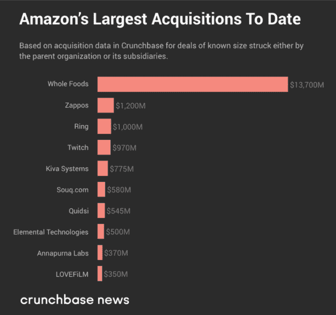
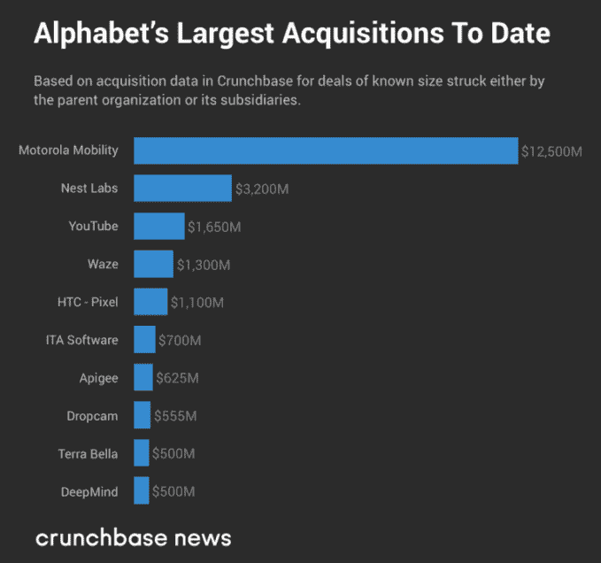
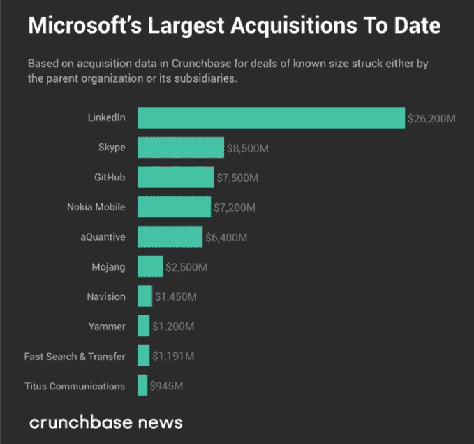
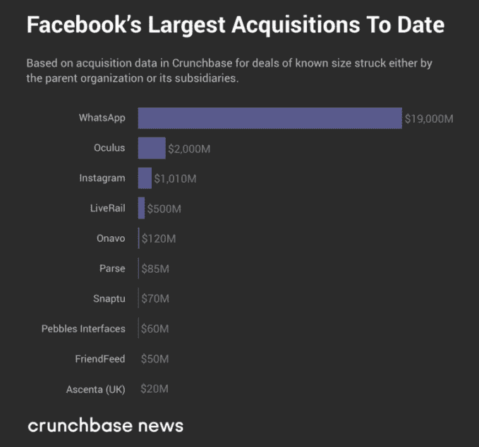

# 科技五大巨头的最大收购:M&A 交易一览

> 原文：<https://web.archive.org/web/https://techcrunch.com/2018/06/10/the-largest-buys-of-techs-big-five-a-look-at-ma-deals/>

在创业领域，任务是被收购、上市或死于尝试。

而且，就被收购而言， [tech 的五大巨头之一](https://web.archive.org/web/20230326125755/https://news.crunchbase.com/tag/a-look-back-in-ipo/)可能是一个理想的收购者。他们有很大的影响力。 [Alphabet](https://web.archive.org/web/20230326125755/https://www.crunchbase.com/organization/alphabet) (谷歌的母公司)[亚马逊](https://web.archive.org/web/20230326125755/https://www.crunchbase.com/organization/amazon)、[苹果](https://web.archive.org/web/20230326125755/https://www.crunchbase.com/organization/apple)、[脸书](https://web.archive.org/web/20230326125755/https://www.crunchbase.com/organization/facebook)和[微软](https://web.archive.org/web/20230326125755/https://www.crunchbase.com/organization/microsoft)占据了巨大的市场价值——在撰写本文时接近 3.9 万亿美元。至少，这是根据 Crunchbase News 的著名科技股仪表板显示的。

当受到彼此的挑战时，这些科技领域的庞然大物更多的是战斗而不是逃跑。当受到斗志昂扬的新贵的挑战时，它们很可能会吞噬任何有抱负的竞争对手的人才、技术和业务。是生命的[圈](https://web.archive.org/web/20230326125755/https://media.giphy.com/media/Lp71UWmAAeJHi/giphy.gif)。

我们在这里要看的就是这些收购。

综合来看，科技五大巨头在整个 M&A 市场中所占份额相对较小。下图显示了从 2007 年到 2017 年，科技五巨头成员进行的收购数量。(作为参考，Crunchbase 记录了每年数以千计的收购。)

但五大在数量上的不足在规模上得到了弥补。如果你能原谅大游戏的双关语，以美元计算，五大收购占了大宗交易的很大一部分。

因此，对于五大巨头中的每一家，让我们看看其中一些交易的规模有多大。我们的分析基于 Crunchbase 数据，这些数据已经尽可能地与公共新闻来源和监管文件进行了交叉核对。我们将从最有价值的(按市值计算)到最没有价值的进行讨论。

## 苹果

尽管是五大巨头中最有价值的，苹果的收购不仅仅是其中最小的，也是披露最少的。换句话说，在 Crunchbase 和其他地方列出的交易中，大部分都不附带美元价值。这可能说明了苹果的隐秘性，以及它倾向于在内部开发大部分产品和服务。

苹果迄今为止在 M&A 最大的一笔交易是以 30 亿美元收购 Beats Electronics ，这可能是其最著名的无线耳机。但吸引苹果眼球的并不是耳机。更确切地说，是它的流媒体服务，苹果首席执行官蒂姆·库克告诉 ReCode 的彼得·卡夫卡这是“第一个真正做对的订阅服务”

包括 Beats 的交易，这里是我们能找到的最大的 M&A 交易。

## 亚马孙

很难找到亚马逊没有涉足的垂直行业。虚拟主机？检查。像电池和纸巾这样贴有白色标签的订书钉？检查。门铃？[检查](https://web.archive.org/web/20230326125755/https://news.crunchbase.com/news/heres-made-money-rings-1b-purchase/)。他们显然也在网上卖书。

现在，非常严肃地说，亚马逊在 2017 年 6 月以 137 亿美元收购了全食超市，将这家在线购物巨头直接带入了实体零售业。尽管全食超市交易是亚马逊迄今为止最大的一次挥霍，但它肯定不是该公司收购的唯一一家商业公司。其中包括亚马逊收购了[Quidsi](https://web.archive.org/web/20230326125755/https://www.crunchbase.com/organization/quidsi)(Diapers.com 和 Soap.com 的母公司，它是第一家提供免费两天送货服务的公司，亚马逊 Prime 因此而闻名)，鞋类和服装零售商 [Zappos](https://web.archive.org/web/20230326125755/https://www.crunchbase.com/organization/zappos) ，以及中东电子商务网站[Souq.com](https://web.archive.org/web/20230326125755/https://www.crunchbase.com/organization/souq-com)。

## 字母表

在科技五巨头中，Alphabet 是最有收购欲的，它进行了最多的企业风险投资。它也是公司结构最复杂的公司。回想一下，Alphabet 是谷歌的母公司，是谷歌收购了 Alphabet 的绝大多数股份。

但是，尽管 Alphabet 向 M&A 投入了大量资源，它的收购行为却带来了好坏参半的结果。最引人注目的败笔是它以 32 亿美元收购了 [Nest Labs](https://web.archive.org/web/20230326125755/https://www.crunchbase.com/organization/nest-labs) ，以及与之相关的在 [Dropcam](https://web.archive.org/web/20230326125755/https://www.crunchbase.com/organization/dropcam) 上花费的 5 . 55 亿美元(该公司后来被更名为 Nest 家庭安全产品的一部分)。

据报道，Nest未能达到收入预期，未能在联网家庭市场占据主导地位，将阵地让给了霍尼韦尔等现有企业。在家庭安全、 [智能门铃和](https://web.archive.org/web/20230326125755/https://news.crunchbase.com/news/front-door-tech-hot-not-just-amazon-wants/) 智能锁等市场，有许多斗志昂扬的新贵紧追 Nest 不放。

话虽如此，但从投资回报率的角度来看，谷歌与 YouTube 的交易可能是 Alphabet 的最佳收购。虽然 Alphabet 没有公布 YouTube 的收入，但一些良好的估计和公开市场数据表明，视频流媒体部门的价值可能达到 1000 亿美元。

## 微软

本周，微软宣布以 75 亿美元收购 T2 软件版本控制和代码托管平台 T4 GitHub。而且，在这一点上，似乎微软正在选择宣布其最大交易的时机，只是为了灌篮苹果。科技播客 Myke Hurley 是 [Relay FM](https://web.archive.org/web/20230326125755/https://www.crunchbase.com/organization/relay-fm) 的创始人，他在 Twitter 上注意到[微软 2016 年收购 LinkedIn 及其 GitHub 交易都是在苹果全球开发者大会开幕当天宣布的。](https://web.archive.org/web/20230326125755/https://twitter.com/imyke/status/1003632846462844928)

除了厚颜无耻的时间选择，你会注意到微软已经完成了科技五巨头中最大的 M&A 交易。

## 脸谱网

在五大科技公司中，脸书的 M&A 模式似乎是最二元的。它的交易要么很小，要么很大。没有太多的中间立场。

脸书一些最大的收购案是一个通过收购获得几乎不可逾越的市场支配地位的案例。虽然它对 Instagram 和 T2 WhatsApp 的收购当时并没有引起太大的轰动，但今天这些交易被视为当前和未来反垄断监管者的警示。

不过，从好的方面来看，脸书的 M&A 记录也是许多公司面临的“购买还是建造”困境中的一个教训。有时候，收购一家公司(尤其是它的工程团队)比从头开始开发新功能更为有利。对于这里列出的许多较小的交易，我们可以看到脸书选择购买。

## 透视五大的收购

在科技食物链的最顶端，五大巨头处于独特的地位，而不仅仅是寻求流动性的风投公司的呼风唤雨者。

Alphabet、亚马逊、苹果、脸书和微软是当今运营的最强大的公司，它们的收购讲述了它们最初如何获得显赫地位的部分故事。

尽管有些收购看起来是突如其来的，但重要的是要记住，一个人不会因为一件事就收购一家公司。这些交易达成时都有战略动机。当这些交易达成后，他们可以透露公司的未来计划。