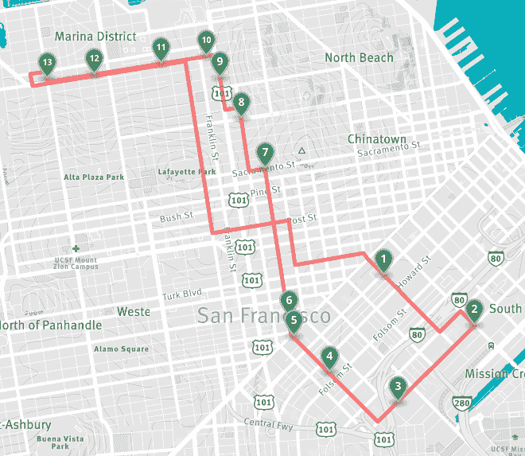
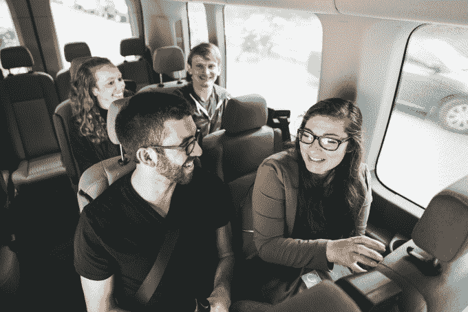

# 末班车创业站:战车 

> 原文：<https://web.archive.org/web/https://techcrunch.com/2015/11/29/the-last-bus-startup-standing-chariot/>

一开始，有三个。

Andreessen Horowitz 支持的公交初创公司 Leap Transit 备有蓝色瓶装咖啡，并为早晚通勤者配备了豪华的凳子。

然后是[夜校的怀旧之举，在该地区的通勤铁路系统 BART 夜间关闭后，下班后的校车在东湾和三藩市之间进行深夜运输](https://web.archive.org/web/20221217202252/http://www.psmag.com/business-economics/night-school-failed-because-it-followed-law)。

然后是[战车，这是创始人阿里·瓦哈布扎德](https://web.archive.org/web/20221217202252/https://techcrunch.com/2014/11/10/chariot/)用通勤车在大约 10 周内组装的一款没有多余装饰的功能性跑车。去年 1 月，在与许多市政和优步用户进行了为期三周的交谈后，Vahabzadeh 决定在那年春天推出一项服务。通勤者告诉他，他们对两个系统在高峰时段面临的容量问题感到沮丧。

所以 Vahabzadeh 租了货车，雇了司机，买了商业货车保险，汽油信用额度，买了停车位，建了一个基本的网站，并开始接受信用卡付款——所有这些都在几个月内完成。

“我们的服务是完全垂直整合的，”他说。“我们采购货车、司机、汽油和保险，我们实际上雇用自己的司机，而不是让他们成为 1099 承包商。”

一年半多后，Chariot 是旧金山仅存的一家巴士初创公司。到目前为止，他们每月至少进行 35，000 次乘坐，40，000 次乘坐，平均价格降至每次 4 美元，许多客户使用通勤福利。

另外两家巴士初创公司卷入了监管问题，最终陷入了困境。 [Leap 在获得官方许可之前就开始运营，并因没有残疾人通道而受到媒体监督，这让它面临加州公共事业委员会的叫停。夜校的模式是租赁巴士，而不是直接拥有和运营巴士，这种模式也让它陷入了法律灰色地带，因为它没有足够的风险资本来维持这一过程。](https://web.archive.org/web/20221217202252/http://www.nytimes.com/2015/10/15/technology/behind-the-failure-of-leap-transits-gentrified-buses-in-san-francisco.html?_r=0)

Vahabzadeh 强调，战车的生存的一个关键点是，该公司从第一天起就一直光明正大地遵守法律。

旧金山主管斯科特·维纳(Scott Wiener)是一名公共交通倡导者，他最近推动了该市的地铁总体规划。“他们善于接受反馈，并确保他们遵守法律。我是一个粉丝，我认为私人交通选择和拼车在使我们成为交通优先的城市方面发挥了重要作用。”

在通过码头和金融区的最初旗舰路线之后，战车增加了通往城市西部和海特-阿什伯里社区的公交线路。

因为 Chariot 是一家消费者网络和移动创业公司，通过一个应用程序与其用户直接相关，该公司可以根据消费者的反馈灵活地增加或减少路线。他们通过另一家 YC 支持的众筹公司 Tilt 从用户那里众包路线创意。

“只有 X 个用户注册并提供了他们的信用卡信息，我们才会推出某些路线。一旦我们达到一定的数字，他们的信用卡将收取第一个月票。如果它不倾斜，什么也不会发生。我们认为这是一种很好的方式，可以降低我们的风险，并让社区参与进来，为他们自己提供更好的通勤选择。”

他们还可以迅速取消表现不佳的公交车站或线路。例如，这家初创公司在推出后大约一个月就拿下了科尔谷的几个站点。

这是一个与城市公共交通系统完全不同的过程，公共交通系统每天处理 70 万乘客，比战车多几个数量级。一方面，交通规划非常缓慢。以为例，在 Geary 和 South Van Ness 讨论和规划快速公交线路花费了超过 15 年的时间。

快速公交系统(BRT)提供了速度更快的路线，因为它们包括特别设计的公交车站和专用车道。旧金山的系统目前以每小时 8.1 英里的速度运行。这是美国最慢的主要城市交通系统，也是每英里运营成本最高的城市交通系统。

像墨西哥城和波哥大这样的拉丁美洲城市，采用 BRT 的速度比旧金山快得多，严重依赖 BRT。但是旧金山进展缓慢，部分原因是商人一直反对失去他们商店前的停车位。几个月前，几十名拟建快速公交线路项目沿线的居民反对[为了给公交线路让路而更换 200 棵树，这是一个 1.588 亿美元的项目](https://web.archive.org/web/20221217202252/http://www.sfgate.com/bayarea/article/Neighbors-speak-up-to-save-Van-Ness-Avenue-trees-6463370.php)。

另一方面，如果需求不足，MTA 和市政不会很快关闭公交车站，这可能会让低收入或更弱势的居民无所适从。与私营公司不同，管理公共系统的交通官员主要关心的是公平和可及性。

这并不是说战车打算排挤牟尼。更确切地说，公共系统和私人公交初创公司有不同的路线规划和管理客户关系的方法，它们可能是互补的。事实上，有一天，Chariot 可能会成为公共系统的供应商，提供面向消费者的应用程序、路线规划和管理软件。

然而，这并没有阻止一场有价值的讨论，这场讨论有时在政治上很敏感，即私人交通初创公司是否会导致公共系统的投资减少，就像 20 世纪中期私人汽车的兴起在几十年前破坏了地铁和公共交通系统一样。

在加州的历史上，交通一直是权力、准入和排斥的有力视觉象征。

1849 年淘金热十年后，当铁路在全州铺设时，利兰·斯坦福的铁路公司南太平洋在弗兰克·诺里斯的小说中被形象化为章鱼，这是一种触手可及的野兽，从加州中部的农场到诺布山顶的镀金时代豪宅。

打破南太平洋对加州控制的进步改革者海勒姆·约翰逊[利用新发明的私人汽车](https://web.archive.org/web/20221217202252/http://cdnc.ucr.edu/cgi-bin/cdnc?a=d&d=SN19101119.2.75)竞选州长，作为他与州政府腐败过去彻底决裂的象征。

当然，去年在旧金山，对于经济适用房和租户权利活动家来说，谷歌巴士成为收入不平等和流离失所的有力象征。

维纳说，他没有看到战车和其他共乘服务蚕食市政或 MTA 的负荷。

“我听到了这种担忧，人们表达了这种担忧，但我就是看不到，”维纳说，他指的是去年 11 月选民如何通过了 5 亿美元的交通债券。“即使你把所有的班车、拼车和每一个私人选择加起来，也比不上依赖公共交通的人数。”

当然，许多公司正在快速试验汽车，从谷歌到特斯拉到优步，可能还有苹果。

如果创业公司和科技巨头正在规划汽车的未来，那么谁在为更大尺寸的车辆和共享交通做同样的事情？