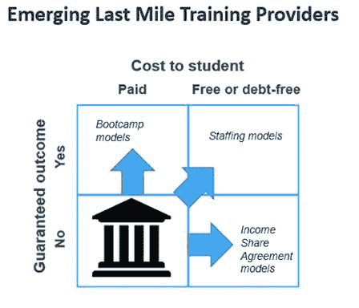

# 教育和培训的“最后一英里”

> 原文：<https://web.archive.org/web/https://techcrunch.com/2017/06/25/the-last-mile-in-education-and-training/>

瑞安·克雷格是

[Achieve Partners](https://web.archive.org/web/20230118123253/https://www.achievepartners.com/)

这是一家专注于教育和就业交叉领域的投资公司，也是《新大学:更快+更便宜的大学替代品》一书的作者。

More posts by this contributor

1994 年大学毕业后，我在麦肯锡公司(McKinsey & Co .)工作了几年——一个穿着不合身西装的年轻人天真地但充满活力地试图说服经验丰富、疲惫不堪的经理们以不同的方式工作。

对许多客户来说，一个不断出现的问题是“谁有可能赢得家庭宽带接入的战争:电话公司还是有线电视公司？”虽然我们现在知道了答案(电缆)，但我记得我花了很多时间研究电缆和电话“最后一英里”连接的技术规范。

最后一英里的概念——连接每个家庭的最后一站——起源于电信，但现在尤其是供应链管理和电子商务的主要焦点。

适用于所有情况的一般原则是，建设最后一英里是最困难和最昂贵的，但同样也是最有价值的:控制最后一英里可以提供几乎无懈可击的竞争地位。在电信和其他公用事业领域，建设最后一英里的成本导致了自然垄断，因此需要监管。

我们现在看到最后一英里现象在一个不太可能的环境中出现:教育。这有三个原因。

## 一.招聘流程发生了巨大变化

如今，超过 85%的职位空缺(以及经济增长领域的几乎所有职位)都在网上发布。因此，典型的招聘启事会收到大约 200 份申请——对于任何招聘经理来说，太多的简历和履历都不值得认真看。因此，所有大型雇主和大多数中型企业都求助于利用求职者跟踪系统来管理他们的招聘流程。这些系统，如市场领导者甲骨文(Oracle)的 Taleo，根据关键词匹配来筛选申请人。

申请者跟踪系统与什么相匹配？越来越多的是技术技能。在过去的十年里，在几乎所有行业的工作描述中，技术技能的数量已经超过了认知技能和非认知技能的总和。虽然这无疑是一个事实的产物，即对于任何给定的工作，提出 10 种不同的技术技能要求比提出 10 种不同的“解决问题”或“批判性思维”的方式更容易，但这对申请人跟踪系统无情的关键字匹配逻辑来说无关紧要，这些系统会过滤掉没有足够关键字匹配水平的候选人。这意味着大多数没有多少技术技能的候选人是人力资源经理看不到的。

在职位描述中，技术技能的流行对于入门级职位来说尤为突出，其中许多职位现在需要利用 SaaS 平台来管理供应链、销售、营销、客户服务、财务、IT 和人力资源等职能。因此，简历中没有 Salesforce(销售)、Pardot(营销)、Marketo(数字营销)、Google AdWords(数字营销)、ZenDesk Plus(客户服务)、NetSuite(财务)、Financial Force(财务)和 Workday(人力资源)等关键词的候选人不太可能被考虑。

## 二。学生真的真的很在乎找到一份好的第一份工作

在过去的十年里，高等教育的一个最大的变化是那些说他们是因为工作、职业或收入原因而入学的学生的比例。今天，超过 90%的学生把这作为上大学的唯一或主要原因。

毫无疑问，这部分源于大衰退期间大学毕业生糟糕的就业状况。大多数学生都有多年未充分就业的哥哥姐姐或朋友，这种情况通常很严重。另一个原因是，今天的学生在有偿工作方面的经验[少得多，这使得他们对获得一份好的第一份工作更加焦虑。最后，对获得一份好的第一份工作的担忧是真实的:只需要大学学位而没有具体经验要求的工作越来越少](https://web.archive.org/web/20230118123253/https://www.insidehighered.com/views/2017/06/16/why-college-students-are-anxious-about-employment-essay)[，也许是因为雇主已经放弃希望新的大学毕业生拥有必要的技术技能，所以开始强加经验要求。因此，十年前入门级销售职位几乎没有任何技术技能要求，而今天同样的职位可能要求两年的销售经验。](https://web.archive.org/web/20230118123253/https://www.forbes.com/sites/ryancraig/2016/12/29/employers-mistakenly-require-experience-for-entry-level-jobs)

## 三。高校还没有调整

即使今天的学生不再相信这一点，但绝大多数高校仍然遵守着那句古老的格言:“我们为你的第五份工作做准备，而不一定是你的第一份工作。”因此，尽管越来越多的人认识到，如果没有一份好的第一份工作，学生越来越不太可能找到一份好的第五份工作，但在调整课程以反映雇主需求和就业市场现实方面几乎没有什么进展。低层次的课程设置没有改变；大多数系提供的是二三十年前提供的同样的低水平课程。与此同时，高级课程继续由教师研究优先事项决定，其运作独立于劳动力市场需求。

## 最后一英里培训提供者

这种日益扩大的差距——通常被称为技能差距——导致了最后一英里培训提供商的出现。这些提供者关注的正是雇主需要的技术技能(如职位描述所示)，但学院和大学不教授这些技能。编码是最明显的例子；虽然所有的学校都教授 Java，但很少有计算机科学项目真正向学生展示编码项目在实践中是如何工作的(例如，使用 struts:开发人员调用常用功能的现有代码)。但几乎在每个领域都出现了“最后一英里”培训机构。除了编码，我的公司还投资了销售、医疗设备和保险领域的最后一英里培训提供商。

最后一英里培训提供商模式分为三类，每一类都代表着传统高等教育价值主张的进步。通过 2×2 矩阵来观察高等教育，其中 X 轴显示学生的成本(付费或免费)，Y 轴显示结果(没有保证或有一些保证的结果)，传统的学院和大学一直并将继续坐在左下象限:为没有保证的结果预先付费。

但考虑到雇主对他们传授给学生的技术技能的需求，最后一英里培训提供商能够改进这一价值主张。我们看到训练营的模式，学生预先支付学费，并获得明确或隐含的就业保证；大多数学生付费训练营显示，相关高薪工作的就业率接近 90%。

我们还看到了收入分成协议模式，在这种模式下，学生不需要预先支付任何费用，但最后一英里培训提供商对积极的就业结果如此有信心，以至于它很乐意在几年内将报酬作为毕业生收入的一部分——通常只有在学生开始赚到 5 万美元或更多时。最后，我们看到了人员配备和安置模式，在这种模式下，最后一英里培训提供商可以真正保证就业结果，因为它雇佣毕业生并将他们分配给客户。这种收入模式允许提供商免费提供最后一英里的培训，进一步增强了对学生的价值主张。

随着这三种类型的最后一英里培训提供商进一步加强与雇主的接触，传统学院和大学将越来越难以跟上；他们通过陈旧的职业服务办公室实现的最后一英里连接，将无法与最后一英里培训提供商竞争，后者的业务依赖于掌握雇主目前所需的技术技能。

随着最后一英里培训机构在各个行业激增，入学人数和学费开始转移，如果大学和学院求助于最后一英里竞赛的失败者一直用来试图控制由此产生的自然垄断的同一工具:监管，就不要惊讶了。