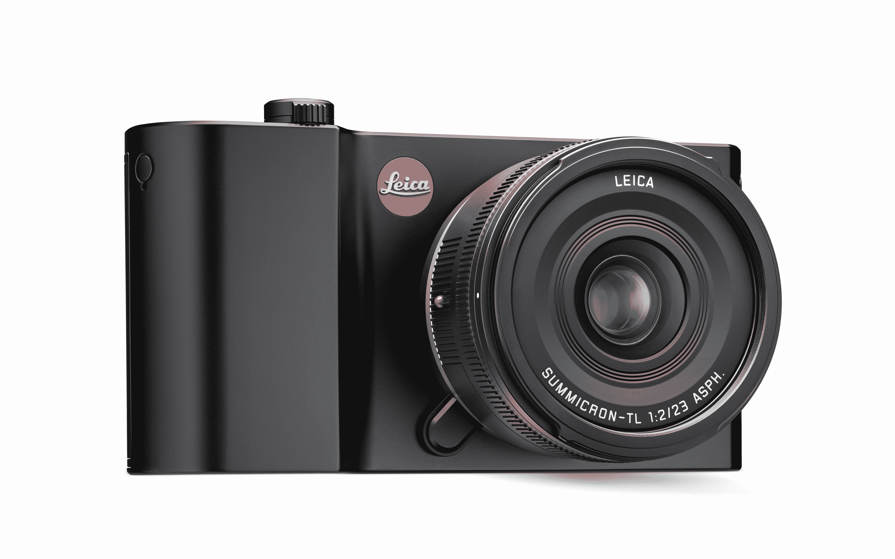

# 徕卡 TL2 将无反光镜相机带到了傻瓜相机的尺寸，但价格昂贵 

> 原文：<https://web.archive.org/web/https://techcrunch.com/2017/07/10/the-leica-tl2-brings-mirrorless-cameras-to-point-and-shoot-size-but-for-a-price/>

# 徕卡 TL2 将无反光镜相机带到了傻瓜相机的尺寸，但价格不菲

徕卡总是藏着一款新的 artisan 相机，今天的发布会也不例外。T 系列相机的尺寸一直是日常使用的傻瓜相机，但 TL2 引入了新的 2400 万像素 APS-C 传感器，使其值得使用焦距从 17 毫米到 200 毫米的可互换镜头拍摄。

不管你怎么解释，也不管你作为摄影师的需求是什么，这都令人印象深刻。然而，如果你是一名体育或动作摄影师，那么你会对 TL2 的连续拍摄速度嗤之以鼻——它最高可达 7 fps(使用机械快门)和 20 fps(使用电子快门)。

TL2 值得注意，因为它让徕卡的 T 系列保持竞争力[对抗更快、更强大的无反光镜相机，](https://web.archive.org/web/20221025222512/https://beta.techcrunch.com/2017/06/24/the-sony-a9-inches-the-mirrorless-camera-market-forward/)包括徕卡自己的 SL 无反光镜全画幅相机。

由于没有光学或电子取景器(除非你考虑为热靴支架购买一个)，你所有的照片都将通过 3.7 英寸的液晶屏幕看到。Leicas 并不以其视频能力而闻名，但 TL2 确实支持在 4K 录制高达 30fps 的视频，支持 60fps 的全高清或 120fps 的 720p 高清慢动作捕捉。

TL2 的 ISO 范围从 50-50，000，比 TL1 的最大 ISO 12，500 有所改进。虽然这意味着你不会在黑暗中看到*一切*，但尽管如此也不会害怕拿出 TL2 过去的黄金时间。像大多数其他现代相机一样，徕卡 TL2 可以通过手机应用程序远程使用，然后你可以将图像导入和导出到社交媒体。

徕卡 TL2s 将从今天开始在徕卡精品店和授权零售商处发售，售价 1950 美元(仅车身)，有黑色和银色两种颜色可供选择。