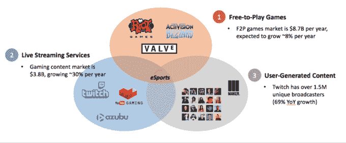
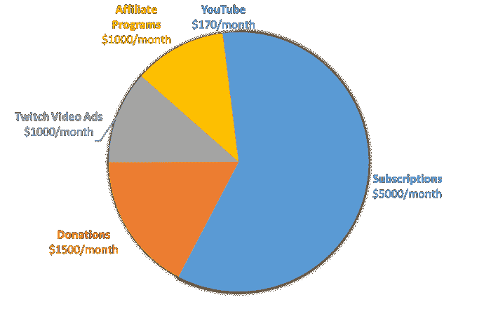
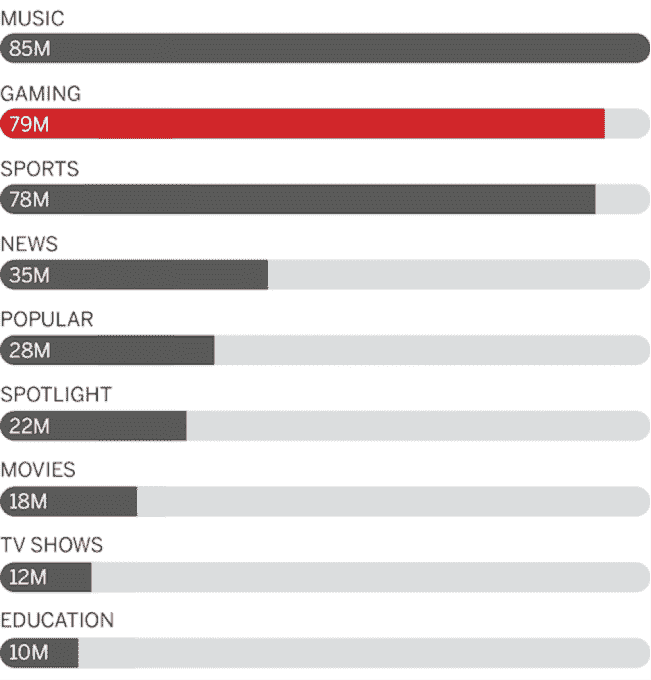

# 电子竞技不那么运动的一面 

> 原文：<https://web.archive.org/web/https://techcrunch.com/2016/01/10/the-less-sporty-side-of-e-sports/>

More posts by this contributor

电竞行业越来越大。非常大。看 Twitch 的人比 CNN 还多。Riot，Valve，[动视](https://web.archive.org/web/20221208173319/https://beta.techcrunch.com/2016/01/04/activision-mlg/)-暴雪和 EA 都有电竞举措。最大的锦标赛吸引了数千万观众，并为英雄联盟和 Dota 2 等游戏中的最佳玩家提供数百万美元的奖金池。

然而，关注[超级明星选手](https://web.archive.org/web/20221208173319/http://bits.blogs.nytimes.com/2014/07/21/chinese-team-wins-biggest-ever-prize-in-professional-video-gaming/)、[大型锦标赛](https://web.archive.org/web/20221208173319/http://www.dailydot.com/esports/the-international-18-million-2015/)和[与传统体育项目](https://web.archive.org/web/20221208173319/http://ftw.usatoday.com/2014/12/league-of-legends-worlds-viewership-esports-world-series-nba-finals)的比较，忽略了电子竞技最有趣的一个方面。当仔细研究电子竞技和流媒体的经济学时，发现娱乐性比优秀更好。

来源:马德罗纳风险投资集团

传统上，职业电子竞技选手的大部分收入来自锦标赛奖金。按照高尔夫或网球等运动的这种模式，玩家将环游世界参加重大比赛并争夺奖金。

例如，有史以来收入第 400 位的电子竞技选手是韩国英雄联盟选手 [Spirit、](https://web.archive.org/web/20221208173319/http://www.esportsearnings.com/players/6015-spirit-lee-da-yoon.)。自 2013 年以来，他在 13 场比赛中赚了 8 万美元，包括 2014 年英雄联盟世界锦标赛的前三名。

然而，如今随着直播服务的普及，出现了各种新的收入模式，如订阅、捐赠和众筹。这些新模式导致流媒体公司更加关注娱乐和观众参与，而不是赢得奖金。

比如 Twitch 上排名第 400 的流光是 [Destiny。](https://web.archive.org/web/20221208173319/http://www.destiny.gg./)自 2011 年以来，他在锦标赛中只赚了 2，444 美元，但他每年在 Twitch 上的收入超过 10 万美元，主要来自订阅费(每月 5，000 美元)和捐款(每月 1，500 美元)。下面是他每月收入的明细，这是他在接受《每日邮报》采访时分享的。

来源:每日点击率，命运

这种模式适用于电子竞技流媒体，因为“go pro”和开始广播的成本几乎为零，流媒体可以通过少量观众获得有意义的收入。

Streamers 不需要投资多年的实践和指导或花费数百万美元的广播基础设施。任何人都可以在任何时候免费开始流媒体播放。[一篇关于 KittyPlaysGames](https://web.archive.org/web/20221208173319/http://www.bloomberg.com/features/2015-the-big-business-of-twitch/) 的文章解释了一名法律专业学生如何成为一名专业的流媒体记者，她拥有 2500 名订户(每月至少 6250 美元的订阅费)和 50 多名粉丝，他们向她捐款超过 1000 美元。

> 从事公司法会降低收入。 KittyPlaysGames

由于订阅和直接捐赠，streamers 不依赖广告，他们可以产生足够的收入来支持他们自己，拥有相对较少但参与的观众。

例如，Destiny 每月从订阅和捐赠中获得 6500 美元的收入，尽管平均只有 2000 至 2500 名并发观众，而 KittyPlaysGames 通常有 2000 至 5000 名并发观众，她曾表示，“在公司法领域的职业生涯将是收入的一个下降”。

电子竞技中这种独特的准入水平和机会令人难以置信地兴奋，我们看到越来越多的新公司专注于电子竞技娱乐而不是竞争。查看 [Jonathan Pan](https://web.archive.org/web/20221208173319/https://medium.com/u/36cc4efe203c) 伟大的电子竞技市场生态系统地图了解更多细节。

我们仍然处于电子竞技的早期，但公司有很多机会增长和定义类别。以下是我们在 Madrona 寻找的一些想法:

## 下一次抽搐

Twitch 一直是游戏社区的一个梦幻平台，但尚不清楚 Twitch 是否会赢得其他垂直市场。以下是 YouTube 上最热门的视频类别——人们会希望现场观看这些活动吗？他们希望如何与内容创作者互动？

资料来源:ESPN 和五三八

## 能在 Twitch 上快速成长的媒体公司

ESPN 始于有线电视，BuzzFeed 始于脸书，VICE 始于 YouTube。这些公司中的每一个都掌握了自己的渠道并迅速发展，然后扩展到其他渠道。哪些媒体公司会在 Twitch(或其他流媒体平台)上成长？

## 飘带工具

流媒体通常是每周 50+小时的全职工作；流媒体需要找到创造性的方法来吸引和赚钱他们的观众。Madrona 的最新投资 [Matcherino](https://web.archive.org/web/20221208173319/https://matcherino.com/) 就属于这一类。他们帮助飘带在不播放时吸引观众，并利用众筹作为一种机制来帮助粉丝支持他们最喜欢的飘带。