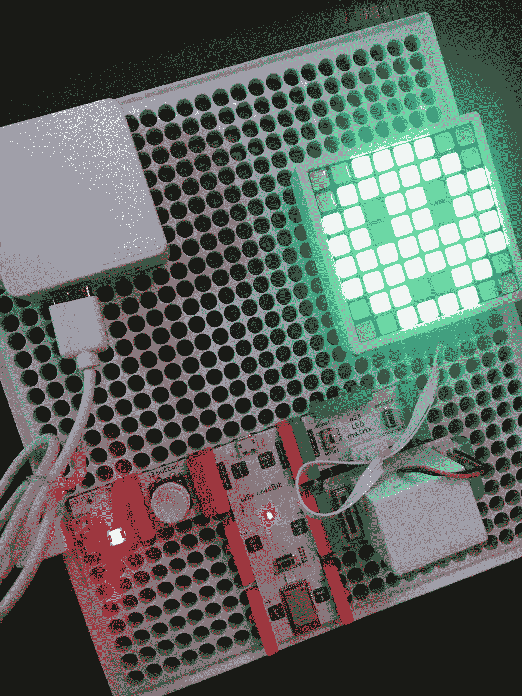
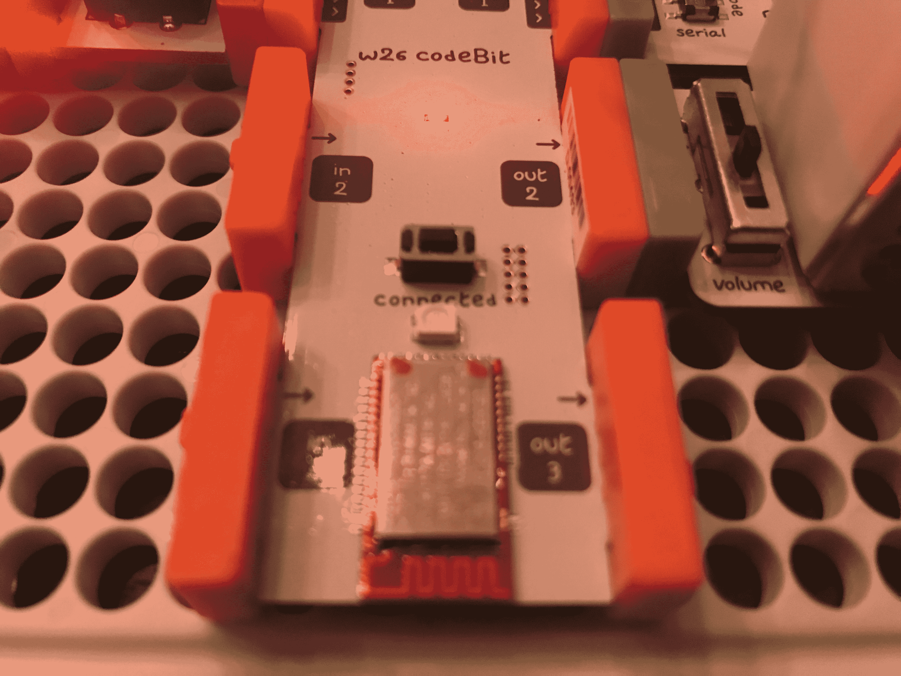
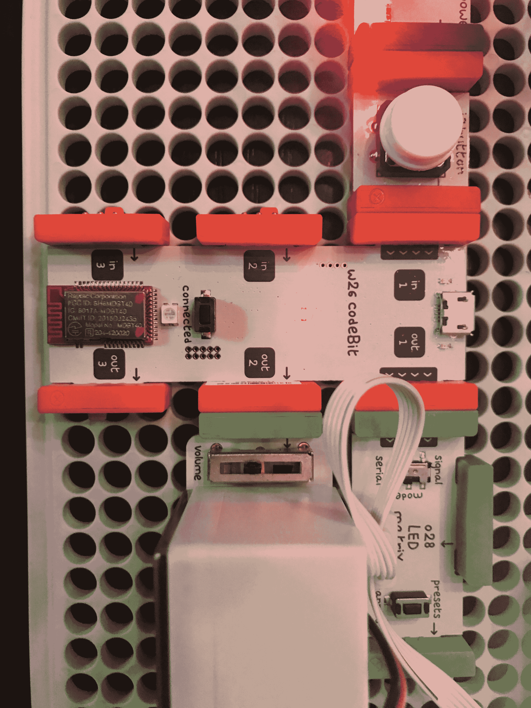

# LittleBits 代码工具包是一种使用 Arduino  进行游戏(和学习)的简单方法

> 原文：<https://web.archive.org/web/https://techcrunch.com/2017/06/05/the-littlebits-code-kit-is-an-easy-way-to-play-and-learn-with-arduino/>

# LittleBits 代码工具包是一种使用 Arduino 进行游戏(和学习)的简单方法

我不喜欢益智玩具。它们通常要么太有教育意义，要么太像玩具，最终，孩子们得不到什么教育和乐趣。LittleBits 的[代码包改变了我的想法。](https://web.archive.org/web/20230323204543/https://shop.littlebits.cc/products/code-kit)

这套代码专门针对 3-8 年级的课堂学习，售价 299 美元。为什么？因为它比 LittleBits 提供的其他编码工具包更健壮一些。

LittleBits 基本上是一个电子工具包，由小组件组成——电池、扬声器、开关——通过强大的磁铁连接在一起。连接在一起的东西会折断并粘在一起，而不应该连接的东西会互相排斥。这意味着你不能真的短路这些套件有限的权力。

代码套件是一个装在盒子里的 Arduino 系统。它配有一个小型可充电电池，可以为基于 Arduino 的三输入三输出码位供电。CodeBot 是无线的，所以你可以通过内置的 USB 加密狗对它进行编程。

编写代码就像在 Scratch 中拖放一样简单。我把它给了我的孩子们，他们能够在几分钟内组装出最初的项目，一旦我给他们看了代码，他们就能够在半小时后修改代码并创建他们自己的游戏。任何具备简单编程知识的教师都可以在几分钟内使用这个工具包。

LittleBits 最让我喜欢的是设计。虽然试验板很有趣，但这些小部件可以快速轻松地组合在一起，CodeBit 的加入增加了大量功能。我从来没有真正喜欢过 LittleBits 出售的电子套件——它们不够有趣，也太简单，不具有全面的教育意义——所以像这样的东西是一个很大的进步。简而言之，这是我推荐的第一个学习物联网和基本编程的 LittleBits 工具包。

虽然没有什么比烙铁和破音响更能学习错综复杂的电子产品了，但 LittleBits 终于达到了某种实用和有趣的水平，可以将它提升到 Heathkit 和其他[经典电子套件的令人眩晕的高度。](https://web.archive.org/web/20230323204543/https://learn.sparkfun.com/tutorials/recreating-classic-electronics-kits)就是不舔 9 伏。

