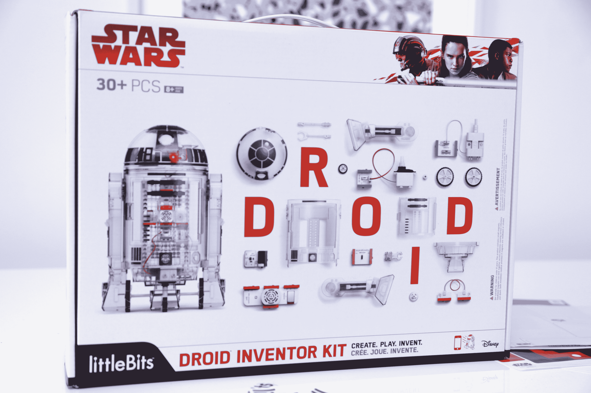
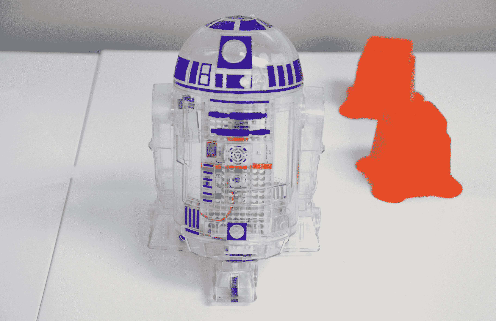
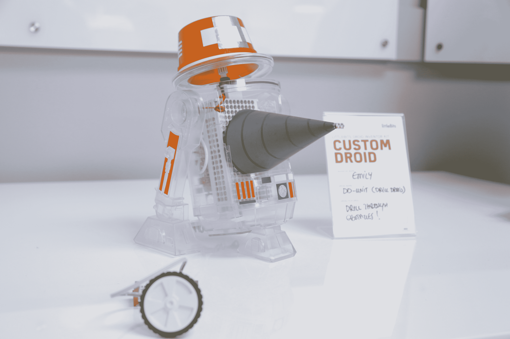

# littleBits Droid Inventor Kit 可以让你制作一个属于你自己的 R2-D2

> 原文：<https://web.archive.org/web/https://techcrunch.com/2017/08/31/the-littlebits-droid-inventor-kit-lets-you-build-an-r2-d2-of-your-very-own/>

# littleBits 机器人发明家工具包可以让你制作一个你自己的 R2-D2

有没有想过打造一个属于自己的 R2-D2？

你可以[花几百万美元](https://web.archive.org/web/20230315095314/https://techcrunch.com/2017/07/01/someone-just-bought-r2-d2-for-over-2-million-dollars/)得到所有屏幕上使用的零件/道具…

或者你可以花几个星期在商店里敲打废金属，从零开始建造一个。

或者你可以拿起 littleBit 的新机器人发明工具包，然后就到此为止。它很小，没有前面提到的选项那么激烈，但是嘿，这是你的 R2。

不熟悉 littleBits？它成立于 2011 年，专注于通过组合在一起的模块化组件向孩子介绍电子和电路。想要建立一个有点禁忌风格的蜂鸣按钮？拿起电池模块、按钮模块和扬声器模块，将它们的磁性末端粘在一起，就可以了——不需要焊接(因此不会有烙铁烫伤)。

这个机器人发明工具包是一个非常可爱的概念:一个 99 美元的盒子，包含所有的电机，扬声器，贴纸，传感器和机器人身体部件，你需要重新创建一个哔哔作响，滚动的 R2-D2。想把事情搞混一点吗？你也可以这样做:

一个配套的 iOS/Android 应用程序为你提供了如何将东西拼凑在一起的一步一步的分解，以及一系列旨在鼓励孩子根据自己的喜好调整 droid 的任务。例如，上面的那个有一个小纸“钻”，当它在房间里滚动时会旋转。

该套件将于 9 月 1 日开始发货。

这对 littleBits 来说是一个相当大的合作伙伴关系；他们去年加入了迪士尼的创业加速器，这是第一个上架的新产品。看看下面视频中大约 2 分钟的标记。