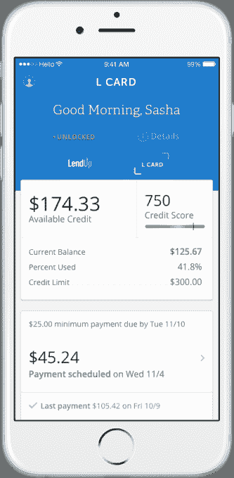
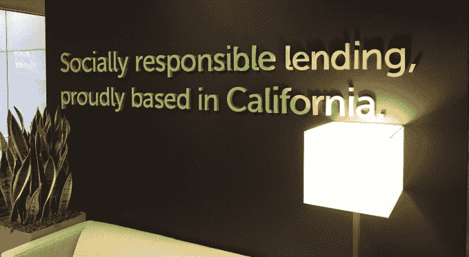
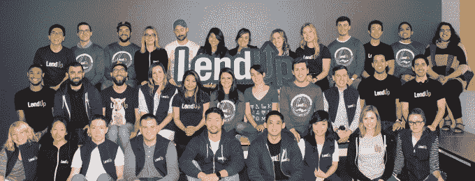

# LendUp 以 4700 万美元与大银行争夺同情心信用卡 

> 原文：<https://web.archive.org/web/https://techcrunch.com/2016/08/22/the-loan-dolphin-swims-again/>

穷人输了，银行赢了。信用卡会让人们陷入债务，并通过滞纳金榨干他们。但正是这种剥削经历让银行容易受到金融科技初创公司的影响，如 [LendUp](https://web.archive.org/web/20221128042940/https://www.lendup.com/) 等公司愿意以低价收购银行，并通过软件效率来弥补利润。

正是这种基于同情原则建立持久消费者银行品牌的战略，让 LendUp 获得了由 Y Combinator 的增长基金牵头的 4750 万美元的新一轮融资。首席执行官萨沙·奥尔洛夫表示，这次 C 轮融资对 LendUp 的估值“大大高于”它在 2016 年 1 月筹集的资金。在这个艰难的后期融资季节，这是一个令人印象深刻的壮举。

 LendUp 将把现金用于扩大其 [L 卡](https://web.archive.org/web/20221128042940/https://www.lendup.com/card)，这是一种没有隐藏费用和灵活还款时间表的信用卡。它还通过其配套的智能手机应用程序展示了现代功能，该应用程序允许用户在丢失或被盗的情况下立即停止收费，以及一个财务健康表，该表可以清楚地显示客户还剩多少信用可以消费。LendUp 每月已经注册了数千个账户，尽管它还没有做好积极推销自己的准备。

“我们对让人们负债不感兴趣，”奥尔洛夫说。严厉惩罚逾期还款的客户可能会给银行带来快速收入，但这会让人们讨厌他们。从历史上看，没有太多的选择。但是，数据驱动的风险评估和通过建立一个应用程序而不是银行分行来消除开销，使 LendUp 能够打入市场。

## 贷款海豚，不是高利贷者

LendUp 成立于 2011 年，最初攻击的是诈骗发薪日贷款业务。它从覆盖低收入社区的预付现金商店中偷走顾客，并通过提供金融教育留住他们。

尽管信用卡是 100 倍大的市场，所以今年早些时候它筹集了 1 亿美元的债务来为贷款提供资金，并在 b 轮融资中筹集了 5000 万美元。尽管它仍然有足够的资金，但 LendUp 选择加速其计划，今天的 4750 万美元由 Y Combinator Continuity 牵头，加入了谷歌风险投资公司、Thomvest 风险投资公司、QED 投资公司、Data Collective、Susa 风险投资公司、Radicle Impact、Bronze Investments、SV Angel 和一些天使。

YC 连续性公司的阿里·罗加尼将作为观察员加入 LendUp 的董事会。他告诉 TechCrunch:

> “LendUp 不仅正在打造一家非常成功的公司，而且是一家非常重要的公司。通过将真正的软件创新与强大的价值观文化相结合，LendUp 为目前无法充分获得信贷的近一半美国人口带来了基本的金融服务。在这个过程中，LendUp 努力帮助其客户提高信用评分，获得更多金融服务，并最终改善他们的生活。

然而，与大银行斗争绝非易事。LendUp 将不得不改变几代人灌输给客户的金融行为模式，同时与银行庞大的营销部门竞争。奥尔洛夫说，随着收入继续“逐月持续增长”，它将不得不平衡其使命与财务偿付能力。

LendUp 将对员工进行仔细筛选，以确保没有人做任何可疑的事情。在线贷款市场 [Lending Club 不得不解雇 179 名员工，并迫使其首席执行官辞职](https://web.archive.org/web/20221128042940/http://www.mercurynews.com/business/ci_30067584/lending-club-cuts-179-jobs-promotes-interim-ceo),因为他和他的家人被发现贷款以提高初创公司的数字。

幸运的是，LendUp 正在做一件事，使其比竞争对手更加灵活:它正在内部构建其整个技术体系。“其他所有人都外包他们的技术，”奥洛夫指出。

金融科技正准备大规模增长。几乎没有哪个行业像银行那样，在吹嘘低利率的同时，隐藏着让钱包不堪重负的费用，从根本上与客户脱节。如果金融巨头不采取更具同情心的方法，他们的客户将会选择像 [LendUp](https://web.archive.org/web/20221128042940/https://www.lendup.com/) 这样的创业公司。