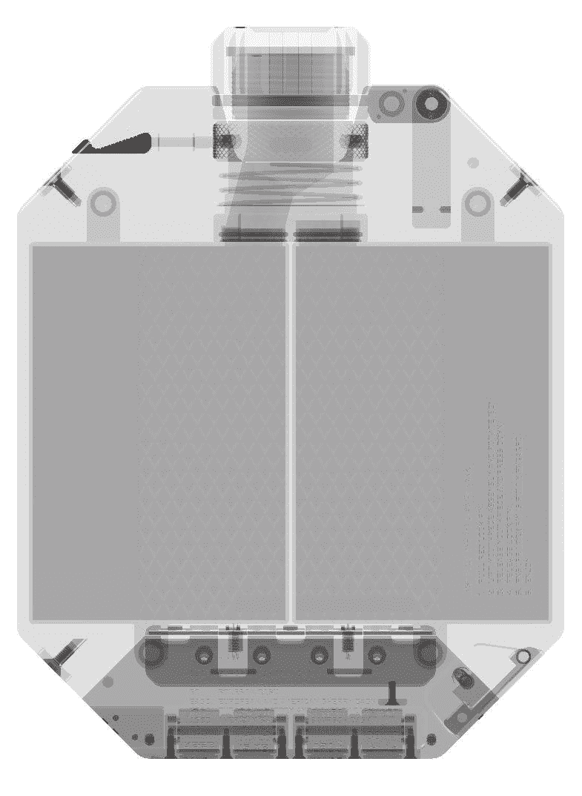

# 麦卡伦 x Urwerk 烧瓶是价值 2000 美元的高科技烈酒 

> 原文：<https://web.archive.org/web/https://techcrunch.com/2017/03/08/the-macallan-x-urwerk-flask-is-2000-worth-of-high-tech-boozing/>

# 麦卡伦 x Urwerk 烧瓶是价值 2000 美元的高科技烈酒

在机械设备的历史上，没有比烧瓶更简单的了。你打开盖子，倒酒进去，然后关上盖子。然后你喝酒。但是如果你能在你的瓶子里放两杯酒呢？如果你有一个机械指示器来告诉你喝的是哪种酒呢？如果你花 2000 美元买了所有这些机械的快乐呢？

那么，你会有麦卡伦 x Urwerk 长颈瓶，一种由 Urwerk 钟表公司为麦卡伦威士忌公司制造的长颈瓶。这种长颈瓶看起来像传统的饮料架——我通常用佳得乐瓶来装酒，但我见过有人变得很花哨——但它有一些秘密。

首先，它包含两个储存各种类型酒的容器——例如，一瓶麦卡伦 30 年苏格兰威士忌和一包夜车——以及一个指示表达和年份的机械系统。你可以转动出口来切换容器，比如说，让你先品尝一杯威士忌，然后再喝一杯无气的米奇威士忌。

它由 150 个部分组成，但遗憾的是，不包括专门的威士忌服务员的服务。

简而言之，这种野生烧瓶提供了太多的杀伤力，它还不如死池电影。你可以在这里读到更多关于它的信息，但是请放心，用这个瓶子把酒偷偷带进球赛或舞会有点大胆，有点鲁莽，也有点浪费。毕竟，你可以用这瓶酒的价格买差不多半瓶[麦卡伦 30 年陈酿威士忌](https://web.archive.org/web/20221219155918/https://www.cwspirits.com/the-macallan-30-year-old-fine-oak-scotch-whiskey-750-ml.html?gclid=Cj0KEQiA9P7FBRCtoO33_LGUtPQBEiQAU_tBgMg00Tgq0UQA8FEC-ZaUVRE9IElXVSet8rMRjRmn_SAaAomc8P8HAQ)，从而用一个惰性的、不能喝的东西换来一瓶最优质的玻璃瓶，里面装着一种罕见的甘露，它如此细腻，以至于你可能会有写诗的灵感。你的电话。