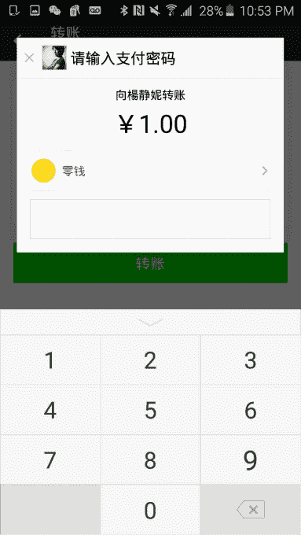
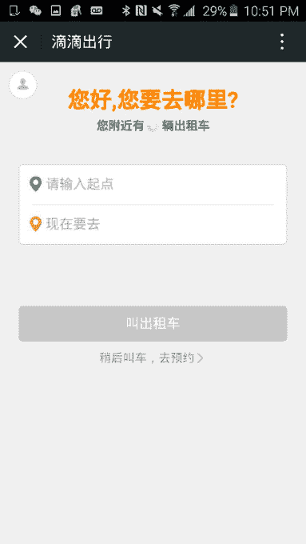
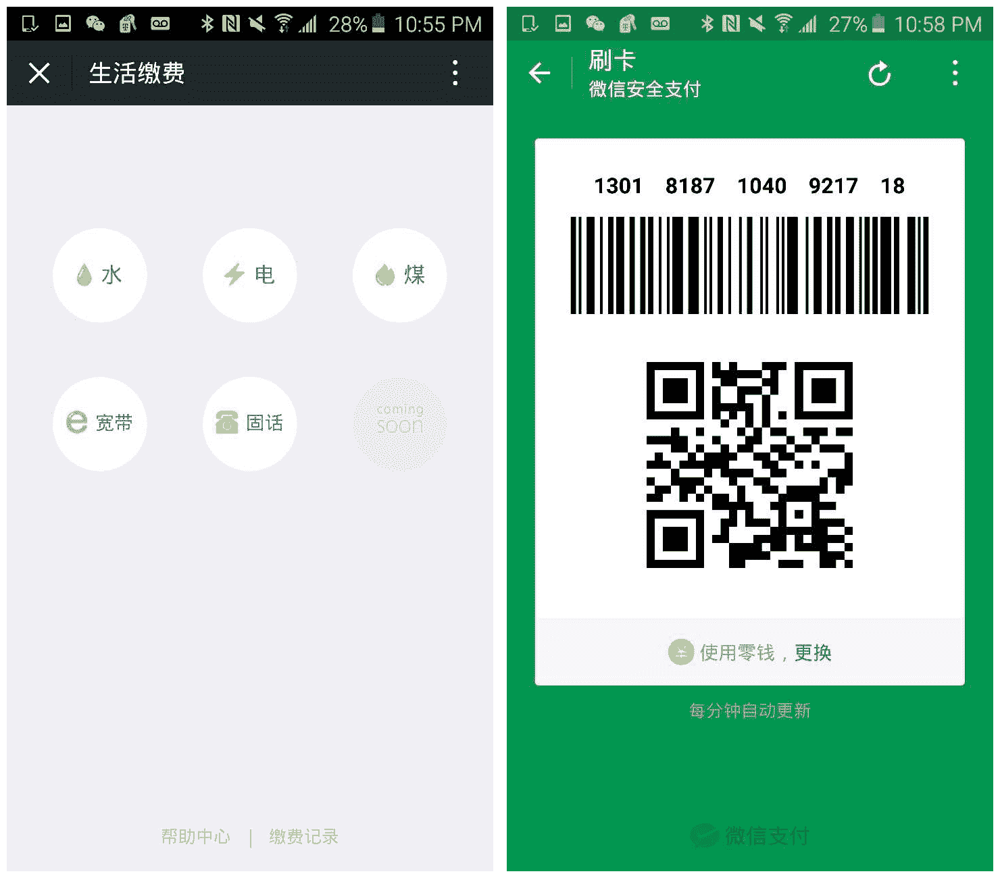
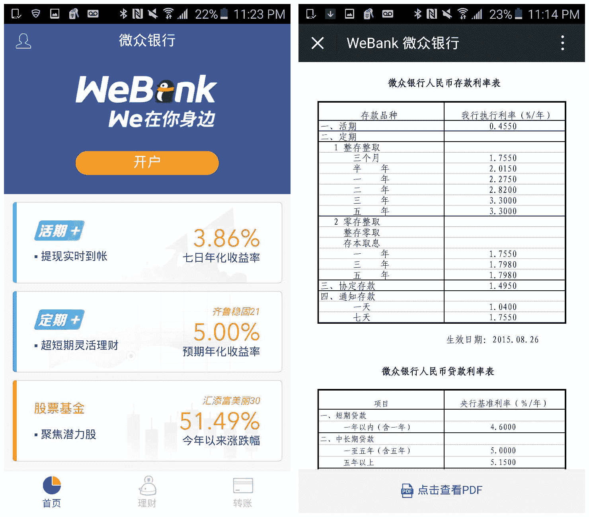

# 微信的多种方式:信息如何吞噬世界

> 原文：<https://web.archive.org/web/https://techcrunch.com/2015/11/26/the-many-ways-of-wechat-how-messaging-is-eating-the-world/>

伊迪丝·杨是 500 Mobile Collective 的合伙人。

More posts by this contributor

2011 年 2 月，我拜访了在腾讯工作的朋友黄彦林。比尔告诉我他们新推出的名为微信的消息应用。当时我已经用 WhatsApp 一年多了。我问比尔为什么他们要造一个模仿者。他的回复？他只是坚持要我下载这个应用程序，然后带着它转一圈。

那天晚上，我回到香港的家里，把它安装在我妈的 iPad 上。令我惊讶的是，她马上就明白了——她仍然不知道如何关闭她的 iPad，但她可以给我发一个笑脸。我就知道微信有大动作了。

此后，微信急剧增长。这款应用不仅改变了我母亲的交流方式，而且已经深深扎根于 2015 年 9 月每天登录的 5 . 7 亿人的生活中。为了展示微信的无处不在:在中国所有一线城市(1000 多万人口)中，微信的普及率超过了总人口的 90%。

微信的参与深度是大多数其他应用无法比拟的，因为它提供了广泛的社交功能——从分享新闻和链接的时刻、高质量的视频和音频聊天(用户每天生成 540 年的视频/语音)，到贴纸和游戏(15%的用户每天玩 10 分钟的游戏)。这些特征不仅仅是促进交易信息，而是自我表达的形式。

这种参与使微信能够进行试验，并成为各种新的消息传递或基于支付的功能的平台。中国以外的许多人没有意识到微信现在跨越的使用案例和垂直行业的广度，从电子商务到交通运输，再到金融服务。

微信惊人的社交(现在也包括支付)体验已经使它变成了一个全球平台，人们用它在南非找工作，在加利福尼亚为他们的非营利组织筹集资金，在曼哈顿出售房地产，在南亚寻找约会。

为了展示微信现在在用户日常生活中拥有的众多接触点，这里有一些超越应用内游戏和社交帖子的成功但不为人知的使用案例。

## 微信压岁钱(想想 PayPal)

2013 年，微信推出了其[支付服务](https://web.archive.org/web/20230326070937/http://www.forbes.com/sites/parmyolson/2015/03/18/facebook-money-transfer-wechat/)，巧妙地模仿了中国千年来用红包送礼的传统。在 2014 年至 2015 年期间，微信用户在该应用上相互发送了超过 10 亿个“红包”——是前一年的 50 倍。现在每天有 5000 万用户发送红包，到明年初，这个数字可能会再翻一番。微信支付的王牌是，你不需要添加联系人来支付——你只需使用一个简单的二维码。

## 打车微信(想想优步)

用户可以通过中国的滴滴快的或新加坡的 EasyTaxi 等拼车服务，直接在微信中预订出租车。用户可以看到司机的详细信息和位置，还可以在微信内与司机交流。在旅行结束时，用户可以通过微信支付轻松支付乘车费用。

## 微信账单和支付(想想 Apple Pay)

中国居民现在可以使用微信进行多种账单和支付选择，超过了我们在西方看到的——或者任何“消息传递”应用程序，就此而言。在一些城市，人们现在可以通过微信上的服务账户支付水、电、气、宽带、移动、税收和信用卡账单。

截止 2014 年 8 月，微信上有超过[500 万个](https://web.archive.org/web/20230326070937/http://www.shanghaidaily.com/business/it/Settling-utility-fees-via-WeChat/shdaily.shtml)公众和服务账号。用户也可以进入商店，在微信中扫描产品的条形码，并获得存有该产品的中国电子商务网站列表。只需点击几下，你就可以通过网上购物来省钱。用户还可以通过微信、购买火车票和电影票，或者充值[手机积分](https://web.archive.org/web/20230326070937/https://www.techinasia.com/china-wechat-shopping-loyalty-cards-change-retail-experience/)，而不是去市场买卡。

## 针对商家和品牌的微信(想想 Shopify)

用户和品牌可以使用[典韦](https://web.archive.org/web/20230326070937/http://www.weidian.com/)(英文名:YouShop)轻松[建立自己的店铺](https://web.archive.org/web/20230326070937/http://chinachannel.co/setting-up-a-shop-on-wechat-with-weidian-wechat-essential-tips/)并在微信上开始销售。典韦的移动商务平台基于微信的社交关系，大规模开放点对点销售，也是大品牌的门户。

JD.com 是首批在微信上建立购物频道的零售巨头之一，现在近 70%的 JD.com 用户通过微信寻找推荐产品。品牌将利用公众账号和页面，通过微信推荐产品，并告知其促销活动。这就是腾讯与阿里巴巴竞争的方式。

## 微信客服(想想 Twitter)

品牌也在使用微信，就像 Twitter 在西方的使用方式一样:在销售之前、期间和之后吸引顾客参与对话。零售员工通过他们的微信账户与顾客沟通，这是[建立融洽关系并确保顾客满意的最佳渠道](https://web.archive.org/web/20230326070937/http://blogs.forrester.com/vanessa_zeng/15-02-05-use_wechat_to_facilitate_cross_channel_sales_and_customer_engagement)之一。

## 提高工作效率的微信(想想 Google Hangouts)

最近微信更新刚刚推出的一个功能是多方视频聊天。微信的编解码器和中国的网络现在足以承载令人印象深刻的高质量移动视频；坦白说，这比 Skype 的体验好得多。观看视频将继续成为消息应用的一大增长来源。

## 银行微信(想想联合银行)

微信参与创办了一家名为[微众银行](https://web.archive.org/web/20230326070937/http://www.webank.com/)的[私人银行](https://web.archive.org/web/20230326070937/http://www.hellotrends.be/en/blog/hello-trends/webank-wechat-s-private-bank)，腾讯投资了该银行，并且是其最大股东(30%股份)。微众银行承诺引入基于摄像头的面部识别系统来审批银行贷款，并提供将您的微信账户与标准银行卡关联的选项。

## 微信筹款(想想 GoFundMe)

拥有如此多的日活跃用户，微信也是一个非营利捐赠的消防队。[捐赠功能](https://web.archive.org/web/20230326070937/http://blog.wechat.com/tag/wechat-gives-back/)支持像联合国儿童基金会和旧金山 Watsi 这样的组织。在与微信/腾讯合作之前，Watsi 共有 14000 名个人捐赠者。在两个月内，微信增加了 34，000 名中国捐赠者，帮助资助世界各地的人们的医疗保健。大多数都是小额捐赠，平均金额约为 0.25 美元，但这些数字很快就会增加。

还有一些真正开箱即用的使用案例…

**微信做小工:**今年早些时候，微信投资了 [M4JAM](https://web.archive.org/web/20230326070937/https://www.m4jam.com/) (Money For Jam)，这是一家总部位于南非的移动求职服务，[连接到微信](https://web.archive.org/web/20230326070937/https://techcrunch.com/2015/02/20/m4jam-wechat-africa/) 。M4JAM 使用微信向他们的用户社区推出“小工作”,用户通过手机回复申请/接受工作。

**微信房地产:**去年，一位纽约的房地产经纪人在微信上收到了一位中国买家的信息，他想了解曼哈顿的一栋住宅楼。代理人给中国买家发了一些照片和附近的一些细节。第二天，在电话交谈之后，代理人[完成了这笔 1300 万美元的交易](https://web.archive.org/web/20230326070937/http://blogs.wsj.com/chinarealtime/2014/04/21/new-york-real-estate-agent-scores-13-million-deal-on-wechat/)。

**微信交友:** 微信的“环视”功能，可以让用户扫描并链接到半径 3 公里内的用户。这个功能现在在一些国家被用来帮助人们寻找约会。

所有这些都表明微信就像之前的脸书一样，正在成为一个不仅仅是社交的中心——并且正在迅速建立一个潜在的大规模商业网络。腾讯正在成功释放一种新的移动经济，这种经济触及到用户的需求，从他们醒来查看社交信息，到他们支付午餐费用，再到他们晚上出去约会和买电影票。

这是微信的世界。这才刚刚开始。