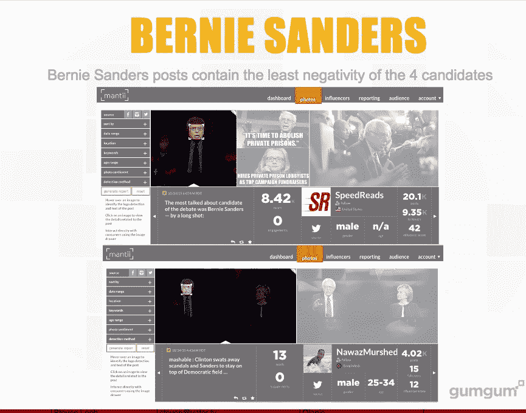
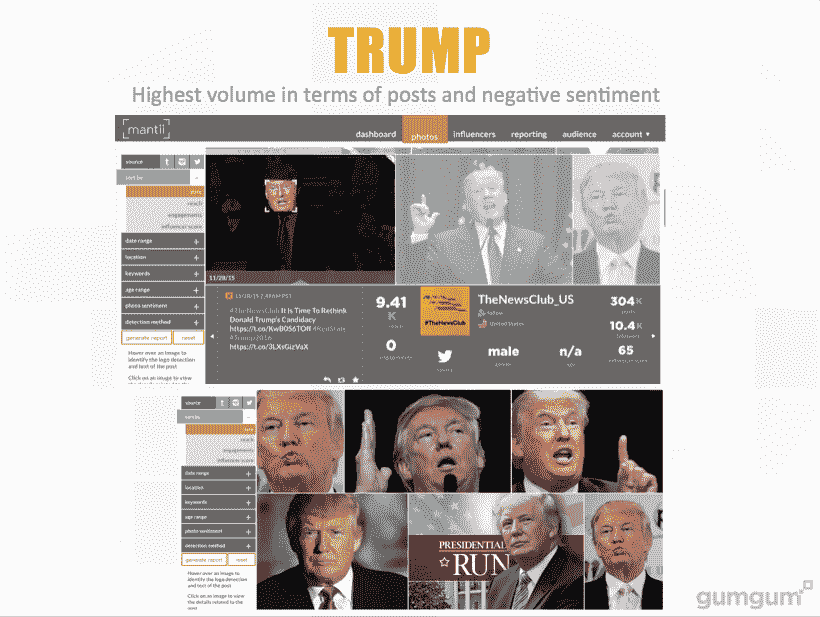

# 迷因选举 

> 原文：<https://web.archive.org/web/https://techcrunch.com/2015/11/29/the-meme-election/>

[Ophir Tanz](https://web.archive.org/web/20230124042336/https://www.linkedin.com/in/ophirtanz/)

是的首席执行官

[GumGum](https://web.archive.org/web/20230124042336/http://gumgum.com/)

这是一家人工智能公司，在计算机视觉方面有着特殊的专长。GumGum 将其能力应用于各种行业，从广告到全球职业体育。Ophir 拥有卡内基梅隆大学的学士和硕士学位，目前居住在洛杉矶。

More posts by this contributor

社交媒体在政治选举中发挥着越来越重要的作用。2008 年的总统选举被称为“[脸书选举](https://web.archive.org/web/20230124042336/http://www.usnews.com/opinion/articles/2008/11/19/barack-obama-and-the-facebook-election)”，这是选民第一次可以点播观看和分享辩论、采访、广告和声明。2012 年，随着巴拉克·奥巴马利用社交平台不仅传播他的信息，而且实际上与人们接触，这一演变继续进行。

在这个时候，视觉效果并没有发挥太大的作用，因为 Instagram 和 Pinterest 仍处于起步阶段，Twitter 尚未完全整合视觉效果。然而，在过去的几年里，人们对视觉交流的渴望使得这些平台大受欢迎。由于能够分享图片，如 memes 和 gif，今天的选民可以向全球数百万人分发图片，这对 2016 年竞选的影响已经可以感受到。

视觉网络最近被定义为一种社交媒体现象，源于智能手机上的摄像头以及 Pinterest 和 Instagram 等照片共享网站的兴起。技术已经发展到用户能够轻松创建和分享图像的地步。每天有超过 20 亿张图片被分享，可以肯定地说这不仅仅是一种时尚。

图像一直是大众首选的表达平台。甚至史前人类也在洞穴墙壁上绘画来表达他对世界的看法。由于大脑极其高效的图像识别能力，图像比文本更能激起即时的情感反应。

麻省理工学院的研究人员发现，人类可以在短短 13 毫秒内处理一幅图像。相比之下，这比文本快 6 万倍，眨眼需要 100 毫秒，所以难怪人们总的来说更喜欢用图像来表达自己的观点。现在可用的技术给他们提供了工具来轻松地做到这一点，然后将这些图像分享给数百万人。

在 2016 年总统竞选的背景下，视觉网络让选民有机会向世界展示他们如何看待候选人。人们现在可以分享候选人的模因，向人们展示他们对候选人或某个问题的看法，这可以说是与第一党选民文件一样有价值的，而不是写状态更新来宣布政治观点。

随着千禧一代在投票人口中所占比例越来越大，视觉网络的作用只会越来越大。根据我们最近的研究，在 Twitter、Instagram 和脸书上分享的关于两位领先的共和党和民主党候选人(希拉里、桑德斯、川普和卡森)的图片中，近 60%没有包含任何点名这些候选人的文字或评论——它们纯粹是基于图片的。

移动应用程序让用户能够轻松制作模因，现在你甚至可以在手机上 Photoshop 图片，即时上传并分享到社交平台。

从表面上看，当涉及到选举时，人们可能会忍不住嘲笑迷因和 gif 的价值。然而，这一现象很重要，因为它让我们得以一瞥特定人眼中的候选人。人们希望能够与他人分享自己的观点，Instagram 等平台的广泛流行表明他们更喜欢通过图像来分享观点。

这也为候选人提供了一个更亲密的视角，让他们了解人民是如何看待他们的，以及如何与他们联系。

例如，我们对主要社交平台上发布的图片的分析显示，伯尼·桑德斯的负面图片最少，大多数(69%)来自 18-24 岁的男性。

相反，尽管特朗普的民调数字很高，但在领先的候选人中，迄今为止，他在更广泛的年龄段(49%在 18 岁至 49 岁之间)发布的负面形象最多。

使用图片和迷因也可以让候选人更受欢迎。在最近的班加西听证会后，所有由希拉里主演的 GIF 都出现了，这引发了一个问题，即[在一个媒体帖子](https://web.archive.org/web/20230124042336/https://medium.com/@MattBors/the-gif-bite-election-34dfab84014#.ihnhxpedm)中被问到，她的行为是否是一个“由她尚不为人知的首席 GIF 顾问炮制的”策略更不用说优质内容的纯粹娱乐价值了。

视觉网络在 2016 年总统竞选中发挥着重要作用。随着选举的继续，将会制作、发布和分享更多的视觉内容。忽视这一点的候选人可能会落得和莎拉·佩林一样的下场。