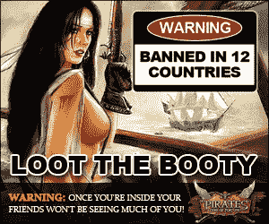

# 信息就是产品:解决手机游戏的价格问题

> 原文：<https://web.archive.org/web/https://techcrunch.com/2015/01/11/the-message-is-the-product/>

More posts by this contributor

***编者按** : Tadhg Kelly 是游戏行业顾问、自由设计师，也是领先设计博客 [What Games 的创建者。](https://web.archive.org/web/20230328073543/http://www.whatgamesare.com/)你可以在推特上关注他[点击这里](https://web.archive.org/web/20230328073543/http://twitter.com/tiedtiger)。*

除了像《我的世界》和纪念碑谷这样的例子，传统观点认为手机游戏是不能收费的。与 Steam 等其他数字商店不同，用户太随意，竞争太激烈，选择太多。在这个世界上，你的主要选择(他们是这么说的)是免费玩。你必须构建一个[游戏即服务](https://web.archive.org/web/20230328073543/http://www.develop-online.net/interview/games-as-a-service-what-does-it-mean-for-indies/0189880)，从无限保留和开放循环的角度来思考。你必须玩些心理游戏来让玩家们克服这种差距。按照这种思路，要做到这一点，需要使用各种照章办事的比喻。

我从来不相信这种说法。我经常觉得，高端手机游戏的付费问题并不是宇宙的固有规律。智能手机和其他任何游戏设备一样，都是完美的游戏设备，即使它们的玩家确实很休闲，这也不意味着它们的行为在任何时候都有本质上的不同。休闲游戏玩家乐于在任天堂的 DS 和 Wii 等其他平台上付费，也为大鱼等公司在 PC 上付费。不，手机的溢价问题一直是我印象中的一个问题。是关于手游如何营销的问题。

## 自制的陷阱

正如马歇尔·麦克卢汉的名言所说，媒介就是信息。他认为媒介的形式本身会影响通过它传递的信息被接收的方式，从而改变它们实际上所说的内容。借鉴麦克卢汉的说法，我认为 **信息就是产品** 。营销方式的基调、方法和策略决定了产品开发者可以开发什么样的产品。你投放什么样的广告决定了你认为什么样的游戏能成功，从而决定了你会投资和制作什么样的游戏。

移动/社交革命的格言之一是，大而愚蠢的广告是不可饶恕的大罪。这种策略被认为是低劣的，因为它们不是由数据驱动的。新一波游戏制造商、发行商、API 提供商和平台认为自己比 EA 这样笨拙的公司更聪明。他们说，“看看大型游戏发行商挥霍的那些愚蠢的钱吧”。*“看看他们多无能，多老派，多电视一代，多好莱坞。”相反，他们更喜欢效果营销模式，也就是说有可衡量结果的定向广告。这一波新的游戏工作室(我之前称之为[三藩市革命](https://web.archive.org/web/20230328073543/https://techcrunch.com/2012/10/13/the-san-francisco-games-revolution-is-over/)，然后宣布它结束)都是性能营销的书呆子。*

自从 Google Adsense 问世以来，科技界就一直主张广告应该是可衡量的，而不是不可衡量的。在产品和服务的世界里，大量的金钱被投入到营销的深井中，创造出收效甚微的广告。例如，你见过多少次塔可钟的广告试图用一种新的、名字很时髦的玉米饼、碎肉和奶酪配方来刺激你？你记得它叫什么吗？当然不是。在过去的二十年里，许多营销大师都提出了类似的观点，比如 Seth Godin 和他关于大公司如何加剧混乱的搞笑演讲。

可以说塔可钟制作这些广告是在浪费时间，但我们无法确定。它们无法进行有意义的衡量。他们用模糊的术语掩盖品牌价值和市场存在，这些东西要么感觉比藏红花更有价值，要么完全是胡说八道。大多数现代思维似乎倾向于后者，我们在一本书又一本书中看到一个又一个案例，表明市场是如何以一种更加部落化和分散化的方式运作的(比三频道电视时代更少"*福特 F150 制造出坚韧的*"，更多"*特斯拉*")。因此，更聪明的广告，有针对性的活动，口碑，社会价值和许多其他低成本/高智能的方法被认为是优越的。

这就是旧金山(革命，而不是地方)游戏公司如何思考的传统。它被简单地理解为阅读，是一个从一个工作室到另一个工作室重复的事实。新的开发人员将自己描绘成通过指标更聪明、精干、对观众敏感、有团队精神并且能够做出反应。参加任何会议，你都会听到人们谈论广告平台，说他们提供高级安装，更好的跟踪，质量而不是数量。他们相信他们正在用新的东西颠覆旧的东西，找到一种不那么好莱坞式的愚蠢的做事方式。

但事实并非如此。尽管他们口口声声说“精益”和“适应市场”，但这类开发者通常会完全复制对方的游戏，并盲目追随对方的脚步。他们对健康一无所知。虽然他们声称遵循一个为玩家提供价值并鼓励一些人付费的故事，但他们实际上的行为就像拉斯维加斯的赌场一样，压榨、推搡和将玩家推向困境。虽然他们声称他们不做拉斯维加斯规模的赌注，而是谈论“部落”营销，但他们实际上做的是大量购买分类广告，并盲目地向几个人口统计数据进行投放。

他们被困住了。

## 表现不佳的营销

在任何平台生命周期的某些点上，愚蠢的广告都是好的。新平台通常有绿色领域阶段，在这个阶段最重要的任务就是抓住注意力。例如，我一直认为这是早期 Zynga(无论是病毒广告还是付费广告)做过的最聪明的事情。问题是后来出现的，当平台安定下来，观众期待更多的时候。这时候，性能唯一让他们陷入困境，因为它的承诺从来没有实现。

理论上，游戏中的绩效营销应该像对有价值的客户的直接营销一样。例如，我妻子是一家葡萄酒俱乐部的成员，该俱乐部定期给她发邮件，介绍价格优惠的好酒，并提供购买机会。这是很好的直接营销方式，因为她能预见到这一点。她的俱乐部不需要炮轰她，希望她会点击。但是对于游戏公司来说，很少会这样。从理论上来说，收集使用指标来微调活动和找到合适的受众是很好的，但在实践中，这只不过是垃圾营销和玩一场极小的转化率增长游戏。除非你有一个观众期待你的交流，否则你所做的一切都是试图找到更好的方法来提高点击量。

问题是娱乐观众通常不处于预期状态。娱乐业向重视惊喜和激情的观众出售未经尝试的体验。与产品和服务不同，这意味着他们通常不想要更多相同的东西。仅仅因为一个玩家喜欢一个游戏并不意味着他们是这个游戏类型的顾客。有些人正在成为特许经营爱好者(游戏的“部落”)，但这些客户对产品质量变得非常敏感。许多人没有，而是一次又一次地寻找快乐。他们寻找他们以前没有做过的事情，并感到惊讶。

对于这两种客户类型，数据驱动的营销模式都存在问题。他们只能描绘出玩家已经做出的动作，根据之前的活动将她和许多线联系起来。但是，如果你曾经去过亚马逊的首页，看到它为你提供五种类型的路由器，因为你最近刚买了一个，你就知道这种模式的局限性是什么感觉了。它倾向于试图重复销售，再次向你出售完全相同的东西，但你不再关心这些了。

游戏厂商往往认为他们的营销和我老婆的酒吧一样，其实不然。它“起作用”的唯一原因是通过蛮力。任何广告都能让一些人点击，即使它是世界上最没用的东西，如果它的规模足够大，这可以转化为一项业务。因为这是大多数数字营销的形式——它本质上依赖于超载——这就是为什么互联网往往不擅长销售优质产品。在许多场馆，营销的唯一机会是小图形面板，横幅，交叉促销酒吧和什么的大量交付。他们展示了你可以建立的营销方式。

在绩效营销中，推销必须直截了当。类似“疯狂的字谜游戏很有趣！现在就玩！”是能说的话的总和。这就是为什么这类活动往往追求显而易见的东西，追求双关语或眨眼。一个例子是 Kabam 的 [*海盗——财富的潮汐*](https://web.archive.org/web/20230328073543/https://www.kabam.com/games/pirates-tides-of-fortune) 的“掠夺战利品”活动，展示了衣着暴露的女士的图像，并声称该游戏在 12 个国家被禁:

现实中？这只是一个公式化的 midcore 社交游戏，希望 5%的受访者会在其中购买硬币，并推动他们支付。换句话说，和其他的一样，因为它必须如此。它的营销只允许那种产品存在。这些是低质量的广告，向以前看过类似游戏的用户出售低质量的产品，他们知道会发生什么。这使得提供这些游戏的业务更加关乎利润，从而降低了体验良好的可能性。购买的广告量必须非常高，因为它的回报将会很低，因此制作伟大产品的承诺将会很低。

这变成了一个负面的循环，就像我们之前在脸书看到的那样。脸书的游戏营销存在内在的不稳定性，原因有四:1)从未接触过它的比喻的新手用户最终会减少。2)来自许多相同和商品化的标题的竞争使海洋变红，导致交易和报价的增加。3)广告成本(也就是获取用户)不断上升。4)这导致以前成功的工作室过度投资，试图再次制作同样的游戏，人数激增，并将以前的宠儿 Zynga(和许多其他公司)变成警示故事。

但是要克服这一点需要 DNA 的改变，因为你不会一夜之间就停止成为一个书呆子。旧金山工作室在理解为什么效果营销是有限的方面往往有差距，这也是为什么这么多社交/移动游戏工作室在制度上缺乏创造力的原因。它们往往由对设计毫无感觉的产品经理 MBA 组成，就像聘请一名会计师担任电影工作室的首席执行官一样，对什么是重要的有着过于具体的想法。他们中的许多人之前从未在游戏中工作过，不知道艺术和经验在游戏制作过程中的价值，或者倾向于认为那些品质是主观的(在“被忽视”的静脉中)。所有这些都反映了他们将支持什么样的营销，以及他们将支持什么样的产品。但也许这种情况即将改变。

## 好莱坞聪明？

移动电话与脸书不同。在 iOS 上，发现过程中有更多的编辑，这意味着该平台能够推出创新的标题，从而阻止停滞。这项技术比脸书以往任何时候都更强大，因此有更多的创新和增长空间。结合这两个特点，我们可以看到，移动市场通常比社交网络更加全面和多样化。它既有它的*字谜和龙*和它的*碑谷*称号，它的*干草日*和它的*《我的世界》*。因此，手机正在成为所有平台中收入最高的平台，甚至超过了游戏机和个人电脑。这也意味着它足够大，足以让一些电影公司考虑不同的营销方式。

例如*战争游戏*。*战争游戏*是一款公式化的“精简策略”游戏，常见于手机(平板电脑和手机)。实际游戏一般，但*战争游戏*在营销策略上做了一些非常有趣的事情。机器地带(负责游戏的工作室)让凯特·阿普顿作为游戏的代言人，然后继续拍摄一些高制作价值的电视广告来推广它。广告展示了厄普顿女士带领军队，鼓舞士兵去征服龙和其他勇敢的壮举。然后——这是真正有趣的一点——他们在 NFL 比赛的黄金时段播放这些广告，据传背后有 4000 万美元。

而且不是一个人。Supercell 也在做类似的事情，在黄金时段的体育节目中为《部落冲突》和《Boom Beach》做了大量广告。一个 *Boom Beach* 广告显示，在一个喜剧场景中，三名新兵遇到了一模一样的三名被火焰喷射器熏到的士兵。和战争游戏广告一样，它们的制作价值很高，看起来就像是不错的动画电影的预告片。我觉得既有趣又好奇还有谁会这么做。例如，暴雪刚刚为即将到来的*地精大战地精*资料片*炉石*制作了一个漂亮的预告片。虽然可以在多个平台上使用，但《炉石传说》主要被认为是一款手机游戏。它会很快出现在电视广告中吗，就像暴雪已经在《魔兽世界》中做的那样？

这让我想知道还有谁会使用这些策略，而不是希望苹果将它们作为成功的入场券。例如，如果有人付费在电视上为纪念碑谷做广告会怎么样？它会卖出 5000 万本而不是 500 万本吗？

说你喜欢索尼、EA 或 Activision 等游戏机发行商的低效率，但他们知道如何做的一件事是销售体验。他们本质上对待一场大型比赛就像漫威对待奥创时代一样。你看过那部预告片，对吧？你当然有。每个人都有，因为这是一个必须看到的东西。但是为什么呢？因为经验的承诺。正是通过那部预告片，通过对它的直接观看，以及围绕着它出现的支持性社交热潮，我们都变得兴奋起来。它是通过一种“重磅炸弹”式的营销方式告诉你一个故事，直接吸引你的右脑，而不必告诉你“现在就看！”或者吹嘘它在加纳被禁。

《奥创时代》的预告片很贵，但最终会证明它的价值。你会花钱去看它，边看边吃爆米花，如果它不难吃的话，可能还会花钱买一个数字版本。记住，媒介就是信息，信息就是产品。在漫威的案例中，电影这一媒介传递了大体验的信息，而通过高价值预告片传播的信息导致了制作高价值产品的意愿:一部引人注目的大电影。这就是它如何赢得被认为是溢价的权利。游戏也是这样做的。

预告片不一定要花费一千万美元或在超级碗比赛期间播放。你可以用它们来创新，以另一种方式获得关注。然而，最终效果是一样的:高质量的体验营销直接导致人们对优质娱乐产品的感觉，这反过来也是人们愿意为其付费的原因。这就是为什么网飞斥巨资制作《T2》的《纸牌屋》的原因，也是为什么游戏发行商聚集在 E3，制作超高质量的电视购物节目的原因。这就是为什么，半相关地，人们会花 700 美元买一部 iPhone，却期望 Android 手机是免费的。

现在告诉我:如果我把你限制在一种邮票大小的广告形式，并要求每个广告都必须产生点击量，你认为你有多大可能能够利用它们来为游戏创造*奥创时代*的刺激感？一点也不。知道了这一点，你认为这样一个产品在你的工作室得到资助的可能性有多大？一点也不。信息就是产品。由于手机游戏的消息是 D 级，所以游戏也是。

## 一鸣惊人的手机游戏

在许多方面，手机游戏中的营销方式(以及产品)已经趋向于归结为购物策略。这是便士富有，英镑贫穷，但它不必保持这种状态。事实上，我认为不太可能。所有绩效营销的问题本质上是它带有一种吝啬的态度，因此是自我限制的。而重磅炸弹式的营销来自于丰富的态度。它询问可以花多少钱来激发灵感，这样做什么样的产品可以激发灵感？

这就是为什么它在游戏机上工作，尽管涉及巨额资金。游戏机的安装基数远不及手机，然而游戏机游戏发行商却不断卖出数百万份关键游戏。事实上，在某些情况下，他们设法卖出了整个安装基础的 20%、30%、40 %,甚至 50%,这在移动世界中是一个可笑的数字。那是因为他们知道如何销售溢价。

当移动游戏公司不再对好莱坞的策略感到骄傲，并意识到他们还能做更多的事情时，我认为这会让移动游戏市场变得更好。拉斯维加斯的赌场最终意识到，建立一个大体验比吝啬现有人群更有价值，并在这个过程中把这个小镇从一个肮脏的贼窝变成了一个成人迪斯尼乐园。他们根据经验而不是表现来思考，结果在这个过程中赚了更多的钱。

如果我们可以采取这种态度，并与它运行，我想我们会停止这么惊讶的想法，一个移动游戏可以充电的前面。正如电影和其他游戏一样，销售行为会积极增加对价值的感知，从而提高价格。信息会改变，产品也会改变。这种良性循环随后开始产生回报。例如，如果你看起来值得展示，苹果更有可能展示你，一个主要的方法是展示意图。它的成本很高，但是如果游戏类型正确，它会转化为巨大的收入，所以它是值得做的。

高桥院长认为，我们很快就会看到一款价值 20 亿美元的手机游戏，也许他是对的。但从长远来看，我认为我们将看到一场高端营销和高端定价的移动革命，更多的洛杉矶，更少的旧金山，向每个人销售。谁知道会有多大。