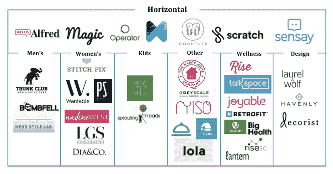
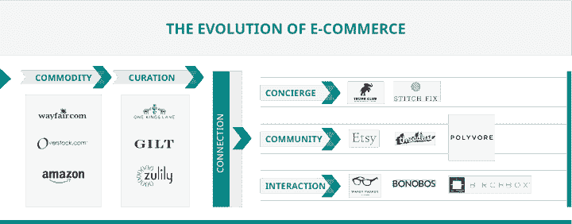

# 中间人反击 

> 原文：<https://web.archive.org/web/https://techcrunch.com/2015/12/30/the-middleman-strikes-back/>

More posts by this contributor

互联网最大的承诺之一——一个民主、透明、开放的网络，将使根深蒂固的行业去中介化，消除收取费用的中间商，从而降低商品成本——似乎已经实现了。

Priceline 和 Expedia 大多干掉了旅行社；Prosper 和 Avant 正在迅速瓦解银行信贷员；汽车销售员已经被易贝、Autotrader 和 Craigslist 所取代。

然而，正如我们认为他们已经一去不复返了一样，中间商又重新焕发了生机——被重新命名为我们最好的朋友:私人门房。

举个例子，个人购物者曾经是一种奢侈品——精英阶层和声望的象征。不再是:成千上万的消费者现在通过 Trunk Club 和 Stitch Fix 等下一代时尚平台与个人造型师(或数据驱动的人类/人工智能混血儿)交流，这两个平台具有示范价值(Trunk Club 在一年多前以 4.5 亿美元的价格被收购，很少有专家会拒绝 Stitch Fix 最近 3 亿美元的估值)。

虽然时尚是一个明显的用例，但礼宾经济正在蓬勃发展，涵盖了从健康到设计的各个垂直领域，大量基础广泛的横向礼宾服务也试图让他们的价值留下深刻印象。

## 你呢，亚马逊？

合乎逻辑的问题是:为什么？鉴于一个无摩擦、民主的竞争环境的所有优势，为什么礼宾服务突然变得流行起来？我看到三种可能的解释:亚马逊、太多 SKU 和客户获取。

**亚马逊。**如果你在网上销售几乎任何实物商品，亚马逊这个互联网上最强大的零售商将是一个永久的威胁。凭借他们的分销、杠杆和物流专业知识，他们有必要的资金来降低价格，并且比几乎任何初创公司都更快地处理和交付产品——更不用说，如果必要的话，他们可以亏本经营。

那么亚马逊暴露在哪里呢？在服务层面上。

亚马逊的运营利润率已经很低，只有 1.3%——不允许有太多的空间来培训和调动一支庞大的人力门房队伍。这意味着，建立一个以人为本、关系驱动的个性化平台实际上提供了一个与亚马逊的切实区别——这是有效与巨头竞争的少数方法之一(也许更重要的是，这是在传统上依赖“品牌”作为其唯一事实上的*护城河的商业领域建立防御的少数方法之一)。*

还有一点:亚马逊主要是定向搜索的目的地——无论是特定产品还是特定类别。但随着购买越来越多地转向移动设备，搜索、发现和分类单个商品变得越来越困难。门房——尤其是当通过移动交互点利用时——减少了摩擦并促成了新的购买行为。

**SKU 太多。我们生活在一个被淹没的世界里。多任务带来的压力正在影响我们学习和思考的方式，信息的选择性和可用性也在影响我们的处理方式，“分散注意力”并尽可能推迟决策。**

信息过载的问题最初是通过治疗解决的，这是减少认知噪音的中间点:

但基于礼宾服务平台的快速增长，似乎策展对新出现的千禧一代买家来说还不够——他们需要比以前更多的帮助和个性化。

运营商和投资者应该问的问题不是消费者是否正在与数字助理建立联系，而是，在什么情况下我们会真正收购太多数字助理？这里存在着重复认知压倒性循环的威胁，并迫使运营商/客户关系的下一次迭代。

**客户获取。**礼宾复兴的一个奇特之处在于，它可能为下一代客户获取打开了大门。

中间商——当通过绩效工资模式受到激励时——实际上成为公司事实上的*客户获取代理，充当对外销售人员。Trunk Club 是这种模式的创新者之一，我们的投资组合公司 LGS 利用这种模式取得了巨大成功。*

> 礼宾模式是作为专家/业余爱好者关系制定的。

它复制了多层次营销(MLM)模式的大部分力量/激励，没有金字塔式的前期资本承诺和义务。MLM 是一个强大的模式([康宝莱](https://web.archive.org/web/20230123205311/https://en.wikipedia.org/wiki/Herbalife)就是一个例子)，但社交销售可能会产生滥用攻击性、糟糕的客户关系和低回头率。礼宾模式被表述为专家/业余爱好者关系。

门房变成销售人员的模式并不适合所有垂直行业，它也不能被混合人工智能助理很好地利用。但是它确实解决了一些传统数字渠道(脸书、谷歌)开始表现不佳时大多数消费者企业经历的可扩展性问题。

## 社区的死亡

直到最近，还有一个强有力的假设，即一个繁荣、活跃的社区将释放出前所未有的能力来促进本地交易。Andreessen Horowitz 普通合伙人 Chris Dixon 在宣布投资 Soylent 时指出:

“他(约翰·博思威克)表示，他对那些似乎专注于销售 X，但实际上是恰好通过销售 X 赚钱的在线社区的公司感兴趣。这有助于解释为什么许多投资者对这些公司的持续成功感到困惑。他举的一个例子是 GoPro。许多投资者决定不投资 GoPro，因为他们认为它是一家相机公司，相机公司通常会很快商品化。”

然而，正确理解 GoPro 的投资者认为它主要是一个高度参与的体育爱好者社区，这是竞争对手很难复制的。

然而，至少从宏观角度来看，这一假定值非常值得怀疑。

上个月，有报道称 Pinterest 上的本土购买广告在假日季[没有达到预期](https://web.archive.org/web/20230123205311/http://recode.net/2015/11/30/holiday-shopping-is-chilly-for-buy-buttons-at-twitter-facebook-and-pinterest/):

“该公司(Pinterest)于 6 月下旬开始在 iPhone 应用程序中添加可购买的 p in 码，并于 11 月初在 Android 应用程序中添加了这一功能。该公司表示，超过 1 万名商家加入了该计划，包括大型零售商和品牌，如梅西百货(Macy's)、诺德斯特龙(Nordstrom)、内曼马库斯(Neiman Marcus)、科尔汉(Cole Haan)和托里伯奇(Tory Burch ),但据一名直接了解销售数据的人士称，这些大型合作伙伴中至少有一个在 Pinterest 上每天的购买次数不到 10 次。这位消息人士和另一位消息人士还表示，Pinterest 内部人士私下承认对早期的销售数据感到失望。

根据同一份报告，Twitter 和脸书的结果同样令人失望。曾经的初创公司 darling，社区杠杆购物门户 Polyvore 在 2015 年被雅虎以 2 亿美元收购——当然是一个健康的价格，但肯定低于曾经的希望。

即使是被 Dixon 视为社区异类的 GoPro，在过去的 12 个月里也在公开市场上损失了近 75%的企业价值。没错，它的交易价格高于大宗商品制造商，但它的社区购买似乎没有想象的那么强劲。

> 具有更多垂直特性的交易社区优于基本电子商务。

然而，具有更多垂直特性的交易社区(如 Soylent)比基本的电子商务表现更好。很明显，这是 Pinterest 和 Twitter 努力通过他们的平台直接销售产品的最初阶段。不要惊讶看到更大的横向社区玩家继续挣扎，并最终收购礼宾领域的公司，以提高他们的转化率、订单规模和频率。

## 经济学

人工驱动的助理/礼宾服务的好处是，在大多数情况下，它们为最终用户体验增加了价值。不利的一面是，它们增加了公司损益的材料成本。

以任何一个列出的健康应用程序(Rise、Talkspace、Big Health 等)为例。)，如果在纯软件基础上运营，毛利率将达到 80-90%。但是以人为中心的组件会以两种方式影响这一点:

*   该公司雇佣了(W2s)任何数量的健康专业人士，这些人预计将与给定配额的客户打交道。虽然这种模式使 wellness 应用程序能够维持他们的毛利润，但由于额外的人工费用，它大大降低了他们的边际贡献。
*   另一种选择是将健康专家视为更像市场供应商，并在 1:1 的基础上将他们与客户联系起来，同时向他们支付每笔交易的一定比例(比如 70%)。虽然这确实有从 G&A 产品线中去除健康专业成本的效果，但它也改变了业务的性质——从 90%利润的软件业务到 30%利润率的市场模式。

考虑到这两个选项，很明显为什么[混合人工智能/机器学习模型](https://web.archive.org/web/20230123205311/https://www.oreilly.com/ideas/the-current-state-of-machine-intelligence-2-0)是几个垂直行业的圣杯——复制个性化服务的水平，同时最大限度地降低间接劳动力成本，并保持非凡的软件级毛利率。

尽管如此，目前仍不清楚混合人工智能助手是否能提供足够强大的最终用户体验，以实质性地影响购买、转换和频率。

就目前而言，在完全由人力驱动的服务中，获胜的商业模式将是那些可以雇用相对便宜、未经培训的人员，然后通过软件或杠杆工作流赋予他们权力，以提供有意义的改善的最终用户体验。

这具有产生更大的供应/专家端可伸缩性的额外好处，因为潜在门房的池要大得多(如果性能不需要深厚的专业知识),并且一致性水平，甚至跨专业知识水平，将更加稳定。

试图利用高水平服务打入市场的初创公司需要高度重视并专注于控制成本。特别是随着投资者市场继续从高烧钱模式过渡，对如何提供高质量体验、深化长期可扩展性和利用低成本劳动力的过度关注将产生许多令人信服的结果。

###### 披露:Chicago Ventures 是 LGS、Mac&Mia、Rise Science、Retrofit 和 Havenly 的投资者。