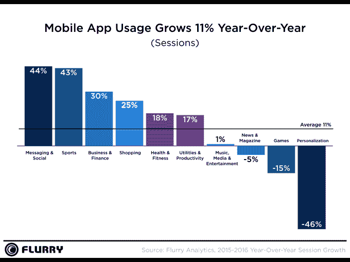
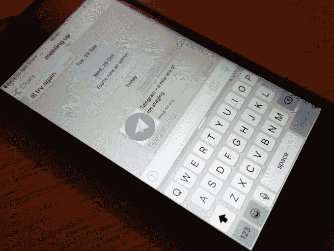
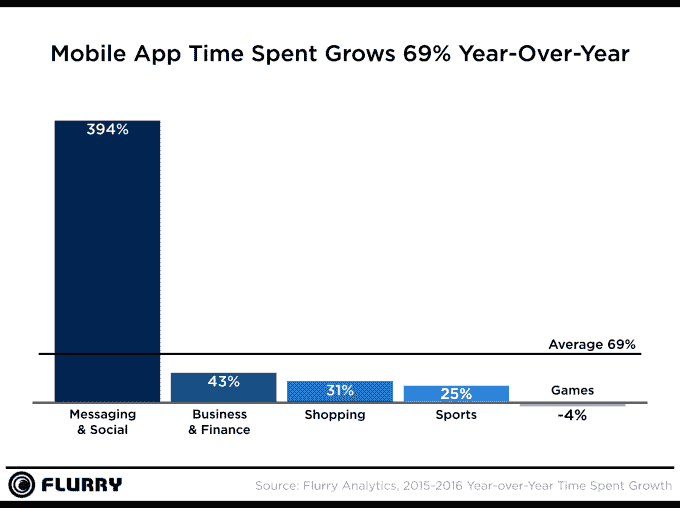
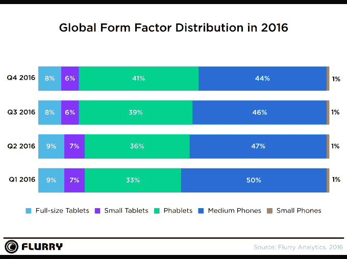

# 移动应用淘金热可能结束了

> 原文：<https://web.archive.org/web/https://techcrunch.com/2017/01/12/the-mobile-app-gold-rush-may-be-over/>

十年前，苹果[发布了](https://web.archive.org/web/20230323205754/http://www.internethistorypodcast.com/2017/01/the-history-of-the-iphone/)iPhone，很快就诞生了 App Store 以及随之而来的更广泛的应用生态系统。根据[今天早上来自 Flurry 的一份新报告](https://web.archive.org/web/20230323205754/http://flurrymobile.tumblr.com/post/155761509355/on-their-tenth-anniversary-mobile-apps-start)，这个行业现在已经成熟，已经达到临界质量。虽然仍有一些增长可以看到——例如，应用程序的使用比去年增加了 11%——但增长正在放缓。许多应用类别现在都在以牺牲其他类别为代价增长，而在以前，所有类别都是同步增长的。

这表明应用程序已经耗尽了有限的资源，即用户的时间。也就是说，将注意力吸引到一个新的应用程序将意味着不得不将用户从其他人身上转移开。这对新的应用业务来说可能是一个问题——特别是那些打算与现有企业竞争的企业，如 [2016 年最常用的应用:](https://web.archive.org/web/20230323205754/https://techcrunch.com/2016/12/28/facebook-google-dominate-the-list-of-2016s-top-apps/)脸书、Messenger、谷歌、Gmail、Instagram、亚马逊、Apple Music 等。

为了生成分析，Flurry 会查看其分析平台上的应用程序。Flurry 的足迹现在包括在 32 亿次会话中跟踪 21 亿台设备上超过 940，000 个应用程序的能力，提供了对当今应用程序生态系统状态的深刻见解。

该公司发现，应用程序的整体使用量仅温和增长——同比增长 11%，而 2015 年年度报告中为 58%。然而，花在应用上的时间正在飙升，比去年增长了 69%。

报告指出，一些应用比其他应用做得更好。

毫不奇怪，社交网络和消息应用在这一年表现出色，会话增长比 2015 年攀升了 44%，花在应用上的时间同比增长了 394%。

这些类别的增加是由多种因素造成的:智能设备的普及、更快的移动宽带、支持语音和视频通话的新功能、应用程序支持的通信和娱乐的结合、直播内容的增加、“I 一代”(智能手机出现时还是孩子，现在是拥有自己设备的青少年)的老龄化等等。

Flurry 没有提到但似乎值得注意的一个因素是用户对更私密的社交和分享的新渴望。这感觉像是对用户隐私整体下降的一种文化反应，或者至少是意识到网络到底有多不 T2。在过去的几年里，人们逐渐理解了公共社交网络上发生的事情有多少被观看、分析和用于生成大量个人数据，这些数据被交易并出售给营销人员和广告商。(更不用说整个政府监视他们公民的事情了。)

消息应用并不一定比更公开的社交网络更私密、更安全——这取决于它们对加密技术和安全实践的使用——但它们*有那种*感觉，这也是它们越来越被采用的因素。

但是他们的增长是以牺牲他人为代价的。

例如，个性化类别失去了最大的吸引力，使用率下降了 46%。Flurry 将这一下降归因于这些应用的用户价值不断减少。

游戏花费的时间也下降了 4%——这是一个很小的下降，但这说明了这些应用程序的短暂本质。不过，游戏收入还不错。由于像《精灵宝可梦 GO》这样的大受欢迎，[App Store 已经打破了这方面的记录](https://web.archive.org/web/20230323205754/http://www.apple.com/newsroom/2017/01/app-store-shatters-records-on-new-years-day.html)。(此外，请注意《超级马里奥 Run》在今年推出得太晚，无法影响 Flurry 在游戏类别中的数字。)

2016 年其他上升的应用类别包括商业和金融，在时间上增长了 43%；购物，增长了 32 %;和体育，增长了 25%。

特别是购物，受益于电子商务行业的成熟，电子商务行业在实现更轻松的移动结账流程方面取得了长足进步，并且受益于本地移动支付机制，如 Apple Pay，我们会说。

Flurry 还指出，亚马逊的实力不容忽视，因为它占了 T4 假日销售交易的 38%。

除了应用程序，该报告还深入研究了外形偏好，发现截至 2016 年第四季度，平板电脑占据了 41%的市场份额。Flurry 说，这与媒体消费和社交应用类别的增长相关。

总体而言，应用程序使用增长放缓表明应用程序淘金时代和市场成熟的结束。新的应用程序将更难找到安装基础，这意味着你将看到更多的创业公司采取类似于发送你的联系人列表的特技来破坏他们的增长，也许，这个领域会有更多的 M&A 活动，更多的风投支持的应用程序在资金耗尽时关闭。

随着移动应用生态系统的成熟，应用平台背后的大型科技公司——苹果、谷歌、微软等——将寻求下一个开发者平台。正在运行的是用于可穿戴设备、联网电视、媒体播放器和机器人的应用。但最有希望的下一个前沿领域似乎是语音计算——这意味着 2017 年可能会轮到亚马逊在“应用”生态系统中发挥作用，这要归功于它的 Alexa 助手和它的许多插件。