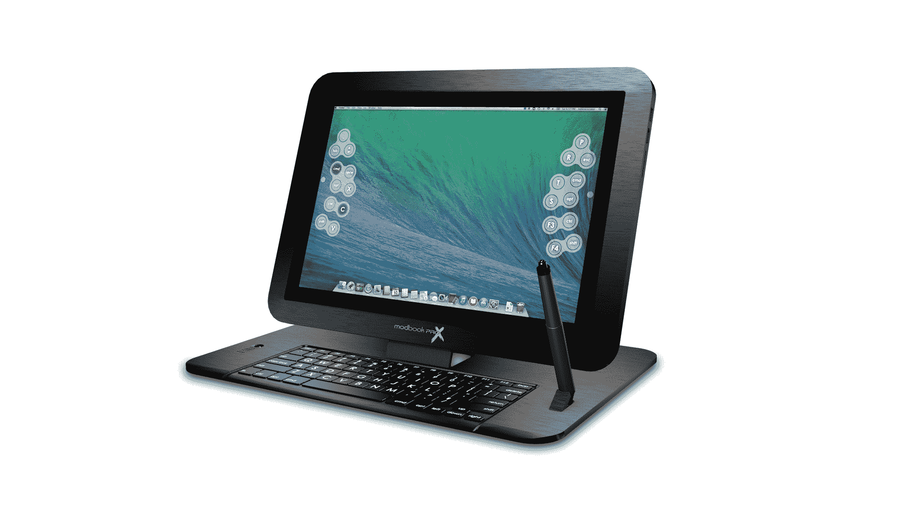

# Modbook Pro X 可将您的 Retina MacBook Pro 变成图形平板电脑 

> 原文：<https://web.archive.org/web/http://techcrunch.com/2014/07/30/the-modbook-pro-x-turns-your-retina-macbook-pro-into-a-graphics-tablet/>

# Modbook Pro X 可将您的 Retina MacBook Pro 变成图形平板电脑

多年来，Modbook 一直在用 Mac 笔记本电脑制造 T2 平板电脑，将苹果电脑与 T4 Wacom 数字化仪结合起来，让数字艺术家拥有一体化的图形制作能力，运行完整的 OS X 软件，并具有足够的压力敏感度。现在，该公司的最新成果包括 Retina MacBook Pro，现在[转向 Kickstarter](https://web.archive.org/web/20230130012600/https://www.kickstarter.com/projects/modbook/modbook-pro-x-154-retina-quad-core-mac-os-x-tablet) 来资助这项应该让艺术家流口水的努力。

Modbook Pro 拥有 Retina MacBook Pro 的 2，880 x 1，800 显示屏，可配置高达 32GB 的内存和 2TB 的存储空间，基本版搭载苹果新发布的 2.8GHz 四核处理器型号。它将运行 Yosemite(明年出货时应该可以使用)，修改后的电脑仍将有 NVIDIA 升级选项，两个 USB 3 端口，一个 SDXC 插槽，HDMI 和两个 Thunderbolt 2 端口。

变化包括新的选项后置键盘条，允许在绘图时快速输入自定义命令和快捷键，而不需要物理或虚拟键盘，以及新的键盘支架，包括一种支撑设备以 30 至 90 度角度绘图的方式，以及一种通过蓝牙配对的全尺寸环境背光键盘。

微软已经通过 [Surface](https://web.archive.org/web/20230130012600/http://www.crunchbase.com/product/microsoft-surface) 系列设备向数字图形专业人士做出了一些友好的姿态，这些设备包括压力感应手写笔输入和附带的笔。对于那些寻找 Mac 专用替代品的人来说，Modbook 选项是一个不错的选择，但 iPad 也可以充当 Modbook 曾经提供的一些功能的替身，尽管它在原生压力敏感度和软件兼容性方面存在局限性。Modbook 还内置了 Wacom 技术，具有 2048 级压力灵敏度，对于需要更多功率的人来说，它的规格可以比 Surface 高得多。但是要花 2000 美元来改装你自己现有的 MacBook Pro，就成本而言，这也是一个很高的要求。

这是 Modbook 第一次走 Kickstarter 的路线，所以看看它能在这个显然是专业的产品上产生多大的预先兴趣，以及平板电脑和计算机业务的变化是否会影响它吸引潜在客户的能力，这将是很有趣的。