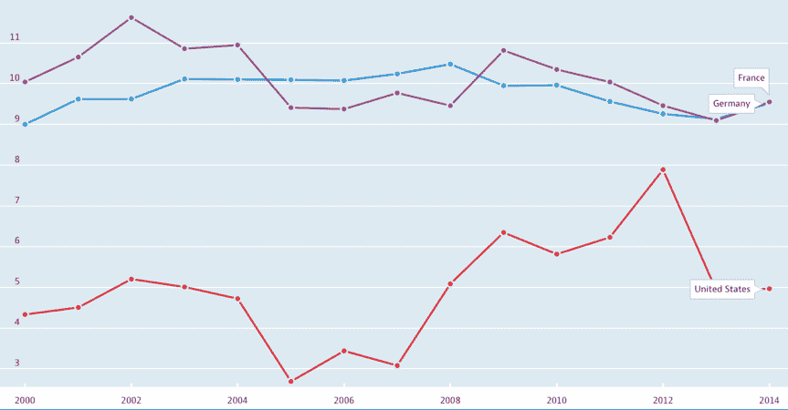

# P2P 贷款的多变本质 

> 原文：<https://web.archive.org/web/https://techcrunch.com/2016/05/22/the-moment-of-the-second-wave-of-online-lenders-is-gone/>

More posts by this contributor

电子借贷平台的迅速崛起吸引了投资者和企业家的极大兴趣。 [Lending Club](https://web.archive.org/web/20230129223150/https://www.crunchbase.com/organization/lending-club) 和 [OnDeck](https://web.archive.org/web/20230129223150/https://www.crunchbase.com/organization/on-deck) 已经成为上市公司，它们的竞争对手，如 [Funding Circle](https://web.archive.org/web/20230129223150/https://www.crunchbase.com/organization/funding-circle) 、 [SoFi](https://web.archive.org/web/20230129223150/https://www.crunchbase.com/organization/social-finance) 、 [Prosper](https://web.archive.org/web/20230129223150/https://www.crunchbase.com/organization/prosper) 、 [RateSetter](https://web.archive.org/web/20230129223150/https://www.crunchbase.com/organization/ratesetter) 、 [Zopa](https://web.archive.org/web/20230129223150/https://www.crunchbase.com/organization/zopa) 、 [Avant](https://web.archive.org/web/20230129223150/https://www.crunchbase.com/organization/avant-credit) 、 [Kabbage](https://web.archive.org/web/20230129223150/https://www.crunchbase.com/organization/kabbage) 等继续发展和增加贷款组合。

其他国家的许多人喜欢从美国和英国复制成功的解决方案，或者选择一个现有的商业模式，产生一个类似的，但“略有不同”或“更好”的模式，并根据这种模式建立一个公司。许多人想知道这些玩家成功的可能性有多大，是否值得对他们投资。让我们通过探索在线平台创建的具体方面来详细考虑这个问题。

## **去哪里找债主**

即使该平台拿出自己的钱，充当资产负债表贷款人，为了成功增长，它将需要吸引外部债务融资作为营运资本。但是这样做变得越来越困难。

一年前，市场上有许多基金准备向几乎所有拥有良好团队和合理想法的平台提供股权和借贷资金，而现在市场已经完全改变了。甚至像 [Prosper](https://web.archive.org/web/20230129223150/https://www.crunchbase.com/organization/prosper) 、 [Marlette Funding](https://web.archive.org/web/20230129223150/https://www.marlettefunding.com/) 和 [Avant](https://web.archive.org/web/20230129223150/https://www.crunchbase.com/organization/avant-credit) 这样的大玩家也在吸引债权人方面遇到了问题，而[正在削减营销成本](https://web.archive.org/web/20230129223150/http://www.wsj.com/articles/fintech-lenders-dial-back-marketing-in-response-to-softer-investor-demand-1460297540?ct=t(Weekly_Industry_Update_April_10_20164_10_2016))，因为他们无法为所有收到的贷款申请提供资金。

这是因为围绕在线贷款的兴奋感下降，投资者对收益率的兴趣增加。因此，在上一次贷款证券化期间，Prosper 的投资者要求更高的收益率(比一年前高出 5 个百分点)。为了展示整体情况，应该指出，这种收益增长只出现在证券化的初级部分，而高级部分的增长率要低得多。

然而，这清楚地表明了投资者对该行业兴趣的转变，以及替代贷款与其他类别高收益资产竞争的必要性。例如，3 月份，我们观察到美国对[“垃圾”债券](https://web.archive.org/web/20230129223150/http://www.zerohedge.com/news/2016-03-18/retail-inflows-junk-bonds-highest-record-past-month)的创纪录需求:仅在 2 月下半月和 3 月上半月就超过 115 亿美元。

不幸的是，由于另类贷款行业的新颖性，并不是所有的参与者都明白“垃圾”债券和 Prosper 发行的贷款之间的区别，后者的 FICO 平均得分超过 700 分。后者是发放给优质借款人的贷款，这意味着与垃圾债券相比，风险更低。

例如，一家主要的金融机构[观察到投资者对该公司发放的贷款兴趣增加](https://web.archive.org/web/20230129223150/https://www.nerdwallet.com/blog/loans/onemain-financial-review-personal-loans-for-poor-credit/)，尽管这些贷款发放给了美国最贫困的人群。这再次表明，投资者在追逐收益率，而不是深入分析信贷质量。

> 在淘金热期间，向手工采矿者出售牛仔裤可能比开采黄金更有利可图。

金融市场总是经历周期。在每个信贷周期的末期，许多资产经理为了追求更高的收益率，越来越多地向风险轴的右侧转移，这正是我们现在看到的情况。那些这样做的人现在可能看起来像天才，为他们的投资组合提供了丰厚的回报，但几年后他们可能会遭受重大损失，而发放给优质借款人的贷款甚至在危机时期也可能保持盈利。

因此，在吸引贷款人方面，新的参与者不仅要与已经赢得声誉的现有大型平台竞争，还要与其他高风险、高收益的资产竞争。这场争夺贷款人资本的竞争一如既往地激烈。

## 我们不害怕竞争

另一件不能让投资新网贷平台的人感到乐观的事情是该行业的竞争。除了一些非常强大和资本雄厚的玩家，现在市场上还有大量几年前建立的新平台。这些平台都将试图吸引风险资本和贷款人/借款人。这对那些刚刚开始创业的人造成了额外的压力。

## 如何吸引借款人

尽管难以吸引债权人，但这些公司仍在争夺借款人。像 [Credit Karma](https://web.archive.org/web/20230129223150/https://www.crunchbase.com/organization/credit-karma) 这样的企业通过向借贷平台出售贷款申请获得巨额利润。最终，平台中的赢家是那些拥有最佳评分模型和更大营销预算的平台。

我强烈怀疑第二波公司将能够产生明显更好的评分模型，因为市场领导者已经在他们的模型上工作了近 10 年。用蛮力，即营销预算来战胜领导者也将是困难的:Lending Club 的账户上有超过 6 亿美元，Prosper 有超过 1 亿美元，SoFi 在不到一年前吸引了 10 亿美元的风险资本投资。

我经常与大量新的在线贷款平台交流，我越来越经常地听到这样一种观点，即大公司正在错过一些利基市场，而专注于这些利基市场可以使一个人建立稳定和盈利的业务。

但我们不应自欺欺人，因为这种方法存在一个严重的问题:最有希望的利基市场(利润率高、来自银行/政府的竞争低、信用风险低)已经被现有的参与者瓜分；这些是消费和抵押贷款，小企业贷款，学生贷款，保理业务。

当然，您可以尝试获取一个新的、狭窄的利基市场，但您是否能够对其进行定义并对其进行“隔离”以创造真正强大的竞争优势？即使它成功了，也很难大到足以建立一家数十亿美元的公司。

然而，创建一个中等规模的家族企业可能就足够了，这是一个好主意，但风险投资并非如此。弗兰克·罗特曼的一篇精彩文章阐述了上述观点。

## 我们会去其他市场

但是，如果还没有竞争对手呢？除了美国和英国市场，还有其他市场:在其他地区，替代融资还没有那么发达。在另一个国家转移商业模式的想法本身是好的，但是也有一些陷阱。不同国家的贷款行业有很大不同，尤其是如果我们拿美国和欧洲大陆做比较的话。

> 在另类贷款行业，仍然有很多赚钱的机会。

在很大程度上，美国人靠信用生活。根据 Bankrate.com[的一项调查](https://web.archive.org/web/20230129223150/http://www.bankrate.com/finance/consumer-index/money-pulse-1215.aspx)，超过 60%的美国人将无法用自己的资金支付 1000 美元的意外费用。在如此有利的市场中非常成功地发展起来的贷款业务，在移居到一个文化不同、对储蓄和贷款有不同态度的国家时，可能会面临许多无法预见的困难。这正是我们所看到的，例如，在德国，如下图所示。这清楚地表明了为什么替代贷款在欧洲发展得要慢得多。

2000-2014 年家庭储蓄率(占可支配收入的百分比[ML1])。资料来源:经合组织

同样重要的是要考虑行业监管的差异。欧洲对利率的监管比美国严格得多。美国一些成功的商业模式在欧洲可能是不可持续的。替代贷款行业正以如此高的速度发展，不仅因为它的每笔贷款成本较低，因为流程从线下转移到了线上，还因为它受益于错综复杂的监管。

通过结合高信贷质量(因为监管体系的不完善，某些借款人没有资格获得廉价贷款)和相对较高的利率，另类贷款对投资者来说是一个非常有趣的资产类别。当利率不再足够高时，或者当经济中的大多数人可以很容易地获得银行贷款时(例如在德国)，替代贷款停止快速增长。

## 这一刻已经过去了

每隔一周，我都会收到至少一份来自欧洲或美国新成立的贷款平台的投资请求。新兴的在线贷款平台数量如此之多，以至于他们不得不打电话给风险投资基金，试图获得一些资金。对于投资者来说，这是一个迹象，表明你不应该投资于该行业的新参与者，因为所有的新参与者都将面临上述问题，贷款是一项需要大量资本的业务。

然而，在另类借贷行业仍然有大量的盈利机会；以下只是其中的一部分:

*   新玩家会发现很难成功。这对新玩家来说是坏消息，但对市场领导者来说是好消息。像 [Lending Club](https://web.archive.org/web/20230129223150/https://www.crunchbase.com/organization/lending-club) 、 [Prosper](https://web.archive.org/web/20230129223150/https://www.crunchbase.com/organization/prosper) 和 [Funding Circle](https://web.archive.org/web/20230129223150/https://www.crunchbase.com/organization/funding-circle) 这样的公司会提供越来越多的贷款。通过使用他们的品牌、声誉、质量评分和强大的投资者基础，他们将能够解决行业面临的问题并度过难关，变得更加强大。合并是很有可能的，顶级公司会接管较小的公司，这些公司的价值会以对收购公司有利的方式进行评估。
*   对贷款人的竞争不可避免地导致利率上升。对于投资贷款的人来说，这是个好消息。最大的平台是安全和有利可图的，它们的利率已经提高，这是一个将资金投入贷款的恰当时机。以美元计算，预期回报率在每年 7.5%至 12%之间，而且，正如历史和压力测试所显示的那样，即使在经济衰退的情况下，这些投资也不太可能无利可图。据我所知，没有任何其他类别的资产可以在如此低的风险水平下给你带来类似的收益。
*   对于那些仍想投资处于早期阶段的另类贷款市场参与者，我建议他们仔细看看服务于另类贷款行业的公司；在淘金热期间，向手工采矿者出售牛仔裤可能比开采黄金更有利可图。这样的公司有很多，比如:[果园](https://web.archive.org/web/20230129223150/http://www.orchardplatform.com/)、 [DV01](https://web.archive.org/web/20230129223150/https://www.dv01.co/) 、[蒙雅](https://web.archive.org/web/20230129223150/https://www.monjaco.com/)、 [PeerIQ](https://web.archive.org/web/20230129223150/http://www.peeriq.com/) 和[黑月](https://web.archive.org/web/20230129223150/https://blackmoonfg.com/)；它们都代表不同的解决方案，每一个都以自己的方式有趣。