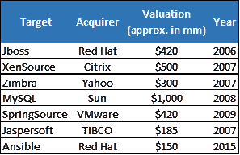
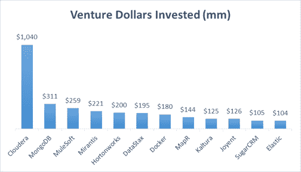

# 开源软件的利润

> 原文：<https://web.archive.org/web/https://techcrunch.com/2016/02/09/the-money-in-open-source-software/>

麦克斯·希雷森撰稿人

[Max Schireson](https://web.archive.org/web/20230307043904/https://www.linkedin.com/in/maxschireson/)

是 Battery Ventures 投资公司的运营合伙人。他之前是数据库公司 MongoDB 的首席执行官。

More posts by this contributor

Dharmesh Thakker撰稿人

Dharmesh Thakker 是

[Battery Ventures](https://web.archive.org/web/20230307043904/http://www.battery.com/)

也是英特尔投资公司的前董事总经理。

More posts by this contributor

众所周知，开源技术——曾经是激进分子、嬉皮士和吃格兰诺拉麦片的人的天下——已经成为主流。据行业估计，从 2011 年到 2014 年，超过 180 家赠送软件的年轻公司筹集了大约 32 亿美元的资金。

今天，即使是主要的企业 IT 供应商也依赖开源来实现关键的业务功能。与前微软 CEO 史蒂夫·鲍尔默(Steve Ballmer)将开源 Linux 操作系统称为“癌症”(显然是对 Windows 的威胁)的时代相比，这是一个巨大的转变。

尽管开源软件越来越受欢迎，但是许多开源公司的财务状况并不健康。正如在 20 世纪 90 年代末的第一个网络时代，眼球并没有转化为实际的在线购买，数百万的免费软件下载并不总是带来可持续的收入流。

毫无疑问，开源软件是推动用户采用的优秀交付模型，它将在未来几年推动市场价值的增长。但它本身并不是一种商业模式。

来源:公开数据

建立一个大的、盈利的开源企业到底有多困难？想想看:除了 Red Hat 正在取得的成功(该公司现在拥有 140 亿美元的估值，建立了 20 多年)和 MySQL 在 2008 年被 Sun 以 10 亿美元收购之外，开源历史上几乎没有其他里程碑式的退出。

但是，对企业家和投资者来说，成功是可能的。基于我们与开源公司合作的经验，包括 Mirantis*、Cloudera*、MongoDB*和其他公司，我们总结了一些重要的经验，供企业家在构建开源社区和可持续业务时参考；这两者不一定是相互排斥的。

## 从第一天开始考虑商业模式

这似乎是显而易见的，但是你会惊讶于开源企业家经常在他们的自由软件下载量破了记录之后才想到他们的商业模式。相比之下，我们的经验表明，一些最好的开源公司在早期就清楚地知道如何赚钱。

公司通常通过销售具有额外安全和管理特性的开源项目的企业版来实现这一点。这些产品旨在吸引 IT 支出大的大型企业。另一种选择是提供高级 SaaS 服务，本质上是一种现收现付的模式。虽然交付可靠的服务可能很困难——也就是说，将许多开源组件打包成一个引人注目的基于云的产品——但 SaaS 可能是另一条创收途径。

Red Hat 是一家从一开始就考虑货币化的公司的好例子。早期，当该公司从运送教科书中的 Linux 光盘转向向大企业销售时，高管们在该公司的免费 Fedora 用户社区和更复杂的红帽企业 Linux (RHEL)产品之间划出了清晰的界限。他们认识到他们的目标购买者——首席信息官和运营主管——重视稳定性甚于特性，这些主管想要一个企业级的付费产品来支持他们的核心 Linux 应用程序。

> 一些最好的开源公司从早期就清楚地知道如何赚钱。

因此，虽然 Red Hat 围绕 Fedora 维护着一个充满活力的开源社区，每六个月更新一次新功能和新版本，但该公司向使用付费企业产品的人推销标准英特尔硬件上的企业级安全性和优化。这使得 Red Hat 从企业客户那里获得了超过 10 亿美元的经常性收入；更广泛地说，它还帮助 Linux 成为最广泛采用的服务器操作系统。

另一家具有前瞻性思维的开源公司 Cloudera 来自大数据领域，有几家公司正在试图将名为 Hadoop 的开源项目商业化。像红帽一样，Cloudera 为其名为企业数据中心(Enterprise Data Hub)的高端产品保留了一些重要的企业功能——安全性、性能和业务分析。与此同时，大数据竞争对手 Hortonworks 正试图从付费产品支持中赚钱，这可能是一个更困难的模式。

Apache software foundation 的开源服务器软件在 20 世纪 90 年代闯入了技术领域，导致许多供应商尝试类似的策略——本质上，向客户出售支持，作为他们部署的一种保险政策，一些用户认为这是有风险的，因为他们是基于开源技术的。然而，随着时间的推移，许多客户对产品感到满意，不需要支持，这表明这不是一个长期的盈利战略。

来源:公开数据

## 选择与您的盈利战略相一致的许可模式

开源许可证确切地决定了谁拥有你的开源产品的修改版本，并且对你的业务有很大的影响。一些许可证允许任何人创建基于原始产品的闭源衍生作品，而其他许可证只为原始产品的所有者保留这一权利。当你试图找出如何给你的产品添加人们会购买的功能时，这是一件大事。

请记住，即使是开源软件也总是有人拥有的，通常要么是盈利性公司，要么是非盈利性基金会(kumbaya 只到此为止)。许可证的范围从许可的(Apache)到限制的(通用公共许可证，或 GPL，变体，Affero GPL 是最严格的)，以及介于两者之间的任何东西。

确切地说，有 71 种不同的口味，都列在 opensource.org 的清单上。更多的许可使得建立大型生态系统变得更加容易。如果任何开源项目都可以包含你的项目，你可以通过被包含在其他成功的项目中，或者与其他成功的项目相联系，来获得一股顺风。更宽松的许可也可能使其更容易吸引对产品的贡献，并且他们使用户更放心该项目不太依赖于小的创业公司。

> 请记住，即使是开源软件也总是有人拥有的。

与此同时，允许任何人向你的产品添加企业功能，会加大创造持续差异化、增加收入和避免分散化的难度。一个恰当的例子是由 OpenStack 基金会管理的流行的云基础设施 OpenStack 项目。英特尔、红帽、惠普、戴尔、Juniper 等科技巨头的早期支持对于 PayPal、沃尔玛和赛门铁克等大用户的早期支持至关重要，这些大用户知道他们的核心基础设施基础得到了更广泛的社区和大型硬件公司的支持。

然而，OpenStack 最近因向多个方向发展而受到批评，这是由各种硬件参与者驱动的，这些参与者都有相互竞争的业务和战略议程，现在，产品可能无法相互很好地工作。这导致了两个供应商的出现，Red Hat 和 Mirantis*，他们承诺成为生态系统的“瑞士”，与所有人合作。鉴于这种许可带来的问题，这似乎是一个令人信服的商业案例。

相比之下，MongoDB 一直遵循更严格的 AGPL 许可模式。尽管使用严格的许可证，MongoDB 的软件已经变得非常受欢迎。这主要是因为该公司提供了一个引人注目的产品:一个简单、灵活的文档数据库，许多开发人员发现它比旧的关系数据库更容易使用。该产品战胜了限制性许可。

两年内，MongoDB 积累了数百万次下载；今天有 1000 万。对于那些相信自己的产品能够被广泛采用而不必依赖其他开源项目的成功的开源企业家来说，从长远来看，更严格的许可可能更好。但是如果你走那条路，准备好在早期大量投资建立社区。

## 辅助服务和“牵手”可能是必要的，但不要为了收入而依赖它们

开源软件已经破坏了企业基础设施中一些最重要的技术:想想 MongoDB 和 Cassandra 对传统 Oracle 数据库的挑战，OpenStack 和 Docker 威胁虚拟化巨头 VMware 和 Linux 取代 Solaris 和 Windows 服务器软件。帮助这些开源失败者成长的是真实世界的成功——而不是像一些企业家认为的那样，昂贵的咨询服务来增加部署。

当然，在采用开源软件的早期，一些专业服务和“手把手”可能是让开源系统起步所必需的，尤其是当客户处理集成遗留软件时。事实上，一些最早的 Hadoop、OpenStack 和 Cloud Foundry 部署需要咨询服务来帮助关键客户取得成功。

> 专注于从订阅中获得经常性收入。

但是不要试图把你的生意建立在服务收入上。与其他收入流相比，它的毛利率较低，可能为 20-30%，而产品相关收入的毛利率为 90%，而且通常不可重复。最终，如果你成功了，你将拥有数百万用户，但你可能只能从其中的几百人那里获得服务收入。

此外，如果你过于积极地追求服务收入，你最终可能会与服务合作伙伴(如埃森哲、IBM)竞争，而这些服务合作伙伴可能会帮助你带来新用户。我们的建议是:专注于从订阅中获得经常性收入，这应该是你高利润的核心产品。构建您的服务组织，以支持客户和合作伙伴的成功，而不是推动收入。更重要的是，我们甚至会通过让您的产品更易于使用和让您的合作伙伴更有能力来支持积极蚕食您的服务业务，以便他们可以从长远角度接管运营。

## 持续的客户满意度胜过前期销售

开源软件的销售周期与传统的企业软件非常不同。对于常规的企业软件，通常很难说服客户使用这项技术；最重要的是，他们必须为此付出代价。在开源软件中，决策过程通常分为两部分，分两步进行。说服人们使用你的软件通常要容易得多，因为产品最初可能是免费的。但是之后你会面临一个单独的任务，说服他们付钱。

对于那些习惯于传统企业软件销售和营销的人来说，这种转变可能会让人迷失方向。销售代表可以花很多时间试图说服某人使用你的软件——并且成功了——但是他们的努力却没有带来任何收入。在你公司的早期，这可能没问题，因为你也在努力建立你的用户群，这可能会在以后转化为收入。

> 显然，从自由软件中赚钱是可能的。

但即使在你成长并开始提升销售额后，你也需要变得非常自律，让你的销售团队专注于持续的客户满意度，因为满意的客户会购买更多，并购买平均售价更高的产品。这反过来有助于补贴你正在进行的研发。总的来说，这与大多数企业销售模式有很大不同，后者专注于销售并转向下一个潜在客户。

销售人员需要根据他们带来的订阅收入来衡量，而专注于社区的独立团队应该促进采用率的增长。这可能意味着雇佣不同类型的销售人员——例如，可能不是来自高压甲骨文模具的人，尽管这些人仍然可以通过正确类型的培训取得成功。

在 MongoDB，我们有一个非常成功的销售人员，他之前开始了一项运动制服业务和另一项清洁屋顶排水沟的业务。他可能没有很多软件经验，但他对客户满意度非常狂热。

## 克服开源收入难题

显然，从自由软件中赚钱是可能的，并且有不同的成功途径。但从一开始就专注于货币化和许可，并建立正确类型的服务模式和销售团队，是做好这件事的关键策略。我们现在有大量过去 20 年的企业案例研究，证明你确实可以建立一个有利可图的开源公司，并且非常受用户欢迎。

换句话说，你可以有你的格兰诺拉麦片，也可以吃掉它。

**表示 Thakker 先生在英特尔投资公司工作时的一项投资。*