# UX 设计中最容易被忽视的方面可能是最重要的

> 原文：<https://web.archive.org/web/https://techcrunch.com/2015/11/22/the-most-overlooked-aspect-of-ux-design-could-be-the-most-important/>

本杰明·布兰德尔撰稿人

More posts by this contributor

我不太擅长设计。事实上，我很不擅长。然而，我对它是如何完成的很感兴趣。我阅读并撰写了大量关于[客户成功的文章；一路上，(不知何故)我在](https://web.archive.org/web/20230316034141/https://www.process.st/2015/09/concierge-onboarding/)上找到了[塞缪尔·胡利克的](https://web.archive.org/web/20230316034141/http://twitter.com/SamuelHulick)站点[用户。](https://web.archive.org/web/20230316034141/https://www.useronboard.com/)

他对流行应用程序中用户入职流程的详细描述，让设计师们了解了世界上一些最成功的应用程序是如何让你不放弃、不沮丧或没有价值的。它以身作则。

在被介绍给塞缪尔的内容后，我看到了一条他链接到网站 [emptystat.es](https://web.archive.org/web/20230316034141/http://emptystat.es/) 的推文，这是一个自 2013 年以来一直在收集用户提交的空状态截图的集合。

写完关于用户入职的文章后，我的大脑还在嗡嗡作响，带着 [Evernote](https://web.archive.org/web/20230316034141/https://www.process.st/2015/10/writing-workflow/) ，我开始收集材料，写一篇关于被称为[设计中最被忽视的方面](https://web.archive.org/web/20230316034141/http://blog.invisionapp.com/why-empty-states-deserve-more-design-time/)的文章。

## 什么是空态？

当屏幕上没有数据显示时，用户会看到空状态。这可能是因为:

*   用户刚刚注册。
*   用户已经自己清除了数据。
*   有一个错误。

我们将快速浏览这三种不同类型的一些例子，然后深入了解空状态如何帮助提高用户留存率，并确保用户充分利用你的应用。

**Gmail 新的注册清空状态**

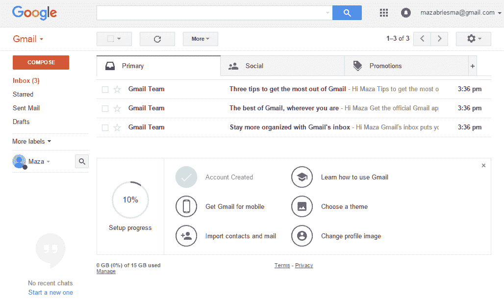

Gmail 吸引新用户的方式很棒，但是当你(最终)进入应用程序时会发生什么呢？嗯，它以你将来会看到的同样的格式给你进一步的信息:电子邮件。它还会发出如何从应用中获得更多价值的指示，所有这些都是为了提高用户成功率(以及随之而来的用户保留率)。

**流程街的零数据状态**

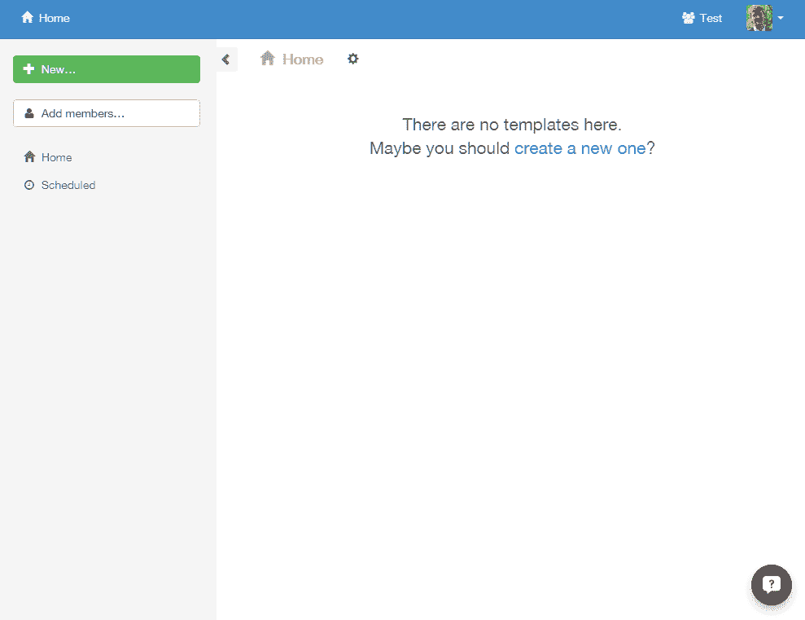

像许多依赖用户创建自己内容的应用程序一样， [Process Street 的](https://web.archive.org/web/20230316034141/http://process.st/)零数据状态告诉你如何填充应用程序。模板是流程街的核心，没有它们，就没有清单，也不需要文件夹、标签或…你懂的。

**Eventbrite 的错误页面**

**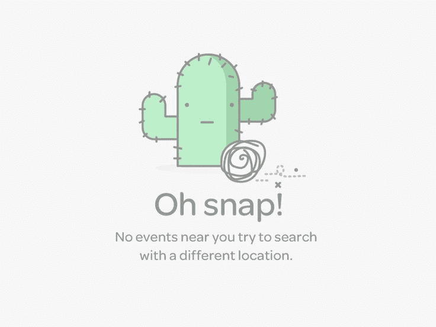**

尽管它的背景是沙漠荒地，但这个空的状态错误消息很吸引人，很有帮助，充满了生机。不像，[有些错误信息](https://web.archive.org/web/20230316034141/http://fortune.com/2015/07/30/windows-10-error-message-something-happened/)，它告诉你下一步该怎么做。你的应用程序中没有什么应该是一个[死胡同](https://web.archive.org/web/20230316034141/https://uxmag.com/articles/usability-tip-no-dead-ends-please)。

## 空状态的内容、原因和方式

一个有用的空状态会告诉你*它有什么用，*为什么*你会看到它，以及*你如何*把它填满。我们稍后会看到更多的元素，但是空状态应该首先是有用的，其次才是惊人的。*

在设计时，把这三个问题(什么、为什么和如何)看作是重新吸引用户的公式，但也要记住这是空状态的最低要求。

## 用空状态吸引用户的注意

这是一个大的。这是最有效的方式来继续你的入职过程的良好工作，并让你的有价值的用户留下来。正如我在开始时所说的，空状态可以而且应该用来(重新)吸引你的用户，帮助他们获得成功。

如何利用空状态来获得关注并推动参与度？好吧，当你在这里着陆的时候你首先会想到什么？

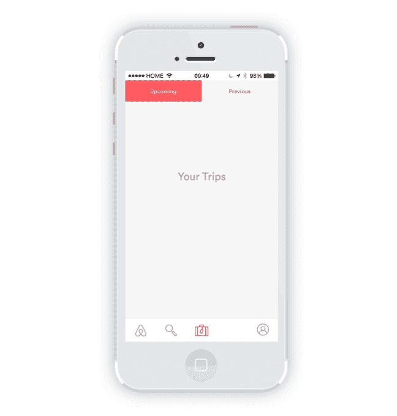

很空虚。没有旅行。这告诉我*这个屏幕是用来做什么的*，除此之外别无它用。

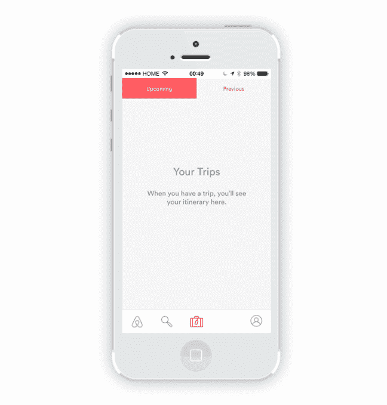

好吧，这就是为什么它是空的，但我在这里的事实可能表明我不知道*如何*增加一次旅行。

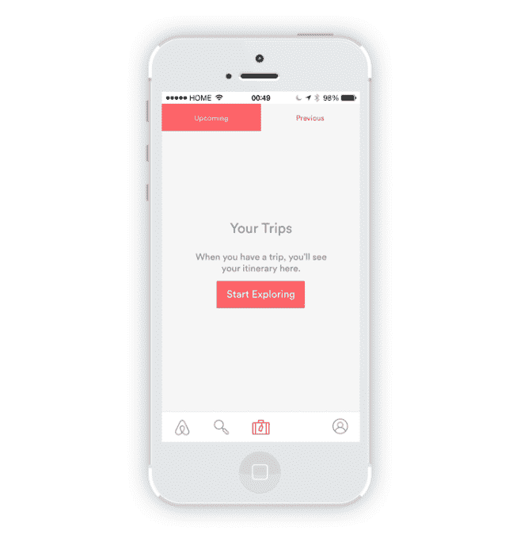

答对了。这个明显的按钮和合适的 CTA 副本告诉我*如何*解决我的问题。如果我只是看到我没有旅行，这感觉就像是应用程序在故意帮倒忙。

让我们用另一个应用程序再做一次。

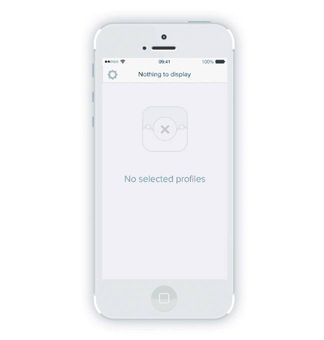

零数据零帮助。它告诉我*这个页面的用途是什么——显示选中的个人资料——除此之外别无它用。*

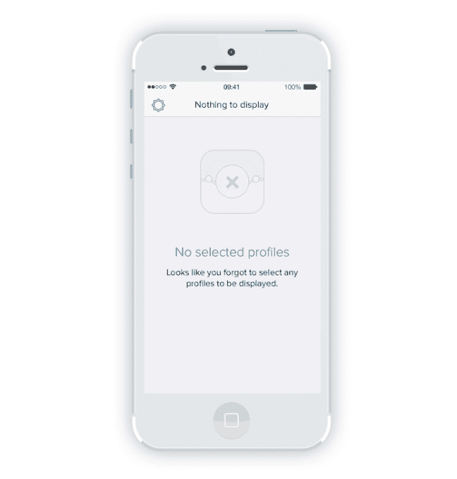

现在我知道*为什么*我在这里，但不知道如何解决我的问题。

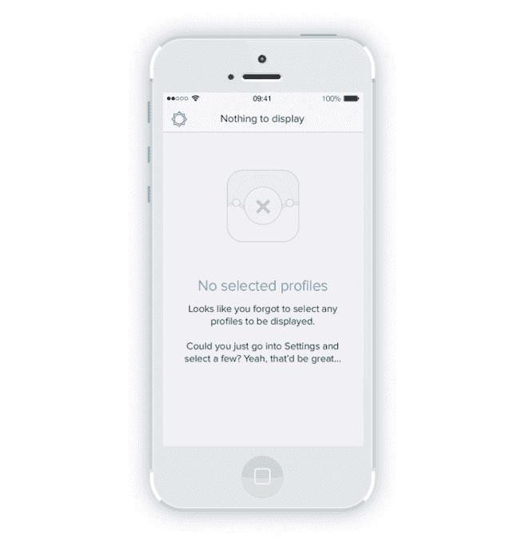

是只有我，还是这个应用程序有点粗鲁？反正乐于助人是我们喜欢的。现在我们知道*如何*解决我们的问题，用有价值的数据填充空白状态。这两个例子都遵循相同的*什么、为什么、如何*公式。

## 个性和利益是锦上添花

在空无一物的状态下，还有两件事可以做，那就是*个性*和*利益*。个性让你的应用令人难忘，使用起来令人愉快。好处有助于传达你的应用对用户有用的原因，这增加了用户的忠诚度，并解决了用户的入职问题。

**凯洛健身程序**

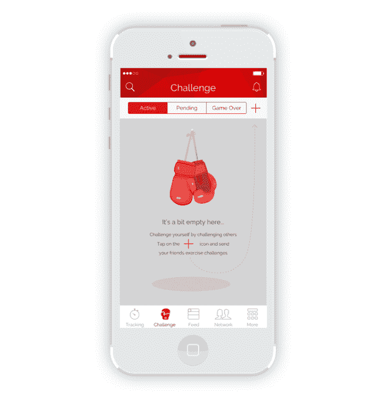

这会告诉你*这是什么*(一个空的挑战屏幕)*为什么*在那里(因为你没有挑战任何朋友)以及*如何*修复它(点击+图标)。但这还不是全部。这种空无一物的状态用美观的图形和对话语言传达了应用的个性*和*告诉你挑战他人的好处。

让我们看看另一个伟大的空状态，它勾选了所有的框。

**光束式**

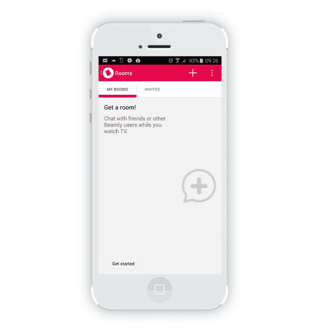

我从未使用过 Beamly，但这个空状态非常有用，我知道这个应用程序到底在做什么。除了三个基本要素*(什么、为什么、如何)*之外，它还加入了一句有趣的话，向需要方便提醒的新用户或老用户解释应用的核心价值。

## 将品牌个性转化为空洞的状态

空状态是一个很好的机会来与你的用户建立人际关系，并传达你的应用程序的个性。就像网页设计者喜欢用 404 页来激发创造力一样，空状态也不例外。情感设计大师 [Aaron Walter](https://web.archive.org/web/20230316034141/https://twitter.com/aarron?lang=en) 求助于人类需求的层次来解释是什么让应用程序的用户体验成功；虽然你的应用应该是功能性的、可靠的和可用的，但它也应该是令人愉快的。

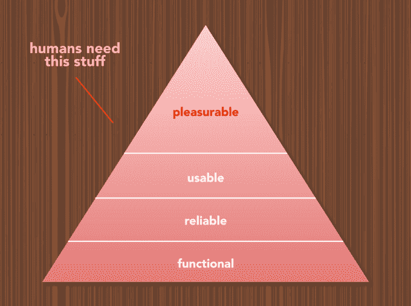

据《粉碎》杂志的西蒙·施密德所说，有很多方法可以让用户的体验变得愉快。我已经把他列出的清单缩小到了你可以用空虚的状态提供的最相关的快乐种类:

## 在空虚的状态下运用情感

回到收件箱的话题，我注意到不同空态的态度有些有趣；也就是说，一些收件箱祝贺你一路到达目的地，而其他应用程序鼓励你填满它。

你的空状态传达的是一种什么样的感觉，取决于你的 app 的用途。Hangouts 希望你添加内容，而 Outlook(带有聚焦收件箱，旨在帮助你阅读所有重要内容)希望你删除内容。

**Hangouts**

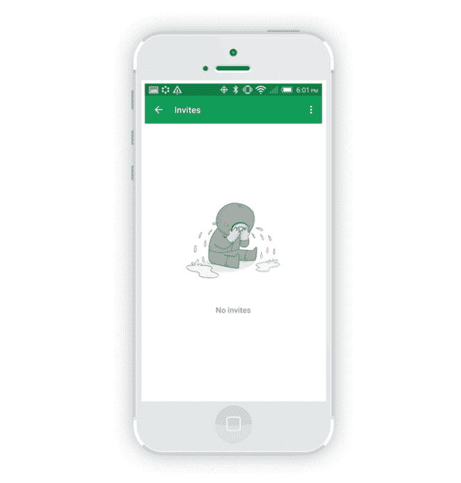

不管这东西是什么，它是悲伤的。对于用户来说，这是不是一个*激励*让他们得到去闲逛的邀请？设计以神秘的方式工作…

**展望**

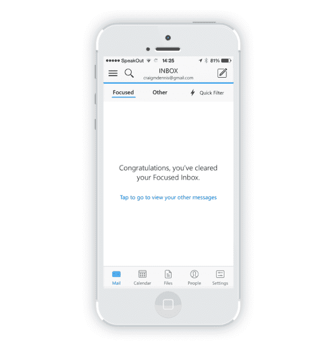

您已经通过该功能取得了成功。明确的*阳性*。

## 用空状态给用户惊喜

可以说，大多数错误消息对用户来说都是一个惊喜。为什么不利用这个惊喜来取悦他们，而不是向他们展示一些感觉他们没有从应用程序中获得成功的东西呢？毕竟，你不希望你的用户经常看到错误信息，所以当它发生的时候，采取一种有趣的态度可以帮助减轻心情。

**认知大脑训练**

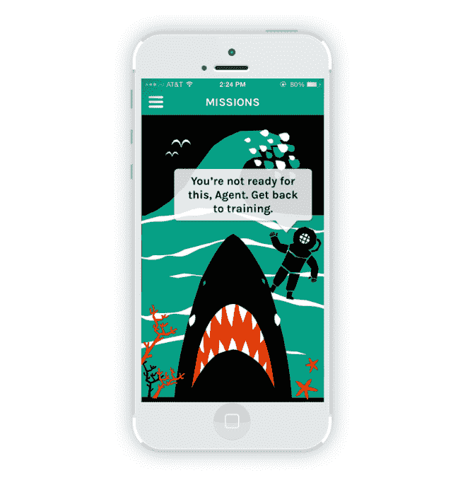

我总是很惊讶看到鲨鱼，不管上下文。

**Timehop**

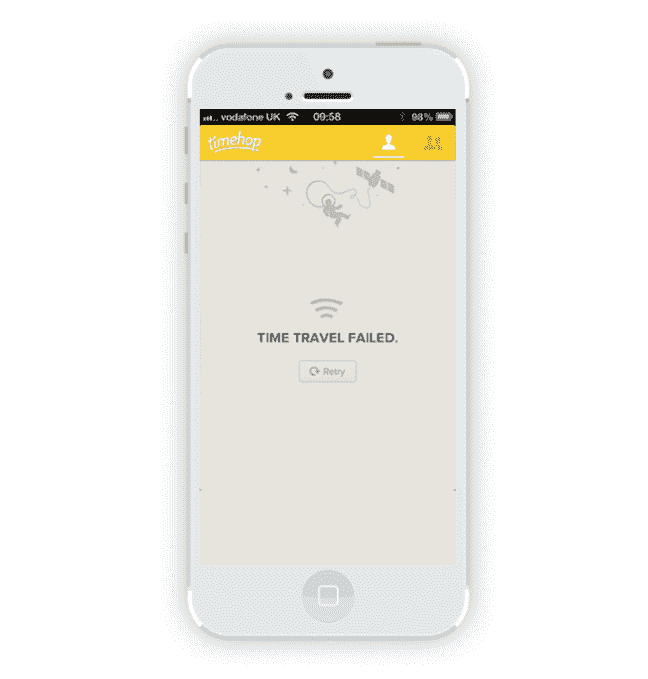

如果你要说我的网络连接断了，让我大吃一惊，至少用一种酷的方式，比如时间旅行之类的。

## 用空状态传递利益

最后，让我们离开设计领域，进入对我来说更舒适的领域:文案。

你第一次使用的空白状态的中心焦点应该是向你的用户(再)推销你的应用程序的好处。你的用户加入过程不会总是像你计划的那样顺利，在注册之后，你的应用可能会在主屏幕上作为一个被遗忘的图标停留几天、几周或几个月，然后才会被重新访问。在入职期间或之后停止使用你的应用程序的用户最有可能永远放弃它，所以要尽一切努力:

*   提醒用户你的应用程序是做什么的。
*   告诉他们为什么要为此烦恼。

换句话说，*的老套文案公理用利益销售，用特色支撑*。

注意:如果你想快速了解如何写干净的文案，可以看看我的另一篇关于[商业写作技巧](https://web.archive.org/web/20230316034141/https://www.process.st/2015/07/business-writing-tips/)的文章。

现在，让我们来看看一些很棒的例子。

**大本营项目的零数据状态**

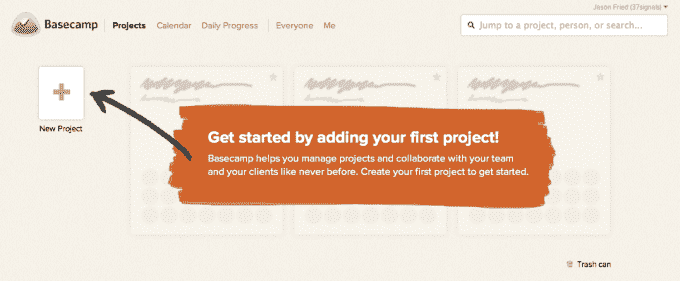

我喜欢应用程序告诉我做什么，如何做，以及为什么我应该关心。

**Dropbox 的团队零数据状态**

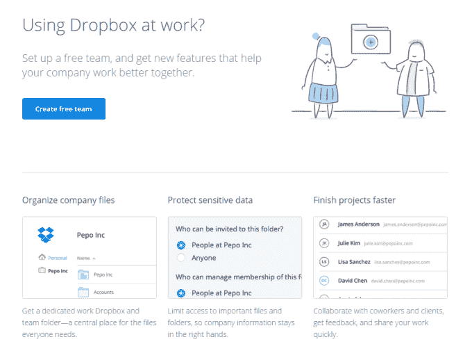

Dropbox 的文案太滑头了。我不需要这个功能，但我还是做了，只是为了给我的滑动文件获取更多的素材。

## 空态设计的关键要点是什么？

因为你一路走到了最后，所以你得到了一个特殊的奖励——让我从漫无边际的状态中解脱出来，并清楚地解释我在尽可能多的空状态中发现的东西。概括地说，空状态应该回答的基本问题是:

*   这个屏幕是什么？
*   为什么我会看到它？
*   我该如何解决这个问题？

除此之外，您应该致力于:

*   沟通个性。让你的应用成为一种享受，将感觉与功能联系起来。
*   解释好处。这对于第一次使用的空状态至关重要，这样用户就知道为什么他们应该关心。

我在这里找到了本文的空状态:[empty stat . es](https://web.archive.org/web/20230316034141/http://emptystat.es/)； [UX:空州](https://web.archive.org/web/20230316034141/https://www.pinterest.com/statanasova/ux-empty-states/)； [UI 空州](https://web.archive.org/web/20230316034141/https://www.pinterest.com/romanyakimovich/ui-empty-states/)。

当我还在空州的时候，如果有人有一些特别好的，我很想看看。把它们写在下面的评论里，谢谢你在我热情的时候支持我。