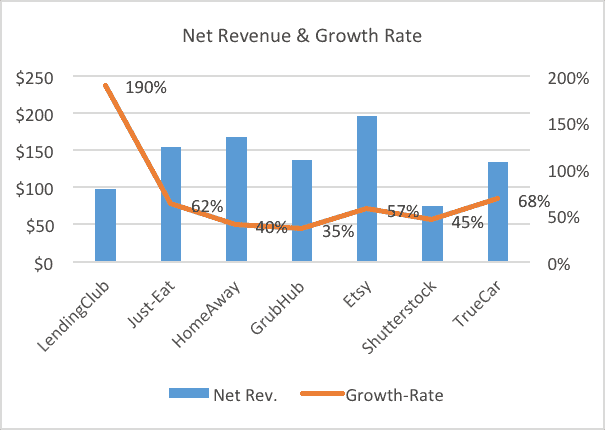
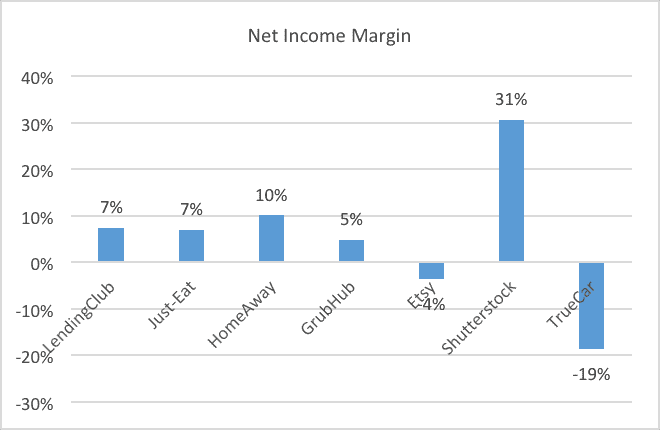
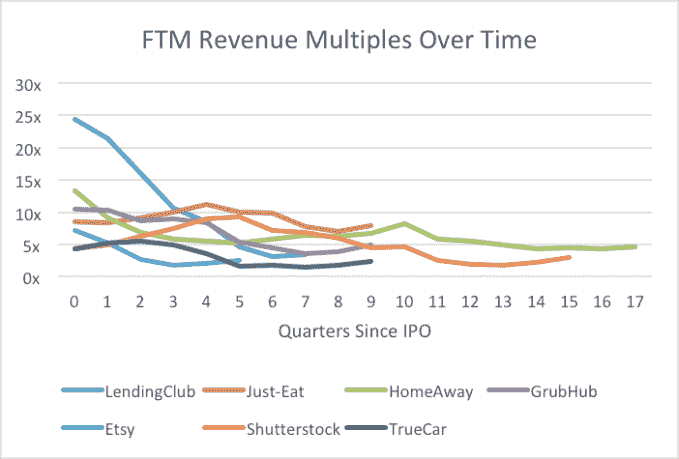

# 公共市场的奥秘

> 原文：<https://web.archive.org/web/https://techcrunch.com/2018/02/28/the-mystery-of-the-public-marketplace/>

注:这是关于风险资本投资常见领域估值思想的三篇系列文章中的第二篇。第一篇文章试图弄清楚 SaaS 的收入倍数，可以在这里找到 [。](https://web.archive.org/web/20230324125621/https://techcrunch.com/2018/01/30/getting-to-the-root-of-the-revenue-multiple/)

(中国以外)估值最高的两家私营科技公司是优步和 Airbnb，它们的估值分别为 690 亿美元和 310 亿美元(根据 [Crunchbase 独角兽排行榜](https://web.archive.org/web/20230324125621/https://techcrunch.com/unicorn-leaderboard/))。像世界上一些最有价值的公司(阿里巴巴、脸书和谷歌)一样，这两家公司也恰好是市场企业，它们的成功在过去几年里帮助鼓励了类似商业模式的风险资本投资热潮。

然而，尽管进行了所有这些投资，市场的公开 comps 仍然远远低于 SaaS——截至 2018 年 1 月初，有 42 家公开交易的 10 亿美元 SaaS 公司 * ，而只有 14 家市场突破了这一障碍** 。

此外，在这 14 家公司中，有几家是国际性的，交易量很小，还有几家有不同的业务模式，其中一些是由企业订阅驱动的(Zillow、Shutterstock、Yelp)，还有一些纯粹是由付费驱动的(Grubhub、Etsy 和易贝)。因此，尽管是最受欢迎的风险投资类别之一，但很少有人真正理解上市公司在公开市场中的价值。正是从这个角度出发，我觉得探索它们的一些特征和估值将是一个有趣的话题。

从最高水平来看，过去几年的市场 IPO 看起来颇具吸引力。正如你从下面的图表中看到的，首次公开募股的平均净收入约为 1.4 亿美元，年增长率约为 70%，利润率为 5%。这似乎是一个比一般的 SaaS IPO 更有吸引力的投资目标，后者的收入中值约为[【1 亿美元】，增长约 60%](https://web.archive.org/web/20230324125621/https://medium.com/@alexfclayton/arr-growth-for-saas-ipos-93af9c7e4e10)并且通常不盈利。

最初，公开市场似乎紧跟潮流，以看似健康的 SaaS 倍数——10 倍以上的远期净收入——奖励这些市场 IPO。然而，在增长放缓、营销支出增加和不同程度的执行失误的共同作用下，华尔街很快对这些公司产生了反感，仅仅五个季度后，它们的预期市盈率就被削减了一半，降至约 5 倍。

如今，随着增长明显放缓(~ 20%)，公开市场的中值交易预期收入为 4.4 倍。

| **公司** | **Mkt。Cap ($B)** | **2018 年修订版(＄M)** | **成长** | **2017 年 FCF 保证金** | **FTM 版本乘数。** |
| 快门架 | 1.5 | 607 | 10.6% | 8% | 2.5 |
| 吃吧 | 7.5 | 888 | 25.2% | 20% | 8.4 |
| LendingClub | 1.7 | 692 | 20.1% |  | 2.5 |
| 格鲁布布 | 6.3 | 928 | 36.7% | 18% | 6.8 |
| Zillow | 8.0 | 1,295 | 20.8% | 17% | 6.2 |
| Etsy | 2.5 | 520 | 19.0% | 6% | 4.8 |
| TrueCar | 1.2 | 367 | 14.0% | 2% | 3.1 |
| 猫途鹰 | 4.8 | 1,601 | 3.7% | 12% | 3.0 |
| 叫喊 | 3.6 | 954 | 13.2% | 18% | 3.8 |
| 通过易趣网购买 | 41.5 | 10,240 | 7.1% | 24% | 4.1 |
| 价格热线 | 88.9 | 14,362 | 14.2% | 33% | 6.2 |
| Expedia | 19.4 | 11,343 | 12.3% | 9% | 1.7 |
| 送货英雄 | 7.1 | 909 | 39.6% | -34% | 7.8 |
| Takeaway.com | 2.6 | 273 | 38.6% | -13% | 9.5 |
|  | **表示** | 20% | 9% | 5.0 |
| **中位数** | 17% | 12% | 4.4 |
| **高** | 40% | 33% | 9.5 |
| **低** | 20% | 9% | 5.0 |

与 SaaS 公司的平均预期收益 5.8 倍相比，这个 25%的折扣似乎相当苛刻。毕竟，市场通常比 SaaS 公司更有利可图，可能需要更少的工程资源来处理复杂的企业需求，并且在长时间内具有很高的粘性。这种粘性源于市场业务固有的网络效应，而这种效应在 SaaS 公司中是不存在的(类似 Salesforce 的平台除外)。

想想你上一次在易贝或 Craigslist 上的经历——如果你像我一样，你经历了一个糟糕的平台和用户体验，并发誓再也不使用这个市场。然而，这些讨厌的网络效应使得下次你需要卖掉二手运动器材时，你别无选择，只能转向这些流动性更好的老企业。最后，这些消费市场中的许多都迎合了巨大的消费支出市场；HomeAway、Grubhub 和 Etsy 的 S1 分别拥有 850 亿美元、670 亿美元和 300 亿美元的资产。很少有企业软件类别可以令人信服地声称拥有如此大的机会。

那么，为什么要打折呢？正如我在前面的中所讨论的，对于 SaaS 公司来说，这一切都与现金流有关。当我们将 SaaS 上市公司和市场公司的自由现金流和增长指标进行对比时，我们看到，虽然市场中值产生的现金流略多，但 SaaS 公司的平均增长速度更快。为了进行比较，回想一下我以前的文章，SaaS 增长每减少一个百分点，底线就会增加 1.4%(假设回收期为 16 个月)。

|  | **FCF 保证金** | **成长** | **多个** |
| SaaS | 10% | 23% | 5.8 |
| 市场 | 12% | 17% | 4.4 |
| SaaS(形容词) | 18% | 17% | – |

*显示中值数字**

现在我们可以看到，在增长平价(假设为 17%)下，SaaS 公司产生的自由现金流比市场公司多 50%(18%比 12%)！很明显，随着时间的推移，经常性收入的好处会越来越明显，因为许多 SaaS 企业保留了超过 100%的现有客户收入，因此能够更有效地增长。有了零星的回头客，市场只需要每年在营销方面投入更多资金来充实自己的金库，永远不会像 SaaS 企业那样走上同一条下滑之路。从 2015 年到 2016 年，易贝取得了 4.5%的增长，从 86 亿美元增加到 90 亿美元，而 Salesforce 继续以 25%以上的速度增长，将 2017 财年的收入从 67 亿美元增加到 84 亿美元。

因此，单纯从指标上看，SaaS 相对于市场的溢价似乎经得起推敲。然而，鉴于目前公开市场中的市场组合相对稀少，我怀疑随着(但愿如此)大量的私人市场进入公开市场，我们将在未来几年了解更多。

随着时间的推移，像优步和亚马逊(其特色是一个重要的市场业务)这样的市场可能会显示出客户的扩张，SaaS 式的追加销售和巨大的潜在市场的结合可能会为一种新型的市场赚取溢价倍数。在新进入者和现有企业的持续优势的共同作用下，市场完全有可能再次迎来辉煌的一天！

接下来:下个月，我的第三篇文章将讨论风险投资中最不受欢迎的一类——硬件——的估值问题。

*来源: [BVP 云指数](https://web.archive.org/web/20230324125621/https://www.bvp.com/strategy/cloud-computing/index)截至 2018 年 1 月

* *不包括脸书、谷歌、亚马逊和阿里巴巴，这些都是高度多元化的企业，拥有独特的商业模式。