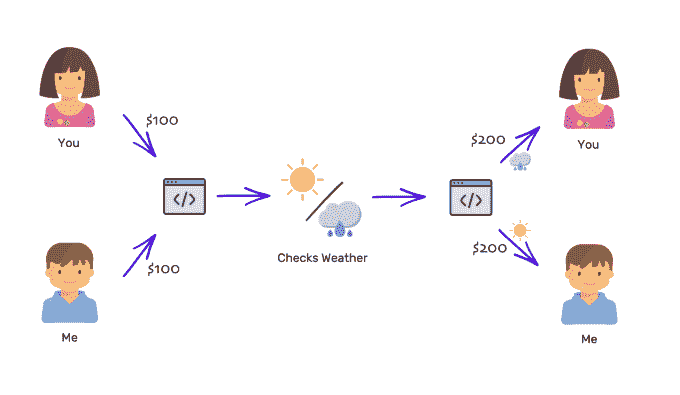

# ICOs 的新时代来了，而且不是基于以太坊

> 原文：<https://web.archive.org/web/https://techcrunch.com/2017/10/03/the-new-age-of-icos-is-here-and-its-not-based-on-ethereum/>

莫希特·马莫里亚撰稿人

莫希特·马莫里亚是

[GOD Token](https://web.archive.org/web/20230311101316/https://godtoken.org/)

该公司管理着一只专门投资区块链资产的对冲基金。

More posts by this contributor

据说 ico 是筹集资金的新方式。我们已经看到一些公司通过出售代币筹集了【T11 亿、[、1 . 56 亿](https://web.archive.org/web/20230311101316/https://www.bancor.network/)、[、1 . 85 亿](https://web.archive.org/web/20230311101316/https://eos.io/)甚至[、2 . 32 亿](https://web.archive.org/web/20230311101316/https://www.tezos.com/)美元，这些代币将用于这些公司承诺用这笔钱建立的协议。

根据筹集到的资金，他们给出的代币在以太坊区块链制造和销售——这意味着所有发生的交易都在以太坊区块链进行，制造的代币在以太坊区块链进行跟踪。但这种情况正在改变。

## 智能合同

以太坊的使命是让区块链不仅仅是一个计算器，这让他们发明了智能合约的概念。你可以把智能合约想象成一套管理某些东西的规则，这些规则在将来是不可修改的。它们允许开发者以智能契约的形式编写任何东西，由网络执行。考虑这个例子:

如果 A 和 B 打赌第二天的天气，可以使用智能合约以无信任的方式进行打赌。他们都可以向智能合同提交他们的下注金额。在第二天的预定义时间，契约将对开放天气 API 进行 API 调用，以查看天气是晴天还是雨天。根据天气情况，总金额将发送到两者之一。

因为这个合同只不过是一个软件程序，并且在陌生人的计算机上执行，所以必须确保程序员不能利用陌生人的计算机或整个网络。为了解决这个问题，以太坊提出了自己的原生编程语言——Solidity。尽管这种语言是图灵完备的，这意味着任何程序都可以用它来编写，但仍然有一个陡峭的学习曲线——开发者社区还处于起步阶段。

这两个限制使得以太坊被认为仅仅是一个 ICO 平台，而不是一台世界计算机。

除了这些以太坊特有的缺点，它还面临着区块链的普遍问题——速度慢，在区块链上没有本地身份。但是区块链正在发展——我们生活在互联网发明的最初几年。它缓慢、昂贵、笨重；但是，嘿，这是未来！

## 未来近在咫尺吗？

总的来说，作为区块链的大力支持者，我对这个领域的研究和发展感到非常兴奋。随着最近的发展，我们看到行业中出现了新的区块链，提供了更多的东西:它们使开发人员转向使用这些新的区块链来构建他们的去中心化应用和 ico。

区块链的发展让我特别兴奋，它允许以分散的方式进行一般的计算。新一代的区块链提供的不仅仅是撰写智能合同的能力。

## 支持编程语言

当谈到编写智能合同时，我从以太坊开发人员社区听到的最大障碍是要求学习一种新的编程语言。我同意语法看起来非常类似于 JavaScript，但它仍然是一种不同的语言，需要你用不同的思维来思考问题。

特佐斯·区块链决定为智能合约开发一种函数式编程语言。大多数开发人员都不熟悉函数式编程，可能会发现学习曲线比以太坊的可靠性更陡峭。

另一个区块链 [NEO](https://web.archive.org/web/20230311101316/https://neo.org/en-us/) 承诺为。Net 和 Java，最终将允许用 Python 编写的程序在它的平台上运行。有了 NEO 对这四种语言的支持，它将从一开始就为 90%的开发者社区提供服务。

[Qtum](https://web.archive.org/web/20230311101316/https://qtum.org/en/) 是另一个区块链，允许开发者编写类似以太坊的智能合约，但使用比特币的 UTXO 格式。在比特币中，没有账户和余额的概念。不是跟踪每个账户的余额，而是跟踪未花费的交易(发送到您的钱包但尚未花费的交易)。那些交易的总数构成了你的余额。与基于以太坊的模型相比，维护这些记录是非常高效和轻量级的。因此，Qtum 允许非常轻量级的智能合约。

看到不同的区块链为他们的区块链采用不同的编程范例是很有趣的。有些面向消费者，有些面向大企业。

## 区块链本土身份

在以太坊区块链上，你的身份是你拥有其私钥的公钥。您部署的每个智能协定都有自己的公共地址(身份)。

与以太坊的假名模式不同，区块链像 NEO 一样为用户提供了一个本地身份，可以在区块链上的应用程序中使用。想象一下，如果互联网允许每个用户都有一个本地身份，那么你就永远不会被要求为你在互联网上使用的每个服务创建一个单独的身份。

有人说[区块链是新的互联网](https://web.archive.org/web/20230311101316/https://techcrunch.com/2017/01/08/the-future-is-a-decentralized-internet/)。有几个心智模型适合区块链，我也相信把它看作新的互联网是一个不错的类比。区块链上的本地身份将具有可用于访问在区块链上构建的任何内容的本地身份。

有几个团队正在努力解决区块链的身份问题。例如，在以太坊上，公民允许用户记录他/她的身份，他/她以后可以在区块链上的其他应用程序中使用。

我发现区块链级别的本土身份是一个有价值的提议，因为如果没有本土身份，解决身份问题的团队将使生态系统支离破碎。

## 共识协议

当前一代的区块链因其为网络供电所消耗的能量而受到批评。由于比特币或以太坊区块链使用的共识方法，成本很高。

在任何区块链中，网络中的所有节点必须周期性地同意系统的更新状态。因为节点在地理上是分布的，并且不总是跟踪网络中的每个其他节点，所以它们将被要求同步它们自己并且同意网络的新状态。

目前，最流行的共识方法是工作证明，其中每个节点都试图通过解决密码难题来声明网络的更新状态。谁先解决它，谁就能告诉网络更新后的状态是什么。每个人都同意并继续前进。

这种方法的缺点是速度慢，费用高。这个问题有几种解决方案，各有利弊。虽然以太坊正在将共识转化为利益证明，但 Qtum 和 Tezos 从一开始就推出了利益证明共识协议的版本。有趣的是，Tezos 领先一步，提供了一种去中心化的治理方式来采用任何对协议的重大升级。每一个主要的升级都被提议和投票，使得硬分叉理论上很少见。

另一方面，NEO 使用委托拜占庭容错(dBFT)共识机制，使网络同步更快，而无需花费大量能源。它支持每秒 10，000 次交易，而以太坊每秒 15 次交易。

## 区块链是未来——但未来看起来如何？

谷歌不是第一个搜索引擎，脸书也不是第一个社交网络——他们是最好的。谈到区块链世界，我们可能会看到类似的趋势。比特币和以太坊让我们看到了以前认为不可能的事情。但它们远非完美。

虽然区块链是未来，但我不认为未来就是我们今天的生活。我们生活在实验中。我们在周围看到的可能明天就会变成废墟。我们的未来可能还没有被发明出来。

怀着对这个行业的厚望和敏锐的目光，我在等待最终的区块链。会是以太坊吗？还是尼奥？还是 Qtum？还是泰佐斯？还是别的？我不知道。现在，我很兴奋地见证了人类生活可以经历的最大转变之一。即使未来看起来不近，未来也不远。