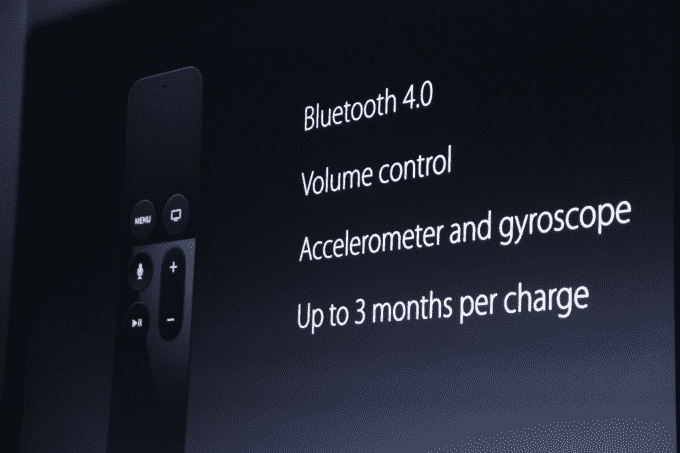

# 新款 Apple TV 遥控器包含触摸表面、麦克风和运动传感器 

> 原文：<https://web.archive.org/web/https://techcrunch.com/2015/09/09/the-new-apple-tv-remote-packs-a-touch-surface-microphone-and-motion-sensors/>

# 新的苹果电视遥控器包含一个触摸表面，麦克风和运动传感器

苹果刚刚发布了新的苹果电视，它将配备一个全新的遥控器，具有一系列新的传感器和按钮。

遥控器的上半部分是玻璃表面，允许用户在 Apple TV 的界面上滑动，或者用它来快进和快退视频。该设备还将内置麦克风和专用的 Siri 按钮，可用于启用 Apple TV 的新语音搜索功能。

遥控器将通过蓝牙 4.0 工作，这意味着遥控器和 Apple TV 之间不需要直接的视线。新设备将是可充电的，但每次充电可持续三个月。

苹果还推出了加速度计和陀螺仪传感器，可用于控制为 Apple TV 开发的游戏。在舞台上的演示中，Harmonix 展示了 Beats Sports，它允许用户将遥控器用作棒球棍，与最初的 Wii Sports 类似。

