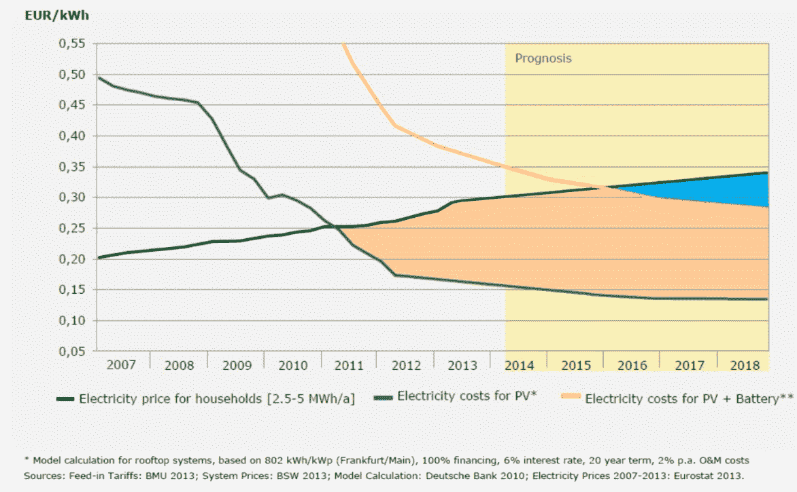
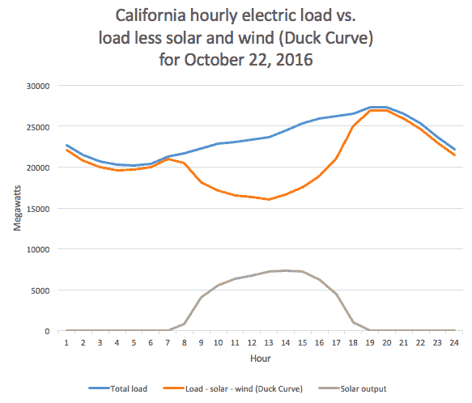
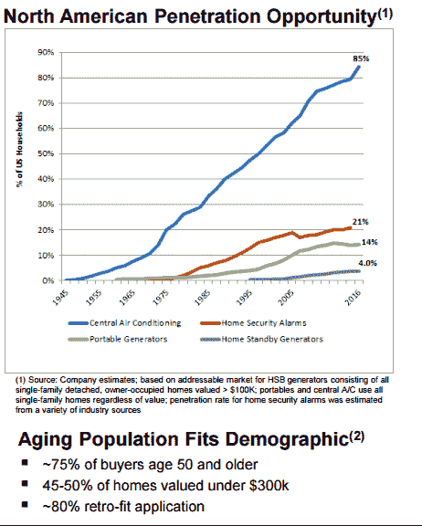

# 新电力公司 

> 原文：<https://web.archive.org/web/https://techcrunch.com/2017/10/05/the-new-electric-utilities/>

斯通利·巴蒂斯特撰稿人

斯通利·巴蒂斯特是这家投资公司的联合创始人和合伙人

[Urban.us](https://web.archive.org/web/20221208110438/http://urban.us/)

，这是一个创业基金，旨在让城市和环境变得更好。

一个理想的电力公司成本更低，对地球有益，并减少完全断电的可能性。而且也没有要求我们放弃 AC 这样的物质享受。

新的技术和商业模式，而不是燃料，推动了新的公用事业的发展。

## 消费者想要可再生能源

几乎三分之二的美国人希望优先发展可再生能源。正如 [苍井空所指出的](https://web.archive.org/web/20221208110438/https://medium.com/@aoisenju/the-best-thing-to-happen-to-america-fd3ae3a28ce2) ，这种欲望 超越了政党政治和气候否定。但这并不意味着消费者愿意支付更多。

## 零燃料成本

相对于其他能源选择，太阳能(和风能)已经取得了快速的进步。太阳能以及在较小程度上的风能受益于快速的技术进步和无运营成本的能源。相比之下，化石燃料的开发受到价格稳定或不断上涨的制约，而且技术改进因日益严峻的开采挑战而变得非常昂贵和困难。

虽然太阳能的成本正在迅速降低，但一个关键问题仍然存在——当没有太阳时，人们倾向于使用更少的能源。下图说明了加州面临的挑战。

解决这一问题的几种不同方法开始受到关注。首先，电池可以有所帮助。白天产生的一些电力可以储存起来，然后在晚上使用。

其次，家庭有许多联网的能源设备，如恒温器和热水器。这些可以调整，以减少高峰或将一些活动转移到阳光充足的时候。

## 电池组

像[Swell Energy](https://web.archive.org/web/20221208110438/https://www.swellenergy.com/)这样的初创公司正在住宅业主中建造电池车队，并在这样做的同时创造了一个新的类别，即电表背后的虚拟能源提供商。Swell Energy 是住宅能源市场的中心，是公用事业公司、安装商、制造商和消费者之间的桥梁。

该公司向房主出售和租赁电池，然后将电池聚集起来，为公用事业提供附加值。Swell Energy 直接与南加州爱迪生公司(Southern California Edison)等公用事业公司签订合同，与他们一起建设迄今为止最大的住宅虚拟发电厂，这是一个由 3000 户家庭组成的网络，使用家用电池和太阳能，将帮助 SCE 降低高峰需求。

公用事业合同使 Swell Energy 能够以比其他供应商更具竞争力的价格向客户提供租赁服务。公共事业受益于减少他们的负荷，不需要在高峰时间购买昂贵的电力。受益于电池组的本地和分布式特性，电力公司还可以放弃昂贵的基础设施投资。

但是这对消费者有什么好处呢？电池为房主提供了更便宜、更可靠的电力，是太阳能的理想伴侣，允许消费者储存能量以备夜间使用。能量存储的可调度性允许消费者在一天中最便宜的时候存储来自电网的能量，并且在电价最贵的时候使用这些存储的电力。

独立于电网的能力也有价值，尤其是在停电期间。

## 能源独立

飓风 Irma 为能源独立提供了一个及时的案例研究。

“人们需要为长时间停电做好准备——几周，”一名 FPL 代表评论飓风过后佛罗里达州预计的停电时间。

与电网形成对比的是，在整个飓风期间，手机服务仍在继续运行，因为手机网络运营商已经为他们的设备安装了电池和发电机。他们在卡特里娜飓风期间吸取了惨痛的教训，当时 70%的网络都离线了。

停电引发新问题。如果没有备用电源，智能家居就会变得愚蠢，或者至少变得不那么智能，因为联网设备会关闭。电网故障也会影响电动汽车，如汽车和自行车。

家用电池存储为想要避免长时间断电的房主提供了一层新的安全保障。

备份系统并不新鲜，但其市场渗透率相对较小。在某种程度上，这可能是因为租赁通常不适用于住宅客户，因此该设备看起来像是 AC 购买。

电池将取代燃料动力系统，特别是在阳光充足的地方，因为它们在成本上已经具有竞争力(备用发电机的成本高于电网)。但是它们也更容易维护——没有活动部件就意味着不需要维修。

## 机器人能源特工

像 [虚拟峰值](https://web.archive.org/web/20221208110438/http://www.virtualpeaker.io/) 这样的初创公司正在利用现有的已安装设备来改变客户需求。

目标是允许公用事业公司通过调整消费者家中的各种设备来减少需求。今天，这意味着像交流或水加热的应用，但也将发展到包括电动汽车和插电式混合动力车。

挑战在于如何在不造成不适或不便的情况下削减需求。Virtual Peaker 正在使用机器学习来研究行为，以便做出调整，这些调整对客户来说不应该是显而易见的，但会对公用事业产生非常积极的影响。

像这样的程序并不新鲜，但是到目前为止都是通过像智能恒温器这样的个人设备来实现的。跨应用程序使用多个不同的设备增加了电力公司可以实现的需求减少的规模。

能源代理的另一种方法更侧重于与电网的交互。 [【电网+】](https://web.archive.org/web/20221208110438/https://gridplus.io/)通过代表消费者买卖能源来代表消费者利益。例如，如果有多余的能源，价格合适，能源可以交易，但如果没有，可以储存。这是一种“轻资产”的方式来组织分布式能源资产，如电池车队，其中每一个感兴趣的当事人都根据当时的条件购买或出售资源。

## 新奖励&奖励

激励并不新鲜。公用事业公司为消费者提供了各种激励措施，从更高效的窗户安装到需求响应激励措施，以减少夏季空调的高需求。

像[solar coin](https://web.archive.org/web/20221208110438/https://solarcoin.org/en/node/6)这样的平台让提供激励变得相当容易。事实上，他们提供了一种基于硬币的货币，用于任何经过验证的太阳能产品。例如，Solarcoins 已经被用于从太阳能安装商那里获得折扣的交易中。毫无疑问，该平台可能会被政府和公用事业公司吸收，但如果太阳能币的价值增加，这就没有必要了。

## 自由能量？

能源成本曲线表明成本在稳步下降，因为我们正在逐步去除燃料成本。但是能源可以免费吗？

亚马逊破折号按钮旨在帮助重新排序。但是，当你的洗碗机可以告诉亚马逊你快用完了的时候，为什么还要按下按钮呢？

没必要升级你的洗碗机。这就是 [分解](https://web.archive.org/web/20221208110438/https://lids.mit.edu/research/research-highlights/power-disaggregation) 的用武之地。分解使用算法来研究你如何使用能源。根据这些数据，算法可以判断哪些电器或设备正在使用。

不，分解并不新鲜，但能源数据除了简单地向消费者提供他们的电器如何使用能源的视图之外，还能做更多的事情吗？

[新能源](https://web.archive.org/web/20221208110438/https://www.youtube.com/watch?v=VTMw-_vuL8k) 率先使用分类数据为客户提供新服务。例如，关于洗碗机使用情况的数据可能会被出售给洗碗机肥皂的供应商，或者可能是亚马逊，以便可以补充肥皂供应。

通过这种方式，各种品牌可能会补贴您的能源使用，以换取对您使用数据的持续访问。

## 从纳税人到客户

公用事业公司建立了庞大的基础设施，由投资者出资，他们押注公用事业公司有能力收取费用，就像政府收税一样。

但是这笔交易对消费者来说越来越没有意义。消费者越来越能够获得同样的电子产品，但对他们的钱包影响更小，更不用说对气候的影响了。他们能够为完全没有这些电子投保。