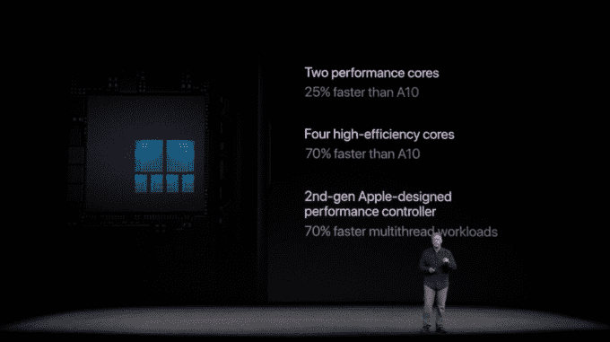

# 新的 iPhone 8 有一个由苹果公司设计的定制 GPU，带有其新的 A11 仿生芯片

> 原文：<https://web.archive.org/web/https://techcrunch.com/2017/09/12/the-new-iphone-8-has-a-custom-gpu-designed-by-apple-with-its-new-a11-bionic-chip/>

# 新的 iPhone 8 有一个由苹果公司设计的定制 GPU，带有其新的 A11 仿生芯片

新的 iPhone 8 相机装有一个名为 A11 Bionic 的新芯片，它装载了一个升级版的 6 核芯片，但这可能不是该公司宣布的最重要的部分。

苹果正在 iPhone 8 中加入一个定制设计的 GPU。GPU 在机器学习方面表现出色，这要归功于它们能够将机器学习所需的各种快速计算分散到一系列核心上，如自然语言处理和图像识别。当然，它们对游戏来说很棒，但这对苹果来说是一大步，因为它希望通过 Siri 将人们锁定在一系列设备的生态系统中。

这一步可能走了很长时间。四月份有传言称苹果正在为 iPhone 设计自己的 GPU。苹果并不是唯一一个为机器学习努力构建定制硬件和 GPU 的公司，它根据自己的需求优化硬件。对苹果来说，这意味着开发针对 Siri、相机和其他潜在机器学习工具进行优化的工具。

这对苹果在增强现实领域的努力来说也将是一件大事。苹果正在寻求用开发增强现实的工具来吸引开发者，在手机中包含实际的魅力以支持高质量的消费者体验将有助于吸引更多的开发者。

以下是 A11 仿生芯片的其余部分，这是 iPhone 8 的下一代芯片:

随着智能手机对新应用和新流程的需求不断增长，苹果通常会升级处理器，使其更快、更高效。但苹果推出自己的定制 GPU 是一件非常大的事情，因为这是一个 Nvidia 长期以来几乎完全拥有的领域。这对于未来的开发者来说非常重要。

请务必在我们的直播博客上查看我们关于 iPhone 事件的[其余报道。](https://web.archive.org/web/20230406143019/https://techcrunch.com/2017/09/12/live-from-apples-iphone-8-iphone-x-event/)