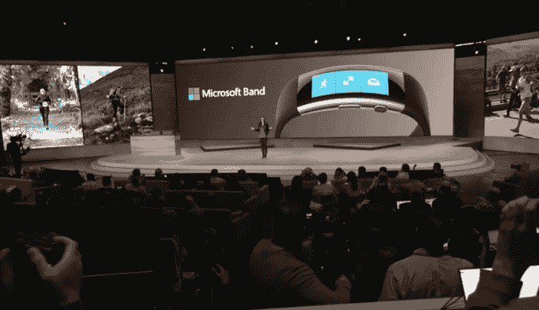
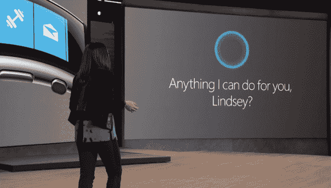
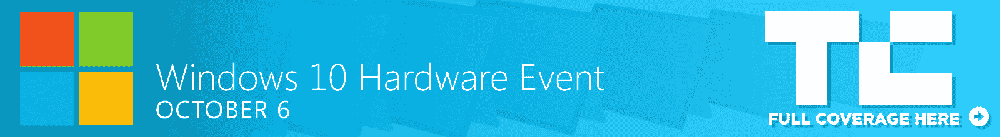

# 售价 249 美元的新款微软手环是微软对智能手表 TechCrunch 的回应

> 原文：<https://web.archive.org/web/https://techcrunch.com/2015/10/06/the-new-microsoft-band-is-microsofts-answer-to-the-smartwatches/>

# 售价 249 美元的新款微软手环是微软对智能手表的回应

微软今天在纽约举行的新闻发布会上发布了第二版微软手环。

出于多种原因，微软乐队的[第一版是一款令人惊讶的设备。首先，没人想到微软会发布这种设备。其次，与智能手表相比，它的定位很奇怪。](https://web.archive.org/web/20221007023746/https://beta.techcrunch.com/2014/10/31/hands-on-with-microsofts-new-fitness-wearable-the-band/)

当时，Apple Watch 尚未上市，Android Wear 设备也刚刚起步。相反，Fitbit 和其他健身追踪器是你手腕上最受欢迎的设备。

这也是微软抛出曲线球，推出混合设备的原因。它不是智能手表，也不是健身追踪器。这是一个 199 美元的设备，有一个小显示屏，可以显示你的通知和小应用程序。最棒的是，它可以与 Windows Phone 以及 Android 和 iOS 手机兼容。

通过微软的 Band 2，该公司希望修复原有的缺陷。林赛·马泰塞探究了细节。

这个新版本包括了当前用户所要求的东西。它对触摸的反应也更灵敏，并配有更坚韧的大猩猩玻璃。它还配备了第 11 个传感器……气压计。它会实时跟踪海拔变化。对于那些真正关心跟踪他们健康数据的人，微软有一些硬核工具。

高尔夫球手？乐队知道你在做什么。不管你是真的在打球还是在练习投篮。它甚至知道你在哪个球座上。Matese 将其描述为“拥有自己的高尔夫球童”

今天可以预购，价格为 249 美元，10 月 30 日上市。最重要的是，它不再真的丑了。老实说，你看到的戴着这个东西的人只是抱歉地摇摇头，好像在说“会好起来的。”今天是他们的幸运日。

