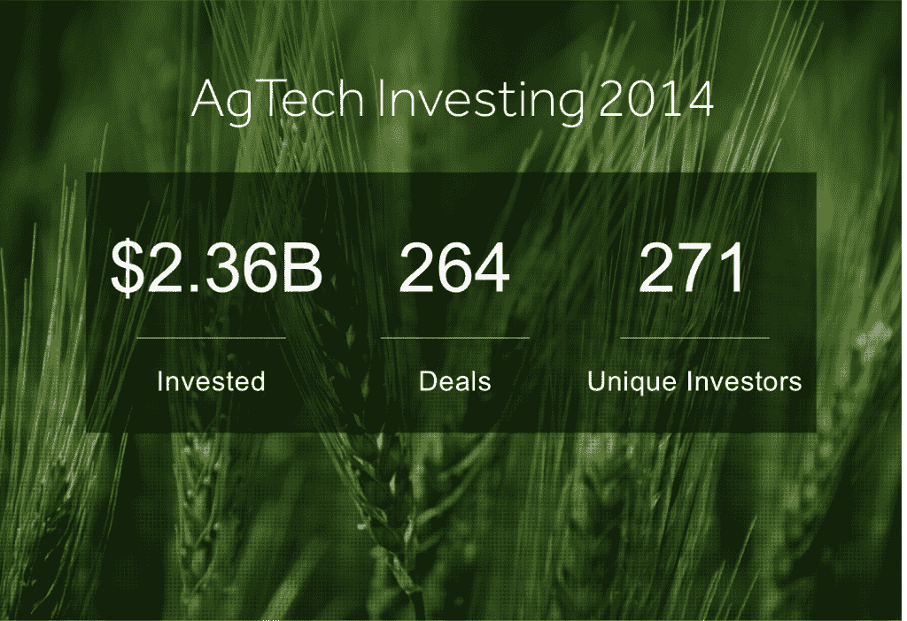
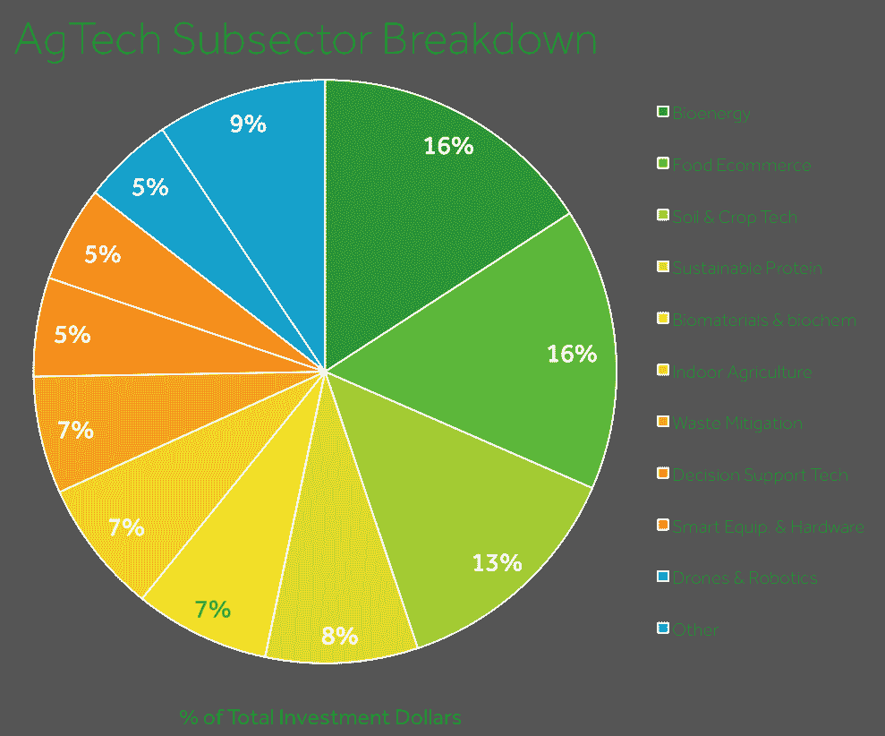
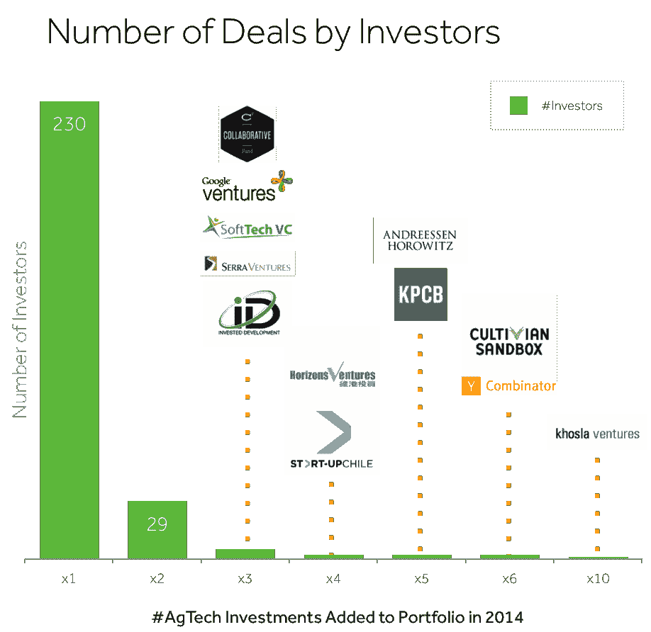

# AgTech 是绿色 TechCrunch 的新女王

> 原文：<https://web.archive.org/web/https://techcrunch.com/2015/04/01/the-new-queen-of-green/>

More posts by this contributor

梅丽莎·蒂尔尼撰稿人

**编者注:** *罗布·莱克勒克是首席执行官，* *梅丽莎·蒂尔尼是农业投资市场 [AgFunder](https://web.archive.org/web/20230217084043/http://agfunder.com/) 和农业技术 AgTech investing 的通信主管。*

在 2013 年末孟山都公司以近 10 亿美元收购气候公司之前，很少有投资者对我们农业系统的技术创新给予太多关注。一年能带来多大的变化。根据我们从 CrunchBase 以及新闻稿和去年提交给 SEC 的文件中获得的数据，2014 年农业技术领域迎来了突破性的一年，在跨越农业价值链的 264 笔交易中，该领域获得了超过 23.6 亿美元的投资。令人惊讶的是，这个 23.6 亿美元的数字现在已经超过了金融科技(21 亿美元)和前绿色女王清洁科技(20 亿美元)等知名行业。

## 为什么是现在？

根据清洁技术集团的数据，在 2013 年之前，对农业技术的投资相对平稳。农业领域的大多数技术创新都集中在生物技术和种子遗传学领域，投资和创新都局限于与农业部门关系密切的参与者。除了种子遗传学和作物投入，大多数其他农业技术通常与清洁技术捆绑在一起。

然后，在 2013 年，发生了转变。AgTech 增长了 75 %,通过 119 笔交易达到 8 . 6 亿美元。综合我们的数据(同时认可我们独特的方法)，AgTech 随后在 2014 年增长了 170%，并在 2015 年初继续显示出强劲的投资。

导致 2013 年阶段过渡的势头转变可以追溯到三个基本趋势的汇合:

1.  打破农业供求平衡的宏观经济趋势

2.  消费者口味的转变，以及

3.  将计算从桌面上解放出来的新硬件技术和大数据的自动化多元收集的融合。

## 巨大的变化

1920 年代机械化和 1940-1960 年绿色革命带来的进步已经基本耗尽。在全球人口增长、繁荣和全球化的力量给我们的农业系统带来基本供求压力的时候，主要农作物的产量增长率在 10 年曲线中一直呈负趋势。

人口以每年约 7760 万的速度增长，预计到 2050 年将达到近 100 亿。与此同时，[中产阶级预计到 2030 年翻一番](https://web.archive.org/web/20230217084043/http://www.reuters.com/middle-class-infographic)。随着收入的增加，人们在食物上花费更多([恩格尔定律](https://web.archive.org/web/20230217084043/http://en.wikipedia.org/wiki/Engel%27s_law))，吃更多的动物蛋白(一磅牛肉需要 8 磅谷物)。为了满足日益增长和日益富裕的人口对食物、燃料和纤维的需求，专家预测，我们需要在未来 35 年将全球农作物产量翻一番。

自 20 世纪 90 年代中期中国崛起以来，随着需求超过供应，自 1999 年以来，农业部门已经悄悄地超越了除科技以外的所有其他部门。这需要一段时间，但投资者和企业家已经开始注意到这一点。

除了推动农业部门的长期趋势之外，公众现在对我们的食品系统状况有了更好的了解，并且更加关注农业对环境的影响。

农业现在约占温室气体排放的 30%，自 1990 年以来增加了 75%，这使得农业成为一个巨大的破坏目标。此外，知情的消费者要求本地种植的、含较少化学物质的可持续食品，农业供应链必须发展以提供此类产品。这为新一代创业公司创造了机会，让它们得以进入对大型农业企业来说太小的新市场。

最后，硬件和软件技术进步的融合创造了应对这一市场的机会。廉价且可无限配置的移动设备(由于无线和能量存储的进步而得以实现)将技术从办公室桌面中解放出来。与此同时，廉价但复杂的硬件传感器已经出现，可以自动收集大量数据集。

随着这些技术的转变，无人机、人工智能、卫星地图、机器人和物联网等令人兴奋的技术很快意识到，农业价值链为许多不够先进或尚未在消费者领域找到解决方案的技术提供了丰富的第一市场机会。如果想做出明智的投资决策，许多关注这些技术的投资者需要在农业方面变得聪明。

## 增长潜力

农业有一个很长的价值链，该行业通常被描述为横向多于纵向(我们跟踪了 16 个子类别——从生物技术、食品电子商务到智能设备——其中 10 个子类别在农业科技市场的份额超过 5%)，目前整个价值链都有增长空间。今年，我们已经看到对无人机制造商 3D Robotics 的 5000 万美元投资和对微型卫星公司 Planet Labs 的 9500 万美元投资，这两家公司都将农业视为关键的早期市场机会。

食品科技公司 Soylent [以 1 亿美元的估值筹集了 2000 万美元](https://web.archive.org/web/20230217084043/https://techcrunch.com/2015/01/14/soylent-20m/)，植物性状公司 Arcadia BioSciences 最近申请了 8600 万美元的首次公开募股。在第一局中，一家名为 FlowHive 的公司已经成为 Indiegogo 上票房最高的活动，为其蜂蜜水龙头技术筹集了超过 680 万美元，已经成为有史以来 10 大众筹活动之一。

资本一直在排队。2015 年第一季度，Finistere Ventures 和 Maumee Ventures 都宣布推出新的 AgTech 基金，专注于 Ag 的 Paine & Partners 宣布成立一只 8.93 亿美元的私募股权基金，将部分投资分配给 AgTech。投资者甚至青睐大麻初创公司；Snoop Dogg

[announced a $25 million fund](https://web.archive.org/web/20230217084043/https://techcrunch.com/2015/02/06/of-course-he-does/)

，创始人基金投资

[in Privateer Holdings](https://web.archive.org/web/20230217084043/https://techcrunch.com/2015/01/08/new-funding-for-privateer-highlights-marijuanas-massive-market-in-the-u-s/)

7500 万美元的基金，支持叶叶，为大麻的 Yelp。

我们甚至看到了退出今年，作为精密股份公司农民边缘，刚从凯鹏华盈 B 系列，宣布

[acquisition of GranDuke Geomatics](https://web.archive.org/web/20230217084043/http://agfundernews.com/farmers-edge-acquires-granduke-geometrics.html)

。Farmers Edge 似乎从气候公司的行动手册中拿走了一页，该公司在 2014 年进行了几次收购，包括 Solum、YieldPop 和 640 Labs。有了专注于超增长的风险投资支持，这可能会给大公司的现任者带来更多压力，他们在收购方面传统上更保守，也没有培养出一个强大的创业和创新环境。

## 大胆的大目标

像之前的清洁技术一样，许多农业技术公司已经将目光投向了[大胆的大目标](https://web.archive.org/web/20230217084043/http://en.wikipedia.org/wiki/Big_Hairy_Audacious_Goal)。这也是对投资者的一种诱惑，他们被那些寻求解决具有巨大市场潜力的大问题的公司所吸引。

农业占淡水开采量的 70 %( T4 ),根据 19 世纪 20 年代拜占庭的水权法律，很少有激励农民更可持续地管理这一资源。为了应对多年来的大规模干旱，农业科技公司正在开发新的解决方案，以更可持续的方式用水。 [SWIIM](https://web.archive.org/web/20230217084043/http://bit.ly/swiim-systems) 是一家最近被任命为白宫气候倡议合作伙伴的公司，正在开发 H20 的 Airbnb。它的硬件/软件解决方案使农民能够分析他们财产上的每一滴水，优化其使用，然后将其剩余的水需求出租给缺水的城市和工业。

另一方面，素食蛋黄酱公司 Hampton Creek 正在尝试配制一种不含鸡蛋的蛋制品。如果 Hampton Creek 能够生产出美味的全素鸡蛋，该产品将对价值 1200 亿美元的鸡蛋产业产生破坏性影响。投资者似乎也这么认为——该公司从硅谷重量级企业科斯拉风险投资公司(Khosla Ventures)、创始人基金(Founders Fund)、李嘉诚的地平线风险投资公司(Horizons Ventures)、杨致远(Jerry Yang)、马克贝尼奥夫(Marc Benioff)和爱德华多·萨维林(脸书)那里获得了 9000 万美元。

甚至在更远的地方，总部位于纽约的[现代牧场](https://web.archive.org/web/20230217084043/https://www.crunchbase.com/organization/modern-meadow)正在用 3D 技术打印肉类和皮革制品。尽管 3D 打印肉可能需要一段时间才能上市并赢得消费者的信任，但 Modern Meadow 有机会通过从真实细胞中培养无牛皮革来占领 540 亿美元的皮革市场。与动物制成的皮革不同，这一过程不需要任何苛刻的化学处理。

## 回报仍需证明

新一代农业科技只经历过几次重大的流动性事件，随着投资者评估他们的投资组合，这将是未来几年对该行业的一次考验。总的来说，战略性收购在很大程度上是农业科技公司获得流动性的途径，但大多数现有公司对此兴趣不大。虽然像 John Deere 和 Syngenta 这样的公司大多保持沉默，但孟山都已经决定不再等待竞争。2011 年，孟山都收购了 Beelogics 和 Divergence 然后在 2012 年，他们以 2.1 亿美元收购了 Precision Planting2013 年，孟山都在旧金山建立了孟山都风险投资公司，并收购了 Agradis、草根、Rosetta Green(3500 万美元)和 Climate corp .(9.3 亿美元)。如前所述，Climate Corp .后来获得了孟山都的支票簿，并与 Farmers Edge 等其他硅谷初创公司一起开始了收购狂潮。

在几个子行业，特别是食品电子商务和生物能源，公司正在达到 IPO 指日可待的规模，但对于这些子行业中的大多数来说，看到大型农业科技公司的出现还为时过早。这无疑将在未来五年发生变化。从历史上看，农业产业已经涌现出了大型上市公司，而仍处于起步阶段的农业科技也不例外。

###### 图片来自 AgFunder 的ag tech2014 年投资报告:年度回顾。 AgTech 交易数据找到[这里](https://web.archive.org/web/20230217084043/https://app.relateiq.com/r?c=chrome_gmail&url=http%3A%2F%2Fagfunder.com%2Freports%2Fagtech-investing-report-2014&t=AFwhZf0hLZcPB3-7MPg6SeA7uaH17q_HA3SKBmNyQ3f6pszXTuPACzIKfYq-UY_EU2FtMsnRYIwerghpMBfCkBo3gf4jiZXxWHi4COJMeeCVEHhlzDnTrPJSItIU6V9W2VqdRb-jNQ3S)。