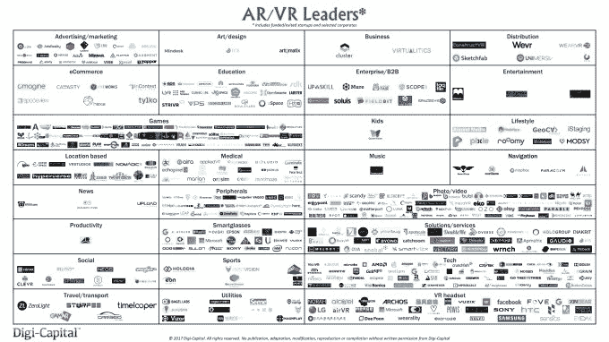
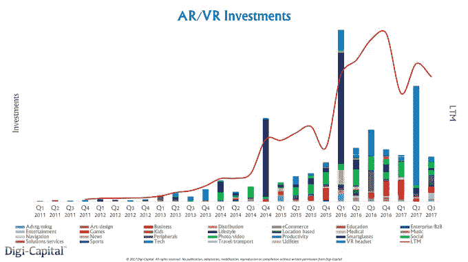
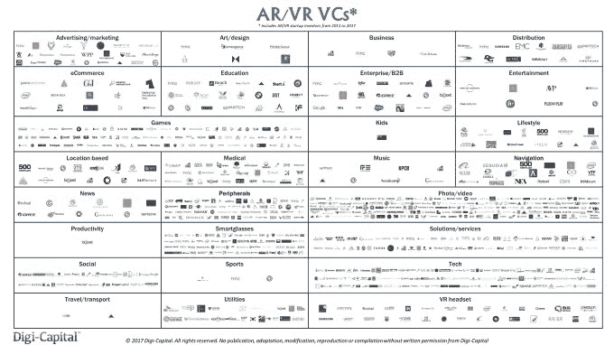

# 移动增强现实和计算机视觉风险投资的新现实

> 原文：<https://web.archive.org/web/https://techcrunch.com/2017/12/13/the-new-reality-of-mobile-ar-and-computer-vision-venture-capital/>

More posts by this contributor

**

来自苹果( [ARKit](https://web.archive.org/web/20230316161016/https://developer.apple.com/arkit/) )、谷歌( [ARCore](https://web.archive.org/web/20230316161016/https://developers.google.com/ar/) )和脸书([相机特效](https://web.archive.org/web/20230316161016/https://developers.facebook.com/products/camera-effects/))的移动增强现实和计算机视觉/机器学习(CV/ML)正在吸引硅谷、中国和其他地方风投的注意力和钱包。今年迄今为止在 ar/VR 上投资的 25 亿美元(仅在 10 月和 11 月就有 10 亿美元)在 AR 和 VR 之间保持平衡，但现在移动 AR 和 CV/ML 是新的热点(因为 VR 已经冷却)。

**

Digi-Capital 为众多风投和初创公司首席执行官提供咨询，所以我和几个朋友讨论了投资市场的演变。你可以阅读下面近 30 位著名风投的评论，但不是为了 TL；人群博士:

*   移动 AR 和 CV/ML 处于光谱的相反两端——一个提供新的 UX/UI，另一个支持广泛的新应用程序(不仅仅是移动 AR)。
*   移动 AR 还处于非常早期的阶段，在未来 18-24 个月内可能会有 5000 万到 1 亿美元的退出。占据主导地位的公司需要时间才能出现。
*   CV/ML 更先进，在中期可能会看到占主导地位的公司。
*   开发者需要时间来了解什么是可行的，消费者/企业也需要时间来大规模采用移动 AR*(注:* [*Digi-Capital 的基本情况是，移动 AR 收入要到 2019 年才会真正起飞，尽管到 2018 年第四季度已有 9 亿安装基数*](https://web.archive.org/web/20230316161016/https://techcrunch.com/2017/10/07/why-arkit-will-make-more-money-than-arcore-or-camera-effects-for-now/) *)。*
*   风投正在寻找初创公司，首先主导一个垂直领域，然后将其转变为一个水平平台*(初创公司首席执行官注意:风投今天会嘲笑你的“我们是一个移动 AR 平台”牌)。*
*   风投感兴趣的是原生移动 AR，而不是其他平台的移植。
*   风投们喜欢有真实解决方案的 CV/ML 创业公司，从根本上颠覆行业，而不是研究项目。
*   风投正在投资 20 多个不同的移动 AR 和 CV/ML 领域，但他们不是同一个风投*(给初创公司首席执行官的明显提示:不要发垃圾邮件；将风险投资者理解为个体，并思考你如何适应他们的投资组合——通才风险投资者可能只会在这个领域下注一两次。*
*   风投本身可能会带来风险，在移动 AR 的早期阶段可能会过度融资。

我受够了。让我们听听他们的意见。

【T2

**Aydin Senkut，Felicis Ventures**

[Felicis Ventures](https://web.archive.org/web/20230316161016/https://www.felicis.com/) 创始人/总经理艾登·森库特(Aydin Senkut)投资于现有产业的再创造和开拓新市场的前沿技术，他对移动 AR 和 CV/ML 的机遇有着截然不同的看法。“移动增强现实对我们来说是一个消费者机会，但也需要突破性的突破来推广 ARKit 和 ARCore 的潜力。这种动态使得成功变得更加困难，但是当他们来到这里的时候，成功将是巨大的。其中一个挑战是避免主要平台自行构建。”

“CV/ML 只有很少的纯平台功能，但是作为一种跨行业的增强技术，它有很多广泛的使用案例——这是真正的颠覆性的。”森库特与菲利西斯的合作方式完全是为了“在风险投资竞争水平较低的市场中进行多种多样、经过计算和风险调整的押注，从而实现“工程上的意外收获”。我们并不认为自己知道未来会是什么样子，但我们有信心，当它进门时，我们有时会认出它。”

**GGV 首都李宏玮**

[GGV 资本](https://web.archive.org/web/20230316161016/https://www.ggvc.com/)  中国合伙人李宏玮从横向平台(如搜索、消息、电子商务)和利用这些平台的纵向平台(如旅游、人力资源、游戏)方面进行思考。在这种背景下，该公司对 AI/ML 系统如何为消费者和企业处理跨平台和垂直行业的数据感兴趣。“我们认为 AR 是一种表现来自 CV 和其他 AI/ML 技术的方式，因此是一种创造有用东西的使能技术。”

随着自动化成为中国的优先事项，CV 和 AR 的结合提供了独特的机会。“我最喜欢的例子是不起眼的蘑菇。由于中国种类繁多(几种有毒)，采摘和分类蘑菇是由具有 10 到 20 年经验的团队完成的。我们已经看到初创公司使用 CV 和机器学习对蘑菇进行分类和标记，然后使用 AR 让技能较低的工人进行排序和选择。最终与机器人技术相结合，工业的传统部分变得更加可扩展。"

李开复也看到了中国教育市场的机遇。“出版商与学生没有任何关系，因为他们买完书后就不再回来。使用移动 AR 添加 AR 功能为出版商提供了持续的关系和进一步货币化的手段。”换句话说，把一个 100%流失率的企业变成一个有终身价值的企业。

马特·墨菲，门罗风险投资公司

门洛风险投资公司  合伙人马特·墨菲在 iPhone 发布后与苹果公司一起管理 iFund，这让他有了某种独特的视角。“iPhone 是一种新的计算设备，代表了一种根本性的平台变革，因为它永远改变了我们使用手机的方式。另一端是 API 驱动的变化，比如苹果和其他公司基于位置和关注健康的 API。”

他认为 ARKit 和 ARCore 的规模介于两者之间——没有整个平台的变化大，但也没有 API 驱动的增量升级小。“ARKit 和 ARCore 给开发者带来的机会是利用一个已经形成规模的市场。他们没有大多数新平台面临的“先有鸡还是先有蛋”的问题，在发布时有一个巨大的潜在市场。”

**比尔·马洛伊，斯威投资公司**

[Sway Ventures ](https://web.archive.org/web/20230316161016/https://swayvc.com/) 创始人/合伙人比尔·马洛伊对移动 AR 和 CV/ML 机会都充满热情。“移动增强现实是*而不是*虚拟现实，因为它从第一天就解决了数亿用户的分配问题。然而，移动 AR 和 CV/ML 投资者的机会却大不相同。未来几年，移动 AR 可能会有一批价值 5000 万至 1 亿美元的退出，CV/ML 可能会在未来 3 至 5 年内推动新一代科技巨头的发展。”

在 machine vision/ML 中，他看到了“捕获、清理和拥有大规模数据，然后从垂直产品扩展到主导水平平台”的价值。然而，“这个领域的人才库要么在大学，要么为苹果、谷歌或脸书工作。所以对于 CV 创业公司来说，最大的挑战是人。”

**Lux Capital 的 Shahin Farshchi 博士**

Lux Capital  合伙人 Shahin Farshchi 博士希望投资“能够实现全新事物的内容和体验，这是任何其他平台都无法实现的。创意社区将推出用户关心的突破性应用，以大规模推动移动 AR。”因此，尽管他正在投资底层技术和企业应用程序，但他认为，消费者应用程序需要首先普及移动 AR，以建立市场。“没有人知道这将在何时发生，会是什么样子。可能是未来三个月，也可能是未来 10 年。”

**杰夫·克拉维尔，Uncork Capital(前 SoftTech VC)**

[Uncork Capital](https://web.archive.org/web/20230316161016/https://uncorkcapital.com/)(前 SoftTech VC)创始人/管理合伙人杰夫·克拉维尔是全息图公司[窥镜](https://web.archive.org/web/20230316161016/https://lookingglassfactory.com/)和 CV stealth 初创公司的投资者。“我正在积极寻找移动增强现实基础设施的机会，相对于垂直产品，我更倾向于水平平台。这个新市场的直接规模是其有趣之处，从大众消费者到远程协助等行业机会都有。”克拉维尔广泛寻找两种类型的初创公司，“实际应用(例如 [Focal Systems](https://web.archive.org/web/20230316161016/https://focal.systems/) )和使用案例和商业模式将会发展的愿景技术(例如芯片上的 CV/神经网络隐形初创公司)。”

**吉恩·蒙斯特，Loup Ventures**

作为一名长期的苹果分析师， [Loup Ventures](https://web.archive.org/web/20230316161016/http://loupventures.com/) 创始人/管理合伙人 Gene Munster 对移动 ar 如何发展成为智能眼镜的长期桥梁有着与 Digi-Capital 相似的观点。“我们认为 2020 年是 ar 的爆发年，2018 年 iPhone 将有后置 ar 深度传感器，2019 年将有苹果智能眼镜”*(注:* [ * Digi-Capital 更保守的基础案例是 2019 年 iPhone 后置 AR 深度传感器，2020 年 iPhone 系留智能眼镜* ](https://web.archive.org/web/20230316161016/https://www.digi-capital.com/news/2017/10/two-speed-arvr-market-after-arkitarcore-ar-upgrade-vr-downgrade/) *)* 。

明斯特是 Loup 的联合创始人，因为他认为“AR 是人类与机器交互的下一种方式，在商业应用程序、游戏、基于位置的 AR(即 AR 云)和医疗领域都有投资机会。”他的投资论点围绕着短期退出和长期平台玩法，“因为这是一个如此早期的市场，我们从能够展示牵引力的应用程序公司开始，如果他们做对了，就利用这一成功成为主导平台。”

**理查德·塔帕拉加，高通风险投资公司**

[Qualcomm Ventures](https://web.archive.org/web/20230316161016/https://www.qualcommventures.com/)董事 Richard Tapalaga 强调了高通推动底层技术和传感器向前发展以实现 AR 生态系统的承诺。“基于我们对移动/AR/VR 硬件和软件的深厚机构知识，我们很高兴能够进一步发展生态系统，并致力于通过投资 [Magic Leap](https://web.archive.org/web/20230316161016/https://www.magicleap.com/) 等项目实现智能眼镜的未来。从种子到后期投资，移动 AR 和 CV/ML 都是我们的浓厚兴趣。开发者蜂拥而至移动 AR 是因为它现在有规模了(不像 VR)，我们都知道移动牵引是什么样子的，没有分发碎片化(还是那句话，不像 VR)。这降低了风投的准入门槛，因为在许多方面，我们都处于坚实的基础上。”

Tapalaga 正在投资“跨相机、传感器、ML、CV 和 AI 的核心技术。我们还专注于移动 AR，特别是围绕业务流程、医疗保健、B2B 和工业应用的企业市场。消费者移动 AR 初创公司正在做一些真正新颖的事情——原生移动 AR，而不仅仅是来自其他平台的移植——也是我们感兴趣的。我们更喜欢基于 ARKit 和 ARCore 的平台，就像 Unity 基于 iOS 和 Android 一样。”Tapalaga 认为过度投资是一种风险，有可能“在早期移动 AR 市场中为初创公司提供过多资金。”

**纳比尔凯悦，星火资本**

[星火资本](https://web.archive.org/web/20230316161016/http://sparkcapital.com/)  合伙人纳比尔·凯悦(Nabeel Hyatt)认为“相机是一种类似于 GPS 的使能技术。这与 app store 或脸书等创新非常不同，它们都是关于分销的。手机上 AR、相机和 ML 的结合代表了新产品和用例的根本性创新，但创作者可能需要两到三年的时间来找出真正有效的方法。如果你想到 2007 年推出的 iPhone 和 2009 年推出的优步，那不是人们想到的第一个用例。”

“ARKit 是我们希望用手机做的事情的下一个扩展，将它们放在现实世界的背景中。随着时间的推移，AR 将变得无处不在。”Hyatt 认为更广泛的 CV/ML 机会是在巨大的价值创造发生的阶段，因为“我们已经进入这个周期四年了。我们对移动增强现实领域同样充满热情，但这个市场才成立了几个月。”

**Niko Bonatsos，通用催化剂**

[General Catalyst](https://web.archive.org/web/20230316161016/http://generalcatalyst.com/)董事总经理 Niko Bonatsos 在过去几年里会见了数百家虚拟现实公司，但他认为“中短期对消费者虚拟现实公司来说很难，因为摩擦太大了。”相反，他对投资移动 AR 初创公司感兴趣，因为他相信“它们是媒体投资未来的一部分，最终将达到智能眼镜。它为以前不存在的新用例开辟了可能性，对现有的知识产权持有者来说也是一个巨大的机会，特别是在游戏衍生产品方面。”

然而，Bonatsos 并不认为前进的道路是平坦的。“苹果更新应用商店以更好地促进开发者是很棒的，但分发仍然是一个瓶颈。现有的移动玩家比移动 AR 新人有巨大的优势，所以这些平台需要进一步探索。此外，第一波移动增强现实应用在很大程度上是相关行业的衍生物，而不是原生的移动增强现实，而且还有 UX 的生理学要弄清楚。人们不会长时间把手机举在面前，所以高频、短时间的应用可能会成功。”

**雅各布·穆林斯，沙斯塔风险投资公司**

[沙斯塔风险投资](https://web.archive.org/web/20230316161016/http://www.shastaventures.com/)  合伙人雅各布·穆林斯领导公司新的[相机基金](https://web.archive.org/web/20230316161016/https://techcrunch.com/2017/09/18/shasta-ventures-launches-a-fund-to-accelerate-ar-and-vr-app-development/)来支持创业公司“通过将智能手机相机与 CV/ML 结合起来，在数字和现实世界之间架起桥梁”。移动 AR 的安装基础是数以亿计的，因此我们专注于社交、游戏和消息/通信领域的规模机会。我们对原生移动增强现实初创公司最感兴趣，而不是人们将现有应用转向移动增强现实。”

红点风险投资公司的蒂姆·哈利

红点风险投资公司(red point Ventures)的创始人兼董事总经理蒂姆·哈利(Tim Haley)在他们位于沙丘路(Sand Hill Road)的办公室里孵化了 Jaunt ，他将 AR/VR 视为“一种媒体类型的连续体，可以在大多数领域用丰富的媒体来增强我们的世界。在过去几年中，我们需要经历虚拟现实市场的第一阶段，才能进入新的媒体。今天，我们已经通过移动 AR 用户界面大规模地将 3D 内容与现实世界融合在一起。但即使取得了这样的进展，我们仍处于市场最终走向的最早期阶段。”

由于 AR/VR 的核心焦点是 Jaunt 的发展(其中一些仍处于保密状态)，Haley 对该领域的下一个大机会将来自哪里很有耐心。“了解什么是平台领域，什么是创业领域是关键，现在我们看到了堆栈不同部分中有趣的平台机会。从纵向角度来看，我们一直在寻找医疗、教育、工业和建筑/施工。我们喜欢投资于艰难问题的艰难解决方案。”

**凯文·西班牙，涌现资本**

[Emergence Capital](https://web.archive.org/web/20230316161016/http://www.emcap.com/)普通合伙人 Kevin Spain 专注于企业/云领域的新兴平台，因此对于移动 AR 来说，寻找“真正对业务有用的企业用例，而不是创新或试点研究项目。现在还为时尚早，所以我们真的还不知道企业的杀手级应用。我们喜欢为企业带来真正价值的公司，比如投资组合公司 [IrisVR](https://web.archive.org/web/20230316161016/https://irisvr.com/) 。

**奥里·因巴尔、马特·米斯尼克和汤姆·艾姆里奇，超级风险投资公司**

[超级创投](https://web.archive.org/web/20230316161016/http://www.superventures.com/)  创始人/合伙人奥里·因巴尔(右上)、马特·米斯涅克斯(中左)和汤姆·艾姆里奇(右下)认为，ar 代表了智能手机之后的下一个计算平台。

“现在是时候投资于增强现实的推动者了，特别是仿生视觉(智能眼镜技术，包括显示和连接)、3D 化世界(计算机视觉和增强现实云)、世界构建(AR/VR 世界构建工具)、自然 I/O 和交互(外设和自然 UI)、网真(社交和通信)和超级智能(让我们更聪明、更快、更好)。”

然而，合作伙伴对市场时机持谨慎态度，“尤其是在消费者领域。我们不相信炒作周期，但认为长期潜力被低估了。”

**加文·特奥，B 资本**

B Capital 的合伙人 Gavin Teo“对企业和消费者业务的 CV 感兴趣。到这个十年结束时，CV/ML/AI 将产生数百亿美元的企业价值。领先的 AR/VR 咨询公司 Digi-Capital 预测[移动 AR 将与](https://web.archive.org/web/20230316161016/https://www.digi-capital.com/news/2017/10/two-speed-arvr-market-after-arkitarcore-ar-upgrade-vr-downgrade/)一样大。随着苹果、谷歌和脸书等主要参与者推动新兴生态系统支持创新和新的商业模式，这是一个非常适合风险投资的市场。”

 Teo 认为,“CV 可以产生一些下一代伟大的科技公司，尤其是在自动驾驶领域。特斯拉和其他公司采用的视觉优先方法，而不是 Waymo 和优步采用的以激光雷达为中心的方法，将随着时间的推移证明更具可扩展性。出于自驾目的，理解某事的含义比仅仅认识到有东西挡路更有影响力。”他还认为，宏观环境将推动“面向企业销售的人工智能/人工智能/人工智能和增强现实业务中的并购和风险投资活动。”

**菲尔·桑德森，里奇风险投资公司(原 IDG 风险投资公司)**

[Ridge Ventures](https://web.archive.org/web/20230316161016/https://ridge.vc/)】(原 IDG Ventures)创始人/董事总经理菲尔·桑德森(Phil Sanderson)对“像 Snapchat 和 Pokémon GO 这样有趣且引人入胜的移动 AR 体验感兴趣。与 VR 不同，启用 AR 的手机无处不在，并得到苹果和谷歌的支持，因此一家公司快速达到逃逸速度的能力很高。”

桑德森已经有两项移动增强现实投资，包括上市公司 [Next Games、](https://web.archive.org/web/20230316161016/https://www.nextgames.com/)在宣布基于《行尸走肉》的移动增强现实游戏后，其市值翻了一番。该公司的移动增强现实重点是“娱乐软件，但也包括工业应用。移动出版商和支持技术是我们的最佳选择。”

**Amitt Mahajan，出席资本**

[Presence Capital](https://web.archive.org/web/20230316161016/https://www.presencecap.com/)创始人/管理合伙人 Amitt Mahajan 认为，“为了让计算机传递关于我们周围世界的附加信息，它们首先需要了解我们周围的世界。我们早期的 AR 投资大多集中在 CV 和试图建立“x 的 Shazam”的公司。移动 AR 领域的下一个大公司可以帮助人们执行以前不在他们的技能或知识领域内的任务。例如，我们的投资组合公司 [Scope AR](https://web.archive.org/web/20230316161016/https://www.scopear.com/) 允许非技术人员执行技术任务，如使用 AR 摄像机按照一步一步的指示对发动机进行维护。”

Mahajan 专注于企业、基础设施和 B2B 业务，他对“正在建立缺失的 AR 基础设施(如 AR 云)的公司或使用 AR 帮助人们学习或提高工作效率的公司”感兴趣。由于潜在的用户界面和分发挑战，Mahajan 将移动 AR 视为智能眼镜转变“信息、邮件、日历、地图等核心应用”的垫脚石。

**橘色硅谷的纪尧姆·帕扬**

[Orange 硅谷](https://web.archive.org/web/20230316161016/http://www.orangesv.com/)负责人 Guillaume Payan 认为“所有行业都将受到 AR 技术的冲击。这项技术有可能从根本上改变我们的行为和互动方式，就像智能手机已经做到的那样，因为增强现实允许我们的感官获得更整合的体验。毫无疑问，大公司将会出现。”

鉴于 Orange 作为电信公司的地位，Payan 解释了 Orange 如何“使我们的网络提供更高的带宽和更低的延迟，以便 AR 体验可以无摩擦。我们对任何连接人和组织的技术、服务和产品都感兴趣。”

**陈谦之，地平线风险投资和存在资本**

[Horizons Ventures](https://web.archive.org/web/20230316161016/http://horizonsventures.com/)顾问和 [Presence Capital](https://web.archive.org/web/20230316161016/https://www.presencecap.com/) 董事总经理陈谦之在 HTC 工作时是高级虚拟现实的主要推动因素，但他对移动 AR 在中国的未来发展有疑问。“没有一家中国公司成功地建立了像 iOS 或 Android 这样的平台，所以还不清楚是否会出现 ARKit 和 ARCore 这样成功的中国竞争对手。最有潜力的玩家是利用微信的腾讯，其次是游戏领域的网易。”或许是因为国内移动 AR 平台市场仍不稳定，陈还没有看到中国开发者的巨大兴奋(不像中国以外)。

**瓦布·戈埃尔，诺韦斯特风险投资公司**

[Norwest Venture Partners](https://web.archive.org/web/20230316161016/https://www.nvp.com/)普通合伙人 Vab Goel“对 AR 和 VR 感到兴奋，但 VR 需要更长时间才能成为主流，因为它需要专门的设备。”Goel 对移动 AR 感兴趣，因为“设备无处不在，巨大的 UX 和投资回报潜力”，并认为“CV 是实现 AR 潜力的关键技术”他对手机游戏、电子商务、图像搜索、家庭安全、自动驾驶、企业和机器人领域的初创公司感兴趣，并相信“AR & VR 技术将对我们的日常工作和家庭生活产生积极影响。”

**艾尔文·王·格雷林，HTC**

HTC Vive  的 Alvin Wang Graylin 在 VR 上投入了大量资金，他正在补充 AR 投资，“因为我们看到 AR 和 VR 在未来几年将会融合。移动 AR 正在将一批新的开发人员带入沉浸式计算，其中许多人可能会从移动平台迁移到高级平台。我们看到用户跨 AR 和 VR 平台交互的混合体验正在发展。”格雷林正在关注行业垂直领域、UGC、AI 和 ML/CV 的应用。“我们看到 2018 年新产品不断涌现，5G 有助于在 2019 年扩大使用规模，2020 年是更先进的 AR/VR 平台的拐点。但一如既往，内容为王，会规模化市场。”

**Marco DeMiroz，风险现实基金**

[风险现实基金](https://web.archive.org/web/20230316161016/http://www.thevrfund.com/)  联合创始人/普通合伙人 Marco DeMiroz 认为“移动增强现实应用的经济和增长前景类似于智能手机应用，未来扩展到智能眼镜将会增强这一点。”DeMiroz 认为“CV/ML 对于为消费者和企业用户创造令人信服的 XR 至关重要”，并有兴趣投资“面向消费者和企业的移动 AR、工具和基础设施(包括 CV/ML)以及更广泛的 AR/MR/VR。”

**其他视图**

[Maven Ventures](https://web.archive.org/web/20230316161016/http://www.mavenventures.com/)创始人/管理合伙人 Jim Scheinman(右)在移动 ar 方面仍在为消费者寻找十亿美元的想法，但已经积极投资自动驾驶市场。

康卡斯特风险投资公司(Comcast Ventures)董事总经理迈克尔杨(Michael Yang，左)不知道移动增强现实是否会成为“下一个大事件”,因为这个市场还处于萌芽状态，而且盈利能力有限，但鉴于其潜在的规模，他对此抱有希望。

**牵引，牵引，牵引**

几乎我接触过的每一位风险投资人都提到，未来 12 到 18 个月是这个领域初创公司的关键时期。移动 AR 的规模分发平台和 CV/ML 的现实世界应用程序意味着牵引力很容易与更广泛的移动或企业应用程序中的既定基准进行比较。风投们正在从他们的前沿技术投资中寻找真正的突破，这个市场也不例外。

那就没有压力了。

*(感谢* [*格雷克罗夫特*](https://web.archive.org/web/20230316161016/https://www.greycroft.com/) *风险合伙人乔恩·高曼和* [*文洛克*](https://web.archive.org/web/20230316161016/https://www.venrock.com/) *投资人王一行-莱文对本帖的贡献。)*