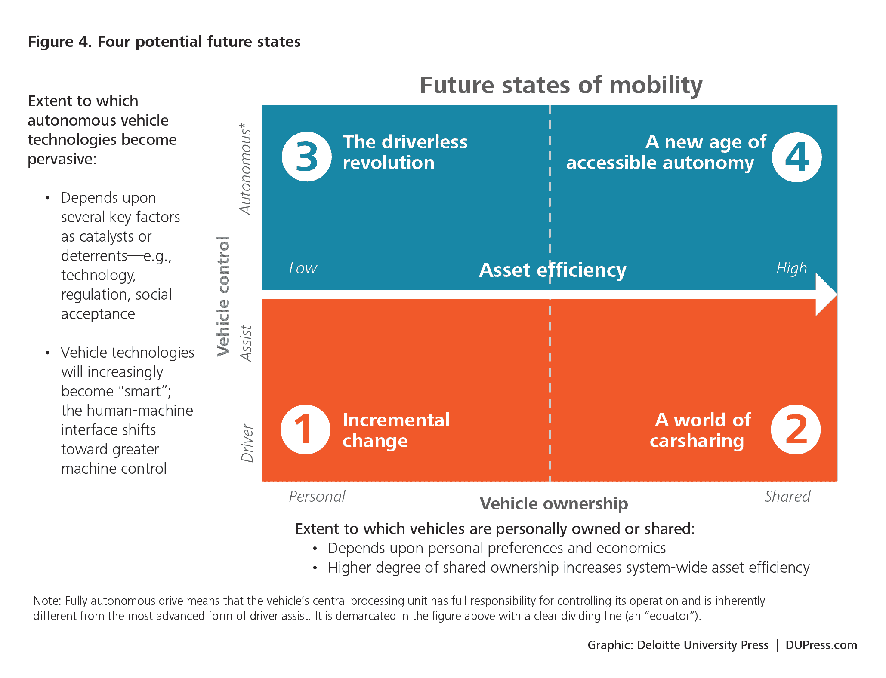

# 汽车保险新的可怕面孔

> 原文：<https://web.archive.org/web/https://techcrunch.com/2016/08/21/the-new-scary-face-of-auto-insurance/>

[Kevin Wang](https://web.archive.org/web/20230404041741/https://www.linkedin.com/in/kwang4/)

是增压器自动化公司的副总裁。此前，他是 Koniku 的增长主管，也是即插即用保险公司的员工。凯文在凯斯西储大学学习金融。他是一名连续创业者，拥有制造和分销以及战略咨询背景。

More posts by this contributor

移动领域的技术使得旅行更加安全、快捷和方便。结果令人难以置信:保险信息研究所发现，在过去的三年里，汽车死亡人数下降了 33%。同一调查发现[九款车型每百万辆车的死亡率为零](https://web.archive.org/web/20230404041741/http://www.latimes.com/business/autos/la-fi-hy-report-on-driver-deaths-20150129-story.html)。随着优步和 Lyft 等打车应用程序在 60 多个国家每天提供超过 100 万次[的出行，移动性也变得更加容易。](https://web.archive.org/web/20230404041741/http://www.businessofapps.com/uber-usage-statistics-and-revenue/)

尽管有好处，创新也有后果。今年5 月 7 日 一名特斯拉车主在使用 Autopilot 功能时死亡。他的车[撞上了一辆卡车，因为他的特斯拉没能区分天空背景下卡车的白色。这一事件可能会改变自动驾驶的叙事和](https://web.archive.org/web/20230404041741/http://www.nytimes.com/2016/07/02/business/joshua-brown-technology-enthusiast-tested-the-limits-of-his-tesla.html?_r=0)[公众诉求](https://web.archive.org/web/20230404041741/http://bigstory.ap.org/article/f1a2e205566c43f88c2eb93d337cb6be/tesla-crash-could-hurt-sentiment-driverless-cars)。它透视了未来离我们有多近，以及社会是否会完全接受它。

自动驾驶有望减少汽车死亡人数。去年有 35，000 人与汽车相关死亡，占美国人口的 0.01%。虽然这似乎不是一个很高的数字，但这些死亡是人的结果，而不是一个将乘客的生命保留在其源代码中的算法。这让我们质疑程序员的责任和他们编写的代码是否被赋予了决定购买汽车的消费者生死的权力。最终，在发生事故甚至死亡的情况下，谁应该承担责任？

下一个关键步骤是自动驾驶的普及以及在我们的社会框架内安全嵌入其实用性的任务。考虑到这些问题，私营公司和政府机构正在采取适当的措施来解决这些问题。谷歌一直在测试和建造一支无人驾驶汽车车队，该车队已经完成了 150 万英里的道路测试。

2014 年，美国交通部批准了[车对车技术](https://web.archive.org/web/20230404041741/http://www.nhtsa.gov/About+NHTSA/Press+Releases/2014/USDOT+to+Move+Forward+with+Vehicle-to-Vehicle+Communication+Technology+for+Light+Vehicles)，使车辆能够相互“对话”，并有助于防止经常导致碰撞的人为错误。今年 3 月，通用汽车[以 10 亿美元收购了一家名为 Cruise Automation 的初创公司](https://web.archive.org/web/20230404041741/http://fortune.com/self-driving-cars-silicon-valley-detroit/)。通用汽车已经准备在其凯迪拉克 CT6 系列中推出面向高速公路的智能巡航控制系统。自动驾驶汽车的技术和政府基础设施正在走向成熟。

> 驾驶技术可能永远不会取代司机，但它可以帮助我们变得不容易受伤。

但有许多因素将决定自动驾驶是否会被大规模采用。消费者的接受度是一个因素。不是每个人都想要自动驾驶汽车。美国人其实是爱车的；Experian Automotive 报告称，每户平均拥有 [2.28 辆汽车](https://web.archive.org/web/20230404041741/http://www.nytimes.com/2008/07/27/nyregion/nyregionspecial2/27Ronecar.html)。如果自动驾驶汽车的想法被广泛采用，最终用户将需要将旅行和汽车所有权视为独立的概念，这是埃隆·马斯克的[总体规划](https://web.archive.org/web/20230404041741/https://www.tesla.com/blog/master-plan-part-deux)中强调的概念。

德勤认为，未来的移动交通有四个阶段:渐进式变革、汽车共享、无人驾驶革命和无障碍自主。我们目前的模式正在走向一场无人驾驶革命，在这场革命中，消费者可能仍然拥有自己的汽车，但汽车将有能力自行驾驶。虽然所有四个阶段可能同时存在，但它们不一定平均分布在人口的每个部分。无人驾驶革命阶段可能表明我们现在拥有的增量变化，就像通用汽车新的自动驾驶凯迪拉克技术一样。

无障碍自主将对汽车保险产生重大影响。首先，事故越少，保险公司的索赔和损失就越少。大卫·祖比，高速公路安全保险研究所的执行副总裁兼首席研究官[表示](https://web.archive.org/web/20230404041741/https://www.kpmg.com/US/en/IssuesAndInsights/ArticlesPublications/Documents/automobile-insurance-in-the-era-of-autonomous-vehicles-survey-results-june-2015.pdf)，“配备正面碰撞预防技术的车辆在财产损失责任范围内的索赔频率降低了 7-15%。”这是一个双赢的局面；科技不仅可以预防事故，保险公司也将支付更少的赔偿。

在自动驾驶汽车普及之前，保险公司还需要开发新的创新产品。在无人驾驶革命阶段，防撞技术将在降低保费方面发挥巨大作用。保险公司将需要找到他们可以销售的新产品。在汽车共享阶段，保险公司向优步和 Lyft 等公司出售 gap 保险和乘车共享政策。司机接送客人时需要保险。

新保单的保费也更贵。Geico 为一名住在芝加哥的男性提供的个人保险将花费 1140 美元，而为同一个人提供的拼车保险将花费 3743 美元(T3)。自动驾驶汽车政策可以遵循同样的涨价策略。

特斯拉事件可能会阻止公众全面拥抱自动驾驶汽车。无人驾驶汽车可能永远无法实现无障碍自主，可能只是一个附加功能。司机很可能仍然要对他们车辆的行为负责。这意味着司机仍然需要汽车保险。驾驶技术可能永远不会取代司机，但它可以帮助我们变得不容易受伤。