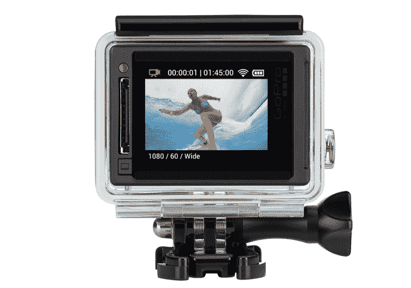
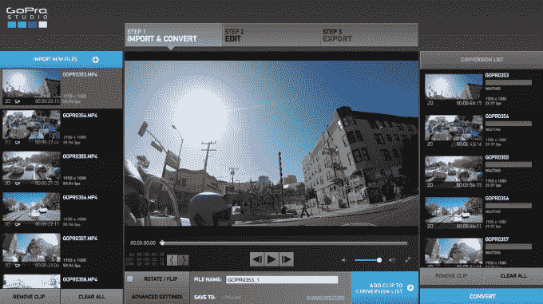

# 最新的 GoPro 型号比以往更加平易近人 

> 原文：<https://web.archive.org/web/https://techcrunch.com/2014/09/29/the-newest-gopro-models-are-more-approachable-than-ever/>

今天， [GoPro](https://web.archive.org/web/20221005193858/http://gopro.com/) 推出了其耐用相机的新系列，有望成为这家现已上市的相机和生活方式公司生产的最平易近人的相机。

这一代为 GoPro 的阵容带来了两层相机。在高端，有 499 美元的 Hero4 Black 和 399 美元的 Hero4 Silver，这两款手机最引人注目的是能够进行 4K 视频拍摄，并(首次)配备了内置触摸屏。这些设备都保留了前几代产品简单耐用的工业设计，整体外观几乎没有什么细微的改动。

在低端，现在有一个简单称为英雄的入门级模型。它的起价为 129 美元，尽管它的规格表不太令人印象深刻，但它仍然为一些市场提供了很好的服务:那些还不确定 GoPro 将如何融入他们的生活，只是想尝试一下的人，以及那些知道*如何以令人敬畏的方式使用*go pro，但想要一些可以完全破坏而不会感觉损失太大的东西的人。

上周，GoPro 带着我和其他一些科技记者在旧金山进行了一次旅行，在各种情况下测试 Hero4 型号，在这些情况下，一个耐用的多功能相机可以让你捕捉到否则可能难以捕捉的镜头。

我们看到专业跳伞运动员从直升机上跳下，降落在海湾边的一片草地上。我们去了蹦床健身房，在那里我们可以看到金牌奥运选手做空翻和特技，开着那些黄色小型摩托车衍生的卡丁车在旧金山兜风，还乘船去了海湾。

在这种多变的测试环境中，我意识到我的生活方式真的不需要这些相机。我只是不经常出去做足够酷的事情——对我来说，iPhone 相机对于大多数用途来说已经足够好了，我的 DSLR 就是我专业使用所需的全部。

但是对于那些真正做酷事情的人来说呢？整个过程中我只使用了一个支架——三节把手——并且能够在定位相机方面花费很少的努力就能得到一些真正有用的镜头。以下是我在没有使用新的 iPhone 应用程序设置镜头的情况下，用 Hero4 Black 拍摄的照片:

[https://web.archive.org/web/20221005193858if_/https://www.youtube.com/embed/qNSAeimojgc?feature=oembed](https://web.archive.org/web/20221005193858if_/https://www.youtube.com/embed/qNSAeimojgc?feature=oembed)

视频

从可用性的角度来看，GoPro 已经努力使设备本身更容易使用，重新组织设置，将分辨率和帧率等事情放在前面和中间。尽管如此，一些默认设置在我的使用中并不太好:例如，一秒钟拍摄 30 张连拍照片对于捕捉大多数没有明显模糊的瞬间来说没有太大意义。GoPro 产品团队成员给了我更好的设置供我使用，但奇怪的是，他们的建议并不是公司的首选设置。

此外，GoPro studio 软件可以进行一些简化。虽然该应用程序是为那些不是 Premiere 或 Final Cut Pro 等应用程序专家的人设计的，但在编辑任何内容之前，该界面仍然需要转换和选择设置，并且实际开始让视频进入标准设置的命令并不明显。

尽管如此，我还是忍不住觉得这一代 GoPro 相机将比以往任何时候都更多地转化为运动和冒险类型。Hero4 Silver(带触摸屏的那款)似乎是对普通人有意义的界面的最佳选择:能够在大的可触摸界面元素中滑动和查看设置，使一切更容易理解。

看到 4K 的镜头——甚至 2.7K，真的——来自 Hero4 Black 令人印象深刻，尽管对大多数人来说还不太现实。首先，大多数人家里都没有 4K 显示器，而且当我试图让我的 MacBook Air 以那么高的分辨率编辑视频时，它似乎会着火。一个拥有 600 美元 Windows PC 的人可能会因为看到这种内容的转换时间缓慢进入*小时*的时间框架而感到相当沮丧。

也就是说，那些愿意购买最高端机型的人会发现，他们的镜头将为该技术的最终到来做好准备。因此，也许可以公平地说，普通人并不真正成为该型号的目标客户——如果你是那种真正能够利用 Hero4 Black 的人，你可能已经从去年的 Hero3 阵容开始为 4K 功能的 GoPro 准备钱包了。