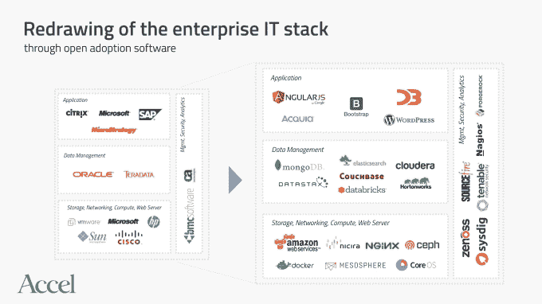

# 软件的下一波浪潮是开放应用软件

> 原文：<https://web.archive.org/web/https://techcrunch.com/2016/06/19/the-next-wave-in-software-is-open-adoption-software/>

杰克·弗洛门伯格撰稿人

杰克·弗洛门伯格是

[Accel](https://web.archive.org/web/20230324022007/http://www.accel.com/)

.

企业购买和部署软件的方式正在发生重大转变。在过去的几年里，开放技术— 软件，即开放变化和自由采用— 已经从例外变成了大多数企业的规则。我们已经看到 IT 堆栈在强大的开源项目上被重新划分，开发人员选择“开放优先”的方法来构建解决方案。根据 Black Duck Software 最近的一项市场调查，超过 78%的企业使用开源软件，不到 3%的企业表示他们不以任何方式依赖开源软件。

在硅谷，开放性几乎是老生常谈，但如今，像 Hadoop、Cassandra、Docker 和 Mule 这样的项目甚至渗透到了最保守和教条的组织中。因此，像 [Cloudera](https://web.archive.org/web/20230324022007/https://www.crunchbase.com/organization/cloudera) 、 [DataStax](https://web.archive.org/web/20230324022007/https://www.crunchbase.com/organization/datastax) 和 [MuleSoft](https://web.archive.org/web/20230324022007/https://www.crunchbase.com/organization/mulesoft) 这样的初创公司每年都通过围绕其开放项目销售专有的增值产品，从真实的企业客户那里获得数亿美元的收入。

这是软件领域的新浪潮——它不仅取代了现有市场，还创造了全新的市场。我们称这些开放采用软件 (OAS)公司，我们相信他们已经准备好建立有意义的业务——并推动巨大的经济成果。

> 我们正在见证软件消费方式的巨大转变。

OAS 公司的构造不同。他们经历了公司建设的三个阶段: [项目、产品、利润](https://web.archive.org/web/20230324022007/https://medium.com/accel-insights/the-rise-of-open-innovation-the-3p-s-for-building-a-durable-open-software-company-3bc6e0ec6fa7) 。建立在这种“3Ps”模式之上的公司在进入“盈利”阶段时，需要与传统的企业软件业务看起来基本相同，并遵守类似的财务标准。几周前，我们在一次 [小组对话](https://web.archive.org/web/20230324022007/http://blogs.wsj.com/cio/2016/05/25/open-source-software-companies-try-a-new-business-model/) 中与初创公司和金融分析师 进行了及时的讨论，因为其中一些公司达到了潜在 IPO 的规模。这感觉很像 2003 年，就在第一批 SaaS 公司开始上市之前。

## OAS 是一种客户驱动的现象

开放软件已经深深扎根于今天的《财富》500 强中，许多人对他们采用的项目做出了贡献。我们不只是在谈论像谷歌和脸书这样的中坚力量；像沃尔玛、通用电气、默克、高盛— 这样的大公司，甚至联邦政府— 都在逃离成熟技术供应商的安全，以换取开放软件更大的控制和能力。这些是真正的客户，他们有真正的预算，需要一种新的软件模式。

鼓声越来越大。每年，我们都会接待 15 位财富 500 强首席信息官，他们是 Accel 技术委员会的成员，我们不断听到对专有软件的批评(“昂贵、变化缓慢”)。下面是我们发现的一些推动客户转向这种新模式的趋势:

*   **对速度和控制的需求:** 对创新和快速交付的需求意味着企业需要所采用软件的敏捷性。当您试图坚持您的发布时间表时，没有什么比等待供应商更新库更糟糕的了。开放平台通过消除对专有供应商的依赖，允许公司更快地移动和更深层次地集成，而不用担心被锁定。企业不再受制于供应商的产品路线图— 他们可以随时根据自己的需求进行创新。
*   **一切都是网络规模的:** 企业正在向一个全球性的、永远相连的用户群提供解决方案。想想那些支持数千万最终用户登录其银行应用程序和全球数十万员工的银行。传统的专有供应商无法应对这种数据冲击和用户规模。对他们来说幸运的是，许多早期的 web 2.0 领导者(谷歌、脸书、Linkedin、雅虎)处理了这些问题，并将他们的大部分知识贡献给了开放社区。
*   **开发者力量和网络效应:** 首席信息官们正在赋予一线开发者下载和采用他们需要的项目来推动创新的能力。开发者期待社区主导的技术，在那里他们采用、部署和 *有意义地参与* 。OAS 超越了摩尔定律，也受益于类似于梅特卡夫定律的东西:它的能量和创新速度随着它周围的开发者网络呈指数增长。开放软件吸收知识和需求的速度远远快于专有软件供应商，同时增强了安全性和稳定性。开放软件在很多方面都更安全。Hadoop 和 Docker 不断地被他们的开发者社区拉伸、推动、塑造和平滑——他们比他们的年龄所暗示的要成熟得多。

所有这些都是在说:我们正在见证软件消费方式的巨大转变。OAS 被公开采用和公开开发，并迅速成为企业构建和交付它的主导模型。

虽然大多数 OAS 公司至少有一些免费的或开源的组件，但是开源和 OAS 不应该混为一谈。开源描述了一种软件开发方法，而 OAS 更适合于走向市场和公司建设的理念。 OAS 不是专有本地软件的廉价替代品。It *与其说是 取代现有企业，不如说是* 创造新市场。 它具有创新性，由开发人员驱动，是软件采用的下一波浪潮。

## 下一波软件

随着每一次连续的技术浪潮— 从大型机到客户端-服务器再到“X”AAS(IaaS、SaaS 等)。)到 OAS — 软件变得越来越容易采用。因此，与之前的浪潮相比，采用的速度更快，受众范围更广。

每一次浪潮都是由技术的某些方面的民主化所驱动的。在从大型机到客户机-服务器的转变中，计算机变得易于使用。在向“X”AAS 的转变中，托管和 WAN 连接变得容易实现。现在，随着向 OAS 的转移，开发人员社区的创新变得触手可及。OAS 不仅代表了一种提供创新功能的新方法，而且是开发人员的交付模式创新。

尽管如此，客户对更大、更快、更便宜的产品的渴望始终不变。每一次浪潮带来的技术创新都促进了软件打包和交付方式的改变，从而使客户可以获得某种形式的效率或成本节约。

> 被公开收养不是万能的。

随着所有这些转变，业内权威人士预测，新的浪潮将使现有的类别商品化。虽然堆栈的某些层确实变得更便宜，但随着更多应用程序的开发和新用例的出现，上一层的消耗会急剧增加。这种新的用法超过了任何商品化。因此，市场机会的价值扩大了而不是缩小了。Salesforce 和亚马逊网络服务(AWS)就是例证。这些平台带来了数以千计的新业务，比过去任何时候都多。

## OAS 不是所有问题的答案

尽管 OAS 公司推动采用的速度比完全专有的同行快得多，但公开采用并不是万灵药。特别是随着公共云供应商开始托管开源项目即服务，这些公司深思熟虑地决定产品的哪些部分将开放，哪些部分不开放是非常重要的。肯定有一种独特的失败模式，其中 OAS 公司过于开放，未能充分货币化。

虽然我们当然相信 OAS，但并不是所有开放的项目都是 OAS 公司的基础，也不是所有这些公司都将公开交易——有些是利基市场，有些会挣扎，有些会是并购机会。很难预测谁会胜出。虽然 OAS 公司可能会有与传统软件公司相同的成功率，但有理由相信赢家会比他们的前辈更大。