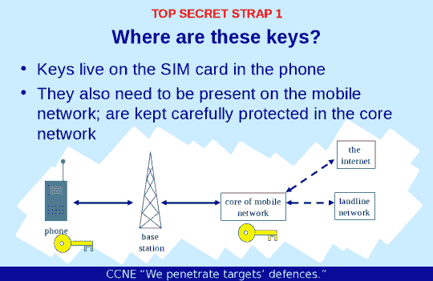

# 据报道，美国国家安全局窃取了数百万 SIM 加密密钥来收集私人数据 

> 原文：<https://web.archive.org/web/https://techcrunch.com/2015/02/19/the-nsa-reportedly-stole-millions-of-sim-encryption-keys-to-gather-private-data/>

美国国家安全局(NSA)和英国政府通信总部(GCHQ)，类似的秘密情报机构，从制造商那里窃取了 SIM 卡加密密钥，使这些组织能够解密全球蜂窝通信数据。

据 Intercept 报道，这一行动发生在 2010 年，情报机构闯入了一家荷兰公司金雅拓。该报告称，黑客为政府机构提供了监控“全球大部分手机通信”的能力。我们当然假设政府对其自身能力的描述是准确的。

**更新:**金雅拓表示正在调查此事，目前无法立即证实该报道。你可以在这篇文章的底部找到它的完整声明。

(金雅拓最近出现在科技媒体上，成为云存储和企业协作提供商 Box 的[新产品的合作伙伴，该产品旨在为其客户带来额外的加密。Box 拒绝对此事发表评论。)](https://web.archive.org/web/20230202083401/https://techcrunch.com/2015/02/10/box-introduces-new-client-controlled-encryption-tool-to-bring-stragglers-to-the-cloud/)

《拦截》的报道再次基于美国国家安全局前承包商雇员爱德华·斯诺登公布的文件。最初由斯诺登点燃的这场风暴在过去一年已经减弱，随着源自他发布的信息的披露速度放缓而减弱。

根据这份报告，NSA 和 GCHQ 成立了移动手机开发小组(MHET ),正如其名字所暗示的那样。

“这一披露意义重大，”电子前沿基金会的马克·鲁默德告诉 TechCrunch。“NSA 和 GCHQ 基本上拥有在世界任何地方破解移动通信的钥匙，即使没有当地通信运营商的参与(即使不多，也可以作为对情报机构行为的某种检查)。这就相当于这些机构为世界上数百万甚至数十亿家庭的大门印制了钥匙，以防他们有一天决定需要进入。坦率地说，人们应该对全球移动通信的安全性没有信心。”

NSA 幻灯片描述了它泄露的密钥。

今天的披露让人想起了斯诺登事件的早期，当时 XKeyscore 项目仍然是科技行业中引起 T2 轰动的事件:根据 Intercept 的说法，NSA 和 GCHQ 通过跟踪金雅拓员工的通信，使用 XKeyscore 作为他们的数据收集工具，成功渗透进了金雅拓。

因此，今天公布的是建立在工具之上的，隐私倡导者担心这些工具在首次详述时会被滥用。利用可能无辜的人的私人通信数据来窃取其他人的加密密钥，正是暗中运作的机构涉嫌滥用的那种过度行为。

我们已经联系了国家安全局和 GCHQ 进行评论，但还没有得到回复。

**更新:** GCHQ 发布了以下声明:

> 我们的一贯政策是不评论情报事务。此外，GCHQ 的所有工作都是根据严格的法律和政策框架进行的，这确保我们的活动是授权的、必要的和相称的，并受到严格的监督，包括来自国务卿、拦截和情报服务专员以及议会情报和安全委员会的监督。我们所有的运营流程都严格支持这一立场。此外，英国的监听制度完全符合《欧洲人权公约》。

美国公民自由联盟的克里斯托弗·索戈伊恩早些时候在推特上讽刺了这件事:

荷兰国会议员要求这两个组织对所谓的攻击做出回应:

当被问及除了金雅拓，是否还有其他团体成为目标时，格伦·格林沃尔德在给 TechCrunch 的一封电子邮件中回应说，“总的来说，我们不能对尚未报道的事情发表评论。”

单独来看，美国国家安全局闯入一家私人公司窃取个人加密密钥似乎令人震惊。然而，回想一下，美国国家安全局不仅仅满足于窃听那些[连接海外美国科技公司](https://web.archive.org/web/20230202083401/https://techcrunch.com/2013/10/30/nsa-infiltrates-google-and-yahoo-networks-report-says/)私人数据中心的电缆。这个特别的项目导致像雅虎和谷歌这样的公司大大增加了他们对各种形式的加密技术的使用。

如今，美国国家安全局及其英国同僚再次被证明对私有财产或隐私不太尊重。

此外，今天的发布表明，可能会有更多的国家安全局的活动曝光。这个事实值得记住，因为我们正在国会就更新《爱国者法案》的几个部分进行摊牌，该法案为 NSA 的部分监控提供了关键的法律基础，这些部分将自动失效。因此，很快就会有另一场关于监控和隐私的全国性辩论。像今天这份关于 SIM 卡、加密完整性和全球公民数据隐私的报告这样的故事，肯定会有助于为这场讨论定下基调。

**更新:**金雅拓发布了一份声明，称目前无法证实该报道，但打算调查该问题:

> 一份出版物昨日报道称，在 2010 年和 2011 年，一个由英国政府通信总部(GCHQ)和美国国家安全局(NSA)特工组成的联合小组侵入了刻在金雅拓 SIM 卡上的加密密钥，可能还侵入了其他 SIM 卡供应商的卡。该出版物指出，目标并非金雅拓本身，而是试图覆盖尽可能多的手机，目的是在未经移动网络运营商和用户同意的情况下监控移动通信。在这个早期阶段，我们无法核实该出版物的调查结果，也不知道这些机构正在开展这项行动。
> 
> 作为数字安全领域的全球领导者，金雅拓尤其警惕恶意黑客，多年来已经检测、记录并缓解了多种类型的企图。目前我们无法证明这些过去的企图和昨天报道的事情之间有联系。
> 
> 我们非常重视这份出版物，并将投入所有必要的资源来全面调查和了解
> 尖端技术的范围。
> 
> 最近报道了许多国家支持的攻击，所有这些都引起了媒体和企业的关注，这真正强调了当今时代网络安全是多么严重。