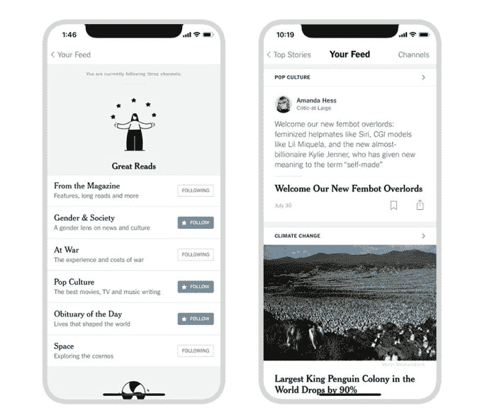

# NYT 在其 iOS 应用程序 中增加了一个个性化的“新闻源”

> 原文：<https://web.archive.org/web/https://techcrunch.com/2018/08/06/the-nyt-adds-a-personalized-news-feed-to-its-ios-app/>

周五,《纽约时报》宣布将在手机应用中加入自己对脸书风格新闻的理解。是的，随便一个*新闻*提要。该出版物表示，它现在将允许其 iOS 应用程序用户通过一个名为“Your Feed”的新功能来定制他们的阅读体验，该功能只包含读者选择关注的那些频道。其中一些频道将从《纽约时报》现有的版块和专栏中提取新闻，如《现代爱情》,而其他频道，如《T4 性别社会》、《战争》、《流行文化》等将从报纸的各个版块中提取新闻。其他的将包括记者和编辑的评论，并以《泰晤士报》以外的有价值的读物为特色。

这种额外的背景只会在这个个性化的你的 Feed 部分找到，并且该出版物表示这是一个为新闻和故事带来另一层洞察力的实验。在技术方面，通过使用后端工程师布兰登·霍普金斯(Brandon Hopkins)创建的机器人，评论本身实际上是从《纽约时报》的松弛部分提取的。它基本上将 Slack 变成了 CMS，用于将这些短文发布到应用程序的 Your Feed 部分。

设计团队将 Your Feed 阅读体验等同于人们阅读印刷报纸的方式。除了阅读头版新闻，人们通常会抽出他们想要阅读的部分，然后翻阅它们——遇到他们想要阅读的其他故事。不同的读者会被不同的板块和文章所吸引。

该公司表示，这一想法来自其用户研究，该公司发现，许多人希望有一个独立于主页的地方，以跟踪定制的内容提要。

《NYT》每天发表约 160 篇文章，当然，要想全面阅读整份报纸是非常困难的。但是这款应用已经允许用户通过点击它的导航来浏览它的许多部分。随着个性化订阅源的增加——就像在脸书和其他社交应用上一样——人们总是有开始将自己封闭在自己的新闻泡沫中的危险。如果应用程序的用户开始跳过首页和其他关键部分，直接进入这个自定义订阅源，他们可能会错过重要的新闻。

希望读者会选择使用新的 Your Feed 功能，作为他们整体新闻阅读体验的补充，而不是作为实际阅读报纸本身的替代品。

此外，NYT 表示，这些版块将由编辑负责管理，以确保可供选择的故事多样化。(谢天谢地——由人工智能和算法决定的新闻监管已经证明[次](https://web.archive.org/web/20230228122636/https://techcrunch.com/2016/08/29/facebooks-trending-topics-algorithm-mistake/)和[次](https://web.archive.org/web/20230228122636/https://www.theguardian.com/technology/2016/aug/29/facebook-fires-trending-topics-team-algorithm)都是一场灾难。以至于脸书最终放弃了，并且[完全放弃了它的趋势新闻部分](https://web.archive.org/web/20230228122636/https://techcrunch.com/2018/06/01/facebook-kills-its-trending-section/)。)此外，通过拥有一个人为编程的部分，编辑可以确保不会用故事淹没读者。

为了使用这一新功能，iOS 应用程序的读者可以从他们想要关注的 24 个频道中选择一个——这一想法与用户在 Twitter 或 Instagram 等社交应用程序上关注账户的方式没有太大区别。然后通读这一部分，现在在 iOS 应用程序中将有一个新的空间，标记为您的提要。

展望未来，NYT 表示，它将通过调整频道选择、提供更多关注频道的方式以及推出其他功能来进一步调整体验，同时对用户反馈和行为做出回应，为其设计选择提供信息。它还将尝试不同版本的保存故事、通知和更好地管理你在应用程序中的兴趣的方法。

该功能目前在 iPhone 和 iPad 上的 NYT iOS 应用程序中可用。出版商告诉我们，用户的反馈将决定它是否会扩展到更多的平台。我们知道，你的订阅源对所有已经安装了应用程序的用户都可用，但只有一半的新应用程序下载将获得该功能。