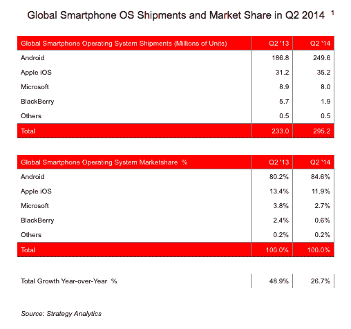
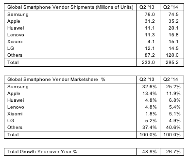

# 在 Q2 出货的 3 亿部智能手机中，安卓占了 85%

> 原文：<https://web.archive.org/web/https://techcrunch.com/2014/07/30/the-one-horse-race-android-represented-85-of-the-300m-smartphones-shipped-in-q2/>

谷歌的安卓系统不可阻挡地向移动领域进军，这又是一个里程碑:根据 T2 战略分析公司的一份新报告，该操作系统占 Q2 智能手机出货量的 85%,这是有史以来最高的比例。

谷歌的胜利对其他所有人来说都是损失，有趣的是，在智能手机市场整体下滑的情况下。苹果、Windows Phone 和黑莓都失去了市场份额，尽管本季度售出了近 3 亿部(准确地说是 2.952 亿部)智能手机，但智能手机的增长与一年前相比几乎减半。

这也可能对谷歌造成损失——根据路透社的一篇报道，Android 很可能因其主导地位而开始在欧洲受到调查。如果发现安卓在欧洲市场占有超过 80%的市场份额，就会引发调查。

然而，目前看来，谷歌可能仍然没有意识到这一点。Strategy Analytics 称，在 Q2，安卓系统占欧洲智能手机出货量的 73%。今天早些时候发布的 Kantar Worldpanel 的一份报告指出，根据 Kantar 在该地区五个主要市场进行的销售调查(不是出货量)，Android 目前在欧洲拥有 74%的份额。在平板电脑领域，安卓现在也占据了全球所有平板电脑出货量的 70%。

至于哪些设备制造商的业务最大，[分析师写道](https://web.archive.org/web/20221225131227/http://www.prnewswire.com/news-releases/strategy-analytics-xiaomi-becomes-worlds-5th-largest-smartphone-vendor-in-q2-2014-269323561.html)三星仍然牢牢领先，尽管其市场份额已从一年前的近 33%降至 25%(设备数量也略有下降，至 7450 万部)。

尽管苹果的销量刚刚超过 3500 万部，但它的份额和三星一样有所下降，现在不到 12%(一年前超过 13%)。虽然平台越来越多地整合到 Android 上，但在手机领域，这个领域更加开放。除了三星，前六名中的所有其他手机制造商的数量都有所增长。值得注意的是，中国新贵小米现在也首次进入前六名，市场份额略高于 5%(见下表)。

Strategy Analytics 表示，尽管智能手机销量继续增长，但增速明显低于过去。Q2 的出货量为 2.95 亿部，同比增长 27%，而去年同期为 49%。为什么？在一定程度上，这是因为尽管新兴市场仍在强劲增长，并拥有大量人口，但在这一点上，它们仍未能弥补更发达的大型市场如欧洲和美国的销售放缓，这些市场更早出现了智能手机热潮。

新兴市场意味着更大的价格压力，消费者的可支配收入可能会明显减少，并认为他们非常基本的功能手机已经足够好了，不管有没有应用。

“当前季度的全球智能手机增长处于五年来的最低水平，各地区之间存在很大差异，”该研究公司的董事琳达·苏(Linda Sui)在一份声明中指出。"非洲和亚洲正在蓬勃发展，而北美和欧洲正在走向成熟."然而，不断变化的潮流正好对谷歌有利。多年来，原始设备制造商一直在生产基于 Android 的低成本智能手机，这得益于该操作系统可以免费获得许可，以及基于 Android 的应用和服务生态系统不断增长。

没错，微软最近也开始让其 Windows Phone 平台免费获得许可，诺基亚也一直在推动低成本的 Lumia 智能手机，但这看起来太少了，也太迟了:Strategy Analytics 指出，由于中国和美国这两个巨大的关键市场增长乏力，Windows Phone 的出货量份额仅为 3%，低于一年前的 4%

事实上，许多竞争已经转移到低端市场。Strategy Analytics 的伍迪·吴(Woody Oh)指出，苹果及其 iPhone 手机也下跌了一个百分点，“因为其在低端智能手机市场的份额有限。”苹果占智能手机出货量的不到 12%(这与销售额不同，但相关联，因为它指出了零售商认为会畅销的产品，基于已经畅销的产品)。

正如研究主管 Neil Mawston 所描述的那样，我们正在形成的实际上是一场单一的竞赛:

“就像个人电脑市场一样，安卓即将把智能手机平台变成一场单人竞赛，”他写道。“它的低成本服务和用户友好的软件仍然对全世界的硬件制造商、运营商和消费者具有巨大的吸引力。竞争对手的操作系统供应商将不得不做一些革命性的事情来颠覆 Android 在智能手机出货量上的巨大领先优势。”

这个革命性的举动会是什么呢？莫斯顿认为，苹果“进军大屏幕平板手机市场”和 Mozilla 在低成本 Firefox 移动设备上的持续努力“是现阶段 Android 持续增长的唯一主要威胁。”鉴于 Firefox 尚未风靡全球，平板手机只是更大的屏幕，但在功能性方面没有更多的东西，如果这是革命性的，那么这似乎是一场非常无力的战斗。

图片: [Flickr](https://web.archive.org/web/20221225131227/https://www.flickr.com/photos/rbulmahn/6180104944/in/photolist-8Q713U-cwr9kY-adM5Y9-84k3xS-9XzRzZ-7VJhyr-83z8K5-aq7DTw-9BussZ-6kzXBW-83w6aa-6TYUqy-98qbVd-bttVPE-drdDdf-83zc5G-bmJtgf-89W1PC-bpGnL4-6T4zxf-9WRbGQ-6oHoaj-7Z2YXE-e1wXZE-8t3mqJ-c8f3yC-9mgbHk-kiJrYR-jPnPwv-89SKWD-89W1kG-89VZRs-89SKwT-89SKwa-89W1Bu-89VZDb-89W1kb-89W1jN-89W15E-83jUyV-f95MK4-9957fA-8rNmyh-9kUiFS-hFkrC7-9Y8USW-83w3j8-a1nZeu-6WQtw-83zdMU)