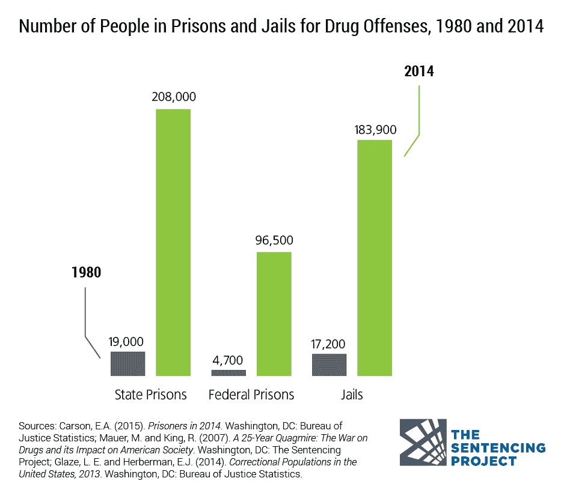
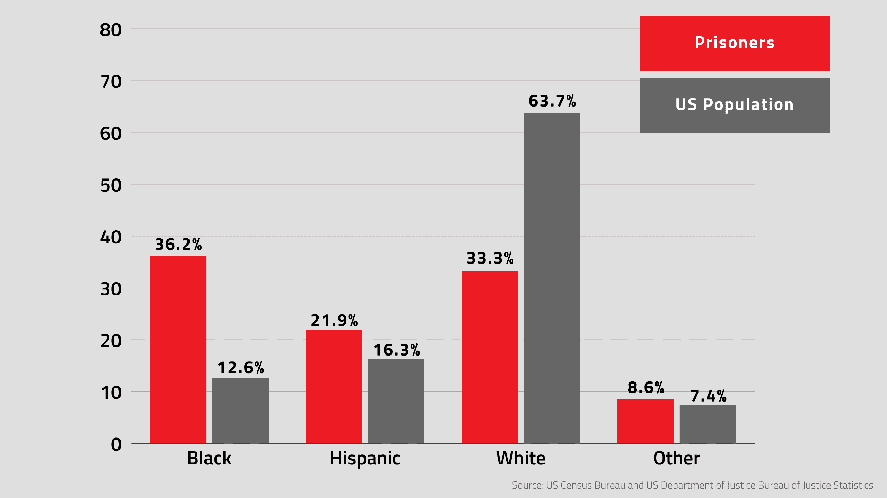
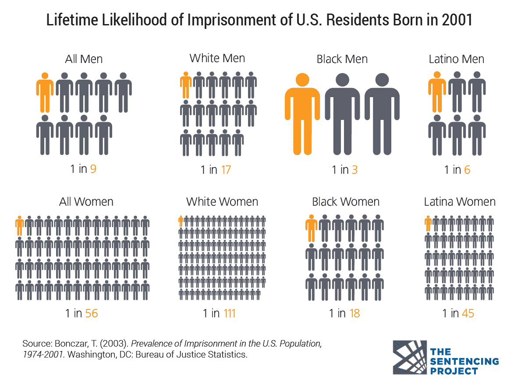

# 另一条管道 

> 原文：<https://web.archive.org/web/https://techcrunch.com/2016/07/31/the-other-pipeline/>

克里斯菲诺·肯雅塔·里尔从未想过自己会进监狱。他告诉我，他的设想是在 25 岁或 30 岁之前死去。

“我看到我周围这么多人在这么年轻的时候就去世了，所以我的长期愿景没有聚焦，”Leal 告诉我。“我只是专注于眼前的事情。”

1994 年，里尔被警察拦下，因为“身为黑人，却在一个他们可能认为我不该去的地方开着一辆好车，”他说。Leal 的一个朋友在车里，警察在他身上发现了一把枪。即使这位朋友作证说那是他的枪，Leal 还是被指控 [推定持有](https://web.archive.org/web/20230213020837/https://www.law.cornell.edu/wex/constructive_possession) 。这是他第三次犯罪。刑期:25 年到终身监禁。

十九年后，44 岁的里尔走出了监狱。尽管困难重重，他还是进入了科技行业。你可以说他是幸运儿之一。

克里斯菲诺·肯雅塔·里尔

克里斯菲诺·肯雅塔·里尔
“我看到我周围有那么多人在这么年轻的时候就死去，所以我的远景没有聚焦。”

当你听说科技领域的“管道问题”时，通常是关于硅谷科技生态系统缺乏多样性。管道争论的关键是没有足够的代表不足的少数民族和妇女追求计算机科学和编程知识。

苹果、谷歌和脸书等科技公司喜欢引用所谓的管道问题作为员工中代表性不足的少数群体和白人之间差异的原因。就在这个月， [脸书的全球多元化负责人再次指责](https://web.archive.org/web/20230213020837/https://techcrunch.com/2016/07/14/facebook-diversity-report-code-org/) 公司数量微薄的黑人和棕色人种员工缺乏可用人才。这遭到了整个科技行业多样性和包容性倡导者的批评和愤怒。

虽然渠道肯定是问题的一小部分，但还有其他因素影响着技术的多样性——包容和归属。雇佣代表性不足的少数族裔是一回事，但让他们感到被包容和被需要是另一回事。经常导致的结果是所谓的“漏桶”现象，这种现象描述了有色人种进入一个空间并最终离开，因为他们在同事手中经历了无意识的偏见。

在过去的一年里，科技行业已经开始解决工作场所中无意识的偏见。例如，脸书甚至建立了一个名为“管理无意识偏见、 ”的 [资源网站，希望其他科技公司能够借鉴脸书的最佳实践。](https://web.archive.org/web/20230213020837/https://managingbias.fb.com/)

> 我们的刑事司法系统天生带有种族偏见。 —安娜·萨莫拉，北加州美国公民自由联盟刑事司法政策主任

**然而，对话中缺少的是另一个 管道——刑事司法系统。系统性的种族主义是这一多方面、其他渠道的根源。这导致比例失调的少数民族，尤其是黑人，最终锒铛入狱——有时直接从教室里出来。**

 **根据国家教育统计中心的一份报告 ，全国公立学校有超过 43000 名学校资源官，其中包括有权逮捕儿童并将其送入监狱的职业执法人员。这条从学校到监狱的管道不成比例地影响着年轻的黑人和棕色人种。

北加州美国公民自由联盟的刑事司法政策主任安娜·萨莫拉告诉我:“学校纪律问题仍然是一个重要的驱动因素。”。“倒退且极具惩罚性的学校纪律政策有将某些年轻人引向某个特定方向的趋势，这是学校到监狱管道的基础。”

与此同时，由于缺乏数据，几乎不可能量化系统性种族主义对刑事司法系统的影响。就目前的情况而言，没有办法测量和展示模式。

“我认为我们的刑事司法系统天生就带有种族偏见，这是一个巨大的因素。我不知道它是否是一个渠道，但它是一个巨大的贡献者，”她说。“我们已经制定了一些非常严厉的法律和执法工具，以确保某些人将被监禁。”

萨莫拉说，很难确定发生了什么，因为我们实际上没有信息，所以我们无法确定模式。刑事司法系统缺乏数据。事实上，几乎没有。

萨莫拉说:“我们无法分析执法部门如何以及为什么做出某些决定，或者为什么某些人被指控犯有重罪，而其他人却因完全相同的罪行被指控犯有轻罪。”。“这是我们需要获取的信息。”

在当今科技行业缺乏多样性的情况下，刑事司法系统扮演着重要的幕后角色。如果不首先检查刑事司法系统，我们就无法有效地解决技术的多样性和包容性问题。

受惩教系统控制的黑人数量惊人。

今天，有更多的非裔美国成年人受到惩教机构的控制——在监狱里，在缓刑期或假释期——“比 1850 年被奴役的人还多，那是内战开始前的十年，”法律学者和作家米歇尔·亚历山大在她的书《[新吉姆·克劳:色盲时代的大规模监禁](https://web.archive.org/web/20230213020837/http://newjimcrow.com/)》中写道，“引用了[皮尤慈善信托报告《皮尤中心关于美国的研究](https://web.archive.org/web/20230213020837/http://www.pewtrusts.org/~/media/assets/2009/03/02/pspp_1in31_report_final_web_32609.pdf)》中的数字。”

20 世纪 50 年代末，种族隔离主义者开始使用法律与秩序的言辞，旨在让白人反对民权运动。他们对民权抗议是犯罪行为而非政治行为的说法负责，他们的论点是抗议助长了犯罪的蔓延。

虽然在这段时间里犯罪率上升了，但其原因是复杂的。婴儿潮一代在 15 至 24 岁年龄组的年轻男性中占了一个高峰，这在历史上是大多数犯罪的原因。亚历山大将这一时期以及由此导致的大规模监禁称为“新的吉姆·克劳”

亚历山大在她的书中写道:“人口中年轻男性的激增恰好发生在黑人男性失业率急剧上升的同时，但媒体并没有探讨导致犯罪率上升的经济和人口因素。”。相反，犯罪报道被耸人听闻，并被作为非裔美国人民权运动事件后法制、道德和社会稳定崩溃的进一步证据

1964 年 [民权法案](https://web.archive.org/web/20230213020837/http://www.history.com/topics/black-history/civil-rights-act) 通过后，正式结束了公共场所、就业、投票和教育领域的歧视，公众焦点转移到犯罪上。当 1968 年马丁·路德·金遇刺后爆发骚乱时，媒体上与之相关的种族形象助长了种族隔离主义者的论点，即黑人的民权导致了犯罪的增加。与此同时，在 20 世纪 60 年代至 80 年代期间，保守派开始质疑福利，让努力工作的白人与不愿工作的黑人对立起来。

亚历山大在《新吉姆·克劳》(The New Jim Crow)(第 48 页)中写道:“对工人阶级白人来说，一个不那么微妙的信息是，他们缴纳的税款将用于支持针对黑人的特殊项目，而这些黑人根本不配享受这些项目。”。

转折点出现在 1971 年，当时理查德·尼克松总统呼吁向毒品宣战，并将非法毒品称为“头号公敌”犯罪和福利最终成为罗纳德·里根 1980 年总统竞选的主题，他使用了种族编码的修辞和策略。

抗议学生隔离的示威者，1963 年。(国家档案馆/新闻人物)1963 年 5 月，伯明翰，种族隔离抗议期间，孩子们遭到袭击。1964 年 7 月 2 日，林登·约翰逊总统签署民权法案。(环球历史档案馆/盖蒂图片社)小马丁·路德·金，费城，1965 年(罗尔斯出版社/波普福特/盖蒂图片社)小马丁·路德·金遇刺后的骚乱余波。(李·巴尔特曼/生活图片集/盖蒂图片社)

罗纳德·里根总统实现了尼克松的愿望。尽管事实上毒品的使用在下降，但在 1982 年，他正式向毒品宣战，声称非法毒品是对国家安全的威胁([非正义的政治:美国的犯罪和惩罚](https://web.archive.org/web/20230213020837/https://www.amazon.com/Politics-Injustice-Crime-Punishment-America/dp/0761929940))，作者凯瑟琳·贝克特和西奥多·萨森，163 页)。

根据美国政府 1990 年的预算，1980 年至 1984 年间，联邦调查局的禁毒资金从 800 万美元增加到了 9500 万美元(凯瑟琳·贝克特，第 53 页)。相比之下，对负责药物治疗、预防和教育的机构的供资则有所减少。例如，根据美国国家药物管制政策办公室[1992 年的数据，T2 国家药物滥用研究所](https://web.archive.org/web/20230213020837/https://www.whitehouse.gov/ondcp)的预算从 1981 年的 2.74 亿美元增加到 1984 年的 5700 万美元。

与此同时，在 20 世纪 80 年代初，市中心的社区正遭受经济崩溃。黑人市中心社区感受到全球化和去工业化的影响最深。

早在 1970 年，在大都市地区工作的黑人中就有 70%以上从事蓝领工作(威廉·朱利叶斯·威尔逊，《工作消失时:新城市穷人的世界》。到 1987 年，黑人男性的就业率下降到 28%(约翰·卡萨达，《城市工业转型与下层阶级》，美国政治和社会科学院年报 501，第 1 号[1990])。

1985 年，在里根宣布向毒品宣战的几年后，快克可卡因走上街头。此后的调查表明，政府在市中心黑人社区的街道上埋设了裂缝、[、，正如亚历山大·科伯恩和杰弗里·圣克莱尔的著作《white out:CIA、毒品和新闻》(Whiteout: The CIA、毒品和新闻、](https://web.archive.org/web/20230213020837/https://www.amazon.com/Whiteout-Drugs-Press-Alexander-Cockburn/dp/1859841392/ref=mt_hardcover?_encoding=UTF8&me=)、以及米歇尔·亚历山大所言。

“中央情报局在 1998 年承认，它在尼加拉瓜积极支持的游击队向美国走私非法毒品——这些毒品以快克可卡因的形式出现在内城黑人社区的街道上，”Alexander 在她的书中写道(第 6 页)。

低收入的黑人社区缺乏合法的工作机会，再加上非法毒品流入这些社区，形成了贩卖毒品的动机。里根政府抓住机会宣传快克可卡因的流行，耸人听闻地报道它的出现。这些耸人听闻的媒体宣传一直持续到 1989 年。

在那段时间，对黑人的种族歧视是由经济崩溃造成的失业和袭击黑人社区街道的快克流行病引发的。考虑到这一点，白人支持“严厉打击犯罪”的倡议，以及反福利措施。毒品战争最终给了白人一个简单的方法来歧视黑人和表达敌意，而不会被指责为种族主义。

这种对影响有色人种的问题采取强硬态度的普遍态度始于 20 世纪 60 年代，主要是保守派在发表这种言论。但到 20 世纪 80 年代末，希望从共和党手中夺取政治控制权的民主党人开始参与进来。为了做到这一点，他们必须赢回摇摆不定的选民，这些选民因为共和党在犯罪和毒品问题上的立场而倾向于共和党。随着两党都登上“严厉打击犯罪”的列车，监狱和服刑人口急剧增加。

根据量刑项目的数据，美国因毒品犯罪被监禁的人数从 1980 年的 4.1 万人增加到 2014 年的近 50 万人。监狱人口的增加不成比例地影响了非洲裔美国人社区，1990 年，20-29 岁的年轻黑人男子中有四分之一在刑事司法系统的控制之下，根据判刑项目[。](https://web.archive.org/web/20230213020837/http://www.sentencingproject.org/wp-content/uploads/2016/01/Young-Black-Americans-and-the-Criminal-Justice-System-Five-Years-Later.pdf)

根据美国卫生与公众服务部 2000 年的一项调查，6.4%的白人、6.4%的黑人和 5.3%的西班牙裔使用非法药物。但是，尽管这些相似的吸毒率，黑人男子被送进州立监狱的毒品指控率是白人男子的 13 倍以上。这种差异是有原因的。

当比尔·柯林顿竞选总统时，他说他不会让任何共和党人被认为比他更严厉。在他的第一个任期内，他签署了 1994 年的[暴力犯罪控制和执法法案。](https://web.archive.org/web/20230213020837/https://www.ncjrs.gov/txtfiles/billfs.txt)

该法案包括三击出局条款，规定被判犯有三项或三项以上重罪的罪犯终身监禁，不得假释。这项 300 亿美元的法案还引入了一些新的联邦死罪，并批准了超过 160 亿美元的州监狱拨款以及州和地方警察力量的扩张。

根据司法政策研究所的数据，克林顿政府的犯罪政策导致了历史上任何一位美国总统的联邦和州监狱囚犯人数的最大增长。

克林顿总统随后将注意力转向福利政策，签署了《个人责任和工作机会协调法案》。该法案对福利援助施加了五年的限制，并终身禁止任何被判犯有使用或持有毒品(包括持有大麻)重罪的人获得食品券和福利。

克林顿还让政府更容易拒绝向任何有犯罪史的人提供公共住房。结果，数百万穷人，尤其是毒品战争的目标种族少数群体，最终无家可归。有犯罪记录的人获得联邦学生资助的资格也是有限的，并且在申请工作时必须表明他们的记录中是否有重罪。

根据美国司法统计局的数据，2002 年，美国有超过 200 万人入狱。此外，由于克林顿时代的政策，还有数百万人在被释放后仍然被刑事司法系统关押，因为他们在就业、住房和接受教育方面受到歧视。鉴于美国社会的合法性和歧视性，累犯率仍然很高。

今天，根据判决项目的统计，在美国[220 万被关押在成人教养系统的人中，黑人和拉丁美洲人约占 150 万，或监狱人口的 67%，而在美国总人口中，黑人和拉丁美洲人仅占 37%。这是因为黑人的入狱率是白人的近六倍。](https://web.archive.org/web/20230213020837/http://www.bjs.gov/content/pub/pdf/cpus14.pdf)

但是黑人的入狱率并不比白人高，因为他们犯了更多的罪。例如，使用毒品的白人是黑人的五倍，但非洲裔美国人因毒品犯罪而入狱的比率是白人的十倍。

此外，黑人因毒品犯罪服刑的时间(58.7 个月)几乎与白人因暴力犯罪服刑的时间(61.7 个月)一样长。数百万黑人成年人因此无法探索科技领域的机会，不管他们是否愿意。

与此同时，根据 2013 年来自住宿安置少年人口普查的数据，有色人种青年占了 63%以上，即 22，669 人。这还不包括那些被送到成人监狱的人。根据判刑项目分析的数据，截至 2014 年，成人监狱中有 5235 名青少年。在全国范围内，黑人占监狱中年轻人的 37 %,这使得成人监狱中的年轻黑人男子达到 1936 人。

与此同时，根据儿童趋势数据库的数据，早年受到刑事司法系统影响的有色人种年轻人更有可能在晚年被监禁，在这些青少年中心面临性侵犯和虐待的风险，并遭受心理健康问题的困扰(近 70%)。

正如任何种族种姓制度的目的一样，大规模监禁的作用是界定什么是种族，它完成了与吉姆·克劳法相同的事情:将黑人与主流社会隔离。

正如亚历山大所写，美国的奴隶制将黑人定义为奴隶，歧视性法律的吉姆·克劳时代将黑人定义为二等公民，大规模监禁时代——我们当今的种族种姓——将黑人定义为罪犯。

在美国，科技行业雇佣了超过 670 万人，是美国经济的重要组成部分。根据非营利 It 贸易协会 CompTIA 的数据，它在过去五年中连续增长，今天技术占美国国内生产总值的 7.1%，占私营部门总工资的 11.6%。今年，科技行业的就业增长率达到了十多年来的最高水平。

黑人仅占脸书、谷歌和 Dropbox 员工总数的 2%。我们知道这一点，因为在过去的几年里，科技公司已经变得更愿意发布他们的 EEO-1 多样性数据，并发布[多样性报告](https://web.archive.org/web/20230213020837/https://techcrunch.com/tag/diversity-report/)。另一个最近的趋势是[雇用多元化和包容性的负责人](https://web.archive.org/web/20230213020837/https://techcrunch.com/2015/09/07/why-are-tech-companies-really-looking-for-heads-of-diversity/)。不幸的是，这些努力似乎还不够，因为有色人种在科技公司中的代表性没有太大改善。

与此同时，在董事会一级代表不足的少数族裔人数甚至更少。2014 年，在 20 家主要科技公司的董事会中，只有三名黑人和一名拉美裔人，根据 Jesse Jackson 牧师的彩虹推动联盟 的调查， [。杰克逊在推动科技多元化方面发挥了重要作用，他坚持要求公司发布多元化数据，并承诺在公司各级别(包括董事会)聘用代表性不足的少数族裔。](https://web.archive.org/web/20230213020837/http://www.rainbowpush.org/index.php/news_links/single/usa_today_rainbow_push_survey_-_few_blacks_hispanics_among_top_tech_executi)

杰克逊和他的组织致力于这一推动，因为他说，技术的多样性是我们这个时代的民权问题。

“一场民权运动是为了结束合法的奴隶制，” [杰克逊在四月份告诉我](https://web.archive.org/web/20230213020837/https://techcrunch.com/2016/04/28/the-fire-inside-rev-jesse-jackson/) 。另一个是结束合法的种族歧视和私刑季节。那是当时的民权运动。另一个是投票权。你可以废除奴隶制，摆脱种族歧视，参加选举，你可以一贫如洗，没有资本、工业和技术，没有交易流程和关系。这是我们这个时代的公民权利:获得资本，使用计算机，如何制造它们，如何出售它们。”

【YouTube https://www.youtube.com/watch?v=AGiKU9BZYH0?version=3&rel = 1&fs = 1&auto hide = 2&showsearch = 0&showinfo = 1&iv _ load _ policy = 1&wmode = transparent】

科技行业缺少黑人，并不是因为缺乏兴趣、知识、技能或动力。相反，眼下有几个问题，都与系统性的种族主义和歧视有关。 首先是科技行业没有充分利用多样化的人才储备。

“虽然‘管道’理论和对美国教育系统提供足够大、训练有素和多样化劳动力的能力的担忧有一些道理，但还有其他因素在起作用，” [平等就业机会委员会的最新报告《高科技中的多样性》指出。](https://web.archive.org/web/20230213020837/https://techcrunch.com/2016/05/18/equal-employment-opportunity-commission-says-tech-industry-is-underutilizing-diverse-talent-pool/)

例如，美国顶尖计算机科学项目的毕业生中，约有 9%来自代表性不足的少数群体。然而，只有 5%的大型科技公司员工属于这一群体。这就出现了不太可能出现的情况，要么该领域的主要雇主无法从顶尖学校吸引到 9 名代表名额不足的少数族裔毕业生中的 4 名，要么顶尖学校几乎一半的少数族裔毕业生不符合他们所受教育的职位要求。”

> 我们正在与真正系统性的种族主义作斗争，这种种族主义不仅存在于这些公司的组织结构中，也存在于我们整个国家的组织结构中。

——金伯利·布莱恩特，黑人女孩守则创始人

第二个是制度化的种族主义，它导致数百万有色人种消失在监狱里，因为毒品犯罪而被关起来，而当白人犯下这些罪行时，很大程度上被忽视。

因此，由于制度化的种族主义，代表性不足的少数群体要么被关进监狱，要么被这个国家的刑事司法系统抓住，要么由于偏见和一些个人种族主义的隐蔽行为，他们被锁在科技行业之外。

“我们正在与真正的系统性种族主义作斗争，这种种族主义不仅存在于这些公司的组织结构中，也存在于我们整个国家的组织结构中，”[黑人女孩代码](https://web.archive.org/web/20230213020837/http://www.blackgirlscode.com/)创始人金伯利·布莱恩特[在二月份告诉我](https://web.archive.org/web/20230213020837/https://techcrunch.com/2016/02/01/black-girls-code-founder-kimberly-bryant-on-racism-and-implicit-bias/)。

处于刑事司法系统的控制之下会对一个人的生活机会产生负面影响，并使其在申请工作、住房和贷款时受到歧视成为合法。结果，成千上万的有色人种年轻人错过了参加传统学校、黑客马拉松、编码学校和科技公司实习的机会。

为了确保每个人都有进入科技行业的公平机会，我们需要关注另一条管道——这条管道导致不成比例的黑人和其他少数族裔最终入狱。

【YouTube https://www.youtube.com/watch?v=KGtPOGKZKUM?version=3&rel = 1&fs = 1&auto hide = 2&showsearch = 0&showinfo = 1&iv _ load _ policy = 1&wmode = transparent】

最初被判 25 年至终身监禁，Leal 服刑 19 年——先是在鹈鹕湾监狱，然后在圣昆廷监狱——多亏了加州三振出局法的颁布和修订。

Leal 第一次进入刑事司法系统是在 1991 年，当时他承认了两起抢劫案，罪名是从一家餐馆的保险箱和收银机里偷钱。一次抢劫两次。Leal 于 1994 年被释放，也就是三振出局法颁布的时候，所以一次抢劫的两次指控意味着两次出局。

“我一直希望我能出去，”里尔说。“这件事一直非常非常清晰地留在我脑海中。我可以看到隧道尽头的光明。我不在乎他们给我多少时间，也不在乎别人说什么。我一直相信我会出去的。我只是不知道什么时候。所以，这其实就是让自己为这个机会做好准备，以便当它真的到来时，我能做好准备。”

2010 年，他被判了 16 年的无期徒刑，没有任何出狱的迹象，Leal 和跨媒体资本的普通合伙人 Chris Redlitz 一起在圣昆廷监狱里帮助开始了 [【最后一英里】](https://web.archive.org/web/20230213020837/http://thelastmile.org/) 。最后一英里教人们如何编码和创办自己的公司。它与科技公司合作，帮助参与者在出狱后获得实习和有偿工作。Leal 于 2012 年与第一批男性一同毕业。

“当我们上完第一堂课时，有些人正准备离开，我找到我投资组合中的一些人，对他们说，‘我们找到了这些人。我认为他们已经做好了准备，但他们已经在监狱里呆了 15 年多，他们并不真正了解技术，而且他们已经很长时间没有工作了，我真的请求[科技公司]参与我们的实习计划，”雷德利兹告诉我。

曾经的囚犯一旦加入这些科技公司，就会变得非常优秀。Leal 是 Redlitz 提到的员工之一。

2012 年，加州选民 [通过了第 36 号提案](https://web.archive.org/web/20230213020837/http://www.courts.ca.gov/20142.htm)，这导致了 1994 年犯罪法案 三振出局条款的修订。对法律的两项主要修改是，第三次犯罪必须是严重或暴力的重罪，目前正在服第三次犯罪刑期的人可以请求法院将他们的刑期减为第二次犯罪刑期——如果根据新法律他们有资格被判第二次犯罪的话。

对里尔来说，这意味着他可能会因潜在的重新判决而会见法官。2013 年，Leal 会见了最初判处他 25 年至终身监禁的同一名法官。法官重新判了 Leal 7 年，一周后 Leal 出狱。

“这可能是我感觉到的最好的感觉，”里尔告诉我。“太神奇了。坐牢是一回事，但被判无期徒刑是一回事——我甚至无法解释这有多艰难，因为你可能真的会死在监狱里。谁他妈想死在监狱里？有不确定性，不知道你什么时候才能出来，这真的很难，所以当我走出那里时，这可能是我一生中最美好的时刻之一。”

在圣昆廷监狱的最后一英里， Leal 遇到了 RocketSpace 的首席执行官 Duncan Logan，他是 Redlitz 的朋友，他说他以前从来没有去过监狱。[rocket space](https://web.archive.org/web/20230213020837/http://www.rocketspace.com/)是一个合作加速器，已经容纳了优步、Spotify 和 Leap Motion 等初创公司。

“实际上，我在演示日之前去做了一些辅导，”Logan 告诉我。“这让我有些震惊。它粉碎了我对自己将会看到或经历的一切幻想。”他告诉我他对刑事司法系统有不同的看法。他告诉我，之前，他还沉浸在“如果我们除掉(罪犯)，这里会变得更好”的想法中。“我对犯罪有一个相当普遍的误解。当然，在对什么是惩教系统以及它可能是什么的完全误解中——我认为我已经经历了一个完全的转变。”

当演示日到来时，Logan 回到了圣昆廷，并对 Leal 的演示印象深刻。洛根告诉里尔，如果他出狱，他会雇用他。他信守诺言。对于 Leal，Logan 说:“他比坐在这里的大多数员工取得了更多的成就。”

Leal 于 2013 年加入 RocketSpace，一年前他从圣昆廷监狱被释放。从那以后，他从在 RocketSpace 搬运家具，到安装 IT 设备，并作为 RocketSpace 的校园服务经理进行一些编程。在从监狱到科技行业的转变中，Leal 看到了许多相似之处。

> 坐牢是一回事，但被判无期徒刑是一回事——我甚至无法解释这有多艰难，因为你可能真的会死在监狱里。

—克里斯菲诺·肯雅塔·里尔

Leal 说:“关于 RocketSpace 和整个 RocketSpace 的技术中心，我立即注意到的一件事是那里有很多能量。“在监狱里有很多能量。最大的不同是，监狱里的很多能量都是混乱的。在 RocketSpace，一切都集中在这些目标上，并试图将该产品推向市场，筹集资金，取得成功。

“所以我认为在监狱里有一种态度，那就是尽你所能工作。在监狱里，一切都是关于最小可行的产品。这也有相似之处。我认为，我所发现的关于企业家精神和技术世界的最大相似之处之一是，失败并不是一件坏事。失败其实是一件好事。你可以从失败中学到东西。”

科技行业的人们已经采取了一些措施，为那些经历过刑事司法系统的人创造机会。是时候关注人们进入刑事司法系统之前发生的事情了。

总的来说，在美国，黑人比白人更有可能被逮捕，一旦被捕，黑人更有可能被定罪，根据量刑项目。一旦被判有罪，黑人比白人更有可能面临严厉的判决。

技术和数据可以在拆除导致不成比例的黑人男性入狱的系统中发挥重要作用。

根据美国公民自由联盟的萨莫拉，缺乏关于刑事司法系统各阶段的统一数据收集。

“从人们被阻止到整个审判过程的一切，以及整个过程中如何做出决定以及这些决定如何影响不同的社区，”萨莫拉说。"所以，在刑事司法中有一个巨大的数据空白."

在科技的帮助下，只要将政府掌握的数据公之于众，刑事司法系统就会变得更加透明。

司法部长卡玛拉·哈里斯办公室的司法部长特别助理贾斯汀·厄尔利希告诉我，现在，很多人觉得在当地警察部队和整个系统中发生的事情有点像黑匣子。Erlich 说，这是因为刑事司法机构使用的许多技术和基础设施都非常陈旧。

“这不一定是因为人们试图隐藏或不分享数据，因为手动获取和提取数据实际上非常困难，”埃尔利希说。“我认为，确保我们共同努力将现代技术引入所有这些机构，对于我们真正能够使用 API 或云提取来分析和研究正在发生的事情至关重要。”

Erlich 领导的团队最近重新启动了[open Justice，这是加州司法部为使执法数据更加透明而做出的一项努力](https://web.archive.org/web/20230213020837/https://techcrunch.com/2016/02/17/california-dojs-openjustice-platform-makes-local-law-enforcement-data-more-transparent/) 。但为了取得重大进展，并向实时刑事司法数据报告和更好的政策迈进，Erlich 说，我们需要政府和领先的技术公司之间建立更多的公私合作伙伴关系。

> 让更多的技术和技术产业参与到刑事司法工作中来是有好处的。

—贾斯汀·厄尔利希，AG 卡玛拉·哈里斯办公室特别助理司法部长

Erlich 说，到目前为止，已经有一些来自像脸书这样的公司的高层支持，但是还需要更多的支持。

技术也有助于更好地理解如何通过预审和保释改革减少进入刑事司法系统的人数。

“我们可以利用技术来更好地跟踪人们，而不是把他们关起来，这样他们就不必一开始就进入系统，”埃尔利希说。“在后端，我们可以开始培训人员，这将有助于技术池的多样化。这不仅仅是从人口统计学的角度，也是从世界观的角度。我认为重要的是，很多最终接触到这个体系的人会被安排到他们可以采取行动改革它的地方。”

厄尔利希说，不是每个人都经历过刑事司法系统，所以与他人分享这种观点很有价值。

“让更多的技术和技术行业参与刑事司法工作不仅对社会本身有利，而且也直接有利于技术行业，”Erlich 说。

与此同时， [白宫最近向人工智能专家发出挑战，要求他们帮助改革刑事司法系统](https://web.archive.org/web/20230213020837/http://www.govtech.com/White-House-Challenges-Artificial-Intelligence-Experts-to-Reduce-Incarceration-Rates.html) 。白宫警方数据倡议负责人 Lynn Overmann 在计算社区联盟研讨会上发表讲话说，人工智能和数据分析可能有助于改善假释筛查的问题，分析警察身体摄像机镜头和分析刑事司法数据。例如，自从部署了人体摄像头后，加州奥克兰的警察和市民使用武力的数量都有所下降。

也就是说，将技术引入刑事司法系统并不一定意味着它会带来好处。在美国的某些州，法院正在使用算法软件来预测某人未来犯罪的可能性。例如，在分析佛罗里达州布劳沃德县的风险得分时，ProPublica 的调查小组发现，判决过程中使用的软件对黑人有偏见。然而，软件背后的私人公司可以努力克服这种偏见，如果他们决定实施更新。

通过改革刑事司法系统，也有机会填补科技行业所谓的劳动力短缺。通过“最后一英里”等项目和其他向前囚犯教授技术技能的积极方法，科技行业可以获得尚未开发的人才，同时解决多样性问题。

“不幸的是，我们知道我们有两个截然不同的多样性问题，”厄尔利希说。“一个是在科技领域。出于多种原因，我们没有我们所希望的多样化的劳动力。同样，不幸的是，也是因为许多社会原因，那些进入刑事司法系统的人没有以不同的方式多样化，也就是说，他们是不成比例的少数民族和非洲裔美国人，我认为这两种结果都是我们正在努力解决的更广泛的社会问题的一个例子。

对我们来说，这是一个真正专注于解决这两个问题的机会，也就是我们如何利用技术更好地了解如何减少进入系统的污染物。"

解决刑事司法系统中的不公平和种族正义问题将为有色人种社区提供更多机会，以多种不同方式繁荣发展。

“刑事司法系统确实体现了我们国家的许多种族问题，”萨莫拉说。“所以如果我们能解决这个问题，我认为我们会看到很多积极的变化。”

###### *布莱斯·德宾的特色图片/亚沙德·库尔卡尼的照片*

**