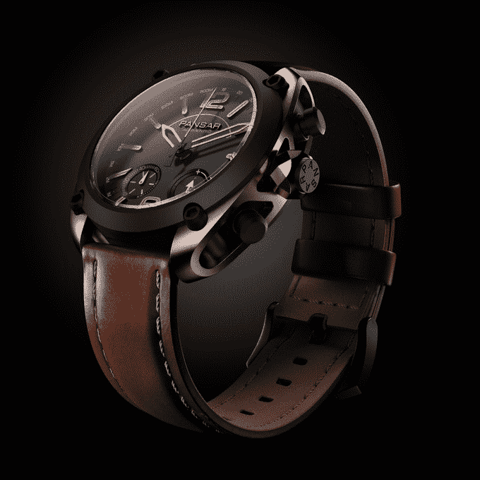

# Pansar Augmented 手表将智能隐藏在模拟面孔之后 

> 原文：<https://web.archive.org/web/https://techcrunch.com/2018/09/04/the-pansar-watch-hides-it-smarts-behind-an-analog-face/>

# Pansar Augmented 手表将智能隐藏在模拟面孔之后

Pansar Augmented 是一款瑞典智能手表，看起来像一款标准的三指针手表。但是，只需点击一个按钮，您就可以查看多个数据点，包括天气、通知，甚至是 CRM 中的销售数据。

Pansar 是一家瑞典手表公司，使用瑞士机芯和手工组装部件，为你的标准手表增添一丝奢华。

这款手表在 [Kickstarter](https://web.archive.org/web/20221206220342/https://www.kickstarter.com/projects/2027940128/pansar-augmented-watch-stay-connected-to-your-pass) 上获得了全额资助。早起的鸟儿需要 645 美元。

手表主要显示时间，但当数据系统被激活时，指针会移动以显示您想要的任何数据。

> 这个世界充满了有趣的数据:无论是寻找完美波浪的信息，跟踪你的股票价值，还是从昨天开始你获得的关注者数量。Pansar Augmented 收集对你重要的数据，并将其方便地传输到你的手表上。这之所以成为可能，是因为独特的双向瑞士机芯与 Pansar Augmented 应用程序相结合。

这款手表有三种型号:海洋版，显示“天气、风力和涌浪等相关数据”，加速器版，显示网站访问量或 Instagram 浏览量，以及量化版，用于希望跟踪销售数据的“分析思维”。

这绝对是传统智能手表愿景的一个聪明的转变，由于一些漂亮的造型，这些可能是不想让普通苹果手表或安卓穿戴设备分心的人的一些好东西。