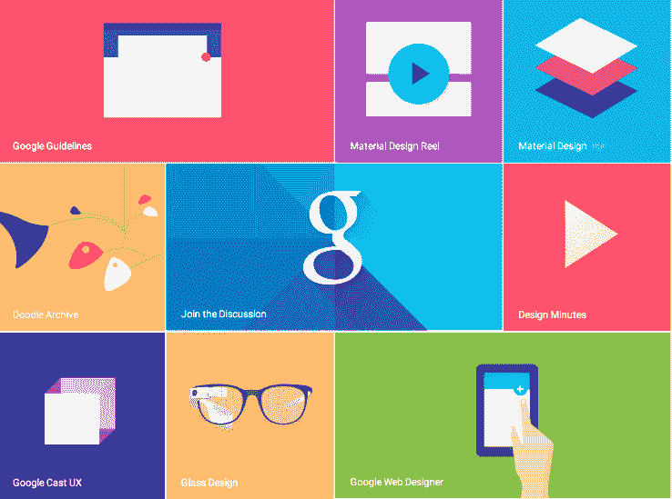

# 硅谷设计的过去、现在和未来

> 原文：<https://web.archive.org/web/https://techcrunch.com/2017/04/30/the-past-present-and-future-of-design-in-silicon-valley/>

史蒂夫·瓦萨洛撰稿人

More posts by this contributor

*以下节选自 [The Way to Design](https://web.archive.org/web/20230323204520/https://thewaytodesign.com/) ，这是成为设计师创始人和建立以设计为中心的企业的指南。经作者许可改编转载。*

直到最近，硅谷的成功还需要几乎一心一意地专注于一个组织的技术实力。这意味着有一个无可指责的技术创始人，10 倍的工程师，对计算优势的不懈投入。将宝贵的时间花在其他事情上——尤其是设计——是对公司实际工作的干扰。

但是在短短的几年里，事情发生了巨大的变化，设计越来越像技术一样不可或缺。这种显著的转变有三个原因。首先，不管你是在做硬件还是托管软件，在过去的 25 年里，原型、生产和发布产品的底层技术变得更好、更便宜、更快。免费且易于使用的 CAD 软件、3D 打印和众筹让设计、销售和运输变得前所未有的简单快捷。

工程师曾经依赖原始编程语言来创建软件；今天，他们从开源库和预先存在的技术平台中构建。特别是在消费者互联网世界，软件的边际成本为零——而设计现在是区分因素。

“现在对新公司的期望要高得多，”Airbnb 的乔·格比亚(Joe Gebbia)在我采访他时对我说，“因为他们在六个月(10 年前)做的事情，现在一周就能完成。”因此，“人们必须带来更多的价值。”

设计占据中心舞台的第二个原因是消费者的期望已经发生了变化。即使在不久前，企业也不会因为对设计的重视不够而注定失败。自由世界的抽屉底部散落着设计拙劣的产品，这些产品由于出色的销售和营销而畅销。但是公众已经开始期待更多。

多亏了像[比尔·莫格里奇](https://web.archive.org/web/20230323204520/https://www.ideo.com/people/bill-moggridge)、[大卫·凯利](https://web.archive.org/web/20230323204520/https://www.ideo.com/people/david-kelley)和[史蒂夫·乔布斯](https://web.archive.org/web/20230323204520/https://en.wikipedia.org/wiki/Steve_Jobs)这样的远见卓识者的工作，人们希望在与技术的互动中获得专注于用户的、无摩擦的体验。乔布斯的影响尤其明显。也许没有一款产品比 iPhone 更能重塑人们对设计技术的期待。自从 10 年前发布以来，消费者对实用、美观的产品体验的需求越来越强烈。

相比之下，你可以沿着 Palm 的死亡之路一直追溯到它的首席营销官所说的:“设计是一种商品。”

摄影:Vasily Pindyurin/Getty Images

**寻找并设计**

设计变得至关重要的最后一个原因是它的范围和意义已经发生了变化。当大多数外行听到“设计”这个词时，脑海中浮现的是迪特·拉姆斯立体声接收器、野口咖啡桌、Dwell 中的一个住宅、Giugiaro 概念车，或者一个精心设计的品牌标志。

我本质上是一个工匠，我尊重这种形式的设计。但是“设计”已经不仅仅意味着工艺。约翰·阿诺德，也许是斯坦福大学设计运动的创始人，教授了一门叫做“如何提问”的课程他认为“人类的每一次进步都是从一个问题开始的……知道该问什么问题以及如何问，有时比最终答案更重要。”

这才是最深刻层面的设计，也是我在这本书里讲设计的时候所讲的。不是审美。它是知道问什么问题和如何问问题，不管是关于一个小产品还是一个行星系统。

在斯坦福大学的一次设计活动中，我遇到了口袋的创始人兼设计师内特·韦纳，后来我投资了他的初创公司。当我为我的设计师创始人项目采访他时，韦纳告诉我，在他的公司 Pocket，对任何有关可行性的问题的自动回答是，“一切皆有可能。”

“我们能做到这一点吗？是个不该问的问题。而是我们为什么要这么做？我们应该怎么做呢？…您有什么想法并不重要，重要的是这能解决问题吗？”韦纳说。在一个你可以建造任何东西的世界里，企业家的责任已经从弄清楚你是否能建造某样东西，转移到首先理解它是否值得建造。这就是为什么设计现在不仅仅是装饰门面。

摄影:尤里·阿库斯/盖蒂图片社

**设计的是什么**

你应该建造什么？追求什么样的合适机会？解决什么问题才是正确的？问正确的问题是答案的一半。设计不是关于窗帘或阴影。设计是一个混乱的、整体的、以人为中心的解决问题的过程——不仅仅是风格问题，还有各种方式和重要性水平的问题。

问问 IDEO 的全球董事总经理迭戈·罗德里格斯(Diego Rodriguez)，他认为哪家航空公司是最好的设计主导型航空公司，在他看来不是维珍美国航空公司，尽管该航空公司在照明和飞行员夹克等方面投入了大量精力。“酷，但那都是假象，”他说。相反，迭戈认为业内真正的设计天才是西南航空公司的联合创始人兼前首席执行官赫伯·凯莱赫，他“彻底重新思考了如何登上飞机的范式。”

凯莱赫解决了一个效率问题，并因此将西南航空公司变成了美国最安全、唯一持续盈利的航空公司之一。这类解决方案不一定漂亮，但它们是创新和有效的。

这种设计的概念与最近关于创造力的学术研究相吻合，加州大学圣地亚哥分校设计实验室的联合创始人兼主任斯科特·克莱默将其总结为:“你需要知道你需要知道的事情来解决问题。你不要相信会阻碍解决问题的事情。”

从这个角度来看，设计是关于寻找一个产品或一个组织的目的——它解决的问题——然后煞费苦心地确保解决方案的每个方面都支持这个目的。

设计是一种思维方式。

**失去了，但现在我是创始人**

我们将何去何从？我坚信 21 世纪将是设计师的世纪，因为我相信设计是打造未来最伟大公司的最强大杠杆。最有趣的创新发生在堆栈的顶部，即与最终用户的界面，在这里技术发展与设计交叉，向右滑动或保持可能决定下一个突破性的业务。

不幸的是，尽管设计在今天是多么不可或缺，但一个明显的差距依然存在:管理顶级公司的人没有多少来自设计背景。根据我能找到的最新数据，只有 15%的创始人声称设计是他们的主要技能。而且，正如其前首席执行官所说，一旦你纠正“对于那些更喜欢设计而不是设计师的人来说，这可能接近 6%。”

是的，也有明显的例外。但应该还有更多。会有的——如果设计师开始更多地将自己视为企业家的话。不仅是产品的建造者，也是公司的建造者。不仅是设计的领导者，也是人的领导者。设计师必须具备企业家精神。

当我离开斯坦福大学，在 IDEO 开始我的产品开发职业生涯时，我有一个价值 15000 美元的工作站和一个价值 20000 美元的 CAD 包，由昂贵的销售代表出售，并在波士顿参加了为期一周的培训课程。我的原型花费了 50，000 美元，是在机械车间用超过 50 万美元的设备制造的。当我们准备好大规模生产时，我们将图纸，在某些情况下，还将 3D 文件发送给工具制造商，他们花了 12 周时间制作出每个零件成本不低于 10 万美元的硬化钢工具。

慢慢地，我的产品会在迷宫般的分销中蜿蜒前进，最终到达需要他们自己照顾和喂养的零售店——购买点展示、端盖、促销材料，在某些情况下，还需要培训。对于所有这些艰苦的工作，你可能会获得 40 个点的毛利润，比作为货架的终端零售商要少，也不会多。

20 年后的今天，你可以用免费版的 [SketchUp](https://web.archive.org/web/20230323204520/https://www.sketchup.com/) 设计一个产品，在你自己的桌面上制作你的第一个快速原型 [MakerBot](https://web.archive.org/web/20230323204520/https://www.makerbot.com/) ，在 [Kickstarter](https://web.archive.org/web/20230323204520/https://www.kickstarter.com/) 上众筹 10 万美元，从 PCH 购买 5000 美元的软工具，用 [Shipwire](https://web.archive.org/web/20230323204520/https://www.shipwire.com/) 或 [Amazon](https://web.archive.org/web/20230323204520/https://www.amazon.com/) 或两者建立虚拟分销，并在你自己的网站上直接向你的客户营销和销售。

工具现在真的在你的手中。但是，每个有抱负的设计师创始人在开始他们的创业旅程之前需要回答的主要问题已经发生了变化。它不再是:你能制造产品吗？现在的出发点是:你到底为什么要建造它？