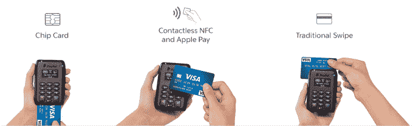

# PayPal Here 读卡器登陆美国，支持 EMV、Apple Pay、Android Pay 等技术

> 原文：<https://web.archive.org/web/https://techcrunch.com/2015/09/28/the-paypal-here-card-reader-comes-to-u-s-with-support-for-emv-apple-pay-android-pay-more/>

随着 Apple Pay 和最近的 Android Pay 的到来，消费者越来越习惯于不涉及信用卡刷卡的替代支付方式。现在，随着美国过渡到[EMV](https://web.archive.org/web/20221205142241/https://en.wikipedia.org/wiki/EMV)——智能卡将数据存储在芯片上，而不是磁条上，这提供了更高的安全性——许多企业主将不得不升级他们的硬件，以支持这些新的芯片和 PIN 卡。

今天，PayPal 公布了其在支付领域发生的所有变化中的竞争战略，在美国推出了其 [PayPal Here 芯片读卡器](https://web.archive.org/web/20221205142241/https://www.paypal.com/us/webapps/mpp/emv)，该读卡器现在不仅支持 EMV，还支持磁条卡和 NFC，包括 Apple Pay、Android Pay、Samsung Pay 等。

正如 PayPal 副总裁兼总经理 Brad Brodigan [解释](https://web.archive.org/web/20221205142241/https://stories.paypal-corp.com/home/introducing-the-new-us-paypal-here-device-with-emv-contactless-and-swipe-capabilities)的那样，今天的消费者希望“随时随地以他们喜欢的任何方式支付”，这就是为什么该公司需要带着多功能读卡器进入游戏。与此同时，企业本身也在为 2015 年 10 月 1 日发生的 EMV 责任转移做准备。届时，不接受芯片卡的商家将在顾客使用其芯片卡时承担销售点欺诈责任——这是鼓励企业主升级硬件的强大激励。这就是 PayPal Here 阅读器的用武之地。

该设备此前已在英国和澳大利亚上市数年，因为美国在 EMV 的采用率落后。

但现在，商家面临着更换设备的需求，许多公司——尤其是销售点终端提供商——一直在利用 EMV 转型来推广自己的硬件和软件解决方案。

同样，PayPal 也在利用这款 PayPal Here 芯片读卡器吸引小企业商户。这款设备将于 9 月 30 日上市，售价 49 美元。这个价格包括 PayPal Here 返利优惠，为美国客户提供 100 美元的信贷，这些客户在激活新硬件的前三个月内至少处理 3000 美元。

这款阅读器本身售价 149 美元——这也是那些无法达到 3000 美元销售额以获得折扣的企业的价格。

这个小巧的手持读卡器可以与安装在企业主手机上的 PayPal Here 应用程序配合使用。在这个应用程序中，商家可以输入销售额，也可以从目录中选择商品。按下充电按钮后，所有可用的支付方式都会显示在屏幕上，包括点击、插入或刷支付卡的说明。

当然，客户也可以通过现金、支票、发票或 PayPal 支付，这使得阅读器在支持的支付类型方面非常灵活。

当选择用信用卡或借记卡支付时，EMV 卡可以插入设备的底部。如果需要输入 PIN 码或签名，客户可以在读卡器上输入前者，或者通过 PayPal 应用程序用手指签名。

同时，该读卡器还支持向后兼容的标准信用卡刷卡，客户可以在读卡器屏幕上点击他们支持 NFC 的信用卡。NFC 功能意味着客户也可以在屏幕上点击他们支持 NFC 的智能手机，以便通过 Apple Pay、Android Pay 或 Samsung Pay 支付。

使用新的 PayPal Here 解决方案不涉及月费，每笔美国消费的费用为 2.7%。这使得它与其他针对小企业的读卡器相当有竞争力，包括 [Square 的 EMV 读卡器](https://web.archive.org/web/20221205142241/https://squareup.com/emv)，它也是 49 美元(或免费，取决于信用资格)，支持 NFC，[收取 Square 每次刷卡 2.75%的标准费用。](https://web.archive.org/web/20221205142241/https://beta.techcrunch.com/2015/06/08/square-apple-pay/#.s2agxy:OLg9)