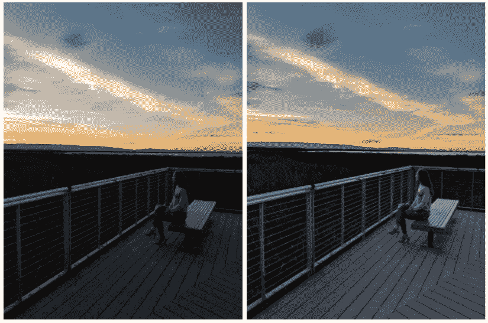
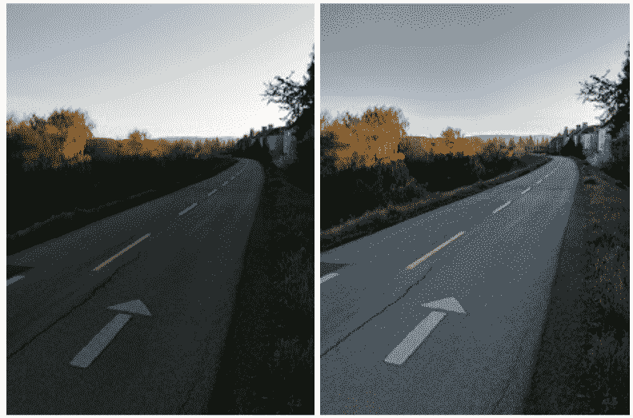

# Pixel 2 的视觉核心照片处理器现在可以与 Instagram、WhatsApp 和 Snapchat  一起使用

> 原文：<https://web.archive.org/web/https://techcrunch.com/2018/02/05/the-pixel-2s-visual-core-photo-processor-now-works-with-instagram-whatsapp-and-snapchat/>

# Pixel 2 的视觉核心照片处理器现在可以与 Instagram、WhatsApp 和 Snapchat 配合使用

[视觉核心](https://web.archive.org/web/20230307142249/https://techcrunch.com/2017/10/17/googles-first-custom-consumer-chip-is-the-secret-behind-the-pixel-2s-camera-performance/) 当谷歌在 10 月份透露它时，它是一个奇怪的小惊喜。系统公司等了三个星期，直到 Pixel 2 发布后，才开始谈论一直在手机中等待的片上系统。

在其生命的大部分时间里，这款专注于摄影的处理器一直致力于改善通过谷歌自己的应用程序拍摄的照片，为 Pixel camera 应用程序提供 HDR+技术。该技术本质上使用谷歌的计算摄影和机器学习来提高照片质量。

现在，正如承诺的那样，这项技术正在进入第三方应用程序——考虑到许多照片是通过其他软件程序拍摄的，这是一个很好的变化。它现在也正式对所有第三方照片应用开放——不仅仅是那些领先一步的知名应用。

作为 Android 8.1 公开测试版的一部分，谷歌在去年 12 月的一次开发者预览版中开启了这项功能。从今天开始，Pixel 2 的所有用户都可以通过四个最受欢迎的移动应用程序使用:Instagram、WhatsApp、脸书和 Snapchat。今天也是该应用向所有第三方开发者开放的第一天。

激活芯片的过程对谷歌和大多数手机制造商来说有点不寻常。诚然，这是手机的一项新技术，但对于一家与应用程序开发者有着如此紧密合作关系的公司来说，花这么长时间来开发更多应用程序令人惊讶。

“这对我们来说是第一次，”谷歌高级硬件工程师 Ofer Shacham 在与 TechCrunch 的电话会议上说。“我们希望确保它干净利落地推出。我们想和我们的合作伙伴一起工作，不让他们感到意外。我们希望确保我们在各个方面都有所改进，不仅是图像质量，还有性能和功耗。这就是为什么我们在 11 月份才在开发者选项中推出 Pixel Visual Core，现在我们正在不断改进。我们希望确保我们的手机与时俱进。”

作为未来几天手机每月软件更新的一部分，Visual Core access 将开始向 Pixel 2 用户推出。谷歌不会评论它是否或何时会出现在非 Pixel 手机上。