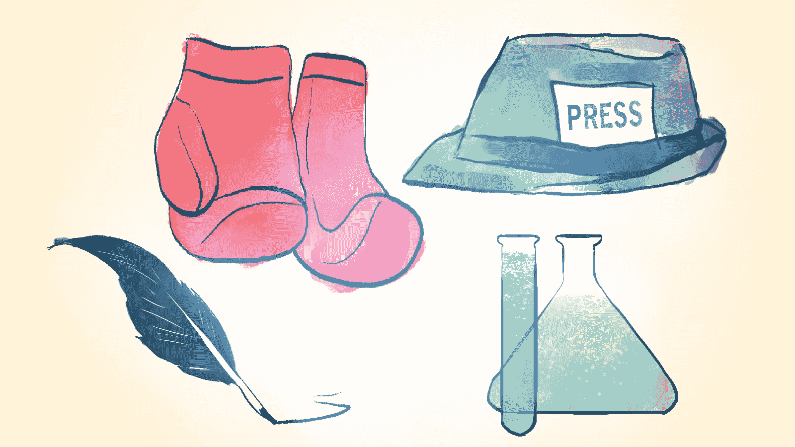

# 诗人、科学家、记者、拳击手的创业方式 

> 原文：<https://web.archive.org/web/http://techcrunch.com/2014/08/09/the-poet-scientist-journalist-boxer-approach-to-entrepreneurship/>

扎克里·汉森撰稿人

**编者按:** *扎卡里·汉森和迪奥戈·杜阿尔特是总部位于迈阿密的品牌忠诚度初创公司 Fidelity Network 的联合创始人。*

创业公司面临的最大挑战之一是弄清楚从哪里开始。企业家认为，除非他们现在就做点什么，否则他们的想法会过时或被竞争对手偷走。然而，这个思考过程类似于用一个月的训练来跑马拉松。是的，这是可以做到的，但你会面临更快耗尽精力和失败的风险。我们需要的是一个当代的指导方针，来帮助新的创业公司创始人发展纯粹的专注。

伟大的创业导师了解这种斗争，最好的导师会告诉他们在开始时应该关注什么，比如，重复核心想法，创建简单的商业模式，或者指导他们构建最小可行产品(MVP)，从而安抚他们的弟子。

基于我们自己对导师的经验和初创公司的混乱诞生，我们开发了一种线性补救方法，所有企业家都可以应用来提高他们的成功机会。我们的理论叫做“诗人、科学家、记者、拳击手的创业方式”

## ****

## **诗人**

*“诗人充满了积极的热情，他的脑袋里充满了各种想法，直到他把所有的想法都表达出来，他才会睡不着觉。”*

这个四阶段的过程从诗人开始。当众所周知的“苹果”落到你的头上，你*知道*你有了一个好主意时，这个阶段就开始了。这种经历的迹象是失眠，既想告诉所有人你的想法，又有一种偏执的感觉，如果你提到它，就会有人偷走它。

一旦你意识到你已经进入了诗人阶段，是时候引导你内心的沃尔特·惠特曼，把你所有的想法写在纸上了。把你的想法写下来，用墨水写在纸上，是建立对你自己想法的真正理解的一个重要部分。

现在，不要担心你的语气或声音，就像你打算开始一场革命一样写作——全身心地投入。写下你的价值观，你的愿景，你的目标，并关注你的想法为什么以及如何改变人们的生活。

一旦你无法从大脑中挤出任何其他东西，就该穿上你的实验服了。

## **科学家**

*“科学家的目标是为客户找到核心价值，去掉多余的功能，并开始测试它。”*

第二步，成为一名科学家，包括开发和发布你的 MVP。用批判的眼光，你必须回顾诗人的作品，推断出核心理论，并决定需要什么来检验这个想法。

在这里，可行性是关键，这意味着科学家必须只挑选必要的东西来检验诗人的理论。这位科学家在工程师的帮助下，建立了一个测试实验。这个实验应该包含核心思想，并导致 MVP 的开发和交付。

一旦 MVP 发货，你就派记者去现场报道。

## **记者**

*“与诗人和科学家不同，记者不偏不倚，保持中立，关注客户的声音(VOC)。记者小心翼翼地不去引导他采访的人，并试图捕捉他们的每一个想法，以便学习。”*

第三步是成为一名记者。现在是时候倾听第一批用户(也称为早期采用者)的心声，并向他们学习了。你不再站在你的讲坛上宣扬你的产品的效用，而是询问和倾听*用户*是否以同样的眼光看待你的产品。

当采访用户时，问一些开放式的问题来引发开明的回应是很重要的。然后，记者从用户那里收集所有的知识，并起草公司更大的故事——关于适销产品的故事，以及它将如何适应并改变你正在进入的市场。

现在，你已经通过科学和新闻证实了你最初的想法，你已经准备好戴上手套，为把你的想法推向市场而奋斗了。

## **拳击手**

拳击手知道他必须反应迅速、注意力集中、身体强壮，才能打一场又一场的仗。他总是高昂着头，双手高举，从失败中爬起来。”

成为拳击手是创业公司创始人的终极成就。当你到了这一步，戴上手套，你将面对几个重量级的对手。

和任何伟大的战士一样，深入研究你的对手是非常必要的。拳击手成为处理推销活动、客户、投资者、孵化器和公共关系的专家。所有即将到来的对手的照片都挂在拳击手的墙上，作为对即将到来的战斗的提醒——拳击手迫不及待地要打出第一拳。

拳击手进入拳击场的那一刻，就没有回头路了。为了把你的产品推向市场，有 12 个回合要打。每一轮你都可能赢或输，但每次你回到自己的角落，你都会与你的导师迭代，并在回到战斗之前根据情况调整你的产品。

鉴于战斗的性质，你将永远面临在任何回合中被击倒的风险(例如，也许你发现你进入的市场已经饱和，或者你的产品将无法生存)，或者相反，*你*可能会击倒你的对手(例如，你可能会收到一家大公司的收购要约)。

作为一名经验丰富的职业选手，你知道这些是创业之战的风险和回报，这场战斗可能会提前结束，但你总是准备好打完所有 12 轮比赛。

不管结果如何，拳击手总是会重新振作起来，无论输赢，并活着继续战斗。

## **岗位搏击面试**

通往拳击场的旅程是漫长的。这需要时间和耐心，以确保你准备好面对你的对手，在一天结束时，你将永远面临失败的风险。

这种内在的风险是许多企业家暗地里(或不那么暗地里)渴望的，就像肾上腺素上瘾者从大楼上跳下来寻求刺激一样，是时候让你自己做好准备，步入创业圈，感受这种冲动了。

表达你内心的诗人，建立实验，讲述故事，并确保你是为战斗而训练。